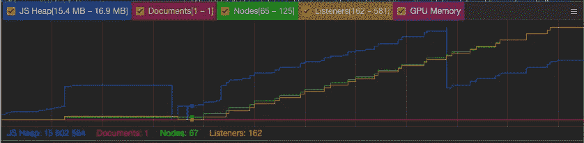
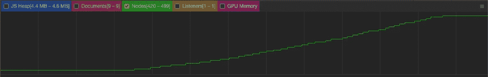

# 5 个常见的 JavaScript 内存错误

> 原文：<https://betterprogramming.pub/5-common-javascript-memory-mistakes-c8553972e4c2>

## 避免 web 应用程序内存泄漏的技巧


[附身摄影](https://unsplash.com/@possessedphotography?utm_source=medium&utm_medium=referral)在 [Unsplash](https://unsplash.com?utm_source=medium&utm_medium=referral) 上的照片。

JavaScript 不提供任何内存管理原语。相反，内存是由 JavaScript VM 通过内存回收过程来管理的。这个过程被称为垃圾收集。

既然我们不能强迫它运行，我们怎么知道它会正常工作？我们对它了解多少？

*   在此过程中，脚本执行暂停。
*   它为无法访问的资源释放内存。
*   它是不确定的。
*   它不会一次检查整个内存，而是会运行多个周期。
*   它是不可预测的。它会在必要时执行。

这是否意味着我们不必担心资源和内存分配？当然不是。如果不小心，可能会造成一些内存泄漏。

# 什么是内存泄漏？

内存泄漏是软件无法回收的已分配内存。

Javascript 为您提供了垃圾收集过程，但这并不意味着您可以避免内存泄漏。为了有资格进行垃圾回收，该对象不能在其他地方被引用。如果您持有对未使用资源的引用，将会阻止这些资源被分配。这就是所谓的无意记忆保持。

内存泄漏可能会导致更频繁地运行垃圾收集器。由于此过程会阻止脚本运行，因此可能会降低您的 web 应用程序的速度。这将使它不那么爽快，用户会注意到这一点。它甚至会导致你的网络应用崩溃。

如何才能防止我们的 web 应用程序泄漏内存？我们必须避免保留不必要的资源。让我们看看最常见的可能发生这种情况的场景。

# 1.计时器监听器

我们来看一下`setInterval`计时器。这是一个常用的 Web API 特性。

> 在`[Window](https://developer.mozilla.org/en-US/docs/Web/API/Window)`和`[Worker](https://developer.mozilla.org/en-US/docs/Web/API/Worker)`接口上提供的`**setInterval()**`方法重复调用一个函数或执行一段代码，每次调用之间有固定的时间延迟。它返回唯一标识间隔的间隔 ID，因此您可以稍后通过调用`[clearInterval()](https://developer.mozilla.org/en-US/docs/Web/API/WindowOrWorkerGlobalScope/clearInterval)`删除它。这个方法是由`[WindowOrWorkerGlobalScope](https://developer.mozilla.org/en-US/docs/Web/API/WindowOrWorkerGlobalScope)` mixin 定义的— [MDN 网络文档](https://developer.mozilla.org/en-US/docs/Web/API/WindowOrWorkerGlobalScope/setInterval)

让我们创建一个组件，它调用一个回调函数来通知它在`x`周期后完成。对于这个特殊的例子，我使用 React，但这适用于任何 FE 框架。

一开始，看起来没什么问题。让我们创建一个组件来触发这个计时器，并分析它的内存性能:

点击几次`retry`按钮后，这是我们使用 Chrome 开发工具得到的内存使用结果:



你可以看到当我们点击`retry`按钮时，越来越多的内存被分配。这意味着先前分配的内存没有被释放。间隔计时器仍在运行，而不是被替换。

我们如何解决这个问题？`setInterval`的返回是一个区间 ID，我们可以用它来取消区间。在这个特定的场景中，一旦组件被卸载，我们可以调用`clearInterval`。

有时候，在代码评审中发现这些问题是很困难的。最佳实践是创建可以管理所有复杂性的抽象。

因为我们在这里使用 React，所以我们可以将所有这些逻辑包装在一个自定义挂钩中:

现在，无论何时你需要使用`setInterval`，你都可以这样做:

```
const handleTimeout = () => ...;useTimeout(100, handleTimeout);
```

现在您可以使用这个`useTimeout`钩子，而不必担心内存泄漏，这都是由抽象来管理的。

# 2.事件监听器

Web API 提供了大量的事件侦听器，您可以将自己与它们挂钩。之前，我们介绍过`setTimeout`。现在我们将关注`addEventListener`。

让我们为 web 应用程序创建一个键盘快捷键功能。由于我们在不同的页面上有不同的功能，我们将创建不同的快捷功能:

一切似乎都很好，除了我们在执行第二个`addEventListener`时没有清理之前的`keyup`。这段代码没有替换我们的`keyup`监听器，而是添加了另一个`callback`。这意味着当一个键被按下时，它将触发这两个功能。

要清除之前的回调，我们需要使用`removeEventListener`。让我们看一个代码示例:

```
document.removeEventListener(‘keyup’, homeShortcuts);
```

让我们重构代码来防止这种不必要的行为:

根据经验，当使用全局对象中的工具时，您需要小心和负责。

# 3.观察者

观察者是一个浏览器 Web API 特性，很多开发者都不知道。如果您想要检查 HTML 元素的可见性或大小的变化，它们是非常强大的。

例如，让我们检查交叉点观察器 API:

> “交集观察器 API 提供了一种异步观察目标元素与祖先元素或顶层文档的[视口](https://developer.mozilla.org/en-US/docs/Glossary/Viewport)的交集变化的方法。”— [MDN 网络文档](https://developer.mozilla.org/en-US/docs/Web/API/IntersectionObserver)

虽然它很强大，但你需要负责任地使用它。一旦你完成了对物体的观察，你需要取消监视过程。

让我们来看一些代码:

上面的代码看起来很好。但是，一旦组件被卸载，观察器会发生什么情况呢？它不会被清除，所以你会泄漏内存。我们如何解决这个问题？仅仅通过使用`disconnect`方法:

现在我们可以确定，当组件被卸载时，我们的观察者将被断开。

# 4.窗口对象

向窗口添加对象是一个常见的错误。在某些场景中，可能很难找到——特别是当您在窗口执行上下文中使用`this`关键字时。

让我们看看下面的例子:

这看起来无害，但这取决于您从哪个上下文调用`addElement` 。如果您从窗口上下文中调用`addElement`，您将开始看到项目堆积起来。

另一个问题可能是错误地定义了全局变量:

```
var a = 'example 1'; // scoped to the place where var was created
b = 'example 2'; // added to the Window object
```

为了防止这种问题，请始终在严格模式下执行 JavaScript:

```
"use strict"
```

通过使用严格模式，您在向 JavaScript 编译器暗示您想要保护自己免受这些行为的影响。需要的时候还可以用窗户。不过，你必须以明确的方式使用它。

严格模式将如何影响我们前面的例子:

*   在`addElement`函数上，当从全局范围调用时，`this`将是未定义的。
*   如果您没有在变量上指定`const | let | var`，您将得到以下错误:

```
Uncaught ReferenceError: b is not defined
```

# 5.保存 DOM 引用

DOM 节点也不能避免内存泄漏。你需要小心不要持有它们的引用。否则，垃圾收集器将无法清理它们，因为它们仍然是可访问的。

让我们看一个小代码示例来说明这一点:

注意，`addElement`函数清除了`list` div 并添加了一个新元素作为子元素。这个新创建的元素被添加到`elements`数组中。

下次执行`addElement`时，该元素将从`list` div 中移除。然而，它没有资格进行垃圾收集，因为它存储在`elements`数组中。这使得它可以达到。这将使您在每次执行`addElement`时成为一个`Node`。

让我们在几次执行之后监视这个函数:



我们可以在上面的截图中看到节点是如何泄露的。我们如何解决这个问题？清除`elements`数组将使它们符合垃圾收集的条件。

# 结论

在本文中，我们已经看到了最常见的内存泄漏方式。很明显，JavaScript 本身不会泄漏内存。相反，这是由开发人员无意的内存保留造成的。只要代码是整洁的，并且我们不忘记自己清理，就不会发生泄漏。

理解 JavaScript 中的内存和垃圾收集是必须的。一些开发人员得到错误的印象，因为它是自动的，他们不需要担心它。

建议定期在 web 应用程序上运行浏览器分析器工具。这是确保没有任何东西泄漏和遗留的唯一方法。Chrome Developer `performance`标签是开始检测一些异常的地方。发现问题后，您可以使用`profiler`选项卡通过拍摄快照并进行比较来更深入地了解问题。

有时候，我们把时间花在优化方法上，却忘记了内存在 web 应用程序的性能中扮演着重要的角色。

感谢阅读。

你不是中等会员吗？支持我[成为这里的](http://dioxmio.medium.com/membership)。

# 有关系的

[](/how-to-write-readable-code-bf1fa656673e) [## 如何写出可读的代码？

### 提高代码可读性的 6 个技巧

better 编程. pub](/how-to-write-readable-code-bf1fa656673e)