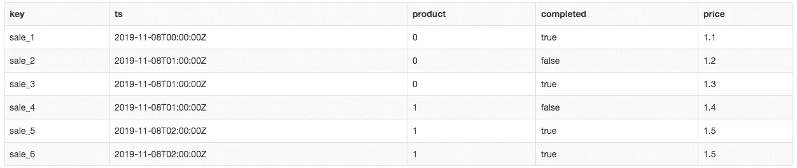
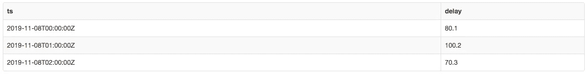
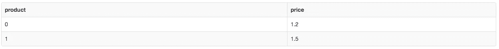
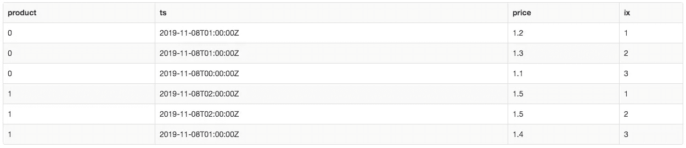
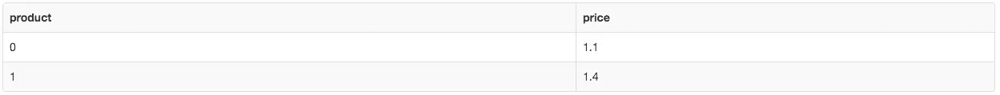
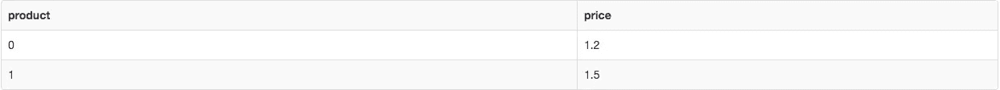
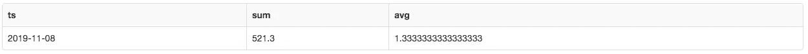
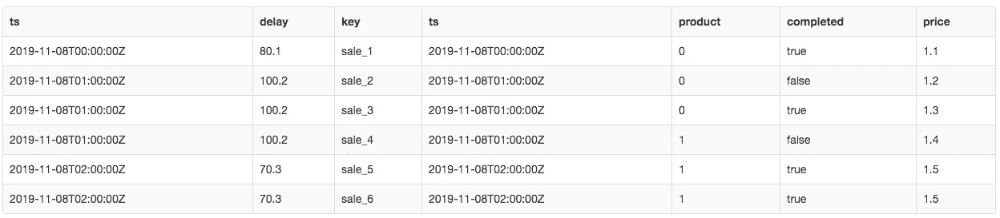
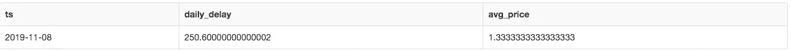

# 开发人员在编写 SQL 查询时会犯的 5 个常见错误

> 原文：<https://betterprogramming.pub/5-common-mistakes-developers-make-when-writing-sql-queries-5d5327a927ed>

## 对于每一个错误，都有一个合适的解决方案


Tobias Fischer 在 [Unsplash](https://unsplash.com?utm_source=medium&utm_medium=referral) 上拍摄的照片。

SQL 广泛应用于数据分析和数据科学。开始编写 SQL 查询相当简单，但是错误可能会很快潜入代码，从而出现在报告(或机器学习模型)中。

在本文中，我将展示编写 SQL 查询时的五个常见错误(和解决方案)。我自己也做过一些，但在执行代码评审时，我注意到了另外一些。

本文中的例子很简洁，用尽可能少的代码展示了问题的核心。对于更有经验的数据科学家来说，这些例子可能看起来很简单，但是当处理更大的真实查询时，这些错误乍看起来可能并不明显。

一些例子是 AWS 红移特有的，而其他例子可能发生在其他 SQL 数据库(Postgres、MySQL 等)中。).

在文章的最后，我还将分享一个到在线数据库的链接，您可以通过它交互式地运行这些示例。

**这里有几个你可能会感兴趣的链接:**

```
- [Complete your Python analyses 10x faster with Mito](https://trymito.io/) [Product]- [Free skill tests for Data Scientists & ML Engineers](https://aigents.co/skills) [Test]- [All New Self-Driving Car Engineer Nanodegree](https://imp.i115008.net/c/2402645/1116216/11298)[Course]
```

你想看更多这样的文章吗？如果是这样，你可以点击上面的任何链接来支持我。其中一些是附属链接，但你不需要购买任何东西。

# 我们开始吧

让我们创建两个临时表，表中的一些条目将有助于我们理解示例。

## 表格销售

该表包含带有时间戳、产品、价格等的销售条目。

请注意，`key`列是唯一的。其他列中的值可以重复(如`ts`列)。

```
**DROP** **TABLE** IF **EXISTS** sales;
**CREATE** **TEMPORARY** **TABLE** sales
(
    **key**       varchar(6),
    ts        **timestamp**,
    product   integer,
    completed boolean,
    price     float
);**INSERT** **INTO** sales
**VALUES** ('sale_1', '2019-11-08 00:00', 0, **TRUE**, 1.1),
       ('sale_2', '2019-11-08 01:00', 0, **FALSE**, 1.2),
       ('sale_3', '2019-11-08 01:00', 0, **TRUE**, 1.3),
       ('sale_4', '2019-11-08 01:00', 1, **FALSE**, 1.4),
       ('sale_5', '2019-11-08 02:00', 1, **TRUE**, 1.5),
       ('sale_6', '2019-11-08 02:00', 1, **TRUE**, 1.5);**SELECT** ***** **FROM** sales;
```



表格 sales 中的条目(图片由作者制作)

## 每小时延迟表

该表包含某一天的每小时延迟。请注意，`ts`列在下表中是唯一的。

```
**DROP** **TABLE** IF **EXISTS** hourly_delay;
**CREATE** **TEMPORARY** **TABLE** hourly_delay
(
    ts    **timestamp**,
    delay float
);**INSERT** **INTO** hourly_delay
**VALUES** ('2019-11-08 00:00', 80.1),
       ('2019-11-08 01:00', 100.2),
       ('2019-11-08 02:00', 70.3);**SELECT** ***** **FROM** hourly_delay;
```



表中的条目 hourly_delay(图片由作者制作)

# 1.计算平均值

让我们计算一个整数类型的`product`列的平均值。

```
**SELECT** **avg**(product)
**FROM** sales;# output is 0
```

在`product`列中有三个`0s`和三个`1s`，所以我们期望平均值为`0.5`。

大多数数据库，比如最新版本的 Postgres，会返回`0.5`，但是 Redshift 会返回`0`，因为它不会自动将`product`列转换为`float`。

## 解决办法

在计算平均值之前，将`product`列转换为`float`类型:

```
**SELECT** **avg**(product::FLOAT)
**FROM** sales;# output is 0.5
```

# 2.使用条件计算平均值

让我们计算一下完成销售的产品的平均价格。

我们要找的值是 *(1.1 + 1.3 + 1.5 + 1.5)/4* ，也就是`1.35`。

```
**SELECT** **avg**(price)
**FROM** (
    **SELECT** **CASE** **WHEN** completed **=** **TRUE** **THEN** price **else** 0 **END** **AS** price 
**FROM** sales
) **AS** q1;# output is 0.9
```

当我们运行上面的查询时，我们得到了`0.9`。这是为什么呢？

出现这种情况:*(1.1+0+1.3+0+1.5+1.5)/6*就是`0.9`。查询中的错误是我们将`0`设置为不应该包含的条目。

## 解决办法

我们用`NULL`代替`0`吧。

```
**SELECT** **avg**(price)
**FROM** (**SELECT** **CASE** **WHEN** completed **=** **TRUE** **THEN** price **else** **NULL** **END** **AS** price **FROM** sales) **AS** q1;# output is 1.35
```

现在输出如预期的`1.35`。

下面的查询也返回正确的结果，因为不带`ELSE`的`CASE`默认为`NULL`。

```
**SELECT** **avg**(price)
**FROM** (
    **SELECT** **CASE** **WHEN** completed **=** **TRUE** **THEN** price **END** **AS** price **FROM** sales
) **AS** q1;
```

# 3.按时间戳排序条目

让我们检索每种产品最后一次销售的价格:

```
**SELECT** price
**FROM** (
    **SELECT** price, row_number() OVER (PARTITION **BY** product **ORDER** **BY** ts **DESC**) **AS** ix 
    **FROM** sales
) **AS** q1
**WHERE** ix **=** 1;
```



上面查询的输出(图片由作者制作)

该查询的问题是有多个时间戳相同的销售。对同一数据连续运行该查询可能会返回不同的结果。

我们可以在下图中观察到，产品 0 在 2019–11–08 01:00 有两次销售，价格分别为 1.2 和 1.3。



产品 0 在 2019–11–08 01:00 有两次销售，价格分别为 1.2 和 1.3(图片由作者制作)

## 解决办法

我们将使用下一个错误来修复查询。

# 4.将列添加到排序依据

对之前错误的修正是显而易见的。我们只需要将`key`列添加到`ORDER BY`中，这将使查询结果可重现。

```
**SELECT** price
**FROM** (
    **SELECT** price, row_number() OVER (PARTITION **BY** product **ORDER** **BY** ts, **key** **DESC**) **AS** ix **FROM** sales) **AS** q1
**WHERE** ix **=** 1;
```



附加 ORDER BY 的查询输出(图片由作者制作)

为什么查询结果与上次不同？

当我们进行快速修复时，我们将`key`列放在了`ORDER BY`中的错误位置。它应该在`DESC`语句之后，而不是之前。该查询现在返回第一笔销售额，而不是最后一笔销售额。

让我们再做一次修复。

```
**SELECT** product, price
**FROM** (
    **SELECT** product, price, row_number() OVER (PARTITION **BY** product **ORDER** **BY** ts **DESC**, **key**) **AS** ix **FROM** sales
) **AS** q1
**WHERE** ix **=** 1;
```



固定查询(图片由作者制作)

此修复使结果可重复。

# 5.内部连接

`Joins`犯了 SQL 查询中最多的 bug。当使用`joins`时，我们需要知道我们是在处理一对一、一对多还是多对多的关系。

让我们用一个例子来说明这一点。我们想合计每天销售的所有延迟，并计算每天销售的平均价格。

```
**SELECT** t2.ts::DATE, **sum**(t2.delay), **avg**(t1.price)
**FROM** hourly_delay **AS** t2
         **INNER** **JOIN** sales **AS** t1 **ON** t1.ts **=** t2.ts
**GROUP** **BY** t2.ts::DATE;
```



合计每天销售中的所有延迟(图片由作者制作)

结果错了！

上面的查询将`hourly_delay`表中的`delay`列相乘，如下图所示。这是因为我们通过时间戳`join`，这在`hourly_delay`表中是唯一的，但是在`sales`表中是重复的。



时间戳列在销售表中不是唯一的(图片由作者制作)

为了解决这个问题，我们将在一个单独的子查询中计算每个表的统计数据，然后`join`计算聚合。这将使时间戳在两个表中是唯一的。

```
**SELECT** t1.ts, daily_delay, avg_price
**FROM** (**SELECT** t2.ts::DATE, **sum**(t2.delay) **AS** daily_delay **FROM** hourly_delay **AS** t2 **GROUP** **BY** t2.ts::DATE) **AS** t2
         **INNER** **JOIN** (**SELECT** ts::DATE **AS** ts, **avg**(price) **AS** avg_price **FROM** sales **GROUP** **BY** ts::DATE) **AS** t1 **ON** t1.ts **=** t2.ts;
```



合计每天销售中的所有延迟—固定版本(图片由作者制作)

# 结论

您可以通过下载示例 [SQL 查询](https://romanorac.github.io/assets/sql/2019-11-11-5-mistakes-when-writting-sql-queries.sql)来自己运行查询。您可以在本地或使用 [SQL Fiddle](http://sqlfiddle.com/) 在线运行这些查询。

你也有一个关于 SQL 查询的令人挠头的故事要分享吗？请在下面的评论中告诉我。

# 在你走之前

在 [Twitter](https://twitter.com/romanorac) 上关注我，在那里我定期[发布关于数据科学和机器学习的](https://twitter.com/romanorac/status/1328952374447267843)消息。


照片由[Courtney hedge](https://unsplash.com/@cmhedger?utm_source=medium&utm_medium=referral)在 [Unsplash](https://unsplash.com?utm_source=medium&utm_medium=referral) 拍摄