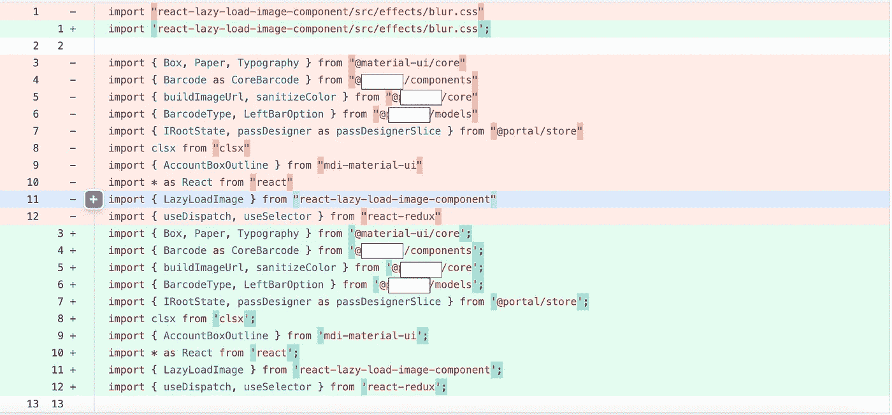
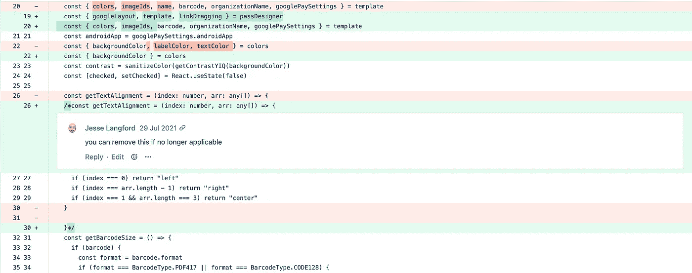
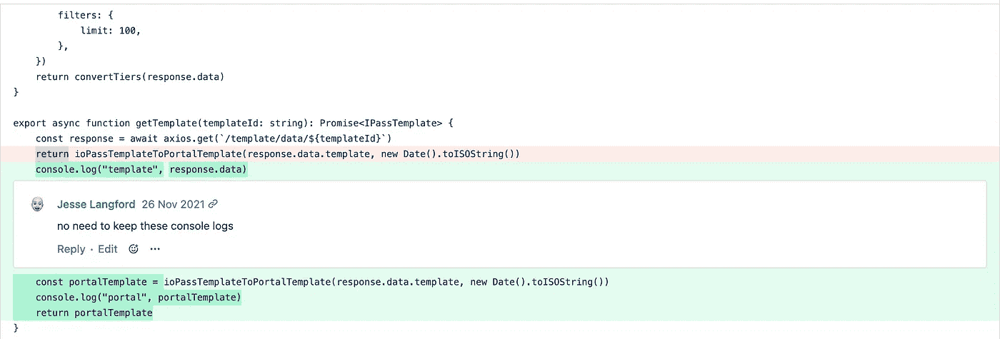
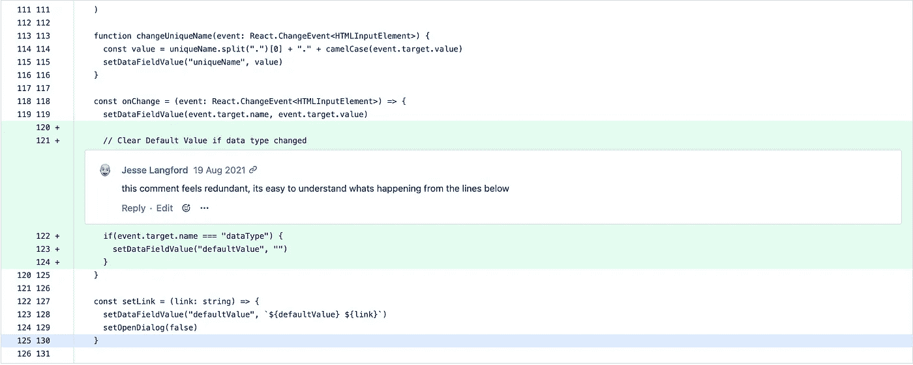

# 我在初级开发人员的拉取请求中看到的 5 个常见错误

> 原文：<https://betterprogramming.pub/5-common-mistakes-i-see-in-a-junior-developers-pull-requests-4c8632ff87a0>

## 对于初级和高级开发人员来说，审查代码可能会有压力

[拉拉·阿兹利](https://unsplash.com/@lazizli?utm_source=medium&utm_medium=referral)在 [Unsplash](https://unsplash.com?utm_source=medium&utm_medium=referral) 上的照片

初级开发人员对高级开发人员审查他们的代码感到紧张是很常见的。当我第一次开始时，我很紧张，我的代码很糟糕，我会暴露自己是一个欺诈开发者。

高级开发人员在审查初级开发人员的代码时感到紧张是很常见的。根据代码质量的不同，审查一个拉请求可能需要 10 分钟到一个小时的时间。

我列出了我在审查初级开发人员拉请求时看到的 5 个常见错误。它们都很容易避免，将它们排除在你的拉动式请求之外会让每个人的评估过程更容易。

初级开发人员能做的提高他们的拉请求质量的最好的事情就是在提交评审之前检查你所做的所有修改。现在有很棒的 git 可视化工具可以显示文件之间的变化。仔细检查这些问题，去掉下面列出的小问题，会让你的拉动式请求更清晰，缩短审核时间。

每一个高级开发人员都承诺了这个列表中的一项，如果不是全部的话。所以如果你看到一个适合你的，我们都经历过。

# **1。不匹配的格式设置**

如果您在提交修改以供审阅之前已经检查过了，那么这一条可以立即告诉审阅者。

看到这样的东西应该会让你奇怪为什么所有的引号都不一样。

上面的例子只是一个开发人员还没有配置他们的 IDE 来使用项目的格式规则的例子。

始终确保您的 IDE 选择的是特定于存储库的格式规则，而不是您自己的全局默认规则。

# 2.留下注释掉的代码

很容易忘记已经注释掉的代码块。如果你觉得将来某一天你会需要它，那就把它抄下来，保存在别的地方。您甚至可以用您的更改创建一个本地分支，只要确保它们不会包含在最终的拉请求中。

如果我们留下了所有可能需要的东西，代码库将很快变得不可读。

# 3.剩余的控制台日志/调试器

在开发一个特性的过程中，像 console.log 和 debugger 这样的一行程序很容易被遗忘。如果您使用 console.log 来帮助您调试，您不会希望另一个队友的剩余日志堵塞您的控制台。被困在别人的调试器中也会令人沮丧。

在这张单子上的所有项目中，这是我最纠结的一项。

## 4.多余的评论

每个团队对代码注释都有自己的偏好。对我来说，我觉得大多数时候他们不需要被包括在内。我可以被说服在某些情况下把它们留下，但不是像上图这样的情况。

我的经验是，如果它需要用文本描述，它可能需要重构。

你可以在这里看到异常[的例子。](https://javascript.plainenglish.io/3-examples-where-i-find-code-comments-helpful-a42d74bee69)

# 5.未描述的提交消息

提交消息对于快速了解您所做的工作非常有用。当您需要回顾旧的提交来调查何时进行了某些更改时，它们也很有用。

如果您提供类似上面的消息，没有人知道实际做了什么工作。

如果你不确定什么时候做，尽早且经常地承诺是一个很好的经验法则。

我希望这是一个对任何希望提高拉取请求质量的人有用的列表。

如果我错过了什么，请告诉我。