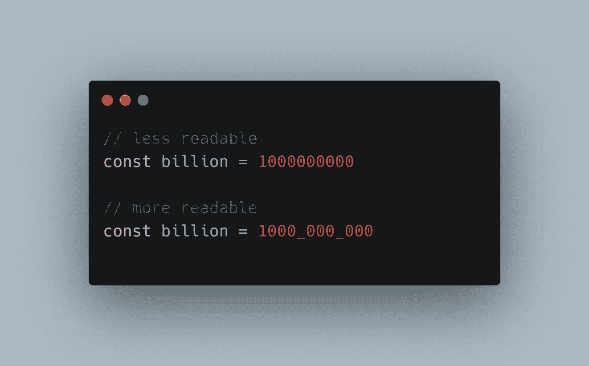

# 大多数开发人员不知道的 5 个很酷的现代 JavaScript 特性

> 原文：<https://betterprogramming.pub/5-cool-modern-javascript-features-most-developers-dont-know-6baf19b532da>

## 用 JavaScript 写得更少，做得更多



作者图片

有了 JavaScript，你可以用许多不同的方式做一件事。此外，JavaScript 随着每一个新的 ECMAScript 规范的发布而发展，增加了新的有用的方法和操作符，使代码更短，可读性更好。

在[提供了十个 JavaScript 技巧](/10-modern-javascript-tricks-every-developer-should-use-377857311d79)之后，我决定再分享五个你可以用 JavaScript 做到的技巧。

# 1.对象.条目

大多数开发人员使用`Object.keys`方法来迭代一个对象。此方法仅返回对象键的数组，而不是值。我们可以使用`Object.entries`来获得键和值。

```
const person = {
  name: 'John',
  age: 20
};Object.keys(person); // ['name', 'age']
Object.entries(data); // [['name', 'John'], ['age', 20]]
```

为了迭代一个对象，我们可以这样做:

```
Object.keys(person).forEach((key) => {
  console.log(`${key} is ${person[key]}`);
});// using entries to get key and value both
Object.entries(person).forEach(([key, value]) => {
  console.log(`${key} is ${value}`);
});// expected output:
// name is John
// age is 20 
```

上面的两种方法返回相同的结果，但是 Object.entries 更容易获得键值对。

# 2.字符串 replaceAll 方法

在 JavaScript 中，要用另一个字符串替换所有出现的字符串，我们需要使用如下的正则表达式:

```
const str = 'Red-Green-Blue';// replaces the first occurrence only
str.replace('-', ' '); // Red Green-Blue// use RegEx to replace all occurrences
str.replace(/\-/g, ' '); // Red Green Blue
```

但是在 ES12 中，一个名为`replaceAll`的新方法被添加到了`String.prototype`中，它用另一个字符串值替换所有出现的字符串。

```
str.replaceAll('-', ' '); // Red Green Blue
```

# 3.数字分隔符

您可以使用下划线`_`作为数字分隔符，这样可以很容易地计算一个数字中零的个数。

```
// difficult to read
const billion = 1000000000;// easier to read
const readableBillion = 1000_000_000;console.log(readableBillion) // returns 1000000000
```

下划线分隔符也可用于 BigInt 数字，如下例所示:

```
const trillion = 1000_000_000_000n;
console.log(trillion); // 1000000000000
```

这实际上增加了数字的可读性，不是吗？

# 4.文档.设计模式

与前端 JavaScript 相关，设计模式允许您编辑页面上的任何内容。只需打开浏览器控制台并键入以下内容:

```
document.designMode = 'on';
```


自己试试

这对设计者很有帮助，因为他们不必每次都根据屏幕上的变化修改代码。

# 5.逻辑赋值运算符

逻辑赋值运算符是逻辑运算符`&&`、`||`、`??`和赋值运算符`=`的组合。

```
const a = 1;
const b = 2;a &&= b;
console.log(a); // returns 2// the above statement is equivalent to
a && (a = b);// OR another approach
if (a) {
  a = b
}
```

我们正在检查`a`的值是否正确，如果正确，我们将更新`a`的值。用逻辑或`||`运算符也可以做到这一点。

```
const a = null;
const b = 3;a ||= b;
console.log(a); // returns 3// the above statement is equivalent to
a || (a = b);
```

和零化合并操作符`??`。

```
const a = null;
const b = 3;a ??= b;
console.log(a); // returns 3// the above statement is equivalent to
if (a === null || a === undefined) {
  a = b;
}
```

`??`操作员只检查`null`或`undefined`值。

请注意，ES12/ES2021 中添加了逻辑赋值运算符

你觉得这些技巧有用吗？请在评论中告诉我你的经历。

感谢阅读！

[](/10-modern-javascript-tricks-every-developer-should-use-377857311d79) [## 每个开发人员都应该使用的 10 个现代 JavaScript 技巧

### 编写简短、简洁、干净的 JavaScript 代码的技巧

better 编程. pub](/10-modern-javascript-tricks-every-developer-should-use-377857311d79) [](/8-best-practices-every-react-developer-should-follow-44177670c646) [## 每个 React 开发人员应该遵循的 8 个最佳实践

### 编写更好的 React 代码的技巧

better 编程. pub](/8-best-practices-every-react-developer-should-follow-44177670c646) [](https://haseeb-anwar.medium.com/react-router-6-features-upgradation-guide-886b9bc2fb71) [## React 路由器 6 功能和升级指南

### 迄今为止最强大的 React 客户端路由器

haseeb-anwar.medium.com](https://haseeb-anwar.medium.com/react-router-6-features-upgradation-guide-886b9bc2fb71)