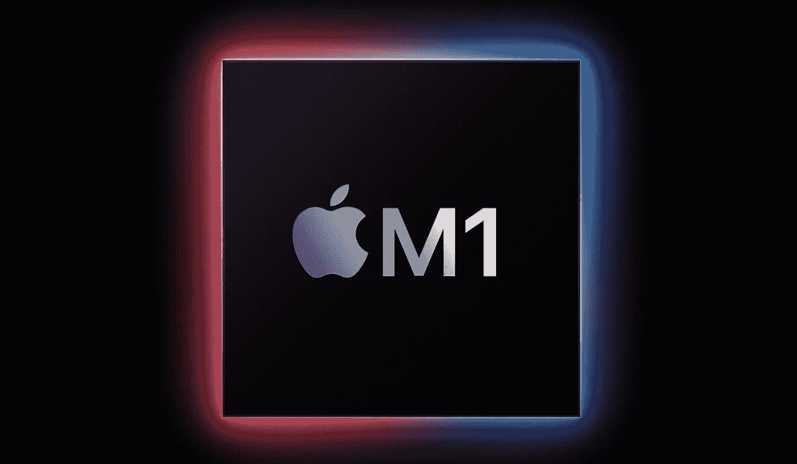
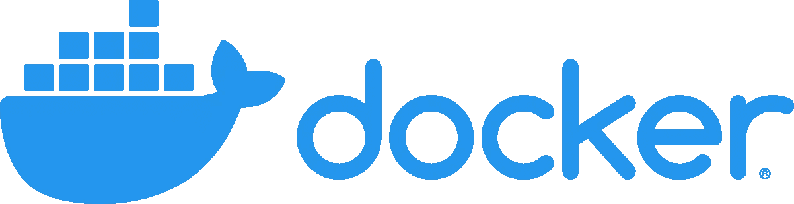
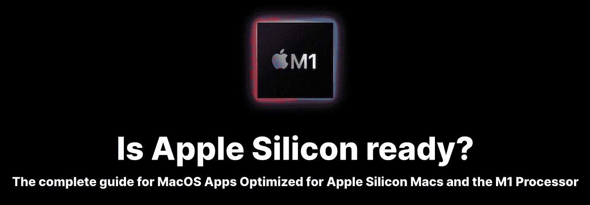
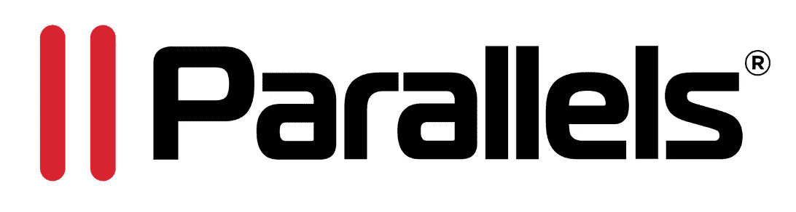

# 新 M1 MAC 电脑的 5 个关键开发调整

> 原文：<https://betterprogramming.pub/5-crucial-developer-tweaks-for-new-m1-macs-a77c9990a985>

## 新的定制芯片，新的开发人员工作流程


Dmitry Chernyshov 在 [Unsplash](https://unsplash.com/s/photos/mac?utm_source=unsplash&utm_medium=referral&utm_content=creditCopyText) 上拍摄的照片

那些新的 M1 MacBook 专业版很闪亮，对吗？它们装载了大量新功能和效率改进。他们绕着上一代机器跑了一圈，并向[展示了一些令人印象深刻的性能数据](https://towardsdatascience.com/m1-macbook-pro-vs-intel-i9-macbook-pro-ultimate-data-science-comparison-dde8fc32b5df)(感谢基准测试的[达里奥·拉德契奇](https://medium.com/u/689ba04bb8be?source=post_page-----a77c9990a985--------------------------------))。

房间里的大象呢？架构改变了。



[来源](https://apple.com)。

M1 芯片是基于 ARM 的，这意味着你将不再生活在 x86-64 的世界里。这对您将要运行的一些应用程序有影响。尤其是如果您正在编译、构建图像或使用尚未针对 M1 发布的应用程序。

在本文中，我们将了解一些重要的调整、应用程序的安装，以及将现有工作流集成到新平台的一般技巧。

# 1.为了兼容性，使用 Rosetta 2

这是你在新 Mac 上需要做的第一件事。Rosetta 2 是一个兼容层，它将允许与 M1 不兼容的应用程序在一个特殊的层内运行，模仿旧的英特尔 x86–64 平台并动态翻译指令。

如果你已经尝试安装一个非 M1 兼容的应用程序，那么 macOS 可能会提示你安装 Rosetta。如果您还没有这样做，并且希望尽早解决这个问题，请运行以下命令:

```
/usr/sbin/softwareupdate --install-rosetta --agree-to-license
```

关于 Rosetta 2 的更多信息可以在苹果官方支持网站上获得[。](https://support.apple.com/en-us/HT211861)

# 2.带拱门的开关自制平台


[来源](https://brew.sh/)。

每个人都知道并且(大部分)喜欢的经典 Brew 应用程序确实可以在 M1 MAC 上开箱即用，但你可能需要对某些软件包进行一些调整。为了在不同的架构下安装软件包，您需要使用`arch`命令来切换它:

```
arch -x86_64 brew config
```

如果您运行下面的命令，您会注意到它说它运行在`x86_64`架构下并使用 Rosetta 2 兼容层。当你安装 Brew 时，默认情况下它应该在`arm64`下本地运行，但是如果你需要安装一个`x86_64`版本的包，你需要利用`arch`并为不同的平台设置 Brew。

如果你还没有在 Mac 上安装 x86_64 版本的 Brew，你可以按照 [Shinichi Okada](https://medium.com/u/a262a804b78f?source=post_page-----a77c9990a985--------------------------------) 的指南: [*如何在苹果 M1 MacBook 上安装 x86_64 自制软件包*](https://medium.com/mkdir-awesome/how-to-install-x86-64-homebrew-packages-on-apple-m1-macbook-54ba295230f) 。

一旦安装了 Brew 两个版本，只需发出以下命令，就可以正常地将 Brew 用于本机软件包:

```
brew install <pkg>
```

对于`x86_64`包，您可以发布:

```
arch -x86_64 brew install <pkg>
```

您还可以将上面的 Brew 命令别名为类似于`ibrew`或`xbrew`的东西，以使事情稍微简单一些。

# 3.使用 Docker Builder 构建 x86_64 映像

如果你和我一样，那么当切换到 M1 时，你完全忽略了 Docker 工作流程中的任何初始差异。在完成一个新项目并推出我闪亮的新形象后，我只注意到错误。

试图在 x86_64 主机上运行我在 Mac 上构建的映像只会导致彻底的灾难。

检查完图像本身后，问题就摆在我面前。我曾为`arm64`建造过。因为我的 M1 机器是基于 ARM 的，它不再默认使用`amd64`架构构建映像。简单地构建和推动的日子已经一去不复返了，现在你需要 Docker BuildKit 的一点额外帮助。



[来源](https://www.docker.com/company/newsroom/media-resources)。

为了使用`BuildKit`,你需要确保你运行的是 Docker 的最新版本，然后你需要启动一个特殊的新“builder”实例:

```
docker buildx create --name my_builder
docker buildx use my_builder
docker buildx inspect --bootstrap
```

这将在您的机器上启动一个新的容器，使您能够构建多种不同的架构。

假设我们有一辆全新的`Dockerfile`，我们想为老款`amd64`打造它。我们需要做的就是告诉我们的构建器实例来处理构建它，以及我们想要什么样的架构:

```
docker buildx build --platform linux/amd64 -t <tag> --load .
```

一旦图像构建完成，它将出现在你指定的标签下的普通图像列表中(这就是`--load`所做的)。现在，您可以像任何其他本地构建的映像一样，将映像推送到注册表中。

非常感谢[乔恩·沃格尔](https://medium.com/u/c08522ea46a9?source=post_page-----a77c9990a985--------------------------------)的精彩指导: [*如何在 M1 MAC 电脑上部署基于苹果芯片*](/how-to-actually-deploy-docker-images-built-on-a-m1-macs-with-apple-silicon-a35e39318e97) *的 Docker 映像。*

# 4.使用更多 M1 就绪应用以获得更好的性能

在紧要关头或者当你绝对需要做一些不支持 M1 的事情时，在 Rosetta 2 下运行应用程序是很好的。但是你会注意到一个相当不错的性能。没有什么比天生跑步更好的了。尤其是在像 M1 这样的巨型处理器上。

苹果公司有一些资源可以找到 M1 本地应用，但我目前为止找到的最好的地方是:[https://isapplesiliconready.com/](https://isapplesiliconready.com/)



[来源](https://isapplesiliconready.com/)。

这个网站会告诉你一个特定的应用程序是否有完全的 M1 支持，只有 Rosetta 2 或者干脆不工作。如果你想在你的 Mac 上安装尽可能多的原生应用，这一点尤其有用。

# 5.将虚拟机从 x86_64 迁移到 ARM



[来源](https://www.parallels.com/about/brand-assets/)。

如果你在你的新 Mac 上使用任何虚拟机，那么你将会有另一个惊喜。根据 [Parallels 文档](https://kb.parallels.com/125343):

> “…在基于英特尔的 Mac 上创建的虚拟机不能在采用 M1 芯片的 Mac 上使用，反之亦然。”

这意味着，如果您有一个现有的 x86_64 虚拟机库，它们将需要迁移到新的基于 ARM 的版本。这意味着在您的 M1 上重新旋转它们，并将磁盘内容移植过来。您可以在下面的[支持文档](https://kb.parallels.com/125344)中找到如何使用 Parallels 完成此操作的分步指南。

感谢您的阅读！如果您喜欢这篇文章，请不要忘记查看:

[](/6-developer-tools-for-mac-that-arent-ides-b1419ffec2c1) [## 6 个非 ide 的 Mac 开发工具

### 处理各种软件工程任务的专用应用程序

better 编程. pub](/6-developer-tools-for-mac-that-arent-ides-b1419ffec2c1)