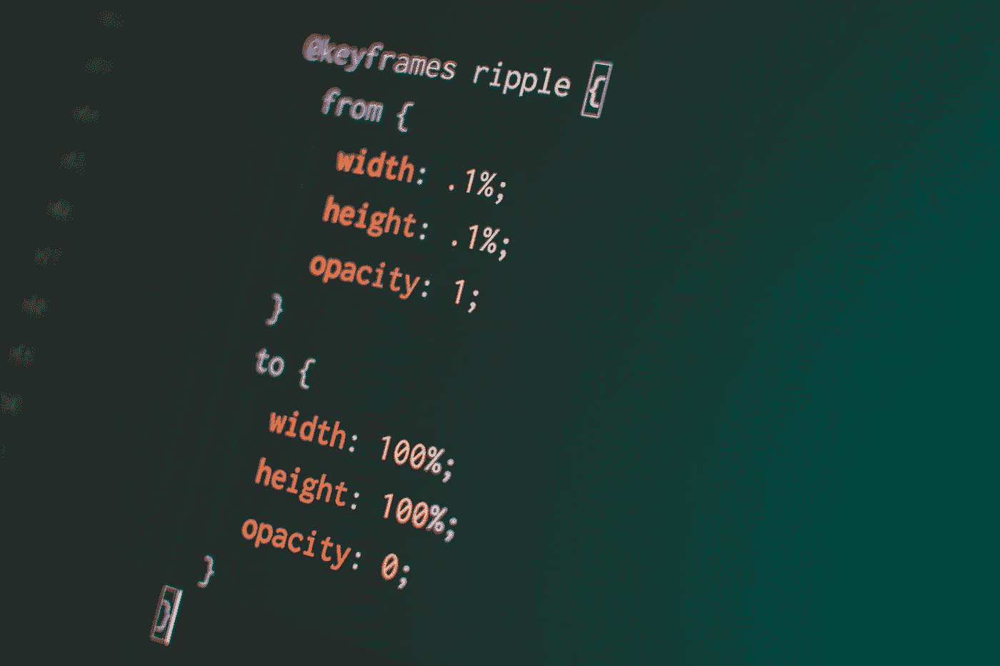

# 作为一名 Web 开发人员应该避免的 5 种 CSS 实践

> 原文：<https://betterprogramming.pub/5-css-practices-to-avoid-as-a-web-developer-1b7553c05131>

## 一些坏习惯以及如何改正

[Pankaj Patel](https://unsplash.com/@pankajpatel) 在 [Unsplash](https://unsplash.com/?utm_source=medium&utm_medium=referral) 上拍照。

有些人认为 CSS 很难学。有很多拐杖，甚至还有一些魔法，很容易搬起石头砸自己的脚。我对此感到难过，因为我不这么认为。

经过一番思考之后，我总结出了五个我不喜欢的开发人员习惯，并将向您展示如何避免它们。

# 1.设置边距或填充，然后重新设置

我经常看到人们为所有元素设置边距或填充，然后为第一个或最后一个元素重置它们。我不知道为什么他们用两条规则，而你可以用一条。一次性为所有需要的元素设置边距和填充要容易得多。

对于更简单和更简洁的 CSS，使用下面的一个:`nth-child` / `nth-of-type`选择器、`:not()`伪类，或者更好地称为`+`的相邻兄弟组合符。

不要这样做:

您可以使用:

或者:

或者:

# 2.为位置:绝对或位置:固定的元素添加显示:块

您知道吗，您不需要为带有`position: absolute`或`position: fixed`的元素添加`display: block`，因为这是默认发生的。

还有，如果使用`inline-*`值，它们会发生如下变化:`inline`或`inline-block`会变成`block`、`inline-flex` - >、`inline-grid` - >、`grid`、`inline-table` - > `table`。

所以，只需写`position: absolute`或`position: fixed`并在需要`flex`或`grid`值时添加`display`即可。

不要这样做:

或者:

您可以使用:

或者:

# 3.使用变换:平移(-50%，-50%)到中心

有一个普遍存在的问题，曾经引起很多麻烦。这种情况一直持续到 2015 年，它的所有解决方案都导致了某种困难。我说的是将一个任意高度的元素沿两个轴居中。

特别是，一个解决方案是使用绝对定位和`transform`属性的组合。这种技术在基于 Chromium 的浏览器中导致了模糊的文本问题。

但是在 flexbox 推出之后，这个技术，在我看来，就不再相关了。问题是它不能解决文本模糊的问题。更重要的是，它让你使用五种属性。所以，我想分享一个可以将代码简化为两个属性的技巧。

我们可以在一个`flex`容器中使用`margin: auto`,浏览器会将元素居中。只有两处房产，仅此而已。

不要这样做:

您可以使用:

# 4.对块元素使用宽度:100%

我们经常使用 flexbox 创建一个多列网格，逐渐转换为一列。

为了将网格转换成一列，开发人员使用了`width: 100%`。我不明白他们为什么这样做。网格元素是块元素，默认情况下不使用附加属性就可以做到这一点。

所以我们不需要使用`width: 100%`，而是应该编写媒体查询，这样 flexbox 只用于创建多列网格。

不要这样做:

您可以使用:

# 5.设置显示:Flex 项目的块

当使用 flexbox 时，重要的是要记住当你创建一个 flex 容器(添加`display: flex`)时，所有的子容器(`flex`项)都会被阻塞。

这意味着元素被设置为`display`并且只能有块值。相应地，如果设置`inline`或`inline-block`，将变为`block`、`inline-flex` - >、`inline-grid` - >、`grid`、`inline-table` - >、`table`。

所以，不要把`display: block`加到`flex`项上。浏览器会帮你做的。

不要这样做:

您可以使用:

# 结论

我希望我已经向你展示了如何避免简单的错误，你会接受我的建议。感谢阅读！