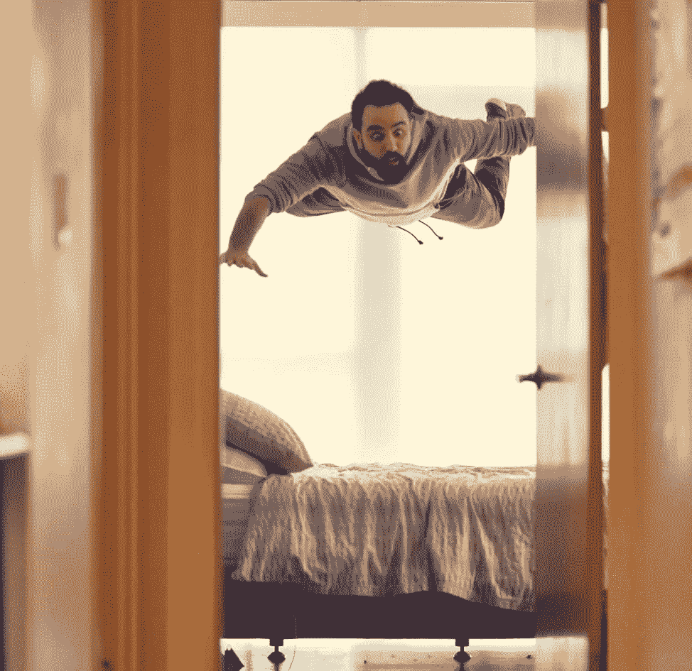

# 我打赌你不知道的 5 个 CSS 技巧

> 原文：<https://betterprogramming.pub/5-css-tricks-i-bet-you-didnt-know-d544f87f9fa4>

## 包括密码笔



照片由大流士巴沙尔通过 Unsplash

# **1。纯 CSS 中的平滑滚动导航链接**

曾经想让你的导航栏链接平滑地向下滚动到一个特定的 ID，但是懒得使用 JavaScript？

CSS 只用一行代码就可以做到。

```
**html** {Scroll-behavior: smooth;
}
```

# **2。无 JavaScript 的滚动捕捉**

这是对我们上面的平滑滚动技巧的一个很好的补充，因为我们现在可以设置我们的链接滚动到一个精确的位置，而不仅仅是我们的 HREF 指向的 ID。

这也可以用于垂直和水平内容。想要建立一个纯 CSS 图像库？使用此技巧可以轻松地吸附到每个图像的中心。

```
**.figure** {
  overflow: auto;
  scroll-snap-type: inline mandatory;
}**img** {
  scroll-snap-align: center;
}
```

## **垂直滚动捕捉**

经由米丽娅姆·苏珊娜的博客[OddBird.net](http://OddBird.net)

## 水平滚动捕捉

经由米丽娅姆·苏珊娜的博客[OddBird.net](http://OddBird.net)

# **3。保持页脚在底部，不管页面上有多少内容**

啊，旧的页脚问题。我想我们都曾经历过这种情况。有很多方法可以让页脚保持在底部；然而，这一个似乎得到它的权利，没有陷阱。

与使用固定或绝对定位不同，这种方法在滚动时不会覆盖页面内容。

```
**body** {min-height: 100vh;display: flex;flex-direction: column;
}**.content** {flex: 1;
}
```

# **4。使用滤镜使图像变亮或变暗**

有时你只是想给你的 UX 增加一点光彩。Filter 是一个很好的方法，可以在一行中快速地将可点击的项目和不可点击的项目分开。

我还喜欢在包装了`img`标签的父元素中添加`transition: all 0.2s ease-in-out;`，给它们一个流畅的动画，而不会感觉迟钝。

```
**img**:hover {Filter: brightness(75%);
}
```

# **5。改变未悬停项目的样式**

或者您可能想要更改除了悬停项目之外的所有项目。在你为如何实现这个目标而头疼之前，请记住`:not`的诀窍。为了更好地衡量，我们将把它与上面的`filter: brightness`结合起来。

还要记住在你的父元素前面添加第一个元素标签类型(在这个例子中是`div`),否则这将不起作用。

```
**div.wrapper**:hover **img:not**(:hover){Filter: brightness(50%);
}
```

(点击底部的 0.5 倍以获得最佳观看效果)

# **资源**

滚动捕捉技巧和相应的密码笔在 [OddBird](https://www.oddbird.net/2019/10/31/scroll-snap/) 上找到。