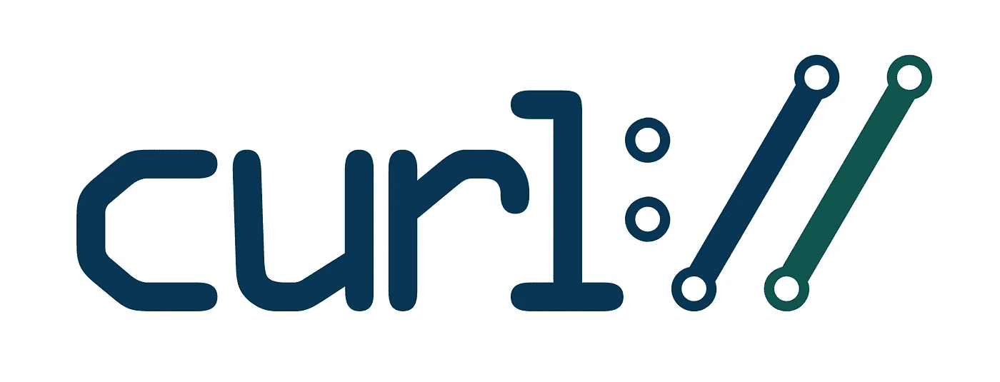
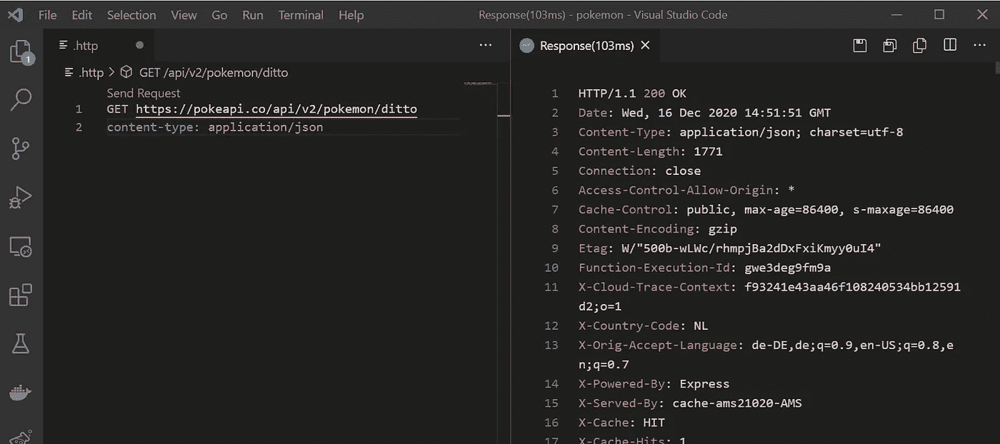
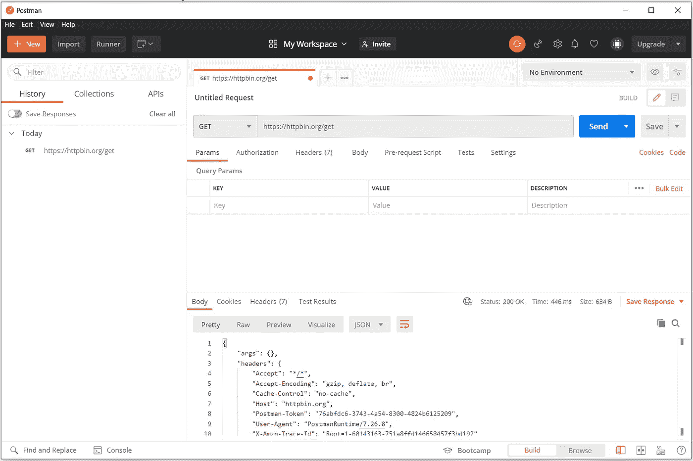
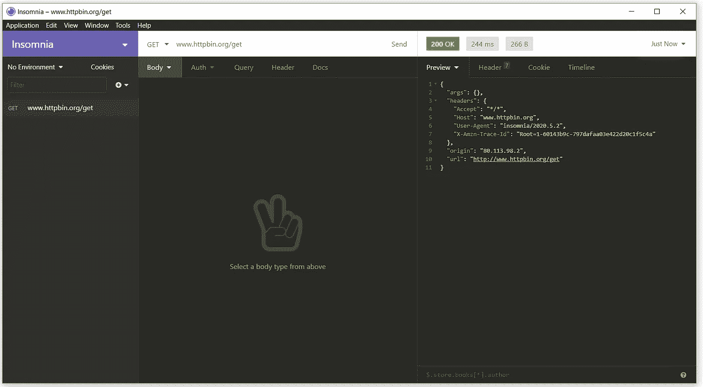
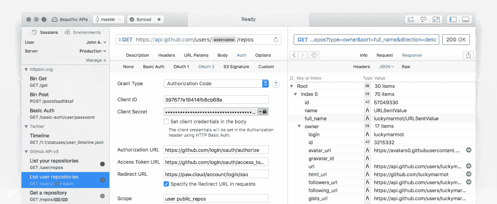

# 5 curl 替代 API 测试客户端

> 原文：<https://betterprogramming.pub/5-curl-alternative-api-testing-clients-baab811423e2>

## 适用于 Windows、Linux 和 Mac 用户的 curl 替代品

图片来自[像素](https://www.pexels.com/pt-br/foto/caderno-caneca-codificacao-codigo-169573/)

在实现或测试 API 时，拥有一个方便易用的 HTTP 客户端工具是非常重要的。为此， [curl](https://curl.se/docs/) 可能是大多数程序员的首选工具之一。

curl 由 Daniel Stenberg 于 1997 年创建，是一个命令行工具，使用 HTTP、HTTPS、SSL、FTP、Kerberos 等协议通过 url 传输数据。

卷曲标志

curl 的简单性和广泛的协议支持使它成为一款令人惊叹的软件。但我们已经不是 1997 年了，如今，在 API 驱动的社会，特别是 REST APIs 的时代，我们可能希望手中有一点额外的权力。

需要针对 API 的请求认证、针对响应的 JSON 语法突出显示、测试的脚本自动化以及跨分布式开发人员的版本化请求，而 curl 似乎在这些领域失败了。

因此，让我们检查一些卷曲的替代品，可能会做这项工作。

# VSCode Rest 客户端

[VSCode Rest 客户端](https://marketplace.visualstudio.com/items?itemName=humao.rest-client)是微软 VSCode 代码编辑器的扩展插件。它基本上允许通过在一个`http`文件中编写几行 curl **-** like 语法来测试 HTTP 调用。

这个扩展的最大优点是您永远不需要离开代码编辑器来测试您的端点和连接。如果您使用 VSCode 编写应用程序和 API，您可能不需要在笔记本电脑上安装任何外部 HTTP 客户端应用程序。很酷，不是吗？

VSCode Rest 客户端

# HTTPie

HTTP pie 是一个基于命令行的 HTTP 客户端，对于那些想尝试不同于 curl 但仍然使用命令行终端来测试基于 JSON 的 API 的人来说，这是一个不错的选择。

除了简单的语言之外，HTTPie 还有一个彩色的终端输出，带有语法高亮、认证功能和内置的 JSON 支持。

这可能是最好的基于命令行的 curl 替代品。

httpie 动画 GIF— [httpie github](https://github.com/httpie/httpie)

# Postman API 客户端

使用另一个著名的 API 测试客户端转移到桌面应用，我们有 [Postman API 客户端](https://www.postman.com/downloads/)。

Postman 可以为我们提供做 API 测试时需要的一切，从简单的 HTTP 请求到认证、自动化测试、自定义脚本。如果出于某种原因，您需要了解您的请求和响应所经过的所有层，那么它的请求分析功能也非常方便。

像云同步和用户之间共享请求这样的功能使 Postman 成为一个完整的 API 测试工具。

Postman API 客户端

# 失眠

[失眠](https://insomnia.rest/)基本分为两个主要产品:一个 API 设计工具和一个 API 客户端。

失眠 API 客户端很有趣，因为它具有自定义插件的可扩展性，支持不同的响应类型，如 PDF 和图像，以及 SSL 的证书管理实用程序。

最重要的是，失眠症的文档总是完整的，并且是最新的，每一个细节、说明或者特性的例子都能找到。

失眠 API 客户端

# 手

如果你在 Mac 上运行并且有一些预算，你可能想看看 [Paw](https://paw.cloud/) 。这台电脑完全可以在 Macbooks 上运行，充分利用了苹果笔记本电脑上所有的硬件和软件。

Paw 还支持云同步版本控制、可单独安装的扩展和秘密管理。

使用 Paw 的唯一缺点可能是它的价格。

手

欢迎来到现代 API 开发和测试:)

# 资源

1.  卷曲—[https://curl.se/download.html](https://curl.se/download.html)
2.  VSCode Rest 客户端—[https://marketplace.visualstudio.com/items?itemName=humao.rest-client](https://marketplace.visualstudio.com/items?itemName=humao.rest-client)
3.  https://httpie.io/
4.  邮递员—[https://www.postman.com/downloads/](https://www.postman.com/downloads/)
5.  失眠—[https://insomnia.rest/](https://insomnia.rest/)
6.  爪子——[https://paw.cloud/](https://paw.cloud/)