# 5 个定制的 React 挂钩，让你的生活更轻松

> 原文：<https://betterprogramming.pub/5-custom-react-hooks-to-make-your-life-easier-a344f7ce4e31>

## 今天就把这些放到你的代码库中吧

Vishal Jadhav 在 [Unsplash](https://unsplash.com/s/photos/hooks?utm_source=unsplash&utm_medium=referral&utm_content=creditCopyText) 上拍摄的照片

你好世界！今天我想和你分享我关于 React Hooks 的笔记。相信从 React 的 16.8 版本开始，当 Hooks 推出的时候，大家就有机会去了解一下了。我也相信这篇文章会帮助你很好地使用钩子。

在我们开始之前，我应该注意，我使用 TypeScript 只是因为我的偏好，如果你愿意，你可以使用普通 JavaScript 的钩子。

每个部分将有:

1.  就绪代码片段
2.  说明
3.  用法示例

好了，我们不要再浪费时间了！

# 使用输入

我的建议是从我最喜欢的钩子开始——`useInput`。我估计这个钩子和默认的 React 钩子一样经常被我使用。SPA 中的交互是主要部分之一，`input`就是很好的代表。大多数时候，我们使用受控的`input`。这个钩子将帮助你准确地管理这个案例。

作为一个参数，我们有`defaultValue = ‘`，它设置为本地`useState`。钩子内部只有一个函数。让我们仔细看看。`data`是单个参数，可以是字符串或反应事件。我们有一个类型检查来决定我们是否需要析构这个值，或者可以直接使用它。

我们的定制钩子从它的状态和函数返回值来处理变化。这个函数可以作为一个钩子的常规设置器，也可以传递给`input`的处理程序`onChange`。

这里有一个用法的例子:

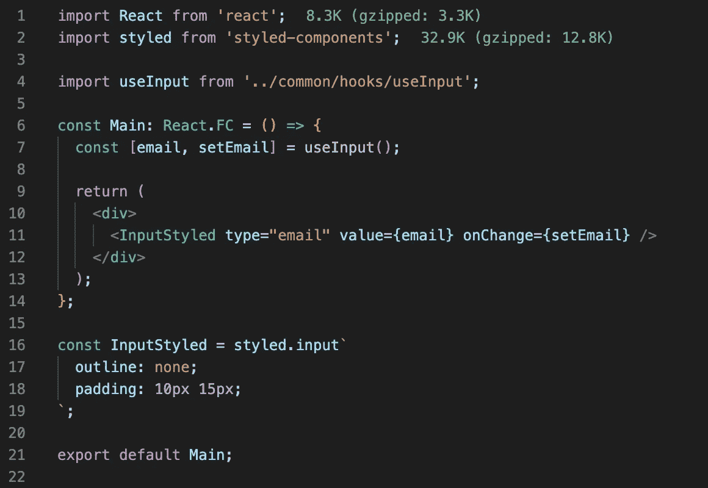

正如我之前所说，我们可以使用`setEmail`作为常规设置器:

行动中:

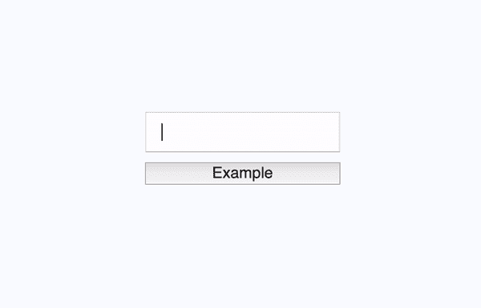

# 使用开关

下一个钩子是`useToggle`。我们经常需要切换一些东西，那么为什么不在一个钩子中转换一下呢？

这个钩子有一个`defaultValue = false`参数，我们存储在`useState`中。单个函数接受`value`，可以是`boolean`也可以是`ClickEvent`。

让我们看一些例子:

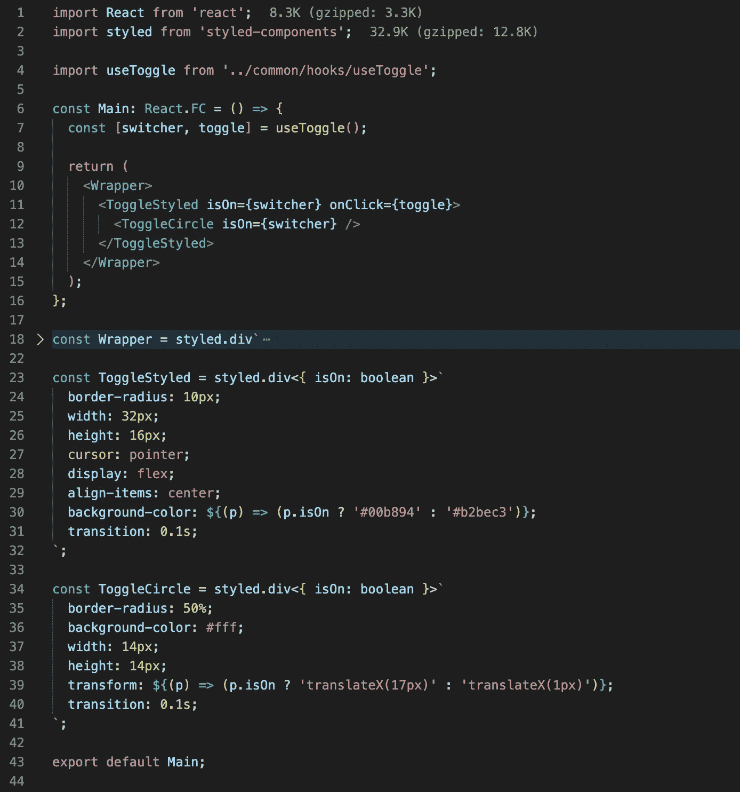

这是它在用户界面中的样子:

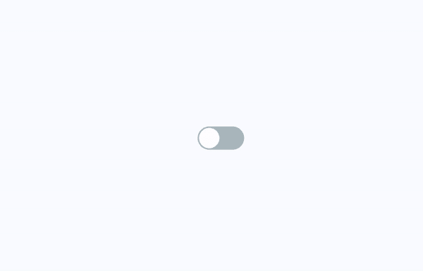

让我们看看如何使用设置值的能力，而不是切换它。例如，我们需要两个按钮来打开/关闭每个切换器，而不管它的当前状态。

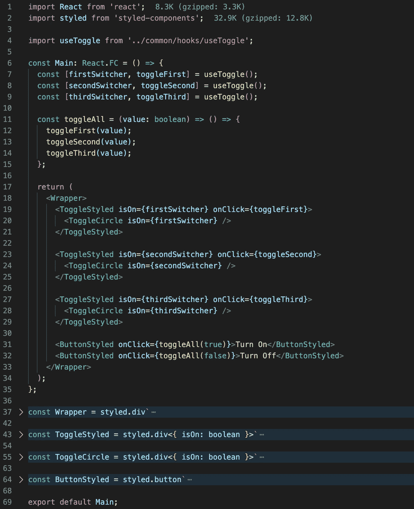

这是它在用户界面上的样子:

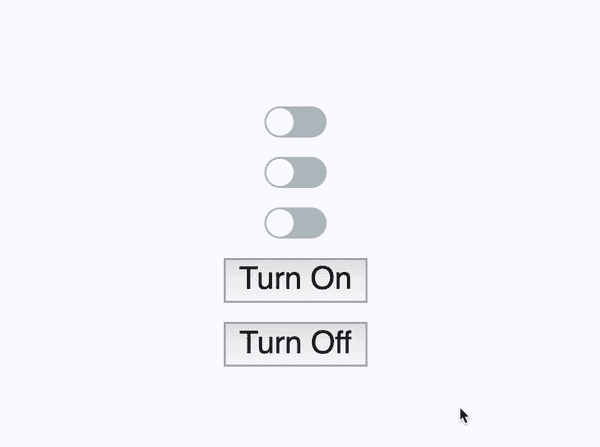

# useEventListener

有时有必要添加一个事件监听器。这里的主要问题是要记住删除它。同样，我们可以用一个定制的钩子把它包起来。

对于这个钩子，我们需要一个处理程序、事件名和一个目标(可选参数，默认情况下，我们使用`window`)。

在`useEffect`的帮助下，我们可以在渲染完一个组件后做任何我们想做的事情。首先，我们检查提供的元素是否支持`addEventListener`。然后我们添加一个处理程序，当然，我们从`useEffect`返回函数，在这里我们可以在销毁一个组件之前删除我们的监听器。

用法的例子:

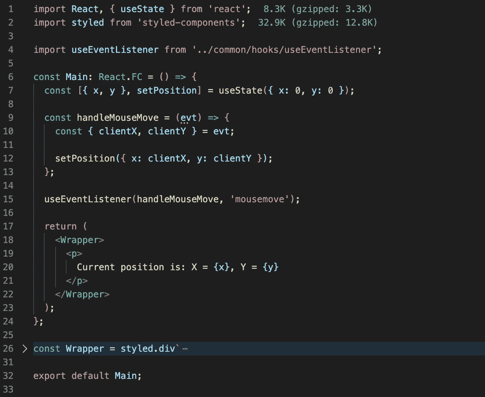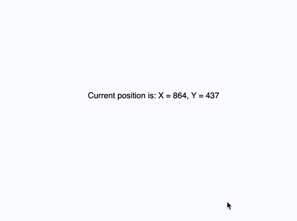

# useWindowScrollBlock

这个钩子你不会那么经常用，但还是要学的好。当主窗口的滚动必须被锁定时，如果你有模态窗口或移动菜单，这可能是有用的。

这是目前为止最简单的钩子。我们在第一次渲染时保存初始物体的溢出值，然后将其更改为`hidden`。我们在卸载时给它初始状态。

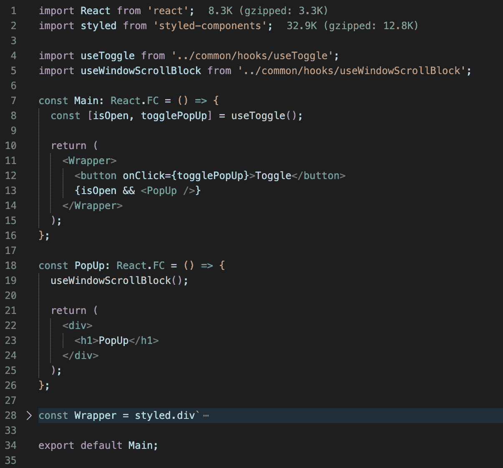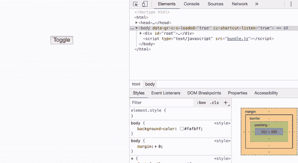

# 使用 Fetch

最后一个是最复杂的，但同时，这个钩子是最有用的，从我的角度来看。从它的名字就能明白它的用途。这个钩子用于请求。我通常使用 Redux-Saga 或 Redux-Thunk 通过 [Redux](https://redux.js.org/) 进行所有请求，但有时可能会发生某个请求不重要，不需要这种方法的情况。钩子可以处理这种情况。

钩子只接受一个参数:将要执行的函数。在我们的情况下，这是一个请求。我们保持商店中流程的当前状态。可以是`pending`、`resolve`或`reject`。来自请求的响应也将存储在`useState`中。响应的类型将取自`generic`。

让我们来看看一些行动:

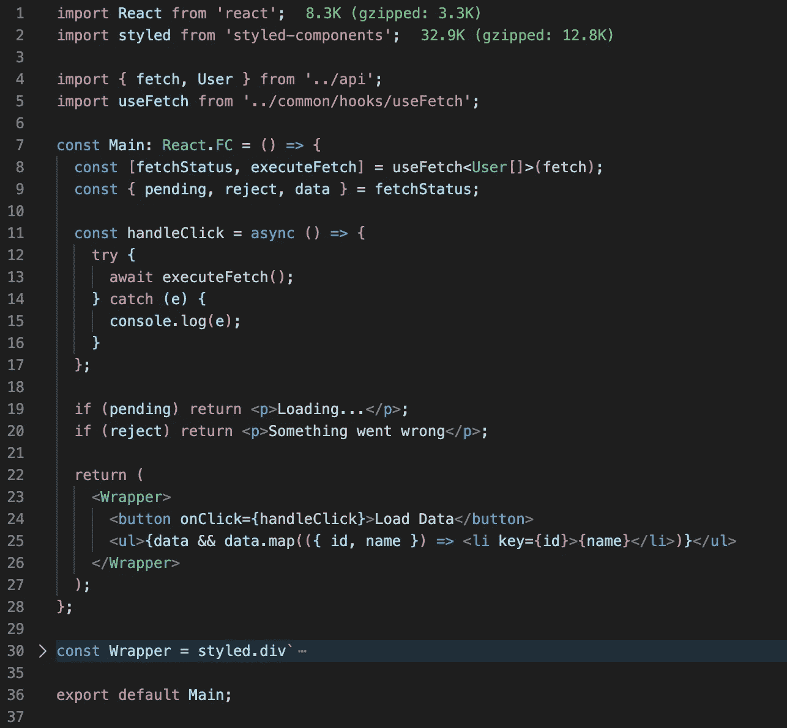

我还必须分享`API`的源代码，以便了解全貌:

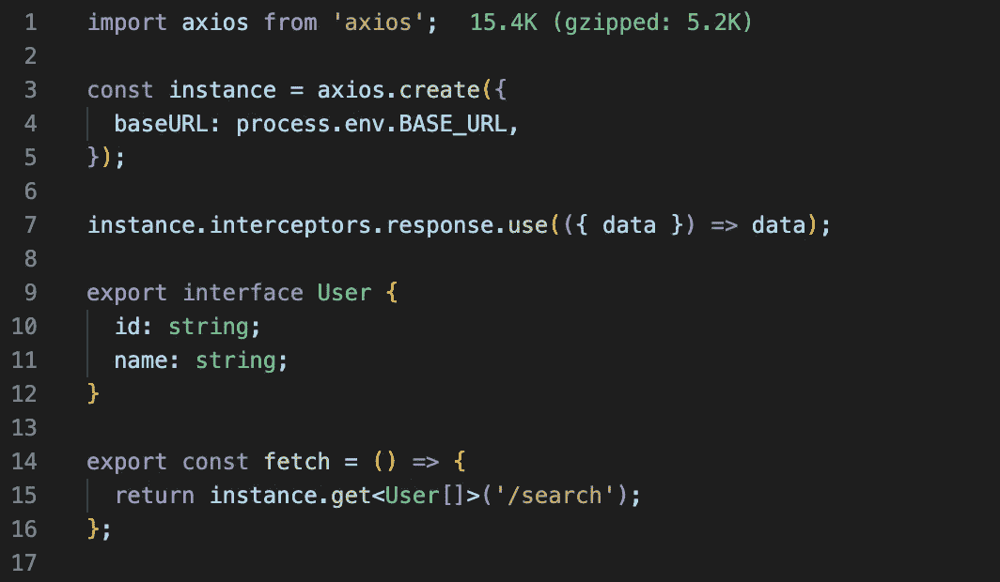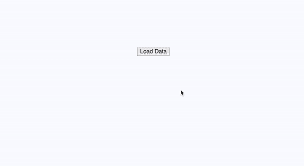

# 摘要

我希望这篇文章对你有用。也许不是每个钩子都适合你和你的需求，但我相信你现在知道如何创建你自己的了。

感谢阅读！