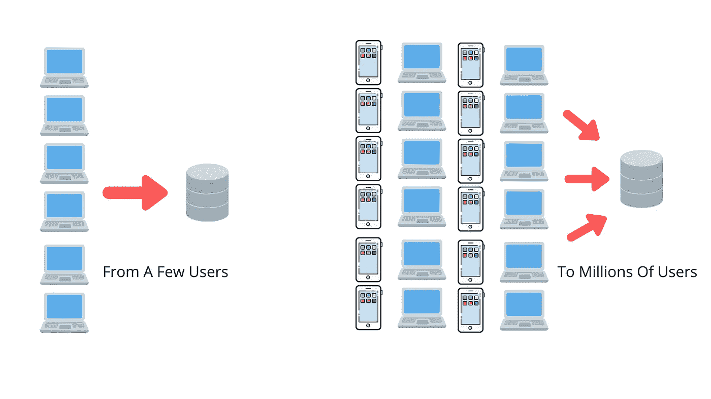
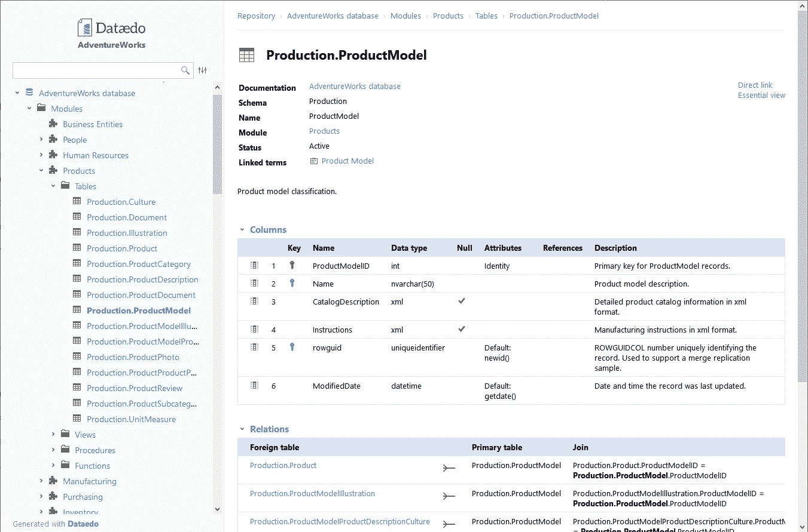

# 2021 年公司将面临的 5 大数据分析挑战

> 原文：<https://betterprogramming.pub/5-data-analytics-challenges-companies-will-face-in-2021-d0987b616594>

## 现实世界的解决方案

[万花筒](https://unsplash.com/@kaleidico?utm_source=unsplash&utm_medium=referral&utm_content=creditCopyText)在 [Unsplash](https://unsplash.com/s/photos/data?utm_source=unsplash&utm_medium=referral&utm_content=creditCopyText) 上拍摄的照片

事实证明，将数据整合到战略中是各种规模的企业的一大优势。“数据驱动”这个老生常谈的术语不仅仅适用于价值数十亿美元的科技公司。

像 [DiscoverOrg 和 MVF 这样的公司正在使用数据来帮助驱动决策和创造更好的产品](https://www.theseattledataguy.com/3-fivetran-case-studies-that-helped-increase-companies-revenue-fivetran-consulting/)。

由于有了数据，甚至更小的公司也在到处寻找节约和新的收入机会。

然而，这一切说起来容易做起来难。

仅仅从所有不同的数据源提取数据并不总是足够的。在开发您的数据策略和产品时，可能会出现许多问题。

在本文中，我将概述您在使用数据时可能遇到的一些问题，包括增加数据大小、拥有一致的数据和定义，以及减少从第三方系统获取数据到数据仓库所需的时间。

我也会提供一些解决方案。

# 数据太多导致性能不佳

大数据。它[解决了你所有糟糕的算法问题，对不对](https://static.googleusercontent.com/media/research.google.com/en//pubs/archive/35179.pdf)？嗯，算是吧。

事实上，大数据会引发许多新问题。特别是性能。

大数据意味着如果你没有能够处理数据的系统，你将很快遇到问题。

即使是最大的公司也会遇到这种情况。数据不断增长，进而降低了仪表板、模型和报告的速度。为一个[画面](https://www.tableau.com/)仪表盘等待两分钟是不可取的。没有哪个高管、董事或经理愿意等那么久。

因此，尽管就洞察力而言，大数据提供了许多好处，但它也很快成为一种负担(我甚至没有提到修剪不必要数据的问题)。

那么，我们如何提高大数据系统的性能呢？

# 解决方案 1:为更多计算付费

解决这个问题的一个方法就是花更多的钱——在集群上购买更多的计算或者获得更大的机器。但是总有个限度。

我和许多客户一起工作过，他们很快意识到通过更多计算来提高他们的性能将会花费太多。这看起来似乎是一个简单的步骤，但可以说这不是最好的解决方案。

有时，这与计算无关，而与设计和底层系统有关。

# 解决方案 2:迁移到专为提高速度而设计的云数据仓库

通过技术债务和公正时间的结合，系统开始变慢。除了购买更大的机器，还有几种方法可以提高性能。

例如，如果您的团队使用 Postgres 或标准 SQL Server 等数据库作为数据仓库，那么可能是时候迁移到为分析查询设计的云数据仓库了。

你可以研究一下云数据仓库，比如 Azure Synapse、Redshift 或 BigQuery。这有助于提高性能，具体取决于您如何设计数据仓库。

# 解决方案 3:改进您的数据仓库设计

如果您已经在云数据仓库中，那么您可以考虑其他可能的解决方案，比如更好的设计、聚合表或索引。

所有这些解决方案都需要查看您的设计，找出瓶颈，并评估最佳解决方案。

改善你的整体设计是一个更难讨论的话题。我很乐意通过免费咨询电话或者在我们每周在[开放的办公时间](https://seattledataguy.substack.com/p/office-hours-with-a-data-consultant)讨论这个问题。

你也可以看看这些关于缩放的文章，因为有很多方法可以解决这个问题。

*   [如何在应用程序变慢之前提高其性能](https://seattledataguy.substack.com/p/how-to-improve-your-apps-performance)
*   [提高数据仓库性能](https://www.tutorialspoint.com/dwh/dwh_tuning.htm)

# 在 Excel 中管理复杂的业务决策

[来源:微软](https://www.microsoft.com/en-us/)

Excel 和电子表格继续推动着全球公司数十亿美元的决策。这种对 Excel 的依赖也导致了即使是最聪明的公司也会犯数百万甚至数十亿美元的错误。

例如，2008 年，巴克莱同意收购雷曼兄弟，但电子表格错误导致他们在不打算购买的合同上蒙受损失。雷曼资产的详细电子表格包含大约 1，000 行需要转换成 PDF。然而，最初的 Excel 版本隐藏了 Barclays 不想要的 179 个项目。他们不想要这些合同的注释没有被传输到 PDF，但是隐藏的行被传输到 PDF。结果，他们不得不购买 179 份他们不想要的合同。

[2012 年，摩根大通损失了近 60 亿美元，主要是因为 Excel 的错误。](https://www.businessinsider.com/excel-partly-to-blame-for-trading-loss-2013-2)

Excel 是一个非常通用的数据工具，可以帮助团队管理大量的工作流。但是，由于复杂的设计、人为错误以及 Excel 的一般操作方式，它们也非常容易出错。

为了避免这些错误，你的团队有一些你可以实施的策略。

# 解决方案 1:像工程师对待代码一样对待 Excel

如果你的 Excel 被用来做重大决策，那么你应该像工程师对待代码一样对待它。

这意味着应该有 Excel 评审和测试用例。这可能看起来有点过了，但是 Excel 非常像代码。有些人甚至认为它是第四代编码语言[。这意味着它容易出现由逻辑、流程和提供的输入导致的错误。](https://www.techopedia.com/definition/24308/fourth-generation-programming-language-4gl)

所以，Excel 应该被当作代码来处理。

不要仅仅相信一个分析师，不管他们有多聪明，都会做出完美的 Excel 表格。优秀的程序员会犯错误，优秀的分析师也一样。

应该进行逻辑审查、测试用例以及健全性检查来减少这些错误。在你的公司因为不良信息而损失大量金钱之前，这一切看起来都是不必要的。

# 解决方案 2:使用 Python 和 SQL 自动化 Excel

为定义明确的业务流程自动化并开发干净的数据工作流，并且可以转换为 SQL 和代码。

许多报表需要从报表或数据库表中复制粘贴数据。除了复制粘贴，还有一些方法可以自动提供数据输出。

这可以通过 SQL、代码和电子表格的组合以及有限的操作来完成。代码仍然容易出错，但是，通常可以用限制错误和输入数量的方式编写代码。Excel 就不是这样了。Excel 的灵活性使得它容易出错。

哪种解决方案最好取决于流程的复杂性、重复性以及基于数据解决方案做出的决策有多大。

# 快速将数据放入数据仓库

我现在已经与美国各地公司的数据科学家和分析师交谈过，他们都有一个主要的抱怨:他们不能足够快地获得他们的数据。

这通常是因为没有足够的数据工程师有空闲时间来获取每个新的数据集。这大大降低了数据科学家和分析师回答问题的能力，而这些问题可能会为企业节省数千甚至数百万美元。

在创建治理良好的数据系统和快速提供数据以便业务主管可以做出决策之间，需要找到一个持续的平衡。

但是当数据被添加时，可能已经太晚了。

# 解决方案 1:使用 ELT 代替 ETL 来完成特定的工作

事实是，在某种程度上，鉴于现代公司需要的发展速度，有时使用足够好的数据比等待完美的数据更好。

只是澄清一下——我确实认为进入中央数据仓库的数据应该尽可能准确可靠。然而，由于替代的中央数据存储系统，数据科学家和分析师可以更快地开始访问新的数据集，而不必等待数据 100%建立起来——警告说，数据可能是时髦的。

这就是 ELTs 的用武之地。

对于那些不熟悉 ELT 和 ETL 的人。这些是提取、转换和加载数据到数据仓库的方法。注意这个过程的第一个字母组成了 ETL。

我过去已经检查过 ETL。问题是，ETL 开发缓慢，因为转换通常代码量很大。这有好处也有坏处，但我现在不会讨论这些。

ELT 将转换移到过程的末尾，允许数据分析师和科学家在数据完全处理之前就开始处理数据。就数据治理而言，这确实会带来一些风险。

然而，我相信 ELT 在进行特别分析以及试图找出为核心数据层建模的数据集时会发挥作用。

ELT 有许多解决方案和工具，以下是其中一些:

*   [气媒](https://airbyte.io/)
*   [Fivetran](https://fivetran.com/)
*   [Talend](https://www.talend.com/resources/what-is-elt/)

# 解决方案 2:只引入您需要的数据

人们遇到的一个大问题是有太多的数据源需要提取。

您的团队不应该提取所有的数据，而应该专注于提取与您的业务目标一致的数据。

例如，Salesforce 和 Workday 可能有数百个表，具体取决于您团队流程的定制程度。所以不要为每一个可能的表创建一个管道——只引入您需要的数据。

这有助于分配资源并确保快速获得数据。

# 一致的数据值和定义

来源:布朗大学。Edu

团队之间不一致的数据定义和值会导致重大问题。

在许多方面，这个问题与我上面提供的解决方案相冲突。但我纯粹是更关注一个企业的核心数据模型，所以我相信这个问题略有不同。

对于那些不熟悉这个问题的人，让我提供一个简单的例子。

假设您正在创建一个衡量多日事件与单日事件的指标。

多日活动的定义是什么？是持续超过 24 小时的事件，还是持续超过 2 天的事件，或者介于两者之间的事件？

定义您的业务日常使用的关键概念是很重要的——每个业务团队都可能会使用这个术语、KPI 和定义。如果团队之间没有一致的定义，您可能会看到不一致的报告:一个团队会说有 100 次多日旅行，而另一个团队会说有 90 次多日旅行。

我见过这导致会议混乱。突然，不再关注某种形式的战略变革的实际背景和影响。经理们和董事们正试图找出十次旅行差异的原因。完全偏离会议的任何形式的实际战略目的，并把它变成一个逻辑和人试图匹配数字的时间浪费。

类似地，出现的另一个问题是所有不同的集成系统，如 Workday 和 Salesforce。各种字段可能会变得不同步。例如，公司的 Salesforce 实例可能每周从 Workday 获取一次员工的职位。这是为了减少人工干预，但它给报告和获得准确信息带来了风险。如果数据分析师从 salesforce 获取数据并假设数据总是最新的，他们可能是错误的。

缺乏清晰的定义和明确的真理来源会有很多风险。

## 解决方案 1:实施数据治理策略

一个很好的解决方案是建立数据治理流程。

数据治理是根据控制数据使用的内部数据标准和策略，管理企业系统中数据的可用性、可用性、完整性和安全性的过程。

数据治理一点也不性感:它不是数据科学或机器学习。但是有效的数据治理可以确保数据的一致性和可靠性，并且不会被滥用。

让我们特别关注最后一部分——确保数据的一致性和可靠性。

顾名思义，数据治理不可避免地增加了移动数据的过程和官僚作风。公司设立数据治理委员会，以确保现有的和报告的数据是一致的。

现代公司中的数据通常高度集成，并自动填充各种第三方来源。我在上面给出了 Workday 和 Salesforce 集成的例子。

数据治理有助于定义哪些字段应该来自哪些来源，因此您不会从不同的来源获取相同的数据，从而导致数据不匹配的风险。

换句话说，数据治理是一个人工过程。

## 解决方案 2:选择一个数据沿袭工具

其他自动化程度更高的流程可以帮助您的团队跟踪数据源以及数据如何从 a 点到 b 点。

例如，像 [TreeSchema](https://treeschema.com/) 、 [Octopai](https://www.octopai.com/) 和 [Kylo](https://kylo.io/) 这样的工具会自动抓取团队的数据源，以帮助跟踪元数据——谁拥有哪个表、数据的模式是什么以及数据来自哪里。

这些工具不仅有助于跟踪数据的来源，还有助于跟踪数据的变化和不良数据实践。

例如，TreeSchema 提供了一些特性，比如在添加新的数据源或字段时发出警告。在一个普通的公司中，会创建一个新的数据对象，但是可能没有任何文档来告诉用户该数据是什么。如果它有文档，可能在某个共享文件夹或 SharePoint 网站中。相反，使用 [TreeSchema，您可以集中管理您的数据文档](https://help.treeschema.com/catalog/governance/recently_completed_actions.html),并在其中有漏洞时获得更新。

拥有一种跟踪所有元数据的方法可以简化事情，并消除对数据的混淆。它还创建了一个更可靠的核心数据层。

# 缺乏清晰的数据策略

大多数公司面临的最大挑战之一是缺乏明确的方向。有如此多的数据需要使用、分析、构建数据产品和集成，以至于很难知道从哪里开始。

建立清晰的数据策略通常是第一步。

这意味着查看您的总体业务目标，然后查看您可以将它们与您的数据目标保持一致的地方，而不是相反。

我曾与一些客户合作，他们的目标是将人工智能集成到他们的服务中，但他们并没有真正考虑人工智能在他们整体商业战略中的作用。

## 解决方案 1:首先从你的商业目标开始

在你花费数千甚至数十万美元购买新的机器学习模型或数据仓库之前，请确保这对你的业务有好处。需要调整。

首先，计划你的业务目标，然后看看你有什么数据可以帮助这些业务目标。

第一步是通过一个基本的[数据分析策略](https://www.theseattledataguy.com/developing-a-data-analytics-strategy-for-small-businesses-and-start-ups/)清单。

# 今天，您将如何改进您的数据分析流程？

利用数据做出更好的决策让公司获得竞争优势。然而，这取决于数据的质量和数据处理的稳健性。

简单地创建仪表板、数据仓库和机器学习模型不足以做出数据驱动的决策。在开发您未来的数据产品时，有许多障碍会阻碍您的团队。

希望这五个挑战和解决方案的列表可以帮助您的团队就如何改进您的数据分析策略做出明智的决策。