# 您应该了解的 5 种数据质量工具

> 原文：<https://betterprogramming.pub/5-data-quality-tools-you-should-know-about-dacc38aa6ba8>

## 眼镜、数据夹等等


Alesia Kazantceva 在 [Unsplash](https://unsplash.com?utm_source=medium&utm_medium=referral) 上拍摄的照片

数据质量确保组织的数据准确、一致、完整和可靠。数据的质量决定了它对企业的有用程度。确保数据质量是一件极其复杂的事情，尤其是在当今企业拥有海量数据的情况下。为了有效地做到这一点，现代企业依赖于数据质量工具。

在本帖中，我们将考虑五种数据质量工具，并了解它们如何在您的数据之旅中为您提供帮助:

1.  巨大的期望
2.  眼镜
3.  数据文件夹
4.  数据构建工具
5.  明显地

在我们开始使用我们的工具之前，让我们先来为*为什么*确保数据质量是一项重要的业务做准备。

# 为什么要担心数据质量呢？

如今的企业比以往任何时候都更加依赖数据。[根据最近的 Gartner 数据质量市场调查](https://www.gartner.com/smarterwithgartner/how-to-stop-data-quality-undermining-your-business)，糟糕的数据质量平均每年给企业造成 1500 万美元的损失。错误的数据会导致商业机会的丧失、不良的市场声誉、客户信心的降低以及重大的财务损失。

# 我们如何得到坏数据？

总体而言，外部和内部因素都会导致数据质量问题。外部原因是指企业无法控制的事情，如第三方数据。内部原因源于组织生态系统中的问题。

当组织使用外部数据源时，外部因素就会显现出来。例如，不同公司的 IT 系统可能在合并或收购后被集成。一些组织可能会从 Meta、Google Analytics 或 AWS Data Exchange 等第三方来源获取数据。未能审核来自第三方的数据质量，或者应用程序中的输入验证不佳，也会导致数据质量问题。

内部因素的一个例子是企业数据仓库。数据孤岛是鲜为人知的数据源，仅由组织内的某些团队或部门使用。另一个因素是缺乏适当的数据所有权。另一个原因可能是使用了错误的数据类型和数据模型。除此之外，应用程序任何一层的软件工程师都可能引入代码更新，从而改变字段并破坏数据。这些因素中的任何一个都可能导致数据质量差和不一致。

# 测量数据质量

数据质量在一个组织中的表现如何，很大程度上取决于该组织如何定义它并确定其优先级。然而，有七个有用的质量指标。

1.  **相关性**:数据与业务的相关性如何。
2.  **准确性**:数据的准确程度。
3.  **完整性**:数据是否完整且处于稳定状态。
4.  **一致性**:数据在整个组织中的一致性如何。如果使用相同的应用程序转换来自多个来源的相同数据，输出应该总是相同的。
5.  **符合性**:数据是否符合业务规则所期望的标准和格式。
6.  **唯一性**:同一数据在企业中是否有多个副本，或者是否是唯一的真实来源。
7.  **及时性**:数据对于当前业务需求的及时性。

# 确保数据质量

企业通常使用自动化工具来检查数据质量。这些工具可以是定制开发的，也可以是供应商提供的。两种选择各有利弊。

如果有可用的 IT 资源并且数据质量要求定义良好，内部解决方案是可行的。自己动手解决方案也有助于削减资本支出。另一方面，构建一个定制的解决方案可能会很耗时，而且损失的时间有时会超过收益。

如果一个公司很快需要一个可靠的解决方案，并且不想自己维护它，那么购买解决方案是最好的。

现在，我们已经奠定了基础，让我们看看我们的五个数据质量工具。当然，这不是一个详尽的列表，市场上还有许多其他工具。根据您的数据质量需求选择混合搭配的工具将取决于您的使用案例和预算。

# 巨大的期望

[Great Expectations](https://greatexpectations.io/) 是一个用于验证、记录和分析数据的开源库。用户以*期望*的形式定义*断言*。预期正如其名称所暗示的——它是你期望从数据中得到的质量。断言是用声明性语言编写的。例如，下面是一个示例断言，其中列`passenger_count`的值必须在 1 和 6 之间。

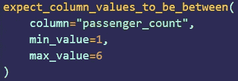

另一个特性是自动数据分析。伟大的期望可以从基于其统计的数据中自动生成期望。这可以节省时间，因为数据质量工程师不必从头开始编写断言。

一旦期望准备好了，它们就可以被合并到数据管道中。例如，在 Apache Airflow 中，可以使用`BashOperator`将数据验证步骤定义为`checkpoint script`。这将在数据流经管道时触发质量检查。《远大前程》兼容大多数数据源，如 CSV 文件、SQL 数据库、Spark 数据帧和 Pandas。

# 眼镜

Spectacles 是一个持续集成(CI)工具，旨在验证项目的 LookML。 [LookML](https://docs.looker.com/data-modeling/learning-lookml/what-is-lookml) 是 Looker 的数据建模语言。如果你不熟悉 [Looker](https://looker.com/) ，它是一个 BI 平台，允许不会“说 SQL”的人分析和可视化数据。

Spectacles 通过运行 SQL 查询并检查错误来验证 LookML。它集成了 GitHub、GitLab 和 Azure DevOps。该工具适合几乎所有的部署模式——无论是手动调用、从拉请求中触发，还是作为 ETL 作业的一部分运行。将 Spectacles 作为 CI/CD 工作流的一部分意味着在将代码部署到产品中之前，LookML 查询会被自动验证。

# 数据文件夹

[Datafold](https://www.datafold.com/) 是一个主动数据质量平台，它有三个主要组件:数据差异、具有列级沿袭的数据目录和数据监控。

Data Diff 允许您在将两个数据集(例如，dev 和 prod)合并到生产中之前对它们进行比较。这有助于用户采取更主动的开发策略。数据差异也可以集成到团队的 CI/CD 管道中，这样差异可以与 GitHub 或 GitLab 中的代码变更一起显示。

作为一个例子，让我们看看 Datafold 的沙盒环境中附带的`taxi_trips`数据集。正如您在下图中看到的，我们已经在`datadiff-demo.public.taxi_trips`和`datadiff-demo.dev.taxi_trips`数据集之间运行了数据差异操作。

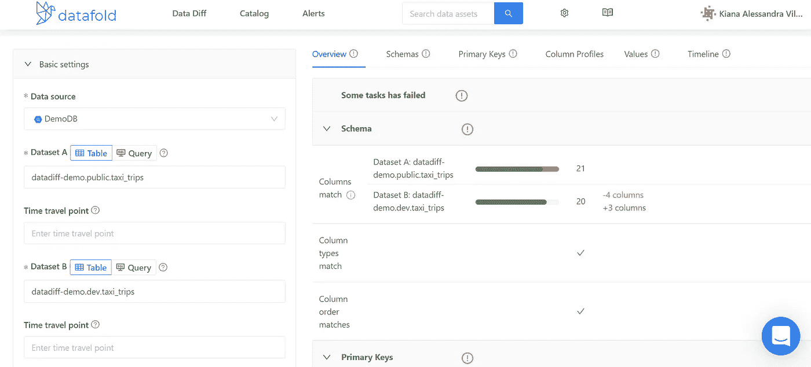

在右侧的详细面板上，您可以选择不同的选项卡来获得不同的结果。

*概述*选项卡将包含成功和失败测试的摘要。

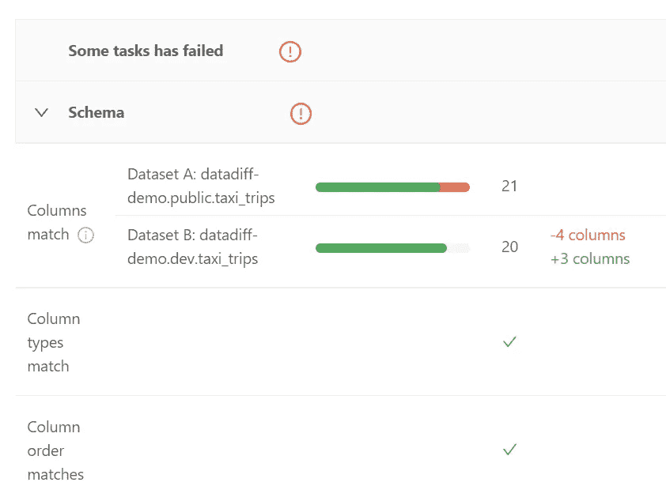

*模式*部分显示两个数据集的列(数据类型、出现顺序)是否匹配。

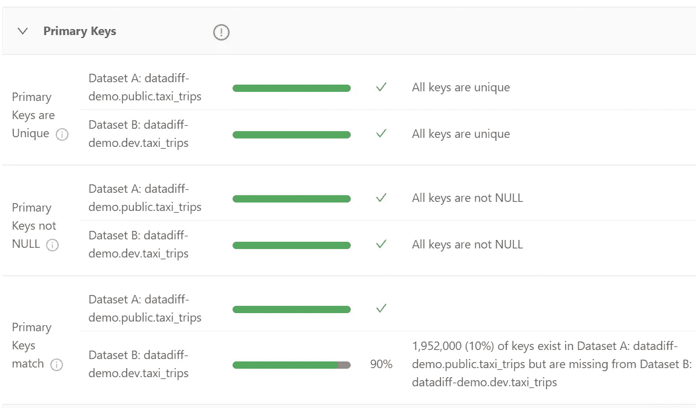

*主键*部分显示两个数据集之间唯一、非空且匹配的主键的百分比。

虽然*概述*选项卡是一个很好的信息来源，但其他选项卡提供了更多有用的细节。例如，*模式*选项卡可以是这样的:

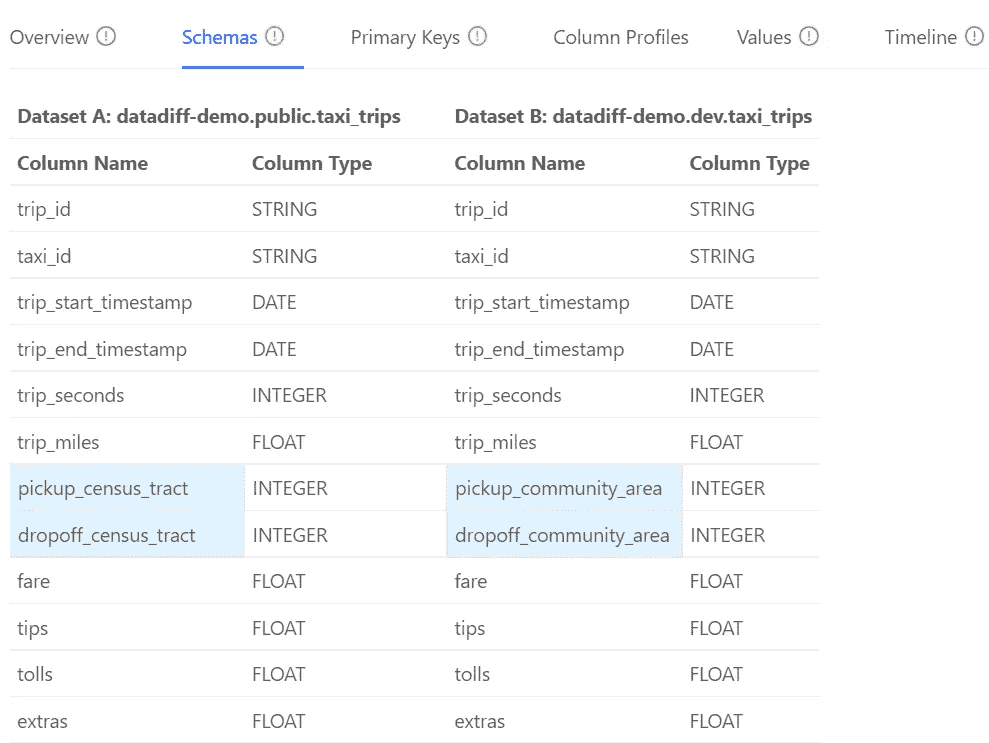

这里，突出显示的列是两个数据集的不同之处。这节省了时间，因为数据工程师可以专注于这两个字段的内容。

*数据目录*列出了用 Datafold 注册的所有数据源。它还允许用户使用过滤器查找和分析任何特定的数据集。对于拥有数百甚至数千个数据集的组织来说，这可以节省大量时间。这是一种发现异常的特别有用的方法。特别是，数据沿袭功能可以帮助回答如下问题:

*   这种价值从何而来？
*   这个值如何影响其他表？
*   这些表是如何关联的？

数据目录提供了一个如下所示的仪表板。向下滚动时，您会看到每一列的列表。

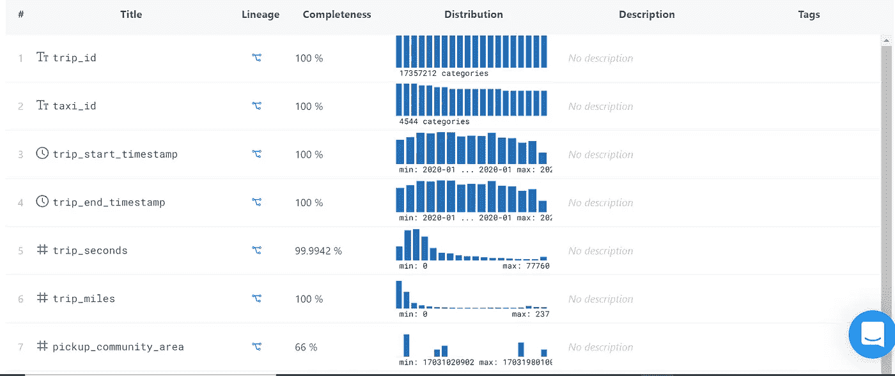

这些列提供了重要细节的概览:

*   *完整性*是指值不为空的百分比。
*   *分布*显示哪些值出现的最多，哪些值出现的最少。它还会显示值是否偏向某个范围。

点击*血统*下的图标会显示如下:


图形谱系图有助于数据工程师快速找到列值的来源。可以检查表、所有或特定列以及上游或下游关系的沿袭。

Datafold 的监控功能允许数据工程师编写 SQL 命令来发现异常并创建自动警报。警报由机器学习支持，机器学习研究数据中的趋势和季节性，以准确发现异常。下图显示了这样一个查询:

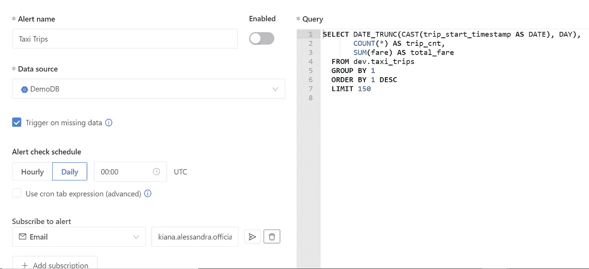

本例中的查询由 Datafold 自动生成。它跟踪出租车数据集中的每日总费用和总行程数。

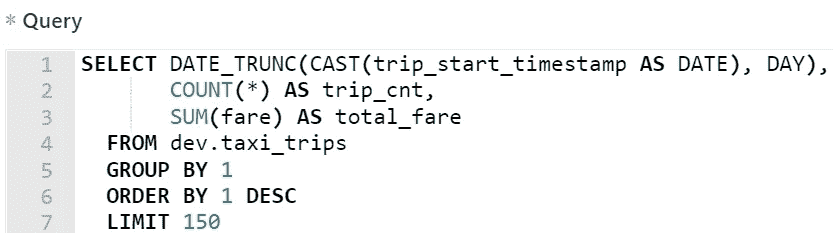

Datafold 还允许用户检查异常随时间变化的趋势，如下图所示:

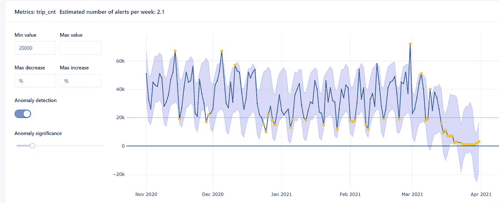

这里，黄点代表相对于最小值和最大值的异常。

# dbt

[dbt](https://www.getdbt.com/) 是一个数据转换工作流工具。在部署之前，它对目标数据库*运行数据转换代码，显示代码将如何影响数据，并突出显示任何潜在的问题。dbt 通过运行 SELECT 语句基于转换逻辑构建数据的最终状态来实现这一点。*

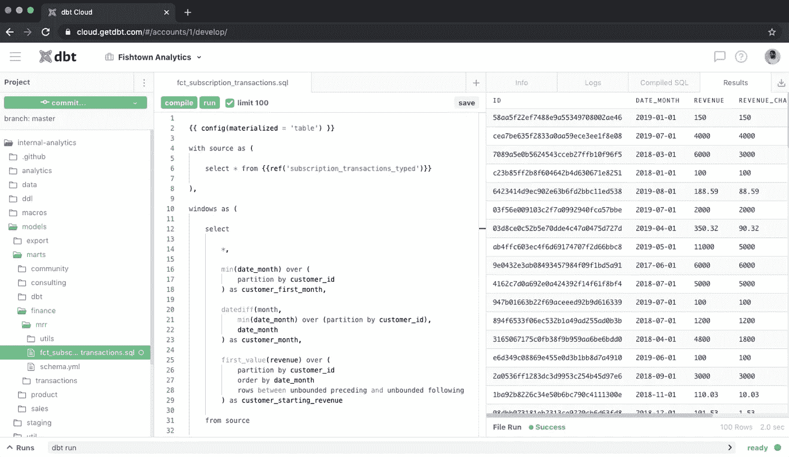

dbt 易于集成到现代 BI 堆栈中，可以成为 CI/CD 管道中有价值的一部分。它可以根据请求或计划自动运行。它有一个自动回滚功能，可以阻止潜在的代码破坏变更被部署。

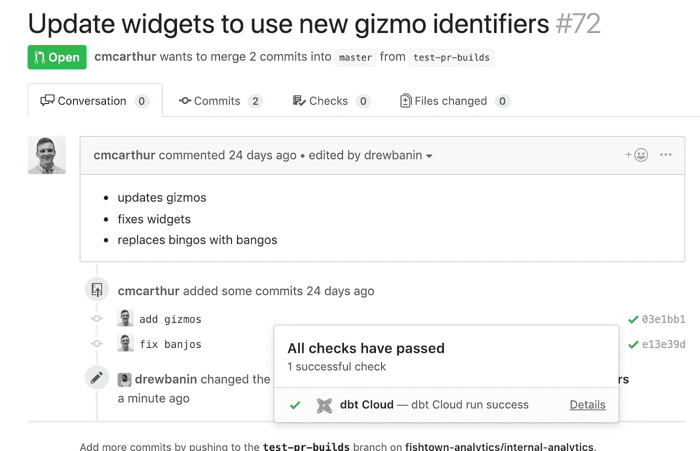

Datafold 和 dbt 可以一起用于自动化数据质量测试。就像 dbt 一样，Datafold 可以集成到 CI/CD 管道中。当一起使用时，它们显示了您的代码如何影响您的数据。

# 明显地

[显然](https://evidentlyai.com/)是一个分析和监控机器学习模型的开源 Python 库。它基于 Panda 数据帧和 CSV 文件生成交互式报告，用于排除模型故障和检查数据完整性。这些报告按细分市场显示模型健康状况、数据漂移、目标漂移、数据完整性、特征分析和性能。

要了解如何明显有所帮助，您可以在 Google Colab 上打开一个新的笔记本，并复制以下代码片段:

```
wine = datasets.load_wine()
wine_frame = pd.DataFrame(wine.data, columns = wine.feature_names)number_of_rows = len(wine_frame)wine_data_drift_report = Dashboard(tabs=[DataDriftTab]) wine_data_drift_report.calculate(wine_frame[:math.floor(number_of_rows/2)], wine_frame[math.floor(number_of_rows/2):], column_mapping = None)wine_data_drift_report.save("report_1.html")
```

这段代码将在浏览器中生成并加载一个报告。

报告的仪表板概览将显示基于每个功能的引用和当前值的分布。

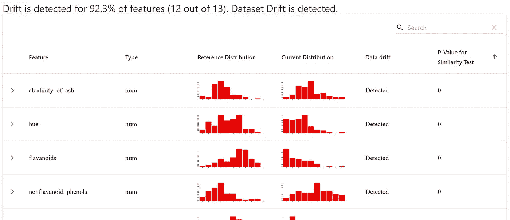

从这里可以进行更近距离的观察。例如，下图显示了当前数据集和参考数据集不同之处的确切值。

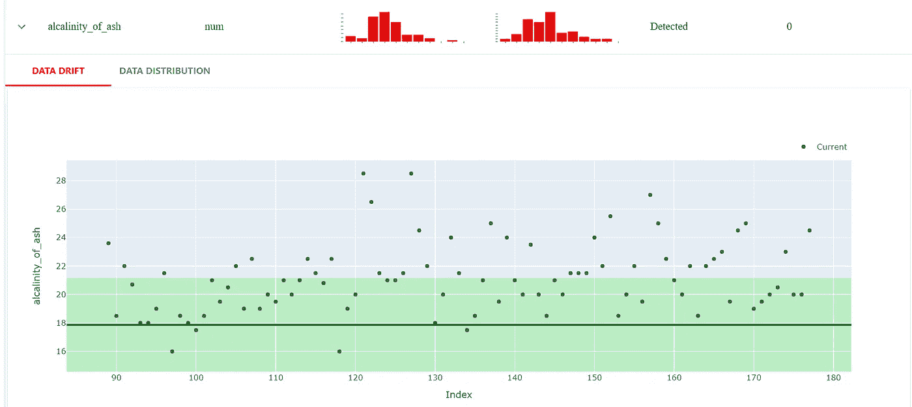

显然有漂亮的特性，如数字目标漂移、分类目标漂移、回归模型性能、分类模型性能和概率分类模型性能。

# 最后的话

数据质量标准和业务要求在不断发展，这使得确保数据质量的任务成为一个持续的过程。在数据驱动的决策中引入坏数据会产生许多后果，所有这些都对业务有害。这就是为什么在数据之旅的每一步都必须保持数据质量标准的原因。

这里讨论的五种工具可以在数据处理和使用的不同阶段使用。在您自己组织的数据之旅中，值得单独或以不同的组合测试其中一些工具，以了解它们如何为您的用例带来好处。