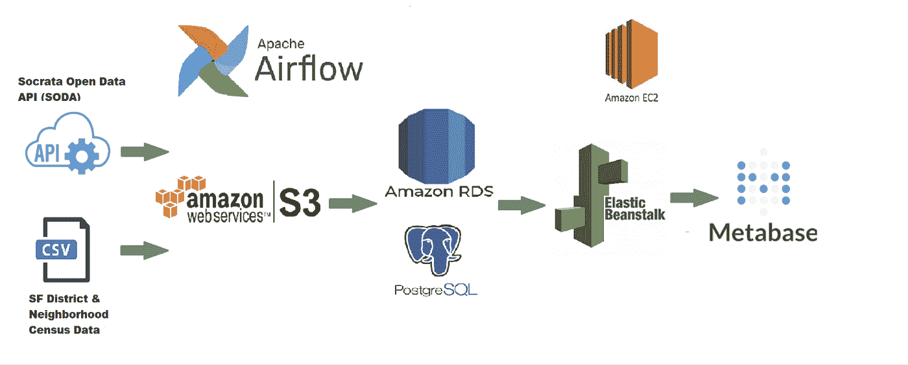
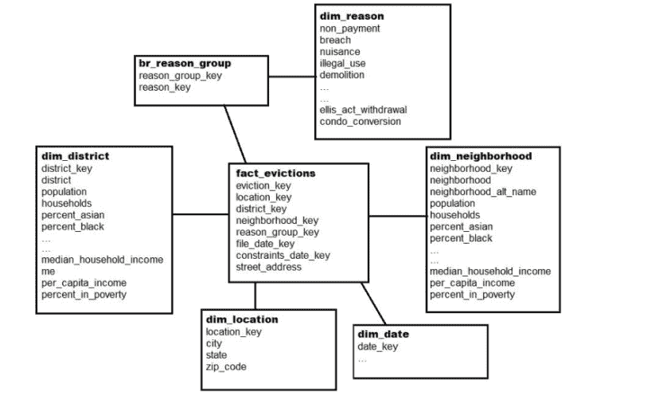
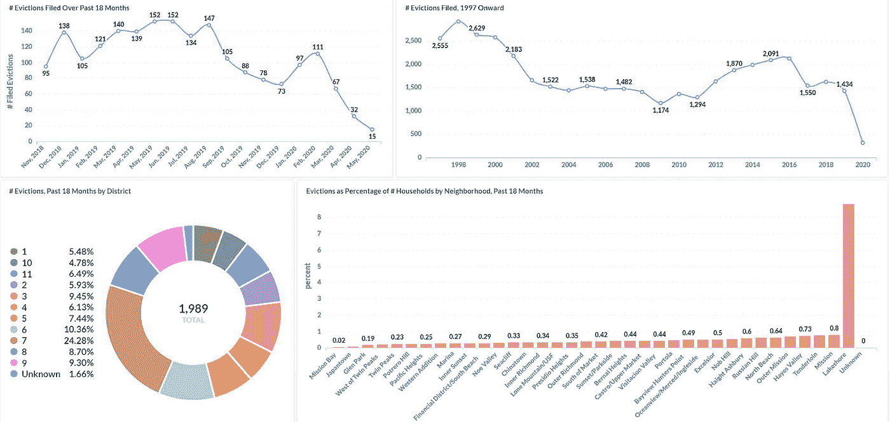
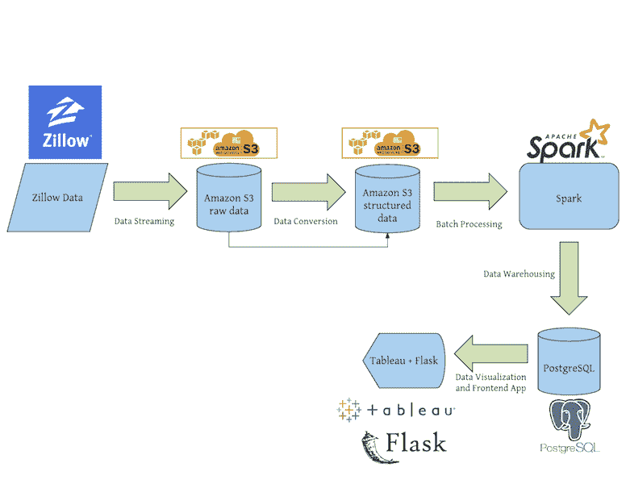
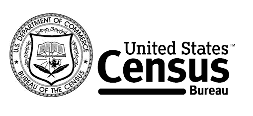
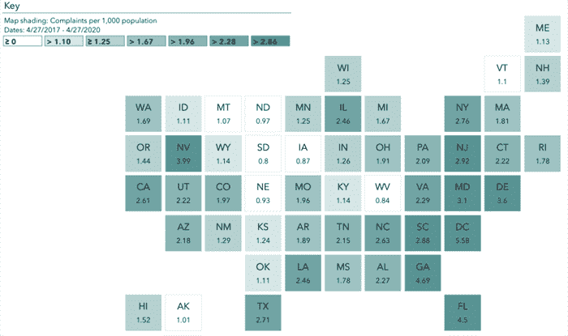
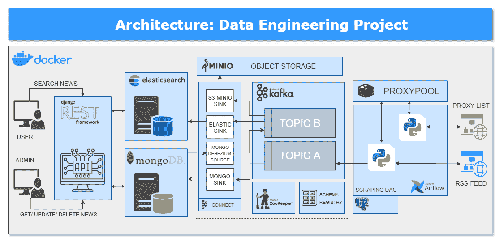

# 数据工程项目的 5 个数据源

> 原文：<https://betterprogramming.pub/5-data-sources-for-data-engineering-projects-d198ca0e74d4>

## 开发您的第一个数据工程产品组合

由 [Unsplash](https://unsplash.com?utm_source=medium&utm_medium=referral) 上的 [Zbynek Burival](https://unsplash.com/@zburival?utm_source=medium&utm_medium=referral) 拍摄的照片。

增加你被数据工程职位选中的机会的最有益的方法之一是在你的简历中添加记录良好的项目组合。

这不仅提高了你的技能，还提供了一个你可以和招聘人员讨论的有形的最终产品。

我们之前分享了一篇文章，介绍了你可以接手的 [5 个数据工程项目](https://www.youtube.com/watch?v=385mKftVr3I&t=1s)的例子。但是如果你想自己做呢？

你应该从哪里开始？

 [## 要添加到简历中的 5 个数据工程项目

### 学习如何使用卡夫卡，火花，德鲁伊，等等

better 编程. pub](/5-data-engineering-projects-to-add-to-your-resume-32984d86fd37) 

通常，找到正确的数据集是组织一个有效项目最困难的部分。

为了帮助您的项目开发之旅，本文将整理一个可用于[数据工程](https://www.theseattledataguy.com/5-mistakes-new-data-engineers-make-data-engineering-consulting/#page-content)的数据源列表。我还将概述其他开发人员实现这些数据集的几种方式，供您从中汲取灵感。

# 1.旧金山开放数据的 API

第一个数据源来自[旧金山开放数据的 API](https://datasf.org/opendata/) 。旧金山当地政府已经做了大量的工作来跟踪来自各种发布部门的数据，包括财政税收官、机场(SFO)和市政交通机构等等。 [Ilya Galperin](https://github.com/ilya-galperin/SF-EvictionTracker) 概述了该数据源的一个恰当的数据工程应用，其中驱逐趋势通过地区、申请原因、邻里和人口统计进行跟踪。

这项研究特别有趣，因为它是在新冠肺炎之后的几个月进行的，允许探索性分析新冠肺炎如何影响三藩市的各个子集。我们要完全掌握疫情影响的复杂性，以及它们在不同地区和不同人群中的差异，还需要数年时间。这个项目是朝着理解新冠肺炎的影响和不同群体之间影响的差异迈出的一小步。Galperin 遵循以下概述的通用模型架构:

来源: [GitHub](https://github.com/ilya-galperin/SF-EvictionTracker)

关于恢复项目构建，提供如上所列的图像是至关重要的。它可以让潜在的招聘人员快速参考你已经亲身体验过的资料。一般来说，最好是让你知道的招聘人员寻找的信息容易找到。除了架构之外，作者还展示了该项目的数据模型:

来源: [GitHub](https://github.com/ilya-galperin/SF-EvictionTracker)

虽然这个项目很棒，但我鼓励您进一步探索这个数据源，看看这个 API 所提供的一切。这将允许你根据自己的兴趣定制自己的项目。

最后，一个好的简历项目最重要的一个方面是视觉上吸引人的用户界面(UI)。尽管它不能证明你对数据工程的关键方面有所了解，但是对于浏览过你的知识库的人来说，你的 UI 直观地传达了你在项目中投入的努力程度。不要让你的努力被平庸的视觉表现所冲淡。下面列出了作者为这个项目创建的用户界面:

来源: [GitHub](https://github.com/ilya-galperin/SF-EvictionTracker)

# 2.房地产 API 大列表

来源: [Zillow](https://www.zillow.com/)

继续房地产的话题，[下一个项目](https://gist.github.com/patpohler/36c731113fd113418c0806f62cbb9e30)由 Zillow 的力量带给你，由 Patrick Pohler 策划。在这里，您可以找到我遇到的最全面的房地产相关 API 集之一。Pohler 在选择和分类各种资源方面做了大量的工作，并详细介绍了其他有用的实现工具。

该列表的主要类别包括:

*   家庭评估
*   邻里和社区数据
*   抵押贷款利率
*   抵押计算器

在 GitHub 上可以找到这些 API 被实现到数据工程管道中的例子[。该库的开发人员创建了一个模型管道，该管道利用历史和当前市场数据来确定当地房地产投资的潜在回报。下面列出了作者模型的一般架构:](https://github.com/jdkhong/Zillow-Data-Engineering)

来源: [GitHub](https://gist.github.com/patpohler/36c731113fd113418c0806f62cbb9e30)

这个项目以 XGBoost 回归模型为特色，以便于预测。作者整理了一个记录良好的项目，可以作为您自己潜在项目的重要参考。

# 3.美国人口普查局数据

来源:[美国人口普查局](https://www.census.gov/)

[下一个数据集](https://www.census.gov/data/datasets.html)来自最大的政府研究之一:美国人口普查。在这里，你可以找到从 1970 年到 2020 年的数据集。这些资源涵盖了广泛的主题，包括:

*   城镇人口总数
*   年度社会和经济增刊
*   州政府税收数据集

该数据集将成为一个很好的辅助数据集，可以用来回答有关 2008 年住房危机或最近的疫情等事件的影响的问题。

# 4.消费者投诉数据库

到目前为止，我们已经看了一些政府数据课程。然而，最全面的政府数据来源可以在 Data.gov[找到。它促进了各种各样的数据集，并提供了一个搜索工具，允许您发现几乎任何社会或经济主题的数据。](https://catalog.data.gov/dataset)

为了演示，这里有一个有趣的数据集:[消费者投诉数据库](https://www.consumerfinance.gov/data-research/consumer-complaints/)。这个数据集跨越了过去三年。就像 Galperin 的项目中使用的数据一样，这些信息可以用来描绘新冠肺炎的一些经济影响。

来源:[消费者金融保护局](https://www.consumerfinance.gov/data-research/consumer-complaints/)

# 5.从 RSS 源抓取新闻

最后，最容易获得的数据来源是从互联网上搜集的数据。为了不那么含糊，我概述了一个项目，它每十分钟从网上搜集新的在线文章，将所有最新的新闻汇集到一个地方。[这个项目](https://github.com/damklis/DataEngineeringProject)利用了各种各样的相关数据工程工具，这使它成为一个很好的项目范例。这个项目的作者是 Damian Kli，他在下面概述了他的模型架构:

来源: [GitHub](https://github.com/damklis/DataEngineeringProject#data-scraping)

有趣的是，Kli 实现了一个更新的 proxypool。他将代理与轮流用户代理结合使用，以避开反刮擦措施，并防止被识别为刮擦者。作者还采用了数据验证步骤，以确保一致的数据被发送给最终用户。最后，这个项目的 API 是用 Django REST 框架编写的。

这个项目的文档是极好的。一切都是概述，易于实施。如果你有兴趣为你自己的项目搜集数据，我建议你深入研究一下这个项目。

# 那么你会从哪里开始呢？

当编译你的项目时，记住演示对于创建一个有效的作品集项目是多么的重要。文档、可视化和用户界面的各个方面可以决定一个项目的成败——尤其是当你的受众是一个可能会浏览数百个项目以缩小候选人名单的招聘人员时。

不幸的是，缺乏视觉上吸引人的项目可能会导致你的简历在候选人选择的早期阶段被淘汰。