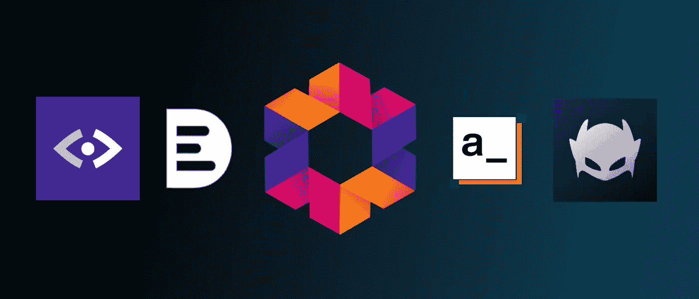
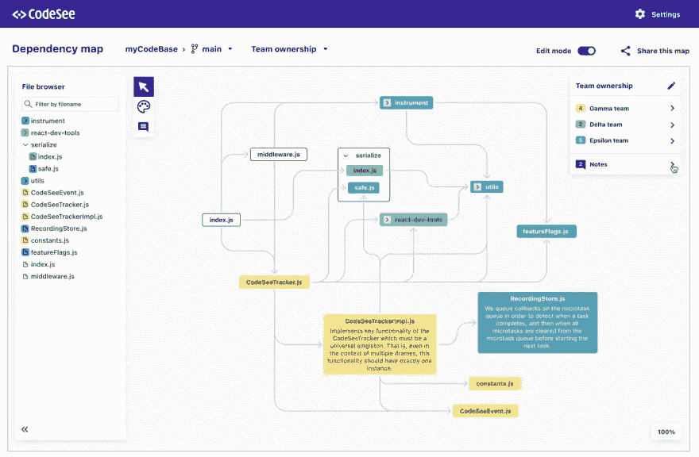
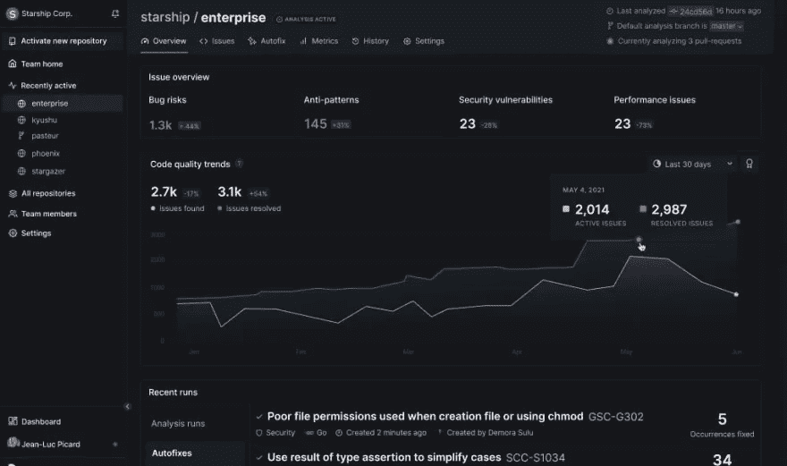
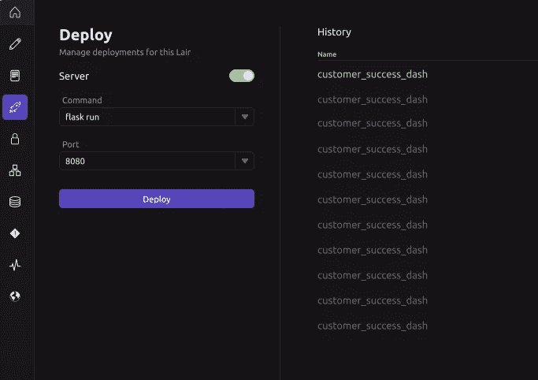

# 2022 年值得关注的 5 种开发工具

> 原文：<https://betterprogramming.pub/5-dev-tools-to-look-out-for-in-2022-713f94c0f3cf>

## Deepsource、Appsmith 等等

作者图片

你能相信过去的两年改变了我们的工作方式吗？开始是艰难的，但现在，随着 2021 年底的到来，我们已经习惯了远程工作环境，并期待市场赶上新常态。

远程团队(尤其是开发团队)对创新和协作改进的需求可能是我们目前在行业中观察到的最强趋势之一。

在这篇短文中，我收集了最近在我的雷达上的 5 个相对较新的开发工具，我相信它们有潜力改善我们的日常工作流程。

# [GitLive](https://marketplace.visualstudio.com/items?itemName=TeamHub.teamhub)

🤕**痛点:**缺乏专门为开发者设计的交流工具

💡**解决方案:**git live——用实时协作的超能力扩展您的 IDE

假设您的团队使用 Git，那么 GitLive 是 IDE 内置 Git 功能的一个显而易见的增强。安装后，它会添加一个团队视图，显示 Git 存储库中每个合作者正在进行的所有工作。主/主之前的任何非陈旧分支都被视为正在进行中的工作，您可以检查不同的已更改文件，并查看相关的问题或拉请求。

但我最喜欢的功能可能是自动合并冲突检测。对于您当前打开的文件，您的本地更改和您的团队成员正在进行的工作之间的差异显示在编辑器的空白处。它向您显示更改的类型(添加、删除、修改或冲突),您可以检查它以查看差异，它来自哪个分支，甚至可以挑选到您的本地文件中。

GitLive 对于大型团队非常有用，尤其是对于开源或内部源代码项目，因为这些特性甚至可以跨 fork 工作。更酷的是，数据直接来自 Git，不需要手动输入来保持最新。

GitLive

# [代码见地图](https://www.codesee.io/)

🤕**痛苦:**复杂而密集的代码库，缺乏对所有代码和功能如何相互映射的共同理解。

💡**解决方案:**CodeSee Maps——一个开发者可视化映射其代码库的工具。

CodeSee Maps 提供自动生成、自我更新的代码图。它们随着代码的发展同步您的代码库，以便您可以快速识别跨代码的依赖关系，并在文件和文件夹之间导航。它真的可以提高你对代码库的理解，并指导你的入职、计划和评审。该工具主要针对开发人员，但对于任何与团队互动的人来说都有很大的价值。

要开始使用 CodeSee Maps，您需要在您的 GitHub 用户帐户上授权 CodeSee，然后在您想要创建地图的存储库上安装并授权 CodeSee 架构图 GitHub 操作。目前他们只支持 GitHub，但是 BitBucket 和 GitLab 都在路线图上。

CodeSee 地图

# [深源](https://deepsource.io/)

🤕**痛苦:**耗时的代码审查容易出现人为错误

💡**解决方案:**deep source——快速可靠的静态分析平台

DeepSource 是一个静态代码分析器，它可以帮助你自动化代码审查，并为你的团队节省大量时间。它可以发现代码库中的问题，并自动提交 PRs 来修复它们(甚至评估 PRs 中的输入代码并修复它们)。支持的分析器包括 Docker、Java、JavaScript、Go、Python、Ruby 以及目前处于测试阶段的 PHP 和 SQL。它集成了 GitHub、GitLab 和 Bitbucket(自托管也可以)。

也有可能在内部部署。它如何改进你的团队的工作方式？他们的网站声称使用该工具平均每个开发人员每周可以节省 3.8 个小时，所以你自己算算吧！

深源

# [阿普史密斯](https://www.appsmith.com/about-us)

🤕**痛苦:**组织内部需要大量 CRUD 应用程序，这是一项重复且耗时的任务。

💡**解决方案:**app Smith——一个构建内部工具的开源框架。

Appsmith 将自己描述为“忙碌的开发人员的 UI 工具”,事实的确如此！对于构建大量托管在自己的基础设施和防火墙内的内部应用的团队来说，这是非常好的。通过拖放预先制作的、可定制的小部件，您可以轻松构建美观的管理面板、工作流和仪表板。您可以与任何 REST 或 GraphQL API 集成，并使用 JS 或库为您的应用程序创建逻辑。

Appsmith

# [方式脚本](https://wayscript.com/)

🤕**痛苦:**设置内部工具和应用程序非常耗时，并且使开发人员无法解决他们试图解决的实际问题。

💡**解决方案:**way script——将本地代码转化为托管应用的最快方式。

WayScript 是内部工具的开发中心。它提供了预配置的容器，您可以将其构建到其中，以便代码可以与您团队的现有基础设施一起工作。您可以快速设置 API(这在传统上是一项很长的任务，但对于技术客户来说也是必须的)、服务器、cron 任务、定制入点、接口等等。工具准备就绪后，您只需点击一下就可以部署它，并将其发送给您的团队。您可以通过下载本地应用程序或 web 应用程序来使用它。

道路脚本

我们无法确定 2022 年会带来什么，但我确信我们在过去几个月看到的趋势将继续增长。我希望我在本文中提出的一些工具将有助于改进您的工作流程，并使到远程工作设置的过渡更加平稳。