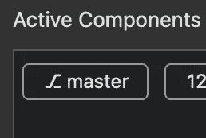

# 提高生产力的 5 个开发人员环境技巧

> 原文：<https://betterprogramming.pub/5-developer-environment-hacks-to-increase-productivity-2ade84555ab3>

## 简单而有效的环境改进，使您作为开发人员的生活更加高效和有效


达斯汀·李在 [Unsplash](https://unsplash.com/s/photos/workspace?utm_source=unsplash&utm_medium=referral&utm_content=creditCopyText) 上的照片

以下是我用过的一些最有用的工作区生产力技巧，我发现它们对效率和效果有好处。其中一些是简单的组织实践，而另一些是工具、框架或实用程序，可以使您的工作总体上更加高效。尽情享受吧！

# 1.终端 Git 分支状态

首先，我们有一个非常简单的改进，它非常受欢迎，最近已经作为核心特性被纳入到 [iTerm2](https://iterm2.com/) 中。

当在 Git 存储库中工作时，能够看到您正在工作的分支及其当前状态是很有帮助的。直到最近，这可以通过一个简单的 [Bash](https://www.gnu.org/software/bash/) 或 [zsh](https://ohmyz.sh/) profile 编辑来完成，在提示符下显示分支。

如果你对为此建立一个基本 Bash 配置文件的细节感兴趣，我强烈推荐 [Elizabeth Zagroba](https://medium.com/u/1d6c51ad6de1?source=post_page-----2ade84555ab3--------------------------------) 关于这方面的伟大的[文章](https://medium.com/@ezagroba/update-your-mac-terminal-to-display-your-current-git-branch-and-status-471c017436a2)。如果您对 iTerm2-way 感兴趣，请按照以下步骤在您的终端中启用它:

*   打开 iTerm2，选择*首选项* > *配置文件*。
*   导航到*会话*选项卡并滚动到底部以启用*状态栏*。


启用状态栏。

*   配置状态栏并选择分支组件。



这是 git 分支组件。

是否选择将分支状态合并到 shell 提示符或终端窗口中完全取决于您。就我个人而言，我两者都用，只是因为我习惯了我的 shell 提示符，我觉得没有它看起来很奇怪。试试吧，自己决定！

# 2.使用 Tmux

如果你对 [tmux](https://github.com/tmux/tmux) 不熟悉，我会建议安装一下，试一试。起初看起来相对简单的窗口/会话管理器实际上是一个极其复杂和功能丰富的生产力发电站。

Tmux 允许你用快捷方式和热键管理多个窗口分割。最方便的好处之一类似于[屏幕](https://linux.die.net/man/1/screen)，它让你暂停会话，稍后再返回。

如果您将它安装在您访问的远程机器上，这可能特别有用。您可以开始一个会话，启动一个长时间运行的脚本或流程，然后从会话中脱离出来，喝杯咖啡。

一旦你成功地获得了咖啡，你的会话将在你离开的地方继续。

另一个惊人的好处是，如果您失去了到远程机器的 SSH 连接，tmux 会自动而优雅地暂停您的会话。

如果您连接到远程机器，打开一个新的 tmux 会话，然后在 [Vim](https://www.vim.org/) 中打开您的文件。在该会话中，如果您断开连接，将不会出现`.swp`文件地狱。

Tmux 救了我无数次，值得学习。

# 3.设置外壳别名

你打字越少，效率越高。在你最喜欢的文本编辑器中打开`~/.bash_aliases`，开始输入一些别名。确保首先在您实际的 shell 配置文件中获取`.bash_aliases`文件(这是默认的，取决于您的发行版)。

如果您不熟悉创建 shell 别名，这非常简单快捷。您可以想出重复输入的命令的简写版本。

当你登录的时候，你会改变目录并启动一个进程吗？做个化名。

您是否发现自己在复杂的目录结构中进进出出？做个化名。

你永远都记不住那个冗长命令的语法吗？对，别名。

别名条目就像这样简单:

```
alias mydir='cd /some/long/directory/path'
```

# 4.组织代码目录

这个听起来很简单，因为它确实很简单。您应该花一些时间(甚至几分钟)来规划存储代码的目录结构。把它想象成清理和整理你的桌子。

我喜欢将任何克隆的库保存在一个名为`co`或`checkout`的单独目录中。这有助于区分克隆的存储库和您可能正在本地修补的东西。

对于任何其他代码，我喜欢把它放在一个按语言组织的目录中。例如:

```
code ---> python ---> <my_cool_project> ---> <source_files>
```

# 5.使用 ripgrep

不记得那个函数在哪个文件里了？忘记你把变量存储在哪里了？Ripgrep 前来救援！

你以前使用过 [git-grep](https://git-scm.com/docs/git-grep) 来搜索知识库吗？Ripgrep 类似，但有一个关键的例外，它 *rips* ！Ripgrep 比 git-grep 要快得多，它可以快速地通过一行行的代码找到你想要的东西。

下次你忘记东西在哪里或者不知道从哪里开始找，试试 [ripgrep](https://github.com/BurntSushi/ripgrep) 。这很简单，因为:

```
rg 'search term'
```

希望您已经发现了其中一些有用的改进，并在下次从事项目时将它们应用到您自己的环境中。