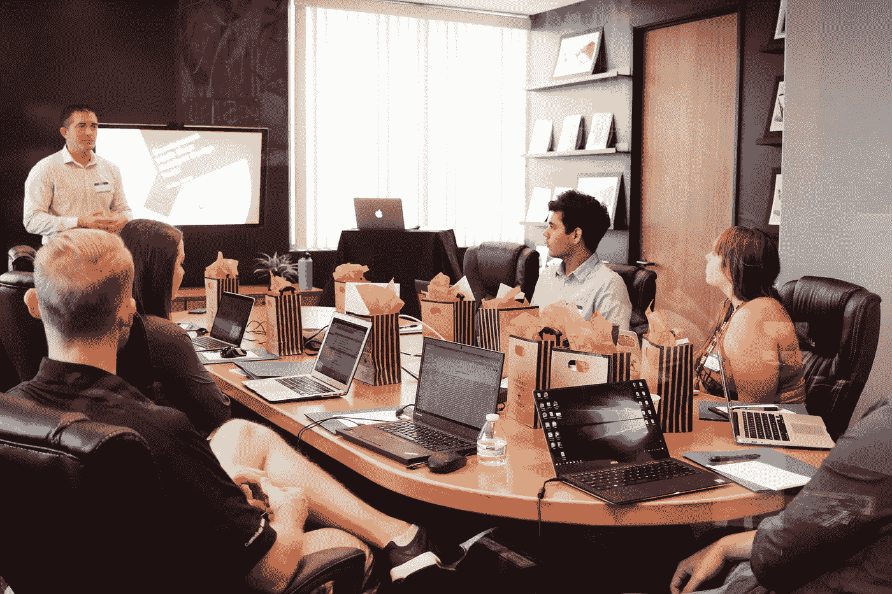

# 5 名开发人员本周分享了他们在更好编程方面的经验

> 原文：<https://betterprogramming.pub/5-developers-share-their-experiences-at-better-programming-this-week-cb232e726534>

## 过去一周我们表现最好的作品

嘿，更好的编程读者们，

又是一个星期五，我希望你们都做得很好。在本期周刊中，我们的五位作者分享了他们的第一手软件工程经验。

此外，我们还通过媒体发布了一些有趣的编程和数据科学故事。事不宜迟，我们开始吧。

[活动发起人](https://unsplash.com/@campaign_creators?utm_source=medium&utm_medium=referral)在 [Unsplash](https://unsplash.com/?utm_source=medium&utm_medium=referral) 上的照片

## [为什么高级开发人员面临更高的面试拒绝率？](/why-do-senior-developers-face-a-higher-interview-rejection-rate-ae78a0d62369)

首先，[萨沙·马修斯](https://medium.com/u/739ee1624074#代码性能的方法</a>作者<a class=)

*   [高度自信的程序员的十大标志](https://levelup.gitconnected.com/top-10-signs-of-a-highly-confident-programmer-d988a60c9192)

## [中型工程](https://medium.engineering/)

最后但同样重要的是，Medium 自己的 iOS 开发者， [Alaina Kafkes](https://medium.com/u/2a0e67b83a74?source=post_page-----cb232e726534--------------------------------) 让我们先睹为快，看看她在 Medium 运行的[战术，以及工程团队如何从中受益。](https://medium.engineering/improving-ios-intangibles-with-tactical-f744fbff033e)

这就是本周的时事通讯！查看 [betterprogramming.pub](https://betterprogramming.pub/) 了解更多有趣的故事。

感谢阅读。直到下一次，

[阿努帕姆](https://medium.com/u/9833cc01f515?source=post_page-----cb232e726534--------------------------------)和更好的编程团队