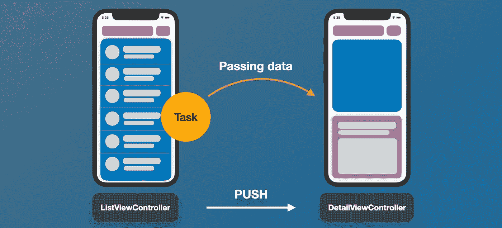
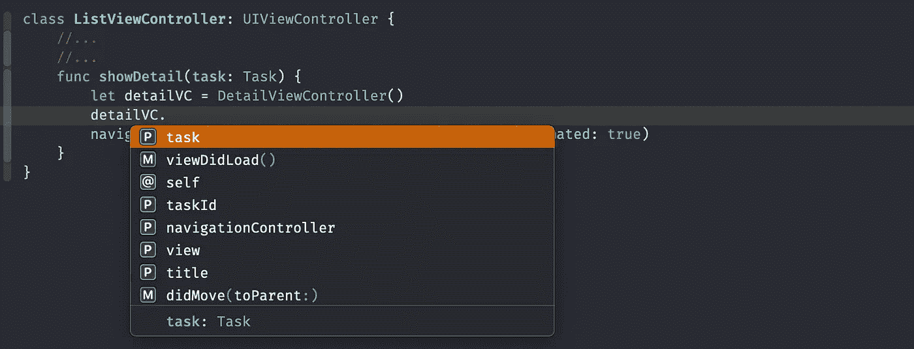
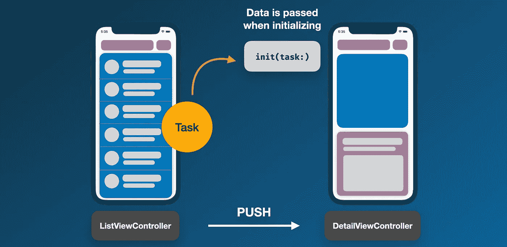

# 在 iOS 代码库中传递数据的 5 种不同方式

> 原文：<https://betterprogramming.pub/5-different-ways-to-pass-data-in-ios-codebases-a784f72a8f50>

## 依赖注入、委托方法等等

安迪·霍姆斯在 [Unsplash](https://unsplash.com?utm_source=medium&utm_medium=referral) 上的照片

视图控制器和视图之间的数据传递是 iOS 开发的一个重要方面。事实上，不正确的实现可能会导致应用程序失败，并产生不正确的最终结果。

# 入门指南

在本文中，我们将学习如何实现在视图控制器之间传递数据的五种方法。

1.  使用`internal`或`public`修改器
2.  实现委托方法
3.  依赖注入
4.  `NotificationCenter`
5.  全局变量

# 1.使用内部(默认)或公共修饰符

在推送或呈现视图控制器时，通常会设置目标视图控制器的属性值。

我们只需要用`internal`级别设置视图控制器内部属性的访问修饰符，默认情况下，如果我们没有用`private`或`fileprivate`修饰符预先声明任何属性。

`internal` access 允许在同一模块或目标中使用属性或功能，这意味着它对同一应用程序、框架、扩展或 Swift 包中的其他源代码始终可见。

`public`访问类似于内部访问，但是它允许在模块内部和外部使用实体。您可以在 Swift [文档](https://docs.swift.org/swift-book/LanguageGuide/AccessControl.html)中了解更多关于访问级别的信息。

将任务对象从`ListViewController`传递到`DetailViewController`

太好了。现在，让我们以如上图所示的两个控制器为例，其中左视图控制器想要将一个`Task`对象传递给右视图控制器。

首先，将目标视图控制器的`Task`对象(在本例中为`DetailViewController`)设为`internal`，以确保其值可以从左侧视图控制器中设置。

在`showDetail`函数中，初始化目的视图控制器后，我们可以用函数参数中的当前任务设置`detailVC`的`task`属性。此方法仅适用于向前方向—推动和呈现视图控制器。

下面是它在 Xcode 中的样子。自动完成选项中只有`task`和`taskId`可见。私有属性不会出现在下拉选项中。

带有 public 和 private 修饰符的自动完成示例

注意:如果您正在使用 Storyboard，那么最好使用 segue 在视图控制器之间传递数据。

# 2.实现委托方法

反向传递数据的一个正确方法是使用委托方法。在本例中，我们将把更新后的`task`数据从`DetailViewController`传递到`ListViewController`。

## 设置委托方法

委托方法是基于 Swift 协议创建的，该协议指定了需要由采用类实现的必需方法。

首先，让我们通过创建一个名为`DetailViewControllerDelegate`的新协议来设置委托方法。

它包含`didUpdate(task:)`函数，该函数使采用类能够接收事件更新。

在这种情况下，`ListViewController`将接收到由`DetailViewController`发出的更新后的`task`对象。请参见下图中的流程。

使用委托方法发回数据

打开，`DetailViewController`并用下面的代码更新。委托方法可以放在同一个文件中:

从上面更新的代码中，我们知道每当调用`updateTask`时，它都会发出委托，通过`didUpdate`委托函数发送`task`对象。

因此，实现视图控制器(在本例中是 ListViewController)将接收发送的数据。

## 更新接收器视图控制器

在`ListViewController`中，我们需要实现所需的委托方法，并将委托分配给自身。

首先，打开`ListViewController`并更新`showDetail()`功能。

然后，在文件的底部，添加一个带有`DetailViewControllerDelegate`协议的扩展名，如下面的代码所示。

# 3.依赖注入

在这种模式下，在创建一个类的实例之前，需要一个或多个依赖对象。在本例中，我们将创建一个视图控制器，只有将数据传递到它的`init()`函数中才能创建它。事实上，如果在初始化过程中数据丢失，它会给出一个错误。

创建 DetailViewController 实例时需要数据

下面是创建具有依赖关系的视图控制器的代码示例。在这段代码中，我们已经将 task 属性更新为 private，因此它将无法从类外部进行设置。

其次，我们添加了`init(task:)`来确保`task`对象在初始化时被传递。

在`ListViewController`中，我们将对`showDetail()`进行一点更新，如下面的代码所示:

此外，对于依赖注入的高级用法，我们可以集成到项目中的优秀库很少，例如 [SwiftInject](https://github.com/Swinject/Swinject) 和 [Resolver](https://github.com/hmlongco/Resolver) 。

# 4.通知中心

`[NotificationCenter](https://developer.apple.com/documentation/foundation/notificationcenter)`是 Apple 提供的一个很棒的 API，可以向多个视图控制器发送数据。它由两个组件组成，观察者和发送者。

当一个视图控制器向自身添加一个观察者时，它将从发送者那里收到一个带有可选有效负载的通知。视图控制器想要订阅更新的键必须在`Observer`中指定。

下面给出了上面编写的代码的细节:

1.  首先，我们定义了密钥，以便正确使用它
2.  创建一个函数，为这个视图控制器添加一个观察者，并在`viewDidLoad`中调用它
3.  创建一个当观察者收到通知时将被调用的函数
4.  处理收到的通知的有效负载

然后，我们可以从其他视图控制器发送一个`Dictionary`类型的数据。所以，所有的观察者都会立即收到数据。

在下面的例子中，我们创建了一个`broadcastInfo()`函数来通知所有观察者这个概要文件已经用指定的有效载荷更新了，这个有效载荷包括一个标题、副标题和图像:

# 5.全局变量

为了创建一个全局变量，我们只需要一个具有静态`var`属性的结构，如下面的代码所示:

不太推荐这种方法，因为任何更改都很难跟踪，而且这可能是错误发生的主要原因。但是，您可以通过使用类似 redux 的库 [ReSwift](https://github.com/ReSwift/ReSwift) 来适当地实现它，这是一个具有单向数据的状态管理工具。

# 结论

太好了！现在，我们已经完成了关于如何在 iOS 项目中传递数据的所有基本的五个方法。希望对你的 iOS 开发有所帮助。

感谢阅读。编码快乐！

# 参考

[Swift 协议文件](https://docs.swift.org/swift-book/LanguageGuide/Protocols.html)

[使用 Segues 查看控制器指南](https://developer.apple.com/library/archive/featuredarticles/ViewControllerPGforiPhoneOS/UsingSegues.html)

[Swift 访问控制文件](https://docs.swift.org/swift-book/LanguageGuide/AccessControl.html)

[通知中心文档](https://developer.apple.com/documentation/foundation/notificationcenter)

[https://github.com/ReSwift/ReSwift](https://github.com/ReSwift/ReSwift)

[https://github.com/hmlongco/Resolver](https://github.com/hmlongco/Resolver)

[https://github.com/Swinject/Swinject](https://github.com/Swinject/Swinject)