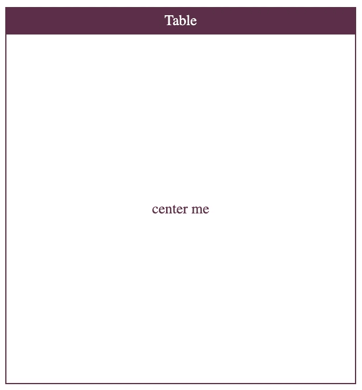
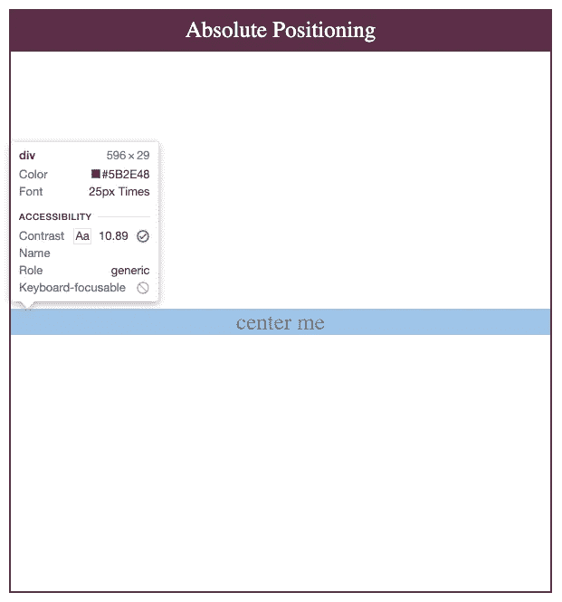
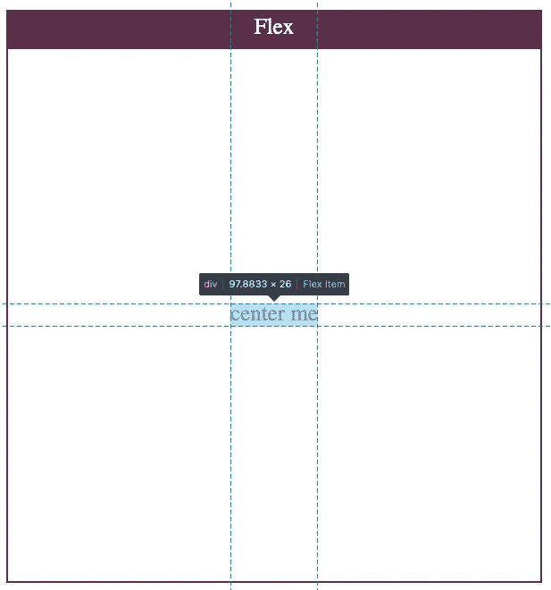
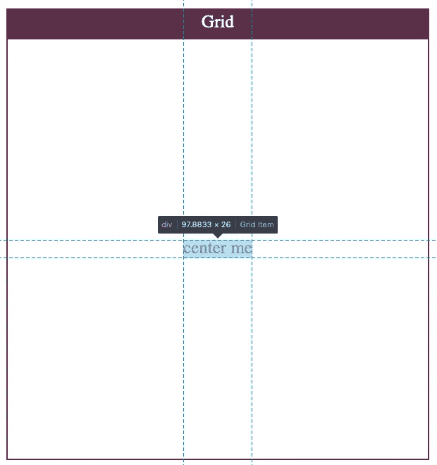
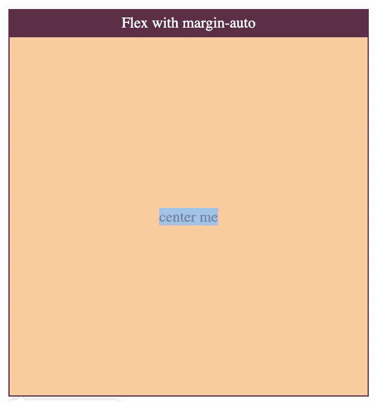

# 垂直对齐 CSS 内容的 5 种不同方法

> 原文：<https://betterprogramming.pub/5-different-ways-to-vertically-align-your-css-content-6ac864af7f2c>

## 研究设计网页的各种 CSS 方法


由 [Pankaj Patel](https://unsplash.com/@pankajpatel?utm_source=medium&utm_medium=referral) 在 [Unsplash](https://unsplash.com?utm_source=medium&utm_medium=referral) 上拍摄的照片。

垂直对齐一直是日常要处理的问题之一。过去，这一直是令开发人员头疼的问题。幸运的是，有了 Flex 和 Grid 这样的新布局，这已经变成了一项微不足道的任务。然而，在处理问题时，知道自己的选择总是好的。

让我们来看看我们可以用来处理垂直对齐的所有工具。即使有些不是最有用的，学习它们可能会提高你对 CSS 的理解。

# 1.桌子

不久以前，表格布局是 HTML 中最流行的布局之一。通过使用`display`属性，您可以强制一些非`<table>`元素表现得像它们一样。

以下是与`display`表相关的值的列表:

让我们使用上面的值来编写我们的第一个解决方案:

为了进行垂直对齐，我们使用 CSS 表的`vertical-align`属性。

> "垂直对齐属性可用于两种情况
> 
> -在包含行的框内垂直对齐行内元素的框。例如，它可以用来在一行文本中垂直定位一个`[](https://developer.mozilla.org/en-US/docs/Web/HTML/Element/img)`。
> 
> -垂直对齐表格中单元格的内容。”— [MDN 网络文档](https://developer.mozilla.org/en-US/docs/Web/CSS/vertical-align)

注意`vertical-align`在`block`和`table`元素上的表现确实不同。这就是为什么如果你试图用它来使元素在一个`div`上居中，它不会做任何事情。

在我们的例子中，最重要的代码是:

使用上述内容基本上与制作布局表格相同:

让我们看看结果:



作者截图。

让我们检查一下结果，以便更好地理解发生了什么:


用开发工具检查表格单元方法。

请注意，HTML 表格应该用于表格数据。这是他们唯一的目的。许多人误用它们。

# 2.绝对定位

绝对定位是多年来的首选解决方案。它在一些特殊的复杂场景中仍然有用。

技术很简单:

*   定义一个`position: relative`到你想要居中的容器。
*   在想要居中的元素上定义`position: absolute`。
*   使用`top: 50%`将元素大致移动到屏幕中间。
*   `transateY(-50%)`最终将项目调整到中心。

让我们在一个例子中使用它:

和以前一样，让我们看看上面代码中重要的 CSS 逻辑:

让我们检查结果:



用开发工具检查结果。

结果与上一个非常相似:`center me` `div`占据了整个水平空间，并与容器分离。

# 3.Flexbox

[Flexbox](https://developer.mozilla.org/en-US/docs/Learn/CSS/CSS_layout/Flexbox) 的灵感来源于 [Bootstrap](https://getbootstrap.com/docs/5.0/getting-started/introduction/) 等流行的 UI 框架。其第一份工作草案于 2009 年 7 月 23 日发布。11 年后，令人惊讶的是对它的支持直线上升:大约 99.2%的浏览器支持它的使用。

FlexBox 具有内容对齐功能。让我们来看看与我们的用例最相关的两个:

## 属性:对齐项目

> “ [CSS](https://developer.mozilla.org/en-US/docs/Web/CSS) `**align-items**`属性将所有直接子对象作为一个组设置`[align-self](https://developer.mozilla.org/en-US/docs/Web/CSS/align-self)`值。在 Flexbox 中，它控制[横轴](https://developer.mozilla.org/en-US/docs/Glossary/Cross_Axis)上项目的对齐。在网格布局中，它控制[网格区域](https://developer.mozilla.org/en-US/docs/Glossary/Grid_Areas)内块轴上项目的对齐。— [MDN 网络文档](https://developer.mozilla.org/en-US/docs/Web/CSS/align-items)

## 属性:对齐-内容

> " [CSS](https://developer.mozilla.org/en-US/docs/Web/CSS) `**justify-content**`属性定义浏览器如何沿着 flex 容器的[主轴](https://developer.mozilla.org/en-US/docs/Glossary/Main_Axis)和网格容器的内联轴在内容项目之间和周围分配空间。"— [MDN 网络文档](https://developer.mozilla.org/en-US/docs/Web/CSS/justify-content)

我们可以将两者结合起来，使我们的项目在容器的`Flexbox`中心对齐。这是目前最常用的方法。它简单、有效，并且只需要其中一个元素中的 CSS。

让我们检查结果:



用开发工具检查结果。

在这里，我们看到了一种更干净、更自然的方法。`center me` `div`只是占用了它需要的空间，因为我们使用了对齐属性。这是因为 Flexbox 在构建时就考虑到了这种用例。我们可以在浏览器检查器上看到更好的元素，如`highlights`，如上所示。

# 4.格子

网格由微软团队起草，并于 2011 年发布到 Internet Explorer 10 中。与 Flex 一样，它在一致性方面功能齐全，包装精美。

我们可以像在 Flex 中一样使用`align-items`和`justify-content`。然而，Grid 有一个配置这两者的简写属性:`place-items`。

让我们来看看定义:

> “ [CSS](https://developer.mozilla.org/en-US/docs/Web/CSS) `**place-items**` [速记属性](https://developer.mozilla.org/en-US/docs/Web/CSS/Shorthand_properties)允许您在相关布局系统(如[网格](https://developer.mozilla.org/en-US/docs/Web/CSS/CSS_Grid_Layout)或 [Flexbox](https://developer.mozilla.org/en-US/docs/Web/CSS/CSS_Flexible_Box_Layout) )中同时沿块和内嵌方向对齐项目(即`[align-items](https://developer.mozilla.org/en-US/docs/Web/CSS/align-items)`和`[justify-items](https://developer.mozilla.org/en-US/docs/Web/CSS/justify-items)`属性)。如果未设置第二个值，则第一个值也用于它。— [MDN 网络文档](https://developer.mozilla.org/en-US/docs/Web/CSS/place-items)

这种方法不如 Flexbox 流行，因为浏览器对网格的支持较少。如果你想让一个项目居中，使用网格可能会有些过头。

代码与 Flex 非常相似。通过使用`place-items`属性，实现这种行为的代码非常少:

```
.container-center {
  display: grid;
  place-items: center;
}
```

如前所述，下面的代码等同于上面的代码:

```
.container-center {
  display: grid;
  align-items: center;
  justify-content: center;
}
```

让我们检查结果:



用开发工具检查结果。

最终结果与 Flexbox one 超级相似。

# 5.带边距的柔性盒/网格

使用`margin: auto`对齐仍然是水平居中对象的常用方法。它沿`x`应用一个均匀的边距，这导致项目水平对齐。

这是一个非常简单而有效的方法。然而，`margin: auto`不能在`display: block`元素上垂直居中。

然而，Grid 和 Flexbox 现在支持`margin: auto`将项目垂直和水平居中。

让我们来看一个例子:

这是所有奇迹发生的地方:

让我们检查结果:



用开发工具检查结果。

这是一个和之前非常相似的结果。浏览器在定位元素方面做得很好，因为它是本机支持的。然而，我们这次没有得到好的定位线。

# 包扎


Jared Erondu 在 [Unsplash](https://unsplash.com?utm_source=medium&utm_medium=referral) 上拍摄的照片。

在本文中，我们已经看到了用 CSS 垂直对齐内容的所有顶级方法。如前所述，最常用的是 Flexbox，因为它非常简单且具有声明性。它只需要最少的代码，并且全部放在父容器中。对 Flexbox 的支持非常棒，所以你不必担心你的用户浏览器不支持它。

你知道任何其他垂直居中物品的酷方法吗？随意评论。

干杯！

## 相关文章

[](https://medium.com/better-programming/grid-vs-flexbox-which-one-should-you-be-using-471cb955d3b5) [## Grid 和 Flexbox——你应该使用哪一个？

### 为正确的工作寻找正确的工具的旅程

medium.com](https://medium.com/better-programming/grid-vs-flexbox-which-one-should-you-be-using-471cb955d3b5) [](https://medium.com/better-programming/using-css-subgrid-for-pixel-perfection-6d4343b057cd) [## 使用 CSS 子网格实现像素完美

### 展示 CSS 的子网格特性的简单美丽

medium.com](https://medium.com/better-programming/using-css-subgrid-for-pixel-perfection-6d4343b057cd)