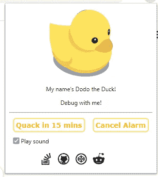
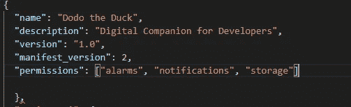
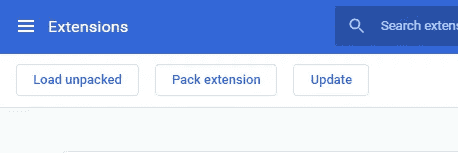
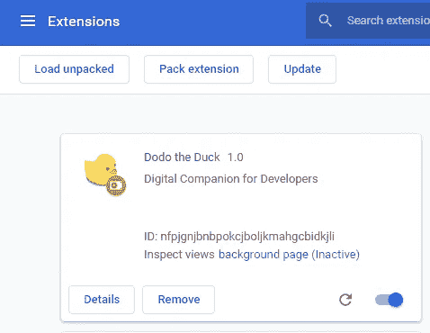
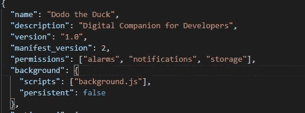
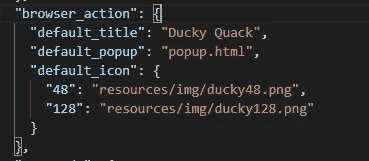
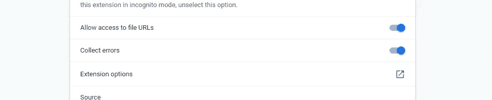
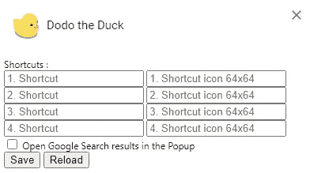

# 创建自己的 Chrome 扩展的 5 个简单步骤

> 原文：<https://betterprogramming.pub/5-easy-steps-to-create-your-own-chrome-extension-6e248e42d48d>

## 根据您的需求定制 Chrome

扩展不过是定制用户浏览体验的小软件程序。它们可以让你根据个人需求和偏好定制 Chrome 的功能和行为。

我最近创建了一个名为 [Dodo 的 Chrome 扩展——鸭子](https://dododebugging.netlify.app/)，它可以作为调试的数字伴侣。渡渡鸟——这种鸭子有很多很酷的特征:

*   有用的调试建议
*   十五分钟闹铃——当你需要快速休息时使用，这样你就不会忘记时间
*   链接到开发者友好的网站，如 [Stack Overflow](https://stackoverflow.com/) 、 [GitHub](https://github.com/) 、 [Reddit](https://www.reddit.com/) 和 [CodePen](https://codepen.io/) 以及添加定制链接的选项

向多多问好

在本文中，我将引导你一步一步地创建自己的 Chrome 扩展。

# 1.创建清单

扩展从它们的清单开始。创建一个名为`manifest.json`、**、**的文件，包含一个`name`、`description`、`version`、`manifest_version`和`permissions`。

manifest.json

要在浏览器中查看您对扩展代码所做的更改，请按照下列步骤操作:

*   转到`chrome://extensions`
*   如果您还没有启用开发者模式，请启用它
*   选择“装入未包装的”
*   找到包含所有文件的文件夹，并选择它们
*   哒哒。多多已经到了！

在开发人员模式下加载解包

安装的扩展

# 2.添加说明

虽然已经安装了扩展，但是没有说明。必须在清单中注册后台脚本和许多其他重要组件。我们将通过创建一个`background.js`文件并将其放在扩展目录中来实现这一点。

通过创建一个名为`background.js`的文件或在这里下载[并将其放在扩展目录中，引入一个后台脚本。](https://raw.githubusercontent.com/Megha-Pathak/Dodo/master/background.js)

向清单中添加 background.js

# 3.引入用户界面

扩展可以有多种形式的用户界面，但是这个将使用弹出窗口。创建一个名为`popup.html`的文件并添加到目录中。该扩展使用:

*   摇摆的鸭子形象
*   控制警报的两个按钮
*   用于播放声音权限的复选框
*   社会联系

用户界面如下图所示。你可以试着自己创建或者从[这里](https://raw.githubusercontent.com/Megha-Pathak/Dodo/master/popup.html)下载文件。

扩展的用户界面

与后台脚本一样，这个文件需要在清单中的`browser_action`下被指定为弹出窗口。

更新 manifest.json 文件中的 popup.html

现在是时候选择和添加图标到我们的扩展中了——并添加一些命令(可选的)。

接下来，在`popup.html`中为`popup.js`添加一个脚本标签。

按照你喜欢的方式设计 UI，或者使用这个`[style.css](https://raw.githubusercontent.com/Megha-Pathak/Dodo/master/style.css)`文件。

# 4.层逻辑

我们有扩展的 UI，但我们还需要进一步的用户交互逻辑。为此，我们将更新`popup.js`文件。对于这个扩展名，`popup.js`文件将包含:

*   Dodo 将建议的调试建议(duckTexts)
*   警报设置的功能
*   设置的功能

你可以自己开发这些功能，也可以在这里下载代码[。](https://raw.githubusercontent.com/Megha-Pathak/Dodo/master/popup.js)

更新后的代码在鸭子上添加了一个点击事件。

该扩展现在已经完全可以使用了。重新加载扩展，刷新这个页面，打开弹出，点击鸭子！

然而，除了我们添加到扩展中的四个网站之外，一些用户可能想要添加到他们经常使用的开发人员友好的网站的链接。为此，我们将在扩展中添加选项。

# 5.给用户选项

包含一个选项页面可以让用户更好地控制扩展的功能，进一步定制他们的浏览体验。首先在名为`options.html`、**、**的目录下创建一个文件，包含用户添加定制链接的代码(或者从[这里](https://github.com/Megha-Pathak/Dodo/blob/master/options.html)下载代码)。然后在清单中注册选项页。

重新加载扩展并单击“详细信息”

向下滚动详细信息页面并选择“扩展选项”以查看选项页面，尽管它会显示为空白。

扩展选项

最后一步是将逻辑添加到选项页面。在扩展目录下创建一个名为`options.js`的文件，为用户添加自定义链接的功能添加逻辑，或者从[这里](https://raw.githubusercontent.com/Megha-Pathak/Dodo/master/options.js)下载代码。

现在扩展可用的选项

您的最终清单文件将看起来像[这个](https://raw.githubusercontent.com/Megha-Pathak/Dodo/master/manifest.json)。

# 6.将您的 Chrome 扩展发布到 Chrome 网络商店(奖金)

一旦你完成了代码，你就可以在 [Chrome 网络商店](https://chrome.google.com/webstore)上发布你的扩展。您可以创建一个开发人员帐户，并按照开发人员仪表板上的说明进行操作。

瞧啊。你已经创建了一个自己的全功能 Chrome 扩展，它将帮助你调试，并将永远成为你的数字伴侣。

如果你对上面的代码有任何问题。这里的可以参考代码[。](https://github.com/Megha-Pathak/Dodo)

感谢您阅读这篇文章。