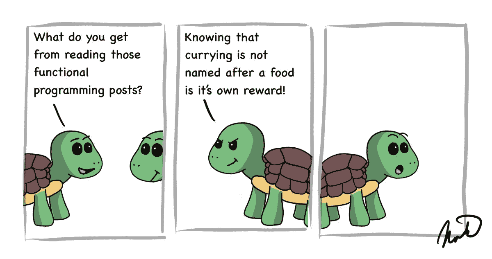

# 掌握 JavaScript 中 Currying 和高阶函数的 5 个简单步骤

> 原文：<https://betterprogramming.pub/5-easy-steps-to-master-currying-and-higher-order-functions-in-javascript-85e2a7e2c268>

## 通过函数式编程提高 JavaScript 的可重用性和性能



图片由作者提供。

Currying 和高阶函数代表了函数式编程的基础。因为 JavaScript 直接支持他们，他们可以把你的代码变成纯粹的魔术。

通过函数式编程，它们可以对代码的可重用性和性能产生显著的积极影响。

# 一流的功能

JavaScript 的函数式编程特性之一是基于函数是一等公民这一事实。这意味着函数可以像字符串或任何其他类型的值一样被传递或返回。

以下是一些非常基本的例子，说明函数在 JavaScript 中是一等公民:

`firstClassType`函数就是我们在函数式编程中所说的*恒等式*。它只是将其输入作为输出返回，没有任何改变。

`myFunctionAsOutput`不接受任何输入，只是返回包含函数的`firstClassType`变量。因此，当我们调用`myFunctionAsOutput()`时，它返回一个函数，我们可以使用其他括号再次调用该函数:

```
myFunctionAsOutput()('value');
```

当你看着`myFunctionAsInputAndOutput`时，你可能会注意到它只是另一个*身份*的例子，因为它只是返回它得到的值。

所以调用`myFunctionAsInputAndOutput(firstClassType)(‘value’);`和调用`firstClassType(firstClassType)(‘value’);`是一样的。唯一的区别是一个是用经典函数定义的，另一个是用箭头函数定义的。这两个函数是同一个函数。

# 高阶函数

在函数式编程中，高阶函数就是任何将函数作为输入或返回函数作为输出的函数。因此，上例中的所有函数都是高阶函数。

嵌套的返回函数始终可以访问其父函数的作用域，您也可以使用它来编写函数，如下例所示:

这是来自 [@7urtle/lambda](https://www.7urtle.com/) 的 memoization 函数的一个简化(并且更详细)的实现。记忆化是一种函数式编程优化技术，它通过直接在键值映射中查找结果来使用内存跳过计算。

当我们定义我们的`upperCase`函数时，我们通过把我们的`a => a.toUpperCase()`作为`memo`的第一个参数来调用`memo`。`memo`将这个函数包装在 memoization 中返回。

这将允许我们简单地调用`upperCase('7urtle');`，当重复调用时，它将使用内存直接查找结果。

`upperCase`的定义也是*无点*无参数定义的一个例子，我们可以用一个参数来定义它，如`upperCase2`所示。

# JavaScript 中的函数 Currying

你可能会认为 currying 这个名字来源于你最喜欢的咖喱菜肴。然而，你就大错特错了。柯里是以数学家哈斯克尔·库里的名字命名的。他的组合逻辑研究，连同阿隆佐·邱奇的λ演算，为函数式编程奠定了基础。函数式编程语言[哈斯克尔](https://www.haskell.org/)也是以库里的名字命名的。

在前面的例子中，您可能已经注意到，我们通过连续使用多个带参数的括号来使用多个函数调用。这也是你调用 curried 函数的方式。

在这段代码中，你可以看到两个相等的函数:`curry1`和`curry2`。利用 JavaScript 中的箭头函数编写的`curry2`，当然更短更简单。

箭头函数中的每个箭头都返回在它之后定义的所有内容，您可以使用任意多个箭头函数。因此，当我们调用`curry1(5);`时，它将返回期望参数`b`的第二个函数。

curry 就是用一系列函数的多个参数替换一个 n 元函数的过程，如下例所示:

在函数式编程中，我们总是喜欢用 arity *1* (一元)来创建函数。他们只有一个论点。`curriedBinary`函数由两个一元函数组成。当我写我的代码时，我所有的函数总是被简化。

# 定制函数的可重用性

Curried 函数之所以伟大，是因为它们可以被重用或组合来创建其他函数。

在这个例子中，我们将`filter`、`lowerCaseOf`和`includes`函数设为一元函数。然后我们通过函数组合定义`isTortoise`函数。建造`filterTortoises`就像组装乐高积木一样简单。

这种风格的代码编写也遵循了*亲*、*干*的最佳实践，以及*单责*原则。这也使得测试你的代码更加容易，因为你只剩下小的原子片段，它们是完全可检查的，没有任何黑盒或者共享的副作用。

# 更好的功能组合

因为每次想要使用 JavaScript 函数时都使用它们很烦人，所以使用像 [@7urtle/lambda](https://www.7urtle.com/) 这样的库要好得多，它已经为我们做了一切，甚至为我们的合成提供了一个非常有用的`compose`函数。最终的代码看起来就像这样:

在这个例子中，你可以看到在一行中，我们可以将`isTortoise`定义为一个记忆化的组合无点函数。在下一行，我们简单地通过使用该函数定义了`filterTortoises`。

像这样写代码需要一点实践，但它是神奇的。除了使你的代码更加可重用和简短，它也将变得更容易理解和讨论。

为了在命令式过程代码中只使用原生 JavaScript 来做同样的事情，我可以用 17 行代码编写`imperativeFilterTortoises`。如果您想比较字符而不是行，函数式声明代码需要 115 个字符，而命令式函数需要 515 个字符。

# 额外收获:咖喱和普通功能

你可能希望能够使用一个函数，这个函数可以神奇地将你的 n 元函数转换成一个 curried 函数，或者允许你的函数以任何一种方式被调用。

为此，我将为您提供采用 n 个函数的`curry` 函数和采用 curried 函数的`nary` 函数。两者都允许你以任何方式调用你自己的函数。

注意，`curry` 和`nary` 函数本身是以函数式编程风格声明式编写的。考虑学习更多关于 JavaScript 中[命令式和声明式编程的知识。](https://medium.com/weekly-webtips/imperative-vs-declarative-programming-in-javascript-25511b90cdb7)

当然，这两个功能在 [@7urtle/lambda](https://www.7urtle.com/) 中也是可用的。事实上，@7urtle/lambda 在内部使用了`nary` 函数的魔力，允许库的消费者调用它的所有函数，作为 curried 或*n*ary 函数。

# 结论

在学习了 JavaScript 的函数式编程并使用了 [@7urtle/lambda](https://www.7urtle.com/) 之后，我就再也不想回去了。即使是现在，我有时仍然会停下来欣赏这样创建代码的简单和优雅。

我的希望是这篇文章能让你走上一条能让你获得同样醉人体验的道路。

请在评论中告诉我，你是否曾经自己编写过功能性代码，或者你是否有过将这些原则引入团队的经历。