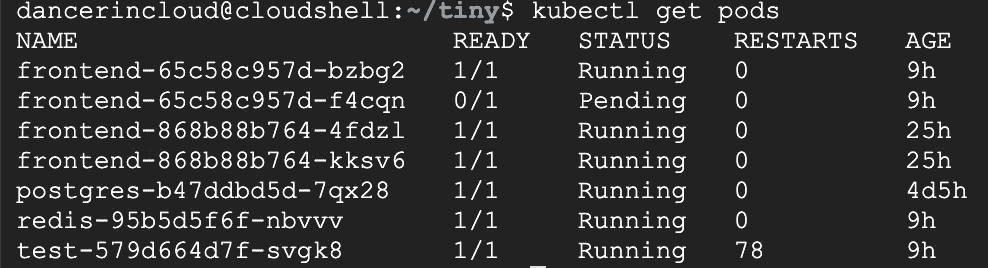
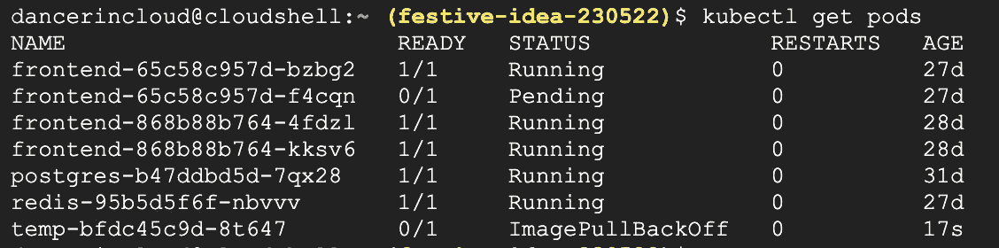
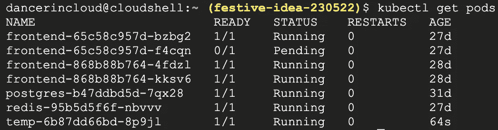
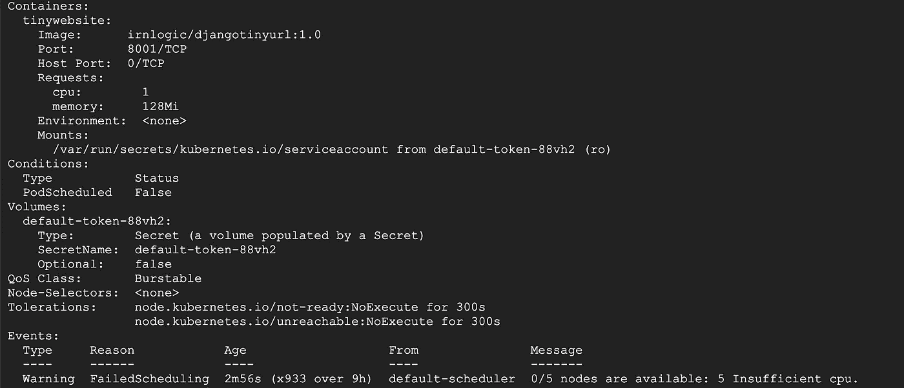
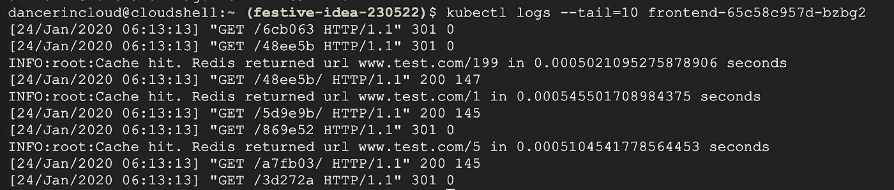
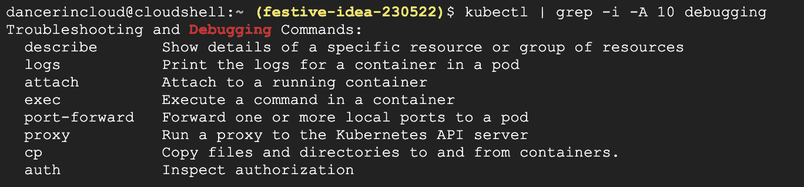
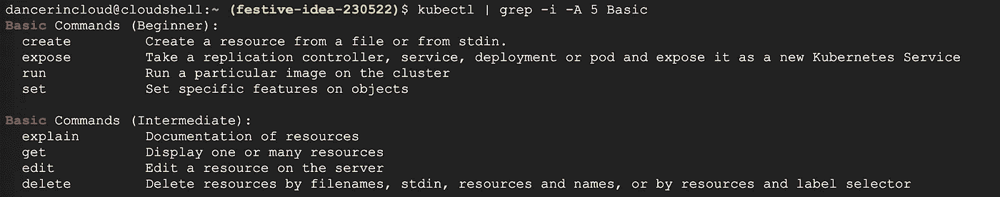
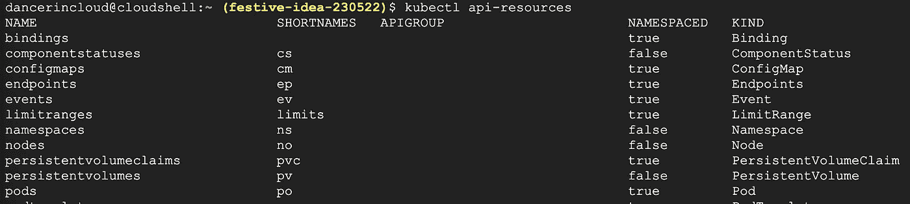
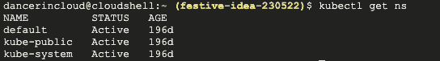
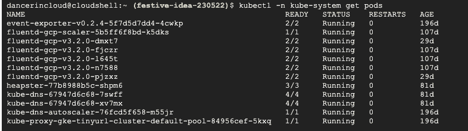

# 排除 Kubernetes 豆荚故障的 5 个简单技巧

> 原文：<https://betterprogramming.pub/5-easy-tips-for-troubleshooting-your-kubernetes-pods-34f594e03ba6>

## 轻松排除 Kubernetes 应用程序的故障并理解其机制


鸣谢:Unsplash 上的 Hush Naidoo

在许多情况下，您可能会发现 Kubernetes 中的应用程序没有正确部署，或者没有正常工作。这篇文章提供了快速解决这种情况的故障排除技巧。

读完这篇文章后，你也会对 Kubernetes 的内部有所了解，作为奖励，我会分享一些关于你自己导航 K8S 的有用技巧。

那么，让我们开始吧！。

首先，有两个原因会导致你的吊舱失效。

1.  Kubernetes 资源(如部署和服务)配置中的错误。
2.  代码中的问题。

在前一种情况下，容器不会启动。在后一种情况下，应用程序代码会在容器启动后失败。我们将系统地解决每一种情况。

在整个练习中，`kubectl`命令行实用程序将用于与 K8S 交互。

# **提示 1:观察吊舱**

验证 pod 处于*运行状态*或*就绪状态*。

```
kubectl get pods
```



一个 Pod 处于*待决状态*达九个小时，这可不好！容器没有启动，我们将用技巧二中的`describe`命令对此进行调查。

同时，当容器无法启动时，会出现其他错误代码。

*   `ImagePullBackoff` — Docker 映像注册表不可访问，部署中指定的映像名称/版本不正确。确保映像名称正确，并且注册表可以访问和验证(`docker login` …)。
*   `RunContainerError` —一个可能的原因:`ConfigMap` / `Secrets`缺失。
*   `ContainerCreating`*——*有些东西不是马上就有的，持久不变的量？

在我们调查其他错误之前，让我们尝试使用不正确的图像名称启动一个 Pod。

```
# start Pod from image "ngin". 
# 'web' can be any name, is the name of resulting K8S deployment
kubectl run temp --image=ngin --replicas=1
```



图像错误:最后一行

果然，使用不存在的图像“ngin”导致了`ImagePullBackoff`错误。让我们通过使用正确的图像名称“nginx”来解决这个问题。

```
kubectl run temp --image=nginx --replicas=1
kubectl get pods
```



分离舱打开了

现在都好了:见上！

接下来，这里有一些在容器启动后*可能发生的错误。*

*   `CrashLoopBackOff` — Pod 活性检查失败或 Docker 图像有故障。例如，对接器`CMD`立即退出。查看第三条提示来检查日志。注:截图中的*重启*栏显示重启次数。在这种情况下，您应该会看到一些重新启动，因为当错误发生时，K8S 会尝试重复启动 Pods。
*   如果 Pod 处于*运行*状态，而您的应用程序仍无法正常工作，请继续提示 3 和 4。

# **提示 2:检查与 pod 相关的事件**

如果你在 Pod 状态上看到一个错误代码，你可以通过`describe`命令获得更多信息。这在容器本身没有启动的情况下很有帮助。

```
kubectl describe frontend-65c58c957d-f4cqn
```



屏幕截图的最后一行表示由于 CPU 资源不足，Pod 尚未启动，请参见底部的消息。您可以增加 Pod 的 CPU 份额并重新部署应用程序。

# **提示 3:检查你的日志**

现在容器已经启动，通过检查日志来查看应用程序是否正常运行。例如，对于 Pod `frontend-65c58c957d-bzbg2`:

```
kubectl logs --tail=10 frontend-65c58c957d-bzbg2
```



正在运行的应用程序的流日志。

```
 kubectl logs -f frontend-65c58c957d-bzbg2
```

如果日志的命令没有产生输出，有可能`get pod`显示的是一个新重启的吊舱，所以检查之前的死吊舱。

```
kubectl logs frontend-65c58c957d-bzbg2 --previous
```

# 技巧 4:直接在 pod 中运行“sh”、“bash”或“ash”

您可以进入 pod 内部并运行命令来对您的应用程序进行故障排除(点击 exit 退出)。

```
kubectl exec -it frontend-65c58c957d-bzbg2 /bin/sh
```

# 技巧 5:显示集群级事件

每当 K8S 管理的资源的状态发生变化(正常、警告等)时，K8S 就会触发事件。它们帮助我们了解幕后发生了什么。`get events`命令提供了事件的综合视角。

```
# all events sorted by time. 
kubectl get events --sort-by=.metadata.creationTimestamp# warnings only
kubectl get events --field-selector type=Warning# events related to Nodes 
kubectl get events --field-selector involvedObject.kind=Node
```

# 额外的小费

这是我最喜欢的提示！熟悉命令让您有信心在 K8S 集群中导航。

首先，在命令列表中键入`kubectl`。

接下来，尝试这里显示的命令来`grep`调试命令。

```
kubectl | grep -i -A 10 debugging
```



列出了可以在 K8S 资源上运行的基本命令。

```
kubectl | grep -i -A 5 Basic
```



接下来，列出你可以操作的 Kubernetes 资源。

```
kubectl api-resources
```



现在你自己下命令吧！您可以选择一个命令(`get`、`describe`、`explain`)并在这些资源之一上运行它！如`get nodes`。试试别人！

虽然有些组合没有意义，但除此之外，指挥系统还是相当直观和一致的；您可以轻松地编写命令和探索。

只是注意不要删除或修改你不想接触的对象。

列出 K8S 命名空间:

```
kubectl get ns
```



您可以深入研究特定的命令，以了解您的选项和示例。

```
kubectl get --help# see K8S system pods in 'kube-system' namespace!
kubectl -n kube-system get pods
```



正如您所看到的，K8S 命令系统非常容易理解，您可以简单地通过试验这些命令学到很多东西。

# 结论

至此，我希望您会发现自己在 Kubernetes 集群中工作得很舒服，可以定位和修复 K8S 资源和代码中的错误。我希望接下来讨论 K8S 服务和网络的调试。

如果你已经走了这么远，我想感谢你对学习 Kubernetes 的坚持和奉献。请在下面留下评论，让我知道你是否想让我继续讨论任何特定的话题。

最后，如果您想在 K8S 中部署真实世界的应用程序，请阅读我的最后一篇文章。然后，您可以使用命令和故障排除工具来修补它。

# 进一步阅读

*   [Kubernetes 调试应用](https://kubernetes.io/docs/tasks/debug-application-cluster/debug-application/)
*   [了解 K8S —故障排除部署](https://learnk8s.io/troubleshooting-deployments)