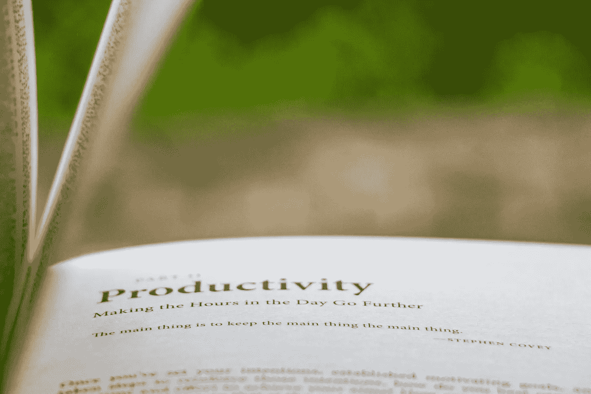

# 提高开发人员工作效率的 5 种有效方法

> 原文：<https://betterprogramming.pub/5-effective-ways-to-boost-your-productivity-as-a-developer-228078460841>

## 可行的建议帮助你把它们变成日常习惯

克里斯纳四世在 [Unsplash](https://unsplash.com/s/photos/productivity?utm_source=unsplash&utm_medium=referral&utm_content=creditCopyText) 拍摄的照片

虽然生产力在各行各业都很重要，但在软件工程领域，风险只会增加。

我们经常寻找使产品高效的标准，但是容易忘记最明显的一个:开发者。

精力充沛的开发人员不仅能在更短的时间内完成更多的工作，还能在工作场所传递积极的氛围——这也反映在团队的表现上。这是产品最终结果的一个很好的指标。

成为一名高效的开发人员有其额外的好处——在更短的时间内完成高质量的工作可以获得更高的报酬，更好的工作生活平衡，当然，还有一种内在的满足感。

长期保持高效需要你吸收一定的职业道德和习惯。一段时间后成为你日常生活的一部分。

让我们来看看一些有效的方法，让你作为一名开发人员的工作和生活更有效率。在这个过程中，我们会提供一些可行的技巧来帮助你轻松地接受这些原则。

# 适当的睡眠

软件开发人员经常和他们的睡眠讨价还价，付出额外的努力来达到他们的目标。听到很多软件工程师睡眠不足并不奇怪。

软件工程是一项要求很高的工作，大脑在一天中的很长一段时间内都在持续工作，睡眠不足只会让你感到昏昏欲睡，从而影响你的工作效率。

此外，睡个好觉有很多好处——更专注，更好的决策，提高记忆技能——所有这些都有助于开发人员高效工作。

虽然最后期限和小玩意会打扰睡眠，但这里有一些方法可以帮助你获得良好的睡眠:

*   **持续的睡眠规律**有助于我们的大脑和身体找出它们的生物钟，从而增加深度睡眠周期的机会。
*   如果你发现很难准时入睡，通常在睡前一小时进行数字排毒至关重要。把小玩意放在身边只会增加清醒度。
*   睡觉前计划第二天会让你领先一步，从而成倍地提高你的工作效率。此外，这是对睡眠时间的一个很好的提醒。

今天，所有的智能手机都支持夜班模式，以摆脱蓝屏——失眠的根本原因。

# 休息一下

开发人员经常发现自己被一大堆工作和截止日期包围，这导致工作时间更长，没有休息时间。

重要的是要意识到，为了保持注意力和集中程度，大脑需要不时地休息一下。此外，身体也需要伸展。

在工作时间小憩一下不仅能增强你的能量，还能防止过度分析手头的任务。作为开发人员，我们在工作时往往倾向于挖掘细节。

时不时的短暂休息可以让你以一种不偏不倚的视角看待更大的图景。

我在长途跋涉中解决的问题比在电脑前解决的还多。

有几种方法可以提醒自己是时候休息了:

*   番茄工作法:设置计时器有助于划分你的目标和时间管理。因此，你解决问题的能力会大大提高。还有一款 [iOS 应用](https://apps.apple.com/us/app/focus-keeper/id867374917)，你可以利用它来坚持这项技术。
*   **喝水:**在工作中保持水分有助于保持精神饱满，防止疲惫。此外，散步也是一个很好的激励。

# 尽量减少分心

环境在开发人员的生产力中起着关键的作用。虽然在工作场所避免干扰几乎是不可能的，但你可以采取一些策略来减少干扰:

*   **投资一副好耳机**。音乐影响我们的大脑不是神话。除了消除噪音和让开发人员进入他们的领域，它还能提升一个人的情绪。
*   **消除不必要的通知。电子邮件提醒和通知徽章是分散注意力的常见原因。因此，你需要坚持打盹，尤其是在深度工作的时候。**
*   **选择你的工作地点**。周围的环境对你的注意力有很大的影响。就我而言，我觉得静态背景比移动背景更好。
*   **利用流动状态。每个人在工作中都有一块紫色的区域:他们觉得最有效率的一个小时或一个领域。这被称为*峰值流量状态。这不会持续一整天；因此，重要的是利用它来完成重要的任务。利用这一点的一个方法是早点吃青蛙，这也有助于避免拖延。***

谷歌通过其数字福利实验，一直致力于利用技术来改善工作与生活的平衡，并尽量减少分心。[这里有几个最近发布的安卓应用。](https://medium.com/better-programming/3-new-google-apps-to-help-you-focus-71d6ded6fd01)

# 带来自动化并了解您的 IDE

软件开发对你的创造性思维要求很高，没有人喜欢单调地使用它。

做重复性的工作会让工作看起来很枯燥，对生产力有影响。实现自动化是一项一次性投资，从长远来看是有回报的。

*   如果你是一个应用程序开发人员，设置一个位桶管道或浪子将会节省你很多监控构建过程的时间
*   对于 macOS 用户来说，像 [Alfred](https://www.alfredapp.com/) 这样的工具是一个福音——因为它有助于为重复性任务定义许多自定义动作

此外，了解 IDE 的来龙去脉不仅可以大大加快工作流程，还可以借助键盘快捷键等使工作流程更加顺畅。由于开发人员大部分时间都在使用 IDE，所以掌握它可以极大地提高您的效率，使您更有效率。

# 读书

经常被工作缠住的开发人员发现很难将阅读纳入他们的时间表。

阅读在提高一个人的生产力方面起着巨大的作用。虽然阅读他人的代码给了开发人员一个新的视角，但书籍对于扩展视野和传授新思想是至关重要的。

它不仅能提高你的认知技能和批判性思维，还能让你以结构化的方式深入挖掘一个主题。

每天只阅读 30 分钟，无论是一些有趣的源代码还是一本书，都会挑战你的思维，增强你的推理能力，并帮助你保持积极的情绪。

除了是一个伟大的压力克星，阅读只会增强你的注意力和记忆力，从而使你在长期内成为一个高效的开发者。

# 结论

我希望上面的提示对提高开发人员的工作效率有所帮助。

这一篇就到此为止——感谢阅读。