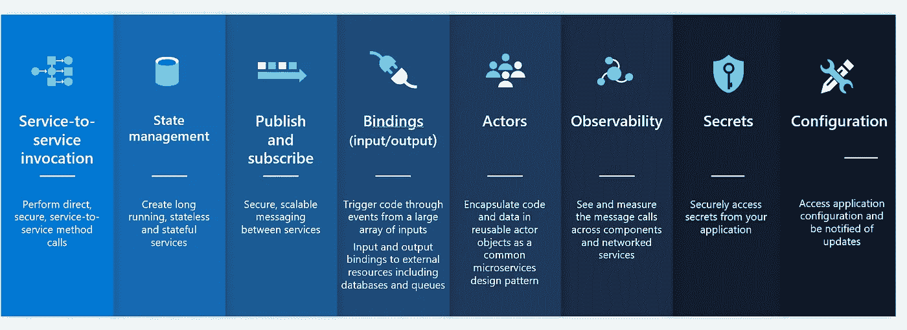
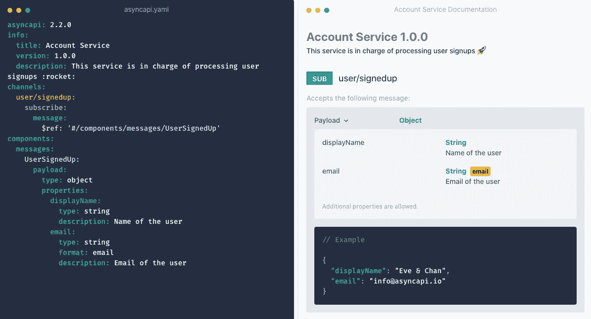
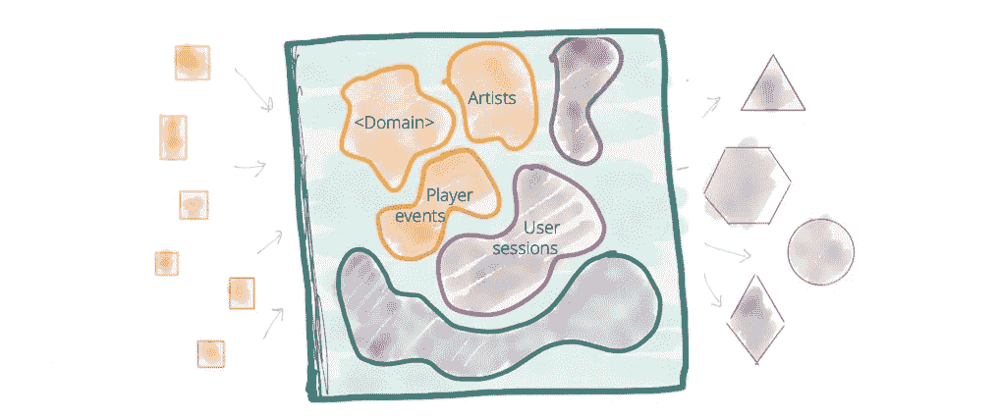
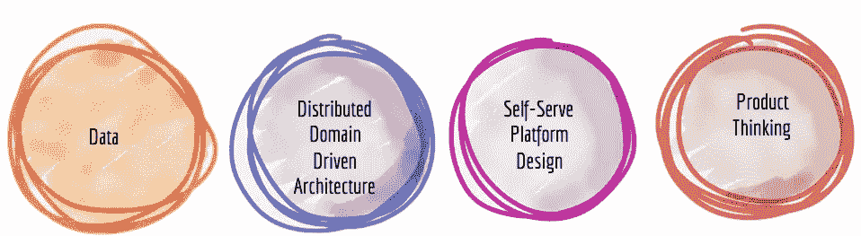
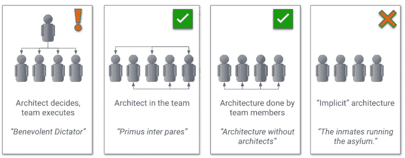

# 2022 年每个工程师都应该知道的 5 项新兴技术

> 原文：<https://betterprogramming.pub/5-emerging-technologies-for-every-engineer-to-know-in-2022-f019ce8eda5b>

## 你熟悉 Dapr 等技术吗？


亚历克斯·佩雷兹在 [Unsplash](https://unsplash.com?utm_source=medium&utm_medium=referral) 上的照片

随着技术的快速发展，很难知道哪些技术需要投入时间，哪些只是一时兴起。我每周花几个小时学习一些新兴技术，我认为这些技术具有广泛应用的真正潜力。

为了让你对今年可能学到的东西有所了解，我挑选了五件我认为会持续很久的事情，值得你花时间去做。

# Dapr 和用于简化应用开发的开放应用模型

您是否厌倦了每次构建新应用程序时都必须处理相同的基础架构问题？是的，我也是。

幸运的是， [Dapr](https://dapr.io/) 和[开放应用模型](https://oam.dev/)试图改进我们开发应用的方式，特别是在它们的基础设施依赖和部署方面。

首先，开放应用程序模型试图模拟我们如何部署应用程序。应用工程师不必担心在 CI/CD 工具中构建管道，他们利用构建模块。这些构建模块要么内置于框架本身(在幕后使用的是 [KubeVela](https://kubevela.io/) )，要么可以通过 Terraform 添加。

一旦这些模块存在，您就可以定义您的部署:

```
apiVersion: core.oam.dev/v1beta1
kind: Application
metadata:
  name: first-vela-app
spec:
  components:
    - name: express-server
      type: webservice
      properties:
        image: crccheck/hello-world
        port: 8000
      traits:
        - type: ingress-1-20
          properties:
            domain: testsvc.example.com
            http:
              "/": 8000
```

这个简单的例子只是部署了一个 web 服务，但是您可以在这里添加您的应用程序需要的所有东西，无论是负载平衡器、数据库还是云服务(例如 AWS S3 或 Azure Blob)。

其次，Dapr 是一个分布式应用程序运行时。简而言之，Dapr 与您的应用程序一起运行，为它们提供几乎每个应用程序都需要的关键东西。例如:



Dapr 的积木。图片来源:Dapr

为了解决其中一个问题，当调用另一个服务时，您可能需要自动重试。这是由 Dapr 为您处理的，因为呼叫将通过一个 [sidecar](https://docs.microsoft.com/en-us/azure/architecture/patterns/sidecar) 进行，如果需要的话，它将重试 HTTP 呼叫。

正如我上面提到的，这个想法是 Dapr 位于应用程序的旁边。您的实际应用程序不需要包含任何来自 Dapr 本身的代码，只需通过定义的端点与 sidecar 通信。

Dapr 和开放应用模型都是平台无关的，这意味着它们不与任何特定的实现或云提供商相耦合。

# web 程序集

你还记得 Java 小程序和 Flash 吗？WebAssembly 是为 web 开发一种格式的最新成果，这种格式可以充分利用用户硬件的全部功能。

虽然 WebAssembly 试图实现与 Java 小程序和 Flash 相似的目标，但这也是相似之处最多的地方。WebAssembly 由万维网联盟(W3C)开发，并得到了 Web 上一些主要参与者的支持:Mozilla、Apple、Google 和 Microsoft。

那么到底什么是 WebAssembly，又是什么让它有别于它的前辈呢？

首先，你可以用多种语言编写代码(理论上可以是任何语言，如果有支持的话)，然后编译成 WebAssembly。支持仍在增加，但你已经可以从 C/C++、Java、Rust、C#和 Swift 中编译 WebAssembly，这只是其中的几个例子。这里有一个语言及其支持状态的列表[在这里](https://github.com/appcypher/awesome-wasm-langs)。

其次，所有最新版本的主流浏览器(当然除了 ie 浏览器)[都已经支持 WebAssembly](https://caniuse.com/wasm) 。如果你还记得 Flash 时代，苹果从未真正登上 Flash 列车，当他们在 Safari 中移除对 Flash 的支持时，实际上扼杀了它。

最后，您的其余网站和应用程序可以通过 JavaScript 与 WebAssembly 通信。这在技术上是可能的，但在现实中从未发生过。

本质上，WebAssembly 感觉像是 web 的自然发展，首次使资源密集型应用程序能够在浏览器中本地运行。它绝不是完美的，但我预计它将在未来几年获得巨大的吸引力，尤其是在所有主要参与者的支持下。

# AsyncAPI

我知道，文档并不是一个特别令人兴奋的概念，不值得你投入宝贵的学习时间。然而，考虑一下 OpenAPI 对 API 世界的影响，以及它现在被广泛采用的程度。AsyncAPI 试图利用 OpenAPI 的成功，并将它们应用到事件驱动的架构中。

凭经验来说，很难一眼就理解一个特定的应用程序使用了什么样的事件驱动机制。即使对于经常开发应用程序的工程师来说，也很容易忘记诸如主题名或端点等细节。AsyncAPI 试图通过记录应用程序的所有事件驱动功能来解决这个问题。



AsyncAPI 规范的示例。图片来源:AsyncAPI

对于任何使用过 OpenAPI 的人来说，这种格式都非常熟悉。这是有意的，因为 AsyncAPI 小组希望尽可能多地利用 OpenAPI。以下是您可以记录的内容的快速概述:

*   **代理—** 允许您记录代理类型(如 Kafka)及其端点。
*   **发布者&订阅者—** 详细描述代理的发送者和来自代理的消息接收者
*   **消息—** 记录任何消息的格式，包括字段的名称及其各自的类型。
*   **通道** —用于代理，列出所有支持的通道。根据你使用的经纪人的不同，名字会有所不同，例如在 Kafka 中，主题就是通道。

正如您对新兴技术的预期，AsyncAPI 的工具并不像 OpenAPI 那样庞大——但是它正在成长！一个真正积极的迹象是，较大的公司开始利用 AsyncAPI，其中最值得注意的是 Slack，其 AsyncAPI 规格你可以在这里看到。

有兴趣了解更多信息吗？点击查看 AsyncAPI [。](https://www.asyncapi.com/)

# 数据网格

数据网格是一种架构，由 Zhamak Dehghani 发明，专门针对解决数据架构中的问题——无论是数据仓库、数据湖还是其他类型。

她认为，虽然公司把很多注意力放在他们的交易应用程序的架构上，但是处理数据(用于数据分析、管理 KPI 等)的应用程序。)正在被抛在后面。很多时候，数据被简单地“扔出围栏”给数据分析师，在那里他们必须与来自众多来源的数据争论，然后数据才可用。



大多数数据湖的问题演示。图片来源:马丁·福勒

扎马克认为这种方法存在几个问题:

*   中央集权，铁板一块。
*   丰富上下文的丢失，例如由领域驱动设计驱动的领域。
*   耦合管道架构(例如 ETL 作业)
*   孤立的领域知识，拥有高度专业化的团队(例如数据团队)，缺乏背景

幸运的是，有一个解决这个问题的建议。数据网格将这些分为四个原则:



数据网格原理。图片来源:马丁·福勒

Zhamak 在解释它们方面做得比我好得多，所以如果你有兴趣了解更多，我推荐你阅读[迁移到分布式数据网格](https://martinfowler.com/articles/data-monolith-to-mesh.html)和[深入研究数据网格的原理和架构](https://martinfowler.com/articles/data-mesh-principles.html)。

# 建筑师电梯

我要强调的最后一点不是技术本身，而是一种思考组织如何构建其应用程序的方式。从我记事起，就有关于架构师应该在组织中的什么位置以及如何坐的讨论。

你应该有一个监督整个技术团队的架构师团队吗？你应该没有建筑师吗？



建筑师的不同安排。图片来源:建筑师电梯

建筑师电梯，作者 Gregor Hohpe，是建筑师不能静态地坐在一个地方的想法。可以说，如果他们乘坐电梯，效率会高得多。在实践中，这意味着他们需要与业务利益相关者互动，了解业务现在和未来的需求。另一方面，他们需要工程团队的信任和支持。

电梯类比意味着架构师应该在两个领域都花时间。这个想法真的引起了我的共鸣，尤其是不幸的是，对于架构师来说，不真正理解工程团队所面临的真正问题是很常见的。在某些情况下，更有经验的团队甚至不需要架构师，并且可以自我管理，由工程师承担为该团队定义架构的角色。

你可以在这里了解更多[，或者在这里](https://architectelevator.com/)拿起 Gregor 关于这个话题的书[。](https://www.amazon.com/Software-Architect-Elevator-Redefining-Architects/dp/1492077542/)

# 摘要

这是我将在 2022 年努力学习的东西，希望它能给你一些可以学习的想法。如果你有其他的新兴技术或想法要学习，它们是什么？

```
**Want to Connect With the Author?**I run a free newsletter providing fortnightly technical book recommendations, including my key takeaways from the books. Interested? [Sign up here!](https://subscribe.technicalbookclub.com/?utm_source=medium&utm_medium=article&utm_campaign=learn2022)
```