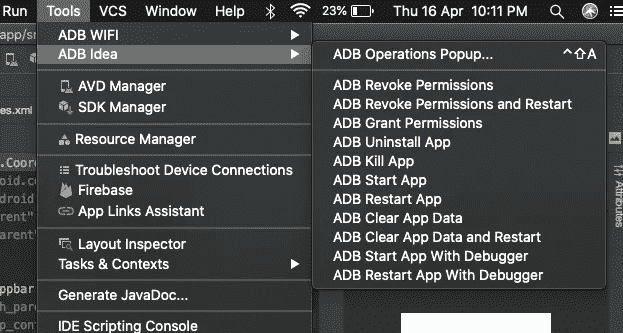
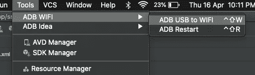
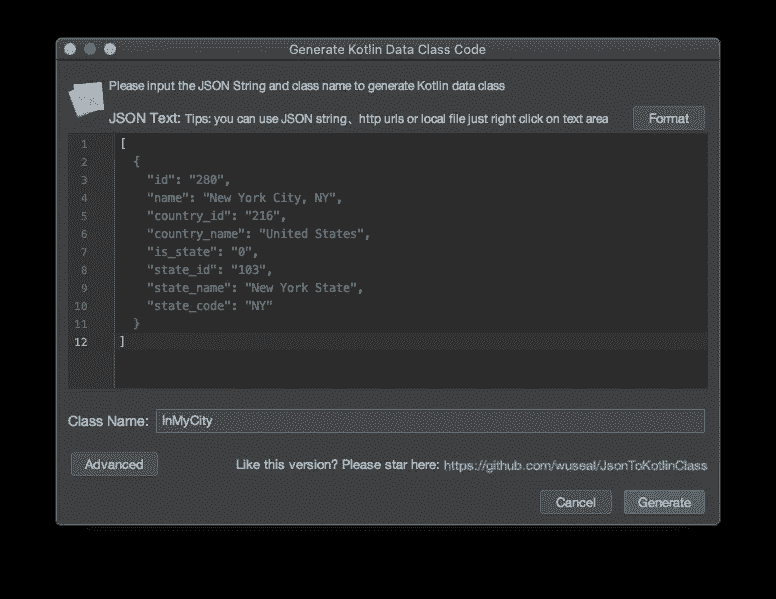
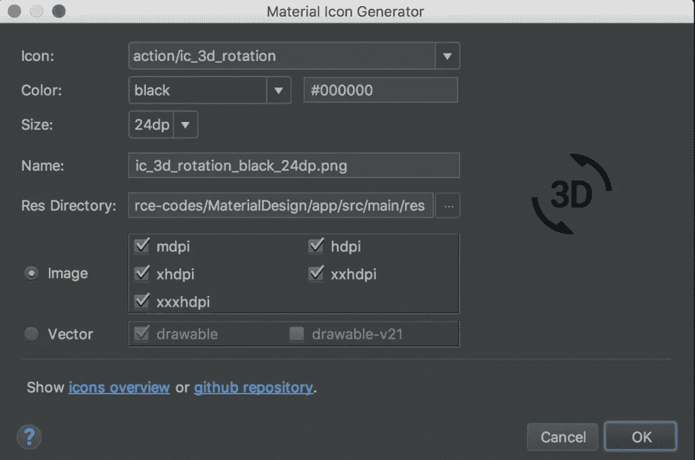

# 每个 Android 开发者必须拥有的 5 个基本 Android Studio 插件

> 原文：<https://betterprogramming.pub/5-essential-android-studio-plugins-every-android-developer-must-have-6669dd09f0a1>

## 亚行理念，。忽略，等等

照片由[奥斯丁·潘](https://unsplash.com/@austinpoon?utm_source=medium&utm_medium=referral)在 [Unsplash](https://unsplash.com?utm_source=medium&utm_medium=referral) 上拍摄

如果你在家工作，我希望你尽最大努力提高工作效率。高效不仅仅是编码，还有*智能*编码。

Android Studio 是基于 IntelliJ IDEA 的强大的官方 Android IDE，它有一个无尽的插件列表，如果使用得当，可以让你的工作更高效、更快速。

这里列出了一些 Android Studio 插件，据我所知，它们是每个开发人员必须拥有的基本插件，以提高他们的工作效率并节省数百个小时。

# 1.亚行理念

作为一个 Android 开发者，你一定遇到过这样的情况，你必须频繁地删除应用程序数据，撤销所有权限，或者杀死一个应用程序，以测试你的应用程序是否能够处理进程死亡。

完成这些任务需要一些步骤；你必须找到你的应用程序>进入应用程序设置>存储>清除数据。

这一切都被 [ADB Idea 插件](https://plugins.jetbrains.com/plugin/7380-adb-idea)简化了。

它提供了所有这些操作的单击快捷命令(杀死一个应用程序，卸载，清除数据，撤销权限)。亚行的理念让生活变得非常简单，这是一个必须具备的。

# 2.亚行 WiFi

我们都在转向无线替代品，不是吗？这些天，我们有无线扬声器，无线耳机，甚至无线充电。那么，为什么您仍然使用连线来调试您的应用程序呢？

[亚行 WiFi](https://android.jlelse.eu/wireless-debugging-through-adb-in-android-using-wifi-965f7edd163a) 插件来了。你所需要做的就是确保你的主机和你的手机连接到同一个网络。

很多次，我都遇到过手边没有电缆，急需调试的情况，多亏了 ADB WiFi。

# 3.。忽视

大多数新手开发人员在开发他们的第一个应用程序时，在集成了版本控制系统(VCS)Git 之后，会将所有文件推送到存储库。(事实上，一些中间用户可能仍然在这样做……)

这些项目文件还包括一些编辑器配置文件，如果您推送这些文件，将会导致每次尝试合并代码时出现合并冲突。如`vcs.xml`、`workspace.xml`。

这是因为这些设置在不同的 ide 上是不同的，并且取决于开发人员的偏好。因此，必须忽略这些文件。

[。ignore](https://plugins.jetbrains.com/plugin/7495--ignore) 是一个帮助你轻松管理忽略文件的插件。比如[。gitignore](https://www.atlassian.com/git/tutorials/saving-changes/gitignore) (Git)，[。npmignore](http://npm.github.io/publishing-pkgs-docs/publishing/the-npmignore-file.html) (npm)，[。dockerrignore](https://docs.docker.com/engine/reference/builder/)(Docker)等。

它可以让您创建一个忽略文件，并根据各自的模板生成忽略规则，因此，可以减少您的所有开销。它还有助于突出显示 IDE 中被忽略的文件，并使您可以轻松地添加新文件或编辑现有规则。

# 4.JSON 到 Kotlin 类生成器

曾经不得不处理来自 API 的长 JSON 响应，并且很难手动为它们创建数据模型？

嗯，[JSON to Kotlin Class generator](https://plugins.jetbrains.com/plugin/9960-json-to-kotlin-class-jsontokotlinclass-)是一个简单的插件，它从任何合法的 JSON string/JSONSchema 或任何返回 JSON string/JSONSchema 作为响应的 URL 生成 kot Lin 类。

它非常有用，因为它节省了处理大型复杂 JSON 的时间。

也有很多网站做同样的事情，但是手边有一个插件是很棒的。

# **5。共瞥**

如果你来自 web 或 iOS 背景，或者你使用过 [Sublime 编辑器](https://www.sublimetext.com/)，你一定对这个插件很熟悉。

[CodeGlance](https://plugins.jetbrains.com/plugin/7275-codeglance) 预览文件的代码，就像一个鹰视图，并让您快速导航到所需的部分。这非常酷，并且经常省去查找/导航代码的麻烦。

# 奖金

好吧！所以，这是一个惊喜，我为你们所有人准备了一个额外的插件。

我没有把它包括在上面的要点中，因为你可以选择使用 Android Studio 的资产生成器，但是我发现这个工具非常有用，并且总是发现自己用它欺骗 Android Studio 的资产生成器。因此，我认为值得一提。

## **6。材料图标生成器**

设计部分，制作漂亮的用户界面，很有趣。这是 Android 应用程序非常重要的一个方面，因为这是用户首先注意到的。而且，好的用户界面和 UX 会带来愉快的用户体验，会给应用留下好印象。

在使用 UI 时，您可能经常会发现需要使用一些图标。对于[谷歌的材料图标](https://google.github.io/material-design-icons/)，你可以访问谷歌的材料网站或者使用 Android Studio 默认的资产生成器。

但是，您仍然会面临挫折，因为在材料网站上，您无法选择自定义您的资产。这就是[材质图标生成器](https://plugins.jetbrains.com/plugin/7647-android-material-design-icon-generator)发挥作用的地方。

只需选择你的图标，选择矢量或 PNG，选择一个大小或使用默认，选择一种颜色或使用默认。你已经准备好了。

回到过去，这个插件是最有用的，因为 Android Studio 的资产生成器并不酷。

# 结束语

我没有提到定制主题的插件；去过那里，做过那个，回到最初的“Darcula”主题。

无论如何，我希望你喜欢它，并尝试将这些插件融入到你的日常工作中。看看哪些最适合你，然后做出相应的决定。

只是不要用大量的插件淹没你的 Android 工作室，因为这可能会对性能产生负面影响。

那么，当你在家里使用这些插件来节省时间的时候，你会做什么呢？

我现在要去看《金钱大劫案》第四季。

干杯！