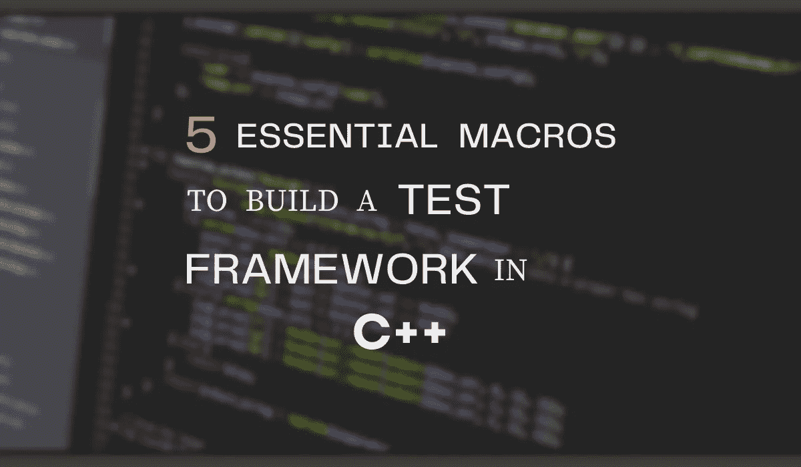

# 用 C++构建测试框架的 5 个基本宏

> 原文：<https://betterprogramming.pub/5-essential-macros-to-build-a-test-framework-in-c-a85ee80042f>

## 用 C++编写一个最小单元测试框架



作者图片

作为一名软件开发人员，编写测试来检查您的代码是否完全符合预期是非常重要的。您不希望将有问题的代码推向生产，尤其是在您没有考虑边界条件的情况下，对吗？

在测试 c++项目的过程中，您可能会遇到流行的框架，如 *GTest* 、 *Catch* 或 *BoostTest* 。它们复杂而健壮，允许你以任何你想要的方式测试代码。

不管这些框架有多复杂，为测试而实现的核心原则是非常相似的。在这篇文章中，我们将通过自己编写一个简单的框架来学习基础知识。

测试框架使用*宏*来避免源文件与大量样板代码混淆。对于我们的框架，我们将只使用其中的五个。一个用于声明、定义、注册和运行测试用例的宏，当然，还有一个用于将结果与期望值进行比较的宏。

# 编写测试用例

宏是创建对每个测试用例都是唯一的测试类的聪明方法。这项工作我们需要两个宏指令。一个`DeclareTest`，和`DefineTest`。而且，由于我们正在进行面向对象编程，我们也将利用一些*继承*和*设计模式*。

用于声明和定义测试用例的宏

在上面的代码片段中有三点需要指出:

1.  令牌粘贴操作符`##`为每个唯一的`Module`或`TestName`创建一个唯一的测试类。
2.  *Singleton* 模式确保每个案例只有一个实例。
3.  并且，为了定义测试，我们覆盖了从其父方法`UnitTest`继承的`runFunc()`方法(接下来讨论)。

以下示例显示了这些宏的测试声明和定义。

测试用例声明

测试用例定义

# 测试引擎

类`UnitTest`是这个框架的核心。它管理所有实例化的测试类。为了避免创建多个管理器，我们将它设为单例。它还提供了一个虚拟的`runFunc()`方法，继承类可以覆盖它来定义测试用例。

看看下面的片段:

**单元测试**类声明

1.  `getInstance()`方法返回一个 singleton。
2.  变量`isTrue`存储测试结果。或真或假。
3.  `testList`存储指向该类注册的所有案例的指针。
4.  `expectEQ()`方法评估期望值是否与被测单元的返回值相同。因为它是一个模板方法，所以已经为您完成了类型检查。你不会拿苹果和橘子做比较。
5.  最后，`runTests()`方法执行存储在`testList`中的所有测试。

**runTests()** 定义

静态变量`passed`和`failed`跟踪每个测试用例执行的结果。有了指向测试用例的指针的`testList`，我们可以直接从`UnitTest`类中访问并执行`runFunc`方法。

# 注册、运行和评估测试用例

现在，一旦我们定义并实例化了测试，我们需要将它们添加到`testList`中。我们用`RegisterTest`宏来做这件事。

最后，为了方便起见，我们将定义宏来运行和比较测试结果。

用于注册、运行和比较测试的宏

# 在单独的进程中运行测试

在单独的进程中运行测试用例允许你的程序运行到最后。即使其中一个抛出异常并中止。隔离的测试用例包含了损害并防止你的程序崩溃。

Windows 和 Linux 系统都允许创建单独的进程。Windows 称之为`CreateProcess`，而在 Linux 世界中，我们称之为`fork`。

下面是在 Linux/Unix 系统上派生出`runTests`方法的代码片段。

`testList`中的每个案例都在一个由`vfork()`系统调用创建的新进程中运行。它返回一个正数作为分叉进程的 ID，并将 ID `0`分配给子进程。然后我们的`runFunc`方法在分叉的进程中被调用，将它与程序的其余部分隔离开来。

现在，你可以争论是否用`fork()`代替`vfork()`。但是，我更喜欢后者，因为它可以处理静态变量，并以正确的顺序打印控制台日志。

# 把它放在一起

我们已经创建了一个简单易用的测试框架。只需五个宏，您就可以编写测试，而无需涉及框架的细节。不能再简单了！

样本测试程序

我希望这是有用的，对你有帮助。在我的 [GitLab](https://gitlab.com/AvinashRavishankar/unittest) 账户上查看完整的源代码。

```
**Want to Connect?**Connect with me on [Twitter](https://twitter.com/TheBarbellCoder) for all the latest updates!
```