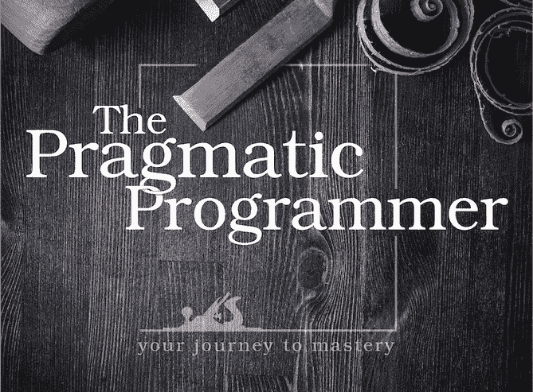
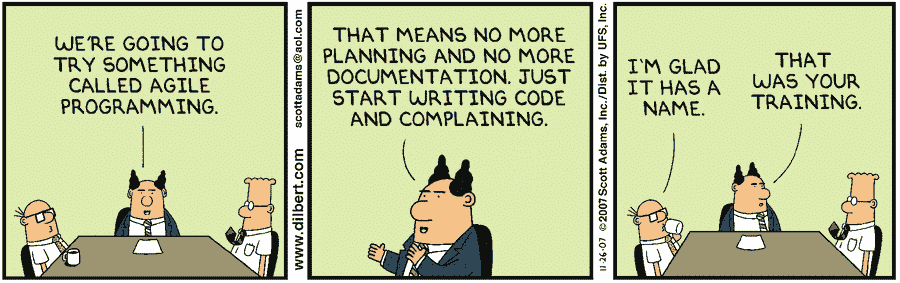

# “务实的程序员”的 5 个要点

> 原文：<https://betterprogramming.pub/5-essential-takeaways-from-the-pragmatic-programmer-6bb3db986294>

## 有史以来最畅销的编码书的要点

图片来自[实用主义书架](https://pragprog.com/titles/tpp20/the-pragmatic-programmer-20th-anniversary-edition/)。

*实用程序员*于 1999 年首次出版，此后被评为[有史以来最好的编程书籍](https://www.best-books.dev/list/best-programming-books)。

作者安迪·亨特和戴维·托马斯是敏捷宣言的最初作者之一，他们有一些严肃的资历。这本书在 Goodreads 上的平均评分为 4.3 分，超过了 16000 分。可以说这是每个程序员都应该读的书之一。

在这篇评论中，我将把这本书浓缩成五个要点。

# 1.不要重复你自己

托马斯创造了术语“干”(或[不要重复自己](https://en.wikipedia.org/wiki/Don%27t_repeat_yourself))，这是有史以来实现高质量代码的最有用的规则之一。作者将干燥原理定义如下:

> "每一项知识都必须在系统中有一个单一的、明确的、权威的表示."

在书中，他们举了以下例子作为非干代码:

然后将其重构为以下干版本:

在第二个片段中，删除了重复的常量。等效的行被封装到单独的函数中，用于打印、格式化和报告。

有趣的是，这实际上会导致更多的代码。然而，结果更具可读性、可维护性、可测试性和可伸缩性。干旱原则可以被视为实现这些其他结果的一种手段。

作者强调，DRY 不仅仅是为了避免字面上的代码重复。这只是画面的一小部分。他们写道:

> “干是知识和意图的复制。而是在两个不同的地方，可能以两种完全不同的方式表达同样的事情。”

重复可能出现在表示、数据结构、API 设计中，甚至可能是指团队成员之间的重复工作。后者是本书后面讨论的管理问题。

# 2.心态和知识一样重要

与典型的编程书籍不同，实用程序员的大部分内容与代码本身无关，而是程序员的思维方式和哲学。

讨论的很多内容都归结为将软件开发更普遍地视为一个端到端的过程，而不是简单地放大代码。这是有道理的。毕竟程序员不是拿工资写代码而是生产工作软件！

这种心态的一些重要方面包括:

*   当事情出错时，不要找借口或推卸责任，要对自己的工作负责。
*   编写“足够好”的软件这意味着不要浪费时间在比产品成功所需更好的东西上。
*   不忽略技术债。作者用破窗的比喻来说明这一点:

> “不要让‘破窗’(糟糕的设计、错误的决策或糟糕的代码)得不到修复。发现一个就解决一个。如果没有足够的时间来修复它，那就用木板把它封起来。也许您可以注释掉有问题的代码，或者显示一条“未实现”的消息，或者替换虚拟数据。"

我觉得这最后一点很有趣。作者并不是说代码需要是*完美的*，而是说它需要保存在不会变质的条件下。用木板封住的窗户可能看起来不太好，但它可以防止一大堆其他问题随着时间的推移而累积。

# 3.好的代码容易修改

对我来说，可能从*这位务实的程序员身上学到的最重要的东西*就是容易改变(ETC)原则。

作为程序员，我们从设计者那里得到 UI 更改或者从客户那里得到意味着重新实现现有功能的新需求的频率有多高？基本上一直都是。是的，在一个理想的世界里，我们会预先得到一个经过充分考虑的设计，我们可以把它变成完美的代码，但是现实世界并不是这样的。

易变原理解决了这个问题。它指出:

> "好的设计比坏的设计更容易改变."

作者将此作为一个指导值，许多其他软件工程原则都是从这个指导值中派生出来的。具体来说，大部分的[固体](https://en.wikipedia.org/wiki/SOLID)可以被认为是 ETC 的一个特例。

> “为什么脱钩是好的？因为通过隔离关注点，我们使每个人更容易改变。
> 
> 为什么单一责任原则有用？因为需求的变化仅仅反映在一个模块的变化上。
> 
> 为什么命名很重要？因为好的名字让代码更容易阅读，而且你必须阅读它来改变它。"

如果你在编写代码时考虑到了*可变性*，那么下次设计师修改布局时，生活将会容易得多！

# 4.选择优秀的工具，并熟练使用它们

乔尔·斯波尔斯基[写了一句著名的话](https://www.joelonsoftware.com/2000/08/09/the-joel-test-12-steps-to-better-code/)程序员应该拥有“金钱所能买到的最好的工具”才能充分发挥生产力。*务实的程序员*认同这一理念，并有整整一章致力于工具。

> “工具放大你的天赋。”

我必须承认，我已经变得如此痴迷于寻找绝对最好的工具，以至于这一章的一些内容对我来说有点显而易见，但让我的假设得到重申是令人放心的。关键要点是:

1.  用明文保存知识。根据作者的说法，这意味着文本“人类可以理解”这包括 HTML、JSON 等。理由是它比二进制格式更可持续，并且更容易用脚本和其他软件操作。
2.  始终使用版本控制。作者认为，版本控制应该用于任何项目，即使只在您的本地计算机上工作。
3.  熟练使用你的工具。作为一名开发人员，不断评估新工具并在它们之间切换很有诱惑力。虽然这可能有一些价值，但更好的做法通常是高度熟练地使用您已经拥有的工具

# 5.敏捷可能不是你想象的那样

资料来源:迪尔伯特·斯科特·亚当斯。经 ANDREWS MCMEEL SYNDICATION 许可使用。保留所有权利。

《务实的程序员》的两位作者都参与了最初的敏捷宣言的撰写。因此，我期待有一章是关于一种受欢迎的敏捷方法——SCRUM 或者可能是看板。但是没有这回事。事实上，他们积极批评僵化的方法及其相关认证:

> “许多认证项目实际上甚至更糟[…]:它们基于学生能够记住并遵守规则。但这不是你想要的。你需要有能力超越现有的规则，并利用优势的可能性。这与‘但是 Scrum/Lean/Kanban/XP/agile 是这样做的……’等等是非常不同的思维模式。”

相反，他们建议开发人员从一系列方法中挑选出最好的部分，并加以应用，倡导他们所谓的*敏捷的本质*。

这在实践中意味着永远不会有“敏捷过程”，因为根据定义，敏捷就是“响应变化”根据作者的观点，项目管理决策应该总是与环境相关，取决于你的公司、团队的性质和许多其他因素。没有一个预定义的流程能够考虑到所有这些。

那么这在实践中意味着什么呢？如何管理项目？*务实的程序员*提供了三个卓越且通用的步骤:

1.  找出你在哪里。
2.  朝着你想去的地方迈出最小的有意义的一步。
3.  评估你结束的地方，修复你弄坏的任何东西。

他们建议重复这些步骤，直到你完成为止，并在你做的每一件事的每一个层面上递归地使用它们。

# 结论

从这篇评论中你会发现，*实用程序员*并不是一本真正关于编程的书。这是一本关于构建工作软件的书。这除了写代码，还需要很多其他技能。

详细讨论每个细节超出了本文的范围，但是也有一些很好的建议:

*   估计
*   需求分析
*   重构
*   测试
*   原型和编码的许多方面

如果我有一个小小的批评，那就是这本书没有一个关于“务实”意味着什么的中心主题。感觉更像是一长串格言和支持性解释交织在一起。不过，这是一些世界级的格言，总的来说，这本书是任何开发人员的必读之作。