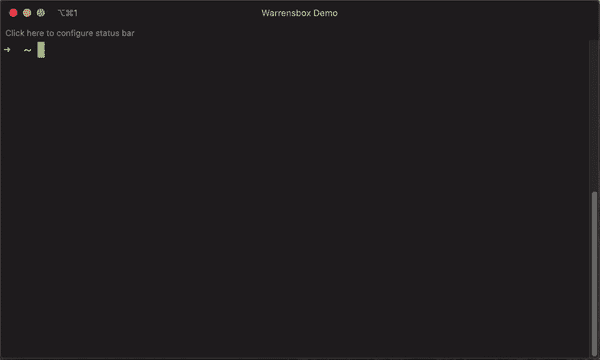
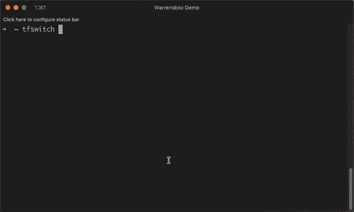
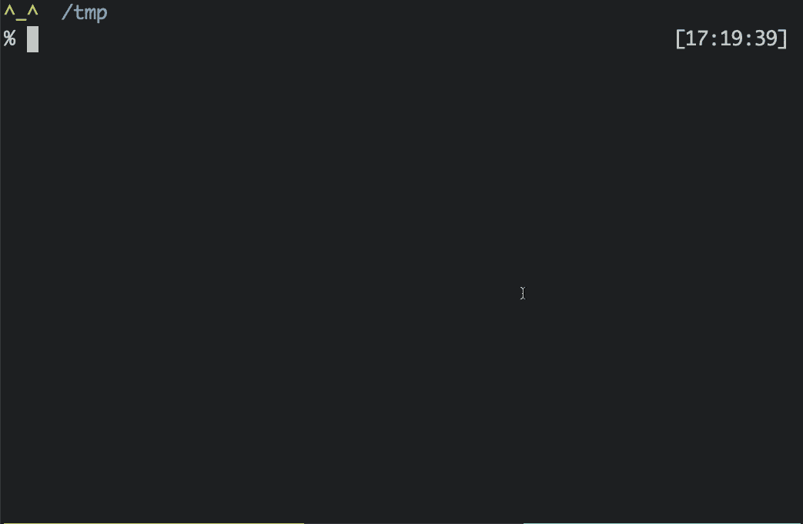
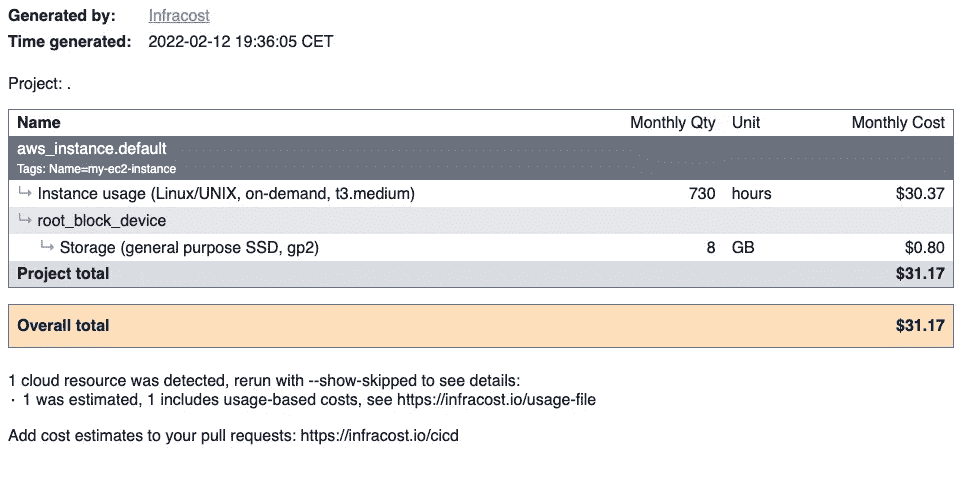

# 日常使用的 5 种基本地形工具

> 原文：<https://betterprogramming.pub/5-essential-terraform-tools-to-use-everyday-e910a96e70d9>

## 通过 Terraform 提高效率并利用您的代码


照片由[克里斯多佛·伯恩斯](https://unsplash.com/@christopher__burns?utm_source=unsplash&utm_medium=referral&utm_content=creditCopyText)在 [Unsplash](https://unsplash.com/?utm_source=unsplash&utm_medium=referral&utm_content=creditCopyText) 拍摄

Terraform 现在是一个基本的基础设施即代码(IaC)工具，作为一名 DevOps 从业者，它将成为你工具箱中的必备工具。如许多开源项目，社区创建并共享许多工具，使其更加强大。

有时候一个项目周围有太多的工具和插件，你可能会感到失落。这就是为什么在这里，我将向你展示我日常使用的 5 种地形工具。

它们让您获得速度，并在使用 Terraform 时获得更多乐趣:

*   在项目中不同的 Terraform 版本之间切换。
*   检测错误并改进代码。
*   自动生成您的代码文档。
*   检测代码中的潜在安全问题。
*   评估变更的云成本。

# 1.TFSwitch

Terraform 是一个进化相当快的工具，会换版本。您需要从 [HashiCorp 网站](https://www.terraform.io/downloads)下载并安装正确的版本。对于每个不同的版本，您需要相关的二进制文件。当您有几个不同版本的 Terraform 项目时，管理起来会很快变得非常困难。

TFSwitch 是一个命令行工具，解决了这个问题。它允许您选择想要使用的 Terraform 版本并自动安装。

## 在 Mac 上安装

```
$ brew install warrensbox/tap/tfswitch
```

## 在 Linux 上安装

```
$ curl -L [https://raw.githubusercontent.com/warrensbox/terraform-switcher/release/install.sh](https://raw.githubusercontent.com/warrensbox/terraform-switcher/release/install.sh) | bash
```

## 快速入门



从[https://tfswitch.warrensbox.com/](https://tfswitch.warrensbox.com/)的“下拉菜单中选择要使用的地形版本”

**【1】**:键入`tfswitch`，在终端上按“Enter”

**[2]:** 使用上下箭头选择您想要使用的 Terraform 版本。

**[3]:** 按回车键选择地形版本。

您也可以在命令行上提供 Terraform 版本:



来自 https://tfswitch.warrensbox.com/[的“在命令行上提供平台”](https://tfswitch.warrensbox.com/)

[](https://tfswitch.warrensbox.com/) [## TFSwitch

### tfswitch 命令行工具允许您在不同版本的 terraform 之间切换。如果你没有特别的…

tfswitch.warrensbox.com](https://tfswitch.warrensbox.com/) 

# 2.TFLint

运行代码时，语法错误有时不容易理解。Linters 提供了加速调试和节省开发时间的重要信息。您还可以将它们集成到您的 CI/CD 管道中，以实现持续改进。

Terraform 基于 HCL (HashiCorp 语言)，这是一种描述基础设施状态的语言。TFLint 是一个支持 Terraform 及其语言的可插拔 linter。除了林挺之外，它也是一个通过插件具有可扩展特性的框架。

下面是使用 TFLint 可以为您的 IaC 项目做些什么:

*   找出主要云提供商可能的错误:AWS/Azure/GCP。
*   警告不恰当的语法和未使用的声明。
*   实施最佳实践和命名约定。

[](https://github.com/terraform-linters/tflint) [## GitHub-terra form-linters/TF lint:一个可插拔的 Terraform Linter

### 一个可插入的 Terraform Linter TFLint 是一个框架，每个特性都由插件提供，主要特性如下…

github.com](https://github.com/terraform-linters/tflint) 

## 在 Mac 上安装

```
$ brew install tflint
```

## 在 Linux 上安装

```
$ curl -s https://raw.githubusercontent.com/terraform-linters/tflint/master/install_linux.sh | bash
```

## 在 Windows 上安装

```
$ choco install tflint
```

## 快速入门

默认情况下，TFLint 检查当前目录下的文件。您可以使用以下参数来更改行为:

```
$ tflint --help
Usage:
  tflint [OPTIONS] [FILE or DIR...]Application Options:
  -v, --version                                           Print TFLint version
      --init                                              Install plugins
      --langserver                                        Start language server
  -f, --format=[default|json|checkstyle|junit|compact]    Output format
                                                          (default: default)
  -c, --config=FILE                                       Config file name
                                                          (default: .tflint.hcl)
      --ignore-module=SOURCE                              Ignore module sources
      --enable-rule=RULE_NAME                             Enable rules from the
                                                          command line
      --disable-rule=RULE_NAME                            Disable rules from
                                                          the command line
      --only=RULE_NAME                                    Enable only this
                                                          rule, disabling all
                                                          other defaults. Can
                                                          be specified multiple
                                                          times
      --enable-plugin=PLUGIN_NAME                         Enable plugins from
                                                          the command line
      --var-file=FILE                                     Terraform variable
                                                          file name
      --var='foo=bar'                                     Set a Terraform
                                                          variable
      --module                                            Inspect modules
      --force                                             Return zero exit
                                                          status even if issues
                                                          found
      --no-color                                          Disable colorized
                                                          output
      --loglevel=[trace|debug|info|warn|error]            Change the loglevelHelp Options:
  -h, --help                                              Show this help message
```

您还可以根据以下优先级将配置文件传递给 TFLint:

*   当前目录(`./.tflint.hcl`)
*   主目录(`~/.tflint.hcl`)

在`.tflint.hcl`中，您可以进行以下操作:

*   定义 TFLint 配置
*   声明要使用的插件
*   启用/禁用特定的 TFLint 规则

下面是一个 TFLint 配置文件的示例:

```
config {
  plugin_dir = "~/.tflint.d/plugins"

  module = true
  force = false
  disabled_by_default = false

  ignore_module = {
    "terraform-aws-modules/vpc/aws"            = true
    "terraform-aws-modules/security-group/aws" = true
  }

  varfile = ["example1.tfvars", "example2.tfvars"]
  variables = ["foo=bar", "bar=[\"baz\"]"]
}plugin "aws" {
  enabled = true
  version = "0.12.0"
  source  = "github.com/terraform-linters/tflint-ruleset-aws"
}rule "aws_instance_invalid_type" {
  enabled = false
}
```

运行 TFLint 很简单:

```
$ tflint
```

如果您没有得到预期的行为，您可以在调试模式下查看详细的日志:

```
$ TFLINT_LOG=debug tflint
```

## **为云提供商使用插件**

当您使用 AWS、Azure 或 GCP 提供商时，您可以使用相应的插件:

*   [亚马逊网络服务](https://github.com/terraform-linters/tflint-ruleset-aws)
*   [微软 Azure](https://github.com/terraform-linters/tflint-ruleset-azurerm)
*   [谷歌云平台](https://github.com/terraform-linters/tflint-ruleset-google)

下面的代码块表示使用 AWS 插件:

```
plugin "aws" {
  enabled = true
  version = "0.12.0"
  source  = "github.com/terraform-linters/tflint-ruleset-aws"
}
```

以下命令安装插件:

```
$ tflint --init
```

Terraform 不验证特定于提供商的问题。下面是一个包含以下配置文件的示例:

```
resource "aws_instance" "foo" {
  ami           = "ami-0ff8a91507f77f867"
  instance_type = "t1.2xlarge" # invalid type!
}
```

`t1.2xlarge`是无效的实例类型。运行`terraform apply`时会出现错误。但是`terraform validate`和`terraform plan`命令没有显示任何错误。这是来自 AWS 提供者的特定问题，而不是来自 Terraform 语法。TFLint 插件有助于在应用代码之前检测到此错误:



# 3.地形文档

记录你的代码对于团队合作和可重用性是很重要的。 [Terraform-docs](https://github.com/terraform-docs/terraform-docs) 是一个从 Terraform 模块以各种输出格式生成文档的快速工具。

[](https://github.com/terraform-docs/terraform-docs) [## GitHub-terra form-docs/terra form-docs:从各种…

### 由 Scalr-Terraform Automation & Collaboration Software 赞助，这是一个从 Terraform 生成文档的工具…

github.com](https://github.com/terraform-docs/terraform-docs) 

## 在 Mac 上安装

```
$ brew install terraform-docs 
```

## 在 Windows 上安装

```
$ choco install terraform-docs
```

## 在 Linux 上安装

```
$ curl -Lo ./terraform-docs.tar.gz https://github.com/terraform-docs/terraform-docs/releases/download/v0.16.0/terraform-docs-v0.16.0-$(uname)-amd64.tar.gz
$ tar -xzf terraform-docs.tar.gz
$ chmod +x terraform-docs
$ mv terraform-docs /usr/local/terraform-docs
```

## 快速入门

创建 Terraform 模块意味着使用输入、输出、资源以及最终的数据源。下面的 Terraform 片段从 AMI (Amazon 机器映像)创建了一个 AWS EC2 实例。尽管所有内容都在一个文件中，但它可以被视为一个模块:

```
terraform {
  required_version = ">= 1.0.0"
  required_providers {
    aws = {
      source = "hashicorp/aws"
    }
  }
}variable "aws_region" {
  description = "The AWS region where to deploy the EC2 instance."
  type        = string
  default     = "us-east-1"
}variable "tags" {
  description = "The tags to associate to the EC2 instance."
  type        = map(string)
  default     = {}
}provider "aws" {
  region = var.aws_region
}data "aws_ami" "ubuntu" {
  most_recent = truefilter {
    name   = "name"
    values = ["ubuntu/images/hvm-ssd/ubuntu-focal-20.04-amd64-server-*"]
  }filter {
    name   = "virtualization-type"
    values = ["hvm"]
  }owners = ["099720109477"]
}resource "aws_instance" "default" {
  ami           = data.aws_ami.ubuntu.id
  instance_type = "t2.micro"tags   = merge({
    Name = "my-ec2-instance"
  }, var.tags)
}output "arn" {
  description = "EC2 instance ARN."
  value       = aws_instance.default.arn
}
```

下面的命令行将在 markdown 中生成 Terraform 文档，并将其存储在自述文件中:

```
$ terraform-docs markdown table --output-file README.md .
```

在自述文件中，我们可以找到模块使用的不同元素，并链接到每个元素的官方文档:

```
<!-- BEGIN_TF_DOCS -->
## Requirements| Name | Version |
|------|---------|
| <a name="requirement_terraform"></a> [terraform](#requirement\_terraform) | >= 1.0.0 |## Providers| Name | Version |
|------|---------|
| <a name="provider_aws"></a> [aws](#provider\_aws) | 3.74.0 |## ModulesNo modules.## Resources| Name | Type |
|------|------|
| [aws_instance.default]([https://registry.terraform.io/providers/hashicorp/aws/latest/docs/resources/instance](https://registry.terraform.io/providers/hashicorp/aws/latest/docs/resources/instance)) | resource |
| [aws_ami.ubuntu]([https://registry.terraform.io/providers/hashicorp/aws/latest/docs/data-sources/ami](https://registry.terraform.io/providers/hashicorp/aws/latest/docs/data-sources/ami)) | data source |## Inputs| Name | Description | Type | Default | Required |
|------|-------------|------|---------|:--------:|
| <a name="input_aws_region"></a> [aws\_region](#input\_aws\_region) | The AWS region where to deploy the EC2 instance. | `string` | `"us-east-1"` | no |
| <a name="input_tags"></a> [tags](#input\_tags) | The tags to associate to the EC2 instance. | `map(string)` | `{}` | no |## Outputs| Name | Description |
|------|-------------|
| <a name="output_arn"></a> [arn](#output\_arn) | EC2 instance ARN. |
<!-- END_TF_DOCS -->
```

# 4.切科夫

Checkov 是一个静态代码分析工具，用于将基础设施扫描为包括 Terraform 在内的代码文件。它会查找可能导致安全性或合规性问题的错误配置。它有 750 个预定义的策略来检查常见的错误配置问题。

[](https://www.checkov.io/) [## 切科夫

### Checkov 扫描云基础设施配置，以便在部署之前发现错误配置。Checkov 使用一个…

www.checkov.io](https://www.checkov.io/) 

## 装置

```
$ pip install checkov
```

## 快速入门

我们将采用 terraform-docs 上显示的零件代码。我们将生成地形图，并使用 Checkov 对其进行分析:

```
$ terraform init 
$ terraform plan -out tf.plan 
$ terraform show -json tf.plan  > tf.json  
$ checkov -f tf.json

       _               _
   ___| |__   ___  ___| | _______   __
  / __| '_ \ / _ \/ __| |/ / _ \ \ / /
 | (__| | | |  __/ (__|   < (_) \ V /
  \___|_| |_|\___|\___|_|\_\___/ \_/By bridgecrew.io | version: 2.0.528
Update available 2.0.528 -> 2.0.829
Run pip3 install -U checkov to updatecloudformation scan results:Passed checks: 0, Failed checks: 0, Skipped checks: 0, Parsing errors: 1Error parsing file tf.json
terraform_plan scan results:Passed checks: 2, Failed checks: 4, Skipped checks: 0Check: CKV_AWS_88: "EC2 instance should not have public IP."
 PASSED for resource: aws_instance.default
 File: /tf.json:0-0
 Guide: [https://docs.bridgecrew.io/docs/public_12](https://docs.bridgecrew.io/docs/public_12)Check: CKV_AWS_46: "Ensure no hard-coded secrets exist in EC2 user data"
 PASSED for resource: aws_instance.default
 File: /tf.json:0-0
 Guide: [https://docs.bridgecrew.io/docs/bc_aws_secrets_1](https://docs.bridgecrew.io/docs/bc_aws_secrets_1)Check: CKV_AWS_79: "Ensure Instance Metadata Service Version 1 is not enabled"
 FAILED for resource: aws_instance.default
 File: /tf.json:0-0
 Guide: [https://docs.bridgecrew.io/docs/bc_aws_general_31](https://docs.bridgecrew.io/docs/bc_aws_general_31)Check: CKV_AWS_126: "Ensure that detailed monitoring is enabled for EC2 instances"
 FAILED for resource: aws_instance.default
 File: /tf.json:0-0
 Guide: [https://docs.bridgecrew.io/docs/ensure-that-detailed-monitoring-is-enabled-for-ec2-instances](https://docs.bridgecrew.io/docs/ensure-that-detailed-monitoring-is-enabled-for-ec2-instances)Check: CKV_AWS_135: "Ensure that EC2 is EBS optimized"
 FAILED for resource: aws_instance.default
 File: /tf.json:0-0
 Guide: [https://docs.bridgecrew.io/docs/ensure-that-ec2-is-ebs-optimized](https://docs.bridgecrew.io/docs/ensure-that-ec2-is-ebs-optimized)Check: CKV_AWS_8: "Ensure all data stored in the Launch configuration EBS is securely encrypted"
 FAILED for resource: aws_instance.default
 File: /tf.json:0-0
 Guide: [https://docs.bridgecrew.io/docs/general_13](https://docs.bridgecrew.io/docs/general_13)
```

# 5.Infracost:从代码中估计云成本

Terraform 所做的更改可能会改变云提供商托管的资源的状态。根据这些情况，费用可能会有所不同。在编写 IaC 代码时，记住这一点很重要。

Infracost 显示了 Terraform 等基础设施即代码项目的云成本估算。它有助于快速查看成本明细，并提前比较不同的选项。

[](https://github.com/infracost/infracost) [## GitHub — infracost/infracost:拉式请求中 Terraform 的云成本估计💰📉爱你的…

### Infracost 显示 Terraform 的云成本估计。它使德沃普斯、SRE 和工程师们能够看到成本分解和…

github.com](https://github.com/infracost/infracost) 

## 在 Mac 上安装

```
$ brew install infracost
```

## 在 Linux 上安装

```
$ /usr/local/bin
curl -fsSL [https://raw.githubusercontent.com/infracost/infracost/master/scripts/install.sh](https://raw.githubusercontent.com/infracost/infracost/master/scripts/install.sh) | sh
```

## 快速入门

使用您的电子邮件地址注册 infracost 以接收 API 密钥:

```
$ infracost register
```

现在你的 API 密匙在`$HOME/.config/infracost/credentials.yml`中

您可以使用 infracost 获得完整的每月成本明细:

```
$ infracost breakdown --path .                                                                                                
Detected Terraform directory at .
  ✔ Checking for cached plan... not found
  ✔ Running terraform plan
  ✔ Running terraform show
  ✔ Extracting only cost-related params from terraform
  ✔ Retrieving cloud prices to calculate costsProject: .Name                                                 Monthly Qty  Unit   Monthly Costaws_instance.default
 ├─ Instance usage (Linux/UNIX, on-demand, t2.micro)          730  hours         $8.47
 └─ root_block_device
    └─ Storage (general purpose SSD, gp2)                       8  GB            $0.80OVERALL TOTAL                                                                   $9.27
──────────────────────────────────
1 cloud resource was detected, rerun with --show-skipped to see details:
∙ 1 was estimated, 1 includes usage-based costs, see [https://infracost.io/usage-file](https://infracost.io/usage-file)
```

您还可以发现由于代码更改而导致的每月费用的变化:

```
$ infracost diff --path .
Detected Terraform directory at .
  ✔ Checking for cached plan... change detected
  ✔ Running terraform plan
  ✔ Running terraform show
  ✔ Extracting only cost-related params from terraform
  ✔ Retrieving cloud prices to calculate costsProject: .~ aws_instance.default
  +$21.90 ($9.27 → $31.17)~ Instance usage (Linux/UNIX, on-demand, t2.micro → t3.medium)
      +$21.90 ($8.47 → $30.37)Monthly cost change for .
Amount:  +$21.90 ($9.27 → $31.17)
Percent: +236%──────────────────────────────────
Key: ~ changed, + added, - removed1 cloud resource was detected, rerun with --show-skipped to see details:
∙ 1 was estimated, 1 includes usage-based costs, see [https://infracost.io/usage-file](https://infracost.io/usage-file)Add cost estimates to your pull requests: [https://infracost.io/cicd](https://infracost.io/cicd)
```

您也可以生成 HTML 报告:

```
$ infracost breakdown --path . --format html > report.html                                                                  
Detected Terraform directory at .
  ✔ Checking for cached plan... found
  ✔ Extracting only cost-related params from terraform
  ✔ Retrieving cloud prices to calculate costs
```



Infracost HTML 报告

# 结论

我们在本文中一起看到的 5 种地形工具将在几个方面为您带来好处:

*   使用 TFLint 更快地调试代码并预测错误
*   限制重复性任务:使用 TFSwitch 进行版本管理，使用 Terraform-Docs 实现文档自动化。
*   使用 Checkov 识别开发过程中的安全问题
*   通过 Infracost 了解基础架构变更的成本影响

您还可以将所有这些工具集成到您的 CI/CD 管道中！

谢谢大家！🙏我希望这篇文章能帮助你找到下一个很棒的 Terraform 工具。想了解更多关于 DevOps 的知识？要查看更多像这样的文章，它在下面！⬇️

[](https://getbetterdevops.io/) [## Getbetterdevops

### Getbetterdevops 是一个 devops 博客，帮助学习现代基础设施和云技术，如 Kubernetes…

getbetterdevops.io](https://getbetterdevops.io/)