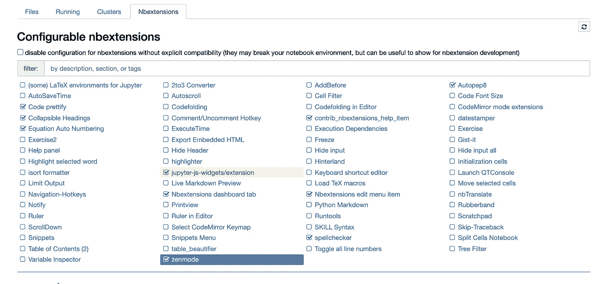
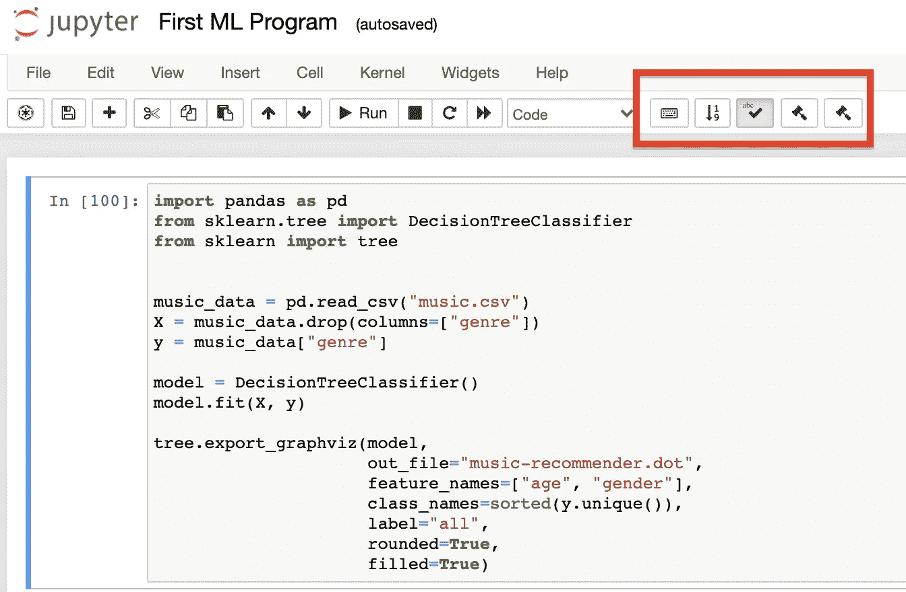
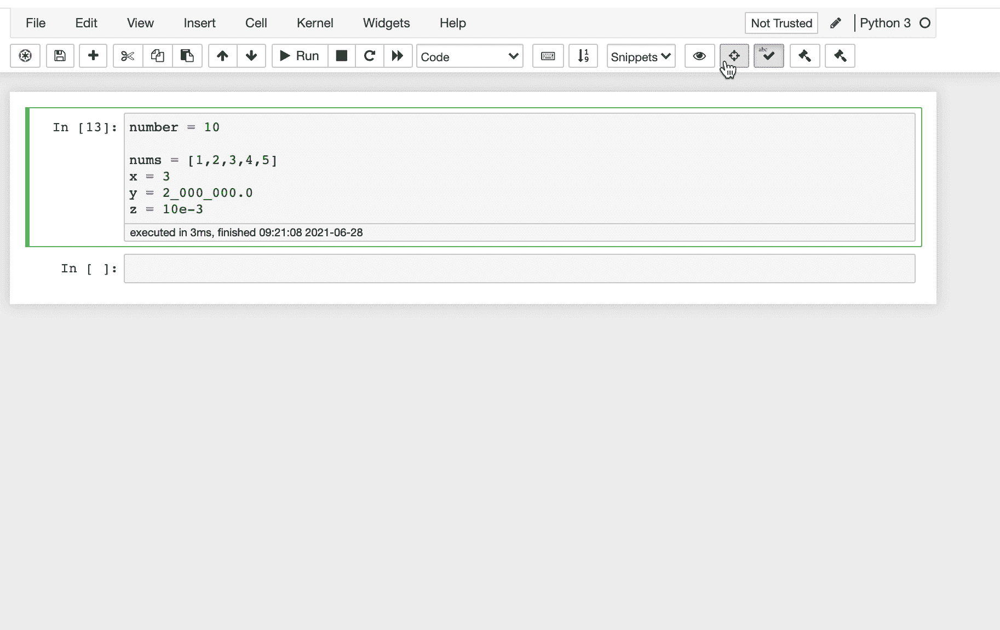
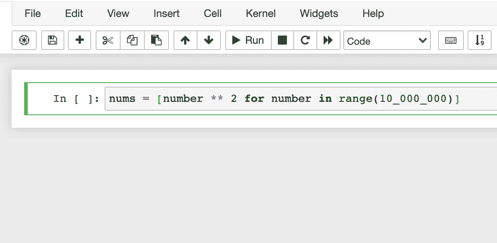
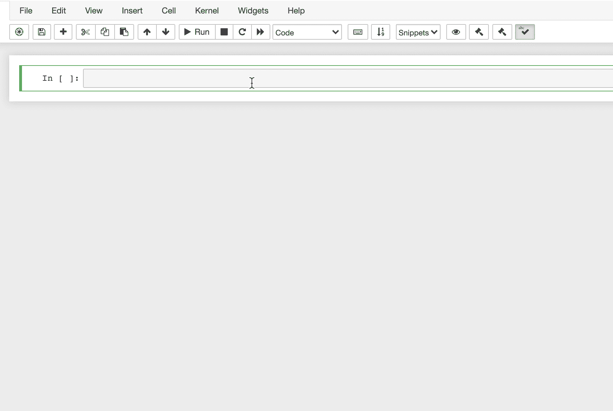

# 5 个扩展来增强您的 Jupyter 笔记本

> 原文：<https://betterprogramming.pub/5-extensions-to-enhance-your-jupyter-notebook-1b44c4ac88bb>

## 如何安装、激活和使用 Jupyter 笔记本扩展

[马丁·施瑞德](https://unsplash.com/@martinshreder?utm_source=medium&utm_medium=referral)在 [Unsplash](https://unsplash.com?utm_source=medium&utm_medium=referral) 上的照片。

Jupyter Notebook 是一个流行的 Python 编程环境。这是一个计算笔记本，允许你把代码、图形、方程和文本都放在一个地方。

然而，这个 web 应用程序有一个小问题:它缺乏有用的特性。幸运的是，您可以用扩展来改进和定制这个工具。

# 如何安装 Jupyter 笔记本扩展

1.  打开一个终端窗口，运行以下命令:

2.启动 Jupyter 笔记本并进入`Nbextensions`选项卡:

3.单击要启用的扩展。

4.激活的扩展出现在笔记本的工具栏中:

5.尽情享受吧！

这就是启动和运行扩展所需的全部内容。接下来，我将向您展示五个有用的扩展。

# 5 个有用的 Jupyter 笔记本扩展

一旦你安装了所有的扩展，让我们来看看你应该马上激活的一些有用的扩展。

## 1.Autopep8 —只需一次点击即可自动设置代码样式

Autopep8 只需一次点击即可自动格式化您的 Python 代码。符合人教版 8 风格指南。它能够为您修复大多数格式问题。

要激活`autopep8`:

1.  转到`Nbextensions`选项卡并选择`Autopep8`。
2.  前往您想要风格化的笔记本，点按工具栏中的锤子图标:

3.享受格式化的代码。

## 2.变量检查器—了解您的工作空间中有什么

变量检查器保存变量数量多的一天。它列出了笔记本中的所有变量。此外，它还显示了关于每个对象的有用数据，如类型、大小和形状。

启用`Variable inspector`:

1.  转到`Nbextensions`选项卡并选择`Variable inspector`。
2.  在你的笔记本上点击工具栏上的检查按钮。

## 3.腹地—启用自动完成

Jupyter 笔记本默认情况下不启用自动完成功能。

要启用`Hinterland`:

1.  转到`Nbextensions`选项卡并选择`Hinterland`。
2.  在笔记本中键入一些内容，以查看自动完成功能是否正常工作。

## 4.execute time—一个单元运行多长时间？

用`ExecuteTime`自动显示被执行单元的运行时间信息。

要启用`ExecuteTime`:

1.  转到`Nbextensions`选项卡并选择`ExecuteTime`。
2.  运行笔记本中的一个代码单元格，并看到运行时信息自动出现在单元格下方。

## 5.隐藏所有输入—隐藏代码，显示结果

如果你只想显示执行一个单元格的结果，可以启用一个名为`Hide input all`的插件。

要启用`Hide input all`:

1.  转到`Nbextensions`选项卡并选择`Hide input all`。
2.  转到您的笔记本，单击眼睛图标隐藏代码。

# 结论

Jupyter 笔记本是数据科学家中广泛使用的计算笔记本。你可以放置你的代码，图表，方程式，文档等。全都在一个笔记本里。

Jupyter 笔记本的开箱版本缺乏有用的功能。这就是扩展派上用场的地方。您可以通过以下方式安装所有扩展:

安装后，您可以在`Nbextension`标签中激活您想要的扩展。

感谢阅读。编码快乐！

我很想加入你的 LinkedIn 网络。请随意连接 [Artturi Jalli](https://www.linkedin.com/in/artturi-jalli-29619413a) 。

# 你可能会发现这很有见地

 [## 10 个必须知道的 Jupyter 笔记本技巧

### 节省时间，提高生产力

better 编程. pub](/10-must-know-jupyter-notebook-tricks-51baea31922) 

# 参考

 [## 非官方 Jupyter 笔记本扩展-Jupyter _ contrib _ nb Extensions 0 . 5 . 0 文档

### jupyter_contrib_nbextensions 包包含一组社区贡献的非官方扩展，这些扩展添加了…

jupyter-contrib-nb extensions . readthedocs . io](https://jupyter-contrib-nbextensions.readthedocs.io/en/latest/)