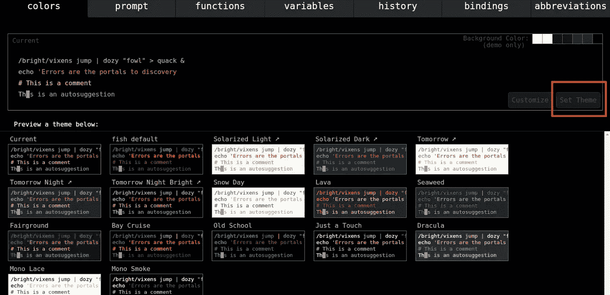
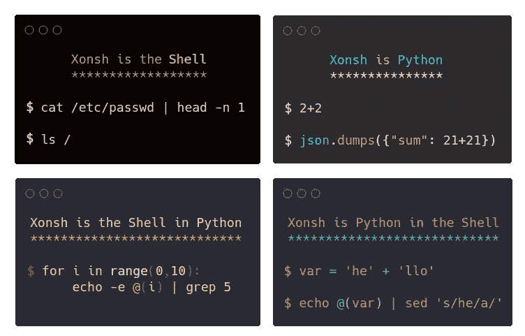
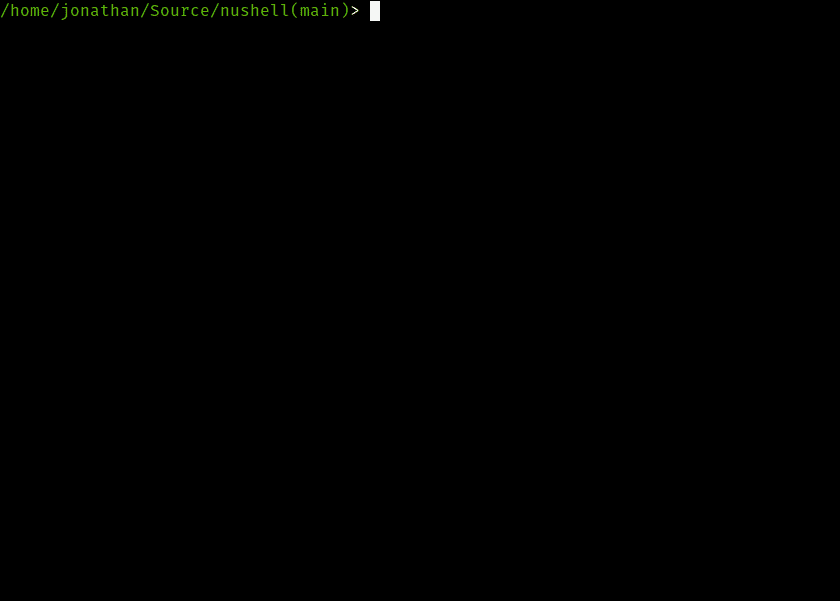
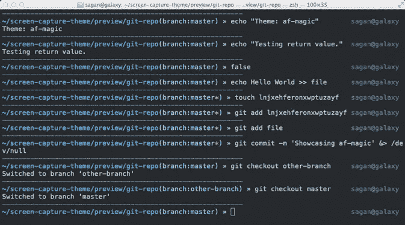

# 你应该试一试 5 种奇特的贝壳

> 原文：<https://betterprogramming.pub/5-fancy-shells-you-should-give-a-try-72e789294b9f>

## 鱼、油和其他有创意的贝壳

[@louishansel](https://unsplash.com/@louishansel) 在 [Unsplash](https://unsplash.com/) 上的照片。

我喜欢命令行，因为它让我更有效率。

大部分时间，为了日常工作，我活在壳里。它只是一个命令行界面(CLI ),允许用户与操作系统进行交互。

自从我使用命令行这么久以来，我已经尝试了各种 shells。我认为这五个尤其值得更多的承认。有的已经可以日常使用，有的还在快速开发中。也许你会找到你下一个选择的贝壳。

# 鱼壳

鱼代表“友好的交互式外壳”

它是一个智能且用户友好的命令行 shell，适用于 macOS 和 Linux 操作系统家族。默认情况下包含了许多有趣的功能，比如语法高亮显示、键入时自动提示以及令人惊叹的制表符补全。

配置文件位于`~/.config/fish/config.fish`。我们可以添加自定义功能。Fish 还提供了一个 web 界面来配置文件。运行`fish_config`时，浏览器会打开机器的 8000 端口，用户可以在网页上配置 fish。不错！

鱼是一种有十几年历史的贝壳。它很成熟，受到很多开发者的喜爱。我认为它最令人印象深刻的特点是自动完成。
如果你想在日常工作中使用，请不要忘记 [oh-my-fish](https://github.com/oh-my-fish/oh-my-fish) 。

# 油壳

[油壳](https://github.com/oilshell/oil)是一个新的 Unix 外壳。Shell 脚本是一种特定于领域的语言，用于处理并发进程、文本字符串和文件系统。它很难学，也是维护的噩梦。

Oil 还面向那些懂 Python 或 JavaScript，但有意避开 shells 的人。

既然我们有这么多现有的 shell 程序，您不能忽略它们。Oil 帮助您逐渐远离 shell 脚本:

*   `bin/osh`运行您现有的 shell 脚本。
*   `bin/oil`是一种全新的语言。

[石油语言](https://www.oilshell.org/blog/2020/01/simplest-explanation.html)是一种新的方言，像 Python 或 JavaScript 一样被解析和评估。它比 shell 脚本更具体。

有趣的是，这个项目是用 Python 实现的，然后用定制工具自动翻译成 C++。

# xonsh

xonsh 是另一个 Python 实现的 shell。

xonsh 的语法更像 Python。实际上，所有 Python 代码在 xonsh 中都是可运行的。xonsh 基于 Python，并添加了额外的语法，这使得调用子进程命令、操纵环境和处理文件系统变得容易。

与在 Oil 中不同，您不能在 xonsh 中重用现有的 bash 脚本。

# 努谢尔

[Nushell](https://github.com/nushell/nushell) 是用 Rust 编写的新 shell。灵感来源于 Windows 中的 PowerShell。Nushell 没有把文件和服务看作原始的文本流，而是把每个输入看作是有结构的东西(也有一些非结构化的部分)。这样，用户可以很容易地用管道制作过滤器。

此外，Nushell 从功能上查看数据。它的管道充当了一种在没有可变状态的情况下加载、更改和保存数据的手段。

Nushell 还没有到 1.0 版本，但是为了好玩还是值得一试的。

# Zsh

[Zsh](https://www.zsh.org/) 不是新壳。

Zsh 于 1990 年首次发布，包含在许多操作系统中。实际上，macOS 已经用 Zsh 代替 Bash 作为 Catalina 中的默认 shell。

它与 Bash 完全兼容，拥有极其丰富的插件。

如果你用 Zsh，就不能忘了 [oh-my-zsh](https://github.com/ohmyzsh/ohmyzsh) 。这是一个社区驱动的框架，用于管理您的 Zsh 配置。回购包含数百个强大的插件和美丽的主题。

# 结论

我希望你喜欢阅读这些贝壳。享受在命令行上的时光吧！

*最初发表于*[*https://coderscat.com*](https://coderscat.com/5-fancy-shells/)*。*