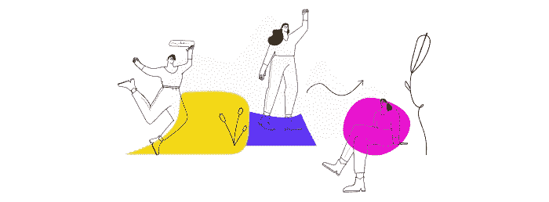
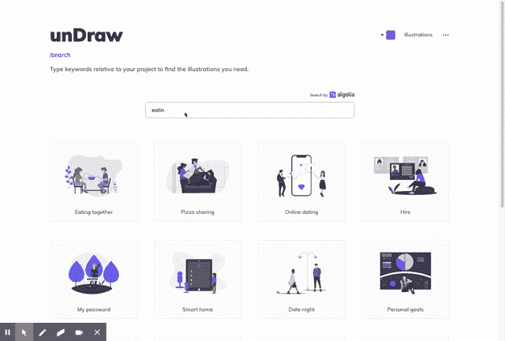
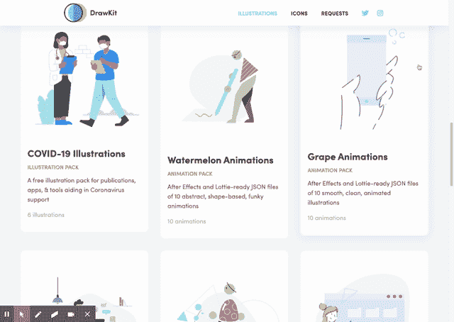
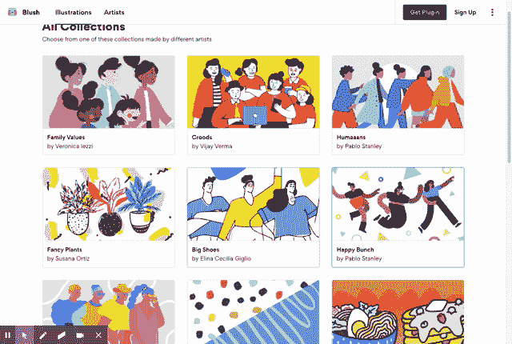
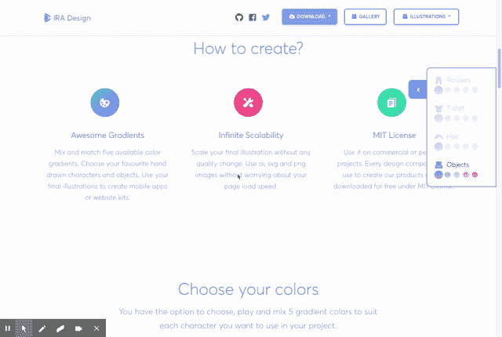
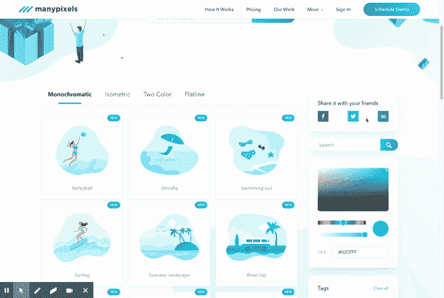

# 面向设计师和开发人员的 5 个免费插图资源

> 原文：<https://betterprogramming.pub/5-free-illustration-resources-for-designers-and-developers-8fd7116ca4dd>

## 让您的项目更有生命力

哦，嘿！

# 烧烤吧！👩‍🍳

插图是给你的网站一点“嗯”的好方法他们可以讲述一个关于你的品牌的故事，而不必阅读每一个。单身。你的网站的文本行来了解这个想法。它们应该直观、酷、直截了当、有趣、引人注目。

进入 BBQ™️… ( *这是我编的，但应该是个东西)。*

**为你的网站设计大而醒目的高质量图片**是吸引访问者注意力的基础，也是拥有一个干净、醒目的漂亮网站的基础。

下面的网站可以很好的找到适合你网站的图片。哦，它们是免费的！大多数都是免费的，你可以随心所欲地使用，而有些只有最低限度的条件。

# 1.拉开

*   允许您键入与项目相关的关键词
*   选择您选择的颜色，为所有选项着色—参见示例
*   【https://undraw.co 

吃着，好吃。

# 2.绘图工具包

*   **吨**不同风格的手绘矢量插图
*   [https://www.drawkit.io](https://www.drawkit.io)

圆形、正方形、三角形——天哪！

# 3.开放式窥视

*   从姿势到颜色，到表情，你真的可以按照你喜欢的任何插图风格来定制你的角色。—“Sul Sul”👋)
*   [https://blush.design/collections](https://blush.design/collections)

哦天啊。

# 4.IRA 设计

*   使用渐变的混合和匹配来构建您自己的插图集，以创建手绘字符和对象。
*   [https://iradesign.io](https://iradesign.io)

一些光斑的渐变！

# 5.许多像素

*   与 UnDraw 非常相似，在下载任何免费插图之前，您可以选择默认颜色。
*   [https://www.manypixels.co](https://www.manypixels.co)

太棒了。

如果你还有什么想和大家分享的，请在下面评论并告诉我！(嘿，押韵)