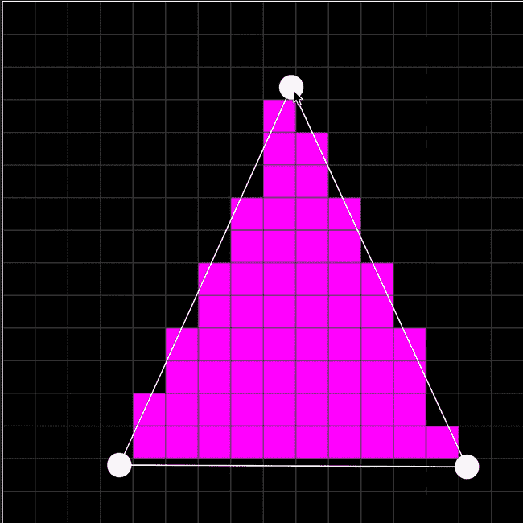
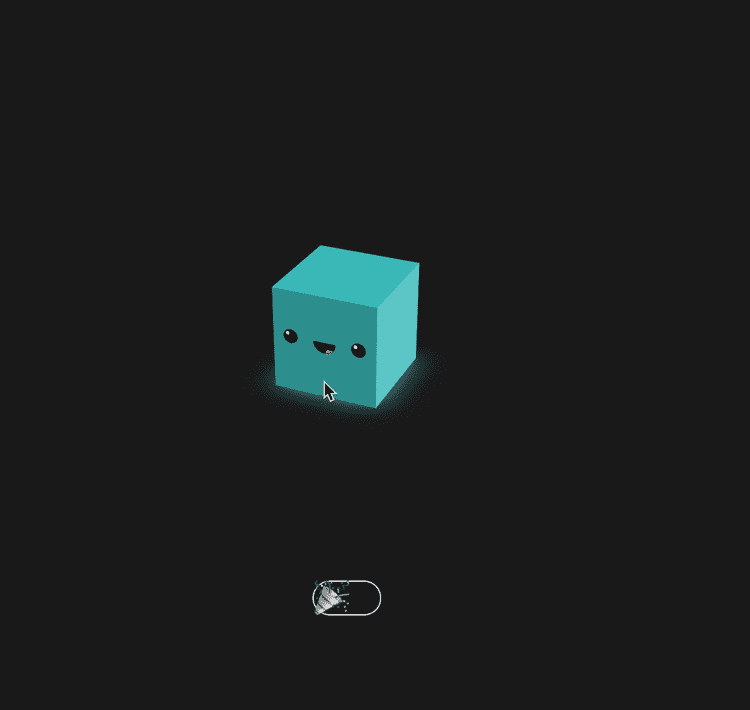
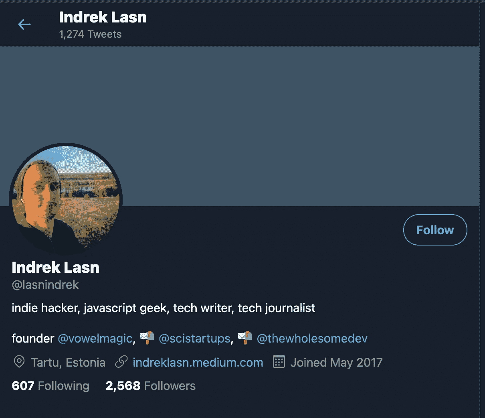
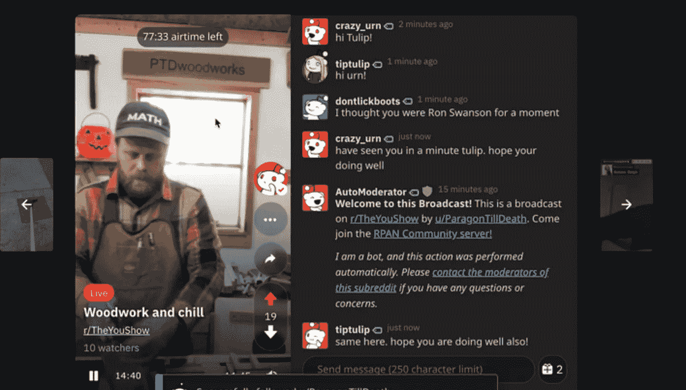

# 5 个前端挑战，让你全力以赴编写代码

> 原文：<https://betterprogramming.pub/5-front-end-challenges-that-will-get-you-pumped-up-to-code-cfaae64646c7>

## 通过构建这些项目来真正擅长编码

[姚](https://unsplash.com/@hojipago?utm_source=medium&utm_medium=referral)在 [Unsplash](https://unsplash.com?utm_source=medium&utm_medium=referral) 上拍照。

有些人特别擅长编码，你也可能属于那个群体。

没有一个人在一夜之间成为编程专家。掌握编程包括投入*吨*的工作。你必须尽可能经常地编码，才能真正精通它。

是的，有些人是天才——我不是其中之一——但即使是天才也需要投入工作。

获得好的开始于练习，练习，再练习。

事不宜迟，下面是我承诺的编码思路。将每个想法作为灵感的来源。选择一些让你对编码感兴趣的事情，然后继续做下去。

使用你喜欢的任何工具或编程语言。对于每一个想法，我会添加一个你可以通过构建它来学习的东西的列表。

# 1.交互式光栅化三角形

> 光栅化的任务是获取以矢量图形格式描述的图像，并将其转换为[光栅图像](https://en.wikipedia.org/wiki/Raster_image)(一系列像素、点或线，当它们一起显示时，创建通过形状表示的图像)— [维基百科](https://en.wikipedia.org/wiki/Rasterisation)

[栅格化三角形🔺📐](https://codepen.io/terabaud/pen/VwKLqdw) —由 [*丽娅·罗斯玛*](https://codepen.io/terabaud)

很酷吧。干得好，[丽娅·罗斯玛](https://codepen.io/terabaud)！

如果您不确定从哪里开始，请查看[源代码](https://codepen.io/terabaud/pen/VwKLqdw)。当你开始编码并解决问题时，事情会变得更容易。我保证。

## 通过建造这个你会学到什么

*   循环循环循环循环。—当用户拖动三角形角时，您需要重新计算大量图形。
*   HTML、CSS、JavaScript——注意三角形是如何由一个个小方块组成的。
*   工作事件监听器—每当用户拖动三角形时，它会改变宽度和高度。查看[源代码](https://codepen.io/terabaud/pen/VwKLqdw)中的例子。

# 2.光栅化鱼

如果上面的例子让你难以理解，我完全可以理解。我现在有点生疏了，不确定能否在一次工作会议中重现它。

来源:[维基百科](https://en.wikipedia.org/wiki/Rasterisation#/media/File:Raster_graphic_fish_20x23squares_sdtv-example.png)

创建一些没有交互的类似东西怎么样？一条光栅化的鱼。即使没有所有花哨的交互，它看起来仍然很棒。

## 通过建造这个你会学到什么

*   HTML、JavaScript——你需要以某种方式重新创建这条鱼。注意这条鱼是如何由正方形组成的。
*   CSS——你可以使用 CSS 来创建单个的方块并给它们上色。或者你也可以用 JavaScript 来实现。

# 3.CSS 胡迪尼党立方体

整洁！一个华丽跳跃的广场！

[CSS 胡迪尼党立方体🎉](https://codepen.io/jh3y/pen/rNLXrGo) — By [Jhey](https://codepen.io/jh3y)

如果您不确定如何开始使用这个工具，请查看 Mozilla " [使用 WebGL](https://developer.mozilla.org/en-US/docs/Web/API/WebGL_API/Tutorial/Creating_3D_objects_using_WebGL) " 创建 3D 对象文章以获取灵感和想法。

## 通过建造这个你会学到什么

*   CSS 动画的高级概念——你将如何让正方形高兴地跳来跳去？
*   JavaScript 事件监听器——例如，有一个“激活聚会模式”按钮，让用户开始或结束动画。

# 4.Twitter 个人资料卡克隆

Twitter 可能是开发人员之间最常见的交流方式。为什么不学习如何编写概要文件部分的代码呢？

[我的推特资料](https://twitter.com/lasnindrek)

上面的个人资料是我的，但是你可以使用任何你喜欢的个人资料。不用担心数据。您可以使用简单的虚拟数据，并对概要文件进行硬编码。

尽管如此，如果你有兴趣的话，Twitter 的确有一个 [API](https://developer.twitter.com/en/docs) 可以让事情变得更加动态。

## 通过建造这个你会学到什么

*   使用 HTML 和 CSS。
*   完成后，尝试使用 React、Vue、Angular 或 Svelte 等框架。看看你能否用前端 JavaScript 库也做到这一点。
*   注意:能够使用一个 JavaScript 库会让你更容易被雇佣，更能脱颖而出。
*   可选:如何使用 [Twitter API](https://developer.twitter.com/en/docs) 并从中获取数据。为此，您可以将 React 与 React 挂钩结合使用。
*   注意:我[写了一篇文章](https://medium.com/better-programming/how-to-fetch-data-from-an-api-with-react-hooks-9e7202b8afcd)关于使用 React 和钩子从 API 获取数据。看看这个。

# 5.Reddit 公共访问网络克隆

[Reddit 公共接入网](https://www.reddit.com/rpan/)，俗称 RPAN，是由 Reddit 运营的直播流媒体服务。2019 年 8 月 19 日上线。

来源: [Reddit 公众访问网](https://www.reddit.com/rpan/)

每当我有时间消磨时，我就看《RPAN 》,看看其他人在干什么。

这是一种很有趣的方式来进行一次简短的交谈，看看我们的生活到底有多大的不同。

从简单开始，只做 HTML 和 CSS 部分。稍后再回来，完成剩下的功能。

## 通过建造这个你会学到什么

*   HTML 和 CSS——只是最基本的布局。你可以硬编码这个。
*   可选:视频播放器—如果您愿意，可以实现视频播放器。
*   可选:基于 Websocket 的聊天室。

[**P.S:寻找更多的编码思路？永远不要耗尽编码的想法，永远不要。在这里访问我提出的一系列前端挑战。**](https://gumroad.com/l/IuqKc)

黑客快乐！感谢阅读。

本文原载于[*the hole some . dev*](https://thewholesome.dev/p/here-are-5-frontend-challenges-that)*快讯。*