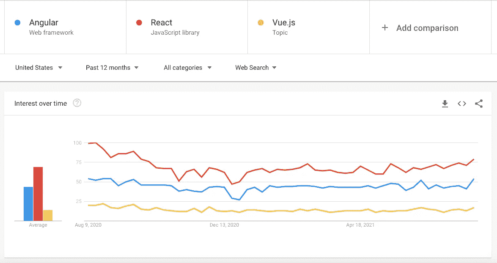

# 获得第一份工作的 5 个前端开发技能

> 原文：<https://betterprogramming.pub/5-front-end-development-skills-to-land-your-first-job-6514c8643c94>

## 不要在开始职业生涯的路上陷入困境或困惑

由 [Unsplash](https://unsplash.com?utm_source=medium&utm_medium=referral) 上 [Greg Rakozy](https://unsplash.com/@grakozy?utm_source=medium&utm_medium=referral) 拍摄的照片

当你准备在 IT 行业开始你的职业生涯时，你有很多选择。有许多编程语言、框架和库，如 HTML、CSS、JavaScript、TypeScript、Java、Python、React、Angular、C#、C++、PHP 等等。因为有这么多的选择，你会对选择一条道路开始感到困惑。

老实说，如果你感到困惑和不知所措，你并不孤单。我也去过那里。现在我意识到我在从大一新生到高级软件工程师的旅程中犯了一些错误。我也知道我不是唯一一个犯这些错误的人。因为我不太清楚从哪里以及如何开始，所以我花了很多时间在不必要的事情上。

大多数初学者犯的一个错误是，他们浪费太多时间从一件事跳到另一件事，却什么也没学到。因此，在本文中，我将为您提供一条清晰而坚实的学习路径，从前端开发开始，这样您就可以将时间花在最重要的事情上。

# 1.基础

首先要做的事。成为前端开发者，需要从 HTML、CSS、JavaScript 开始。这些其实都是前端开发的基础语言。HTML 用于构建网页，CSS 用于美化网页，JavaScript 用于编程。

我们用一个类比来理解这一点。把一个建筑想象成一个网页。它有一个框架或结构(HTML)，它有漂亮的墙壁和瓷砖(CSS)，它可以有某些功能，例如，当我们按下电梯按钮时，它会来接我们(JavaScript)。

现在，让我们再举一个例子。只要看看你的媒体简介页面。标题看起来像这样。

你想开发一个看起来像它的标题。所以首先我们使用 HTML 来构建这个布局的所有构件。左侧是构建模块，如用户名、关注者数量、列表菜单和关于菜单，右侧是搜索图标、带有个人资料图像的下拉菜单、编写新故事的按钮和转到媒体主页的媒体图标。我们使用 HTML 将这些构件添加到我们的网页中。

然后，我们用 CSS 给它一些视觉效果。例如，我们将用户名变得更大、更粗，改变关注者数量和左侧其他菜单的颜色，给配置文件图像一个绿色边框，改变按钮的文本颜色和边框颜色，调整中间图标的大小。

最后，我们可以使用 JavaScript 为我们的网页添加功能。就像，如果我们点击搜索图标，它可以在一定程度上扩大。我们可以用 JavaScript 来实现。

所以，你在互联网上看到的每一个网页都是用这三种语言构建的；HTML、CSS 和 JavaScript。因此，你对这些语言及其特性的学习和理解得越好，你在前端开发中就能做得越好。

# 2.前端框架

现在，我们明白了基本面的重要性，也明白了我们应该学习什么来超越它们。下一步是什么？

嗯，建设网站往往包括一堆重复性的任务。这就是前端框架和库的来源。一个框架或库附带了很多代码，我们可以在我们的网站上重用。因此，他们帮助我们更快地完成工作。这就是为什么现在很多公司都使用这些流行的框架，比如 React、Angular 和 Vue。

更准确的说，React 不是一个框架，而是一个库。框架和库的主要区别是框架迫使我们的应用程序进入一个结构。因此，所有使用 Angular 这样的框架构建的应用程序，最终都具有相似的结构。所以当你从一个项目转移到另一个项目时，你会发现一个相似的结构。另一方面，库不会强迫我们的应用程序进入一个结构。他们只是提供一些代码来重用。

但是把所有这些事情放在一边，所有这些工具都服务于同一个目的；它们帮助我们更快地构建应用程序。现在，你不需要学习所有这些。当你从事不同的工作时，你可能需要学习其中的任何一项。

在所有这些中，React 是最受欢迎的。它由脸书创建，用于创建脸书和 Instagram。所以我会说，从反应开始。

谷歌趋势

# 3.版本控制系统

我们使用版本控制系统来跟踪我们的代码历史，并与其他人更好地合作。这就是为什么你会在每一份工作描述中找到它。

市场上有多种版本控制系统，但 [git](https://git-scm.com/) 是最受欢迎的一种。所以只关注 git，不要担心其他版本控制系统。

# 4.CSS 预处理程序

CSS 是一种古老的语言，它有自己的局限性。如果你为中型或大型应用程序编写 CSS，你的代码迟早会变得凌乱不堪，变得很难管理。所以每次你想改变什么，结果都是打破了别的东西。

现在你会奇怪为什么 CSS 没有进化。是的，现在，它已经是第三版了。但是每次 CSS 中有新的特性时，所有的浏览器都需要支持这个特性。不幸的是，这是一个缓慢的过程。这就是 CSS 预处理器的用武之地。

CSS 预处理器是一个程序或工具，它可以让你从不同的语言中生成比 CSS 更好更强大的 CSS。因此，我们不使用普通的 CSS，而是使用另一种看起来非常类似于 CSS 的语言。事实上，它几乎是相同的，但它有一些额外的功能。然后，我们将代码交给 CSS 预处理器，它将代码转换成每个浏览器都能理解的普通 CSS。这就是 CSS 预处理器的目的。

有许多 CSS 预处理程序可用，比如 SASS、LESS 和 Stylus 等等。不过还是那句话，你没必要为了得到一份前端开发人员的工作而把它们都学会。因为这些都是服务于相同目的的相似工具。萨斯是其中最受欢迎的。所以我会推荐用 SASS。

# 5.JavaScript 的超集

就像 CSS 一样，JavaScript 也是一门相当古老的语言。尽管它不时得到更新，但它仍然有一些局限性。因此，许多前端开发人员更喜欢使用更现代的语言，如 TypeScript 和 CoffeeScript 来编写代码。然后，他们将代码交给一个名为 Transpiler 的程序，该程序将把现代代码翻译并编译成所有浏览器都能理解的旧 JavaScript 代码。

还是那句话，你不需要全部学会。你只需要从其中任何一个开始。我会说，用打字稿，因为这是最流行和最广泛使用的。当你换工作时，你可能需要学习一门不同的语言。但是你可以非常容易地学习这些语言，因为所有这些语言都非常相似，因为它们都是基于 JavaScript 本身构建的。

# 学习路径

因为我们已经知道作为一名前端 web 开发人员我们需要学习什么。现在，让我们看看确切的路径和每一步可能消耗的时间。

首先，你要学习 HTML，CSS，JavaScript。如果你花 3-5 个小时学习和编码，你将在 3 个月内对基本原理有一个合理的理解。你不会成为一名专家，但你会很好地理解它们，足以做出东西。

接下来，你要学习一个像 React 这样的前端框架或者库。你需要 1-2 个月来学习反应。

之后你还要学习一个类似 [git](https://git-scm.com/) 的版本控制系统。两周后你会对 git 感到舒服。

这些是你在几乎每份工作描述中都能找到的绝对要素。现在，如果你有一些额外的时间，我会建议你学习 SASS 和 TypeScript，以便从人群中脱颖而出，增加你的工作机会。SASS 很简单，你需要一两周的时间来学习。TypeScript 需要更多的时间，学习 TypeScript 的基础知识需要 2-4 周的时间。

因此，如果你花几个小时学习和编码，六个月后你就可以申请初级前端开发人员的工作。当然，每个人都不一样。你可能会更快到达那里，也可能会花更长的时间，不要因此而气馁。别忘了，如果你下定决心并充满热情，你可以实现任何事情。

要学习这些技能，你可以去像 [Udemy](https://www.udemy.com/) 或 [Pluralsight](https://www.pluralsight.com/) 这样的网站。他们有很多学习内容。只需查看课程的预习和评分，然后选择你喜欢的课程。

# 结论

这就是这篇文章的内容。我希望你现在对成为一名前端 web 开发人员有更多的了解。想看更多这样的文章，敬请期待！

感谢阅读！