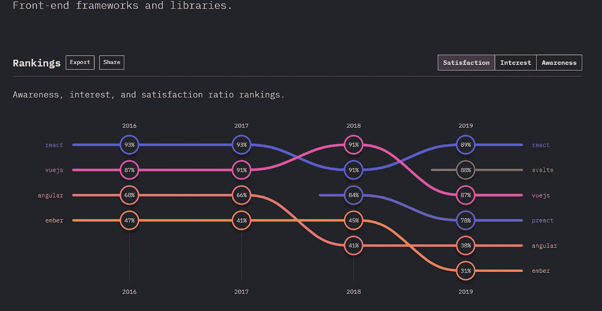

# 5 2020 年的前端预测和趋势

> 原文：<https://betterprogramming.pub/5-front-end-predictions-and-trends-for-2020-afc949e0eba2>

## 如何拥抱它们以及准备一些有用的资源


詹·西奥多在 [Unsplash](https://unsplash.com/s/photos/predictions?utm_source=unsplash&utm_medium=referral&utm_content=creditCopyText) 上的照片

今年即将结束，今年我们看到了前端技术在过去几年中的发展。我们一直在努力追赶这个非常迷人的行业中所有的新框架、库或新工具。

这种残酷而快速的增长使得全球前端开发人员的数量得以增长。这真的很棒；越多的开发人员相互交流、联系和分享他们的知识，就有越多有用和强大的工具和资源可用。

因此，知道了我们现在对 JavaScript 和前端东西的了解，我们需要领先一步，看看趋势、工具和资源将会是什么，以掌握、完善或赶上这列快速行驶的火车。

这将让你知道你已经掌握了哪些技能，哪些技能需要准备，以便继续成为前端开发精英的一部分。

# 这些预测和趋势从何而来

接下来的预测是基于我这一年所看到的一切；在研究、调查和可靠来源中。

这些预测有些可能是真的，有些可能不是真的。只是预测而已！现实情况是，我们需要密切关注它们，并拥有正确的资源来掌握和准备它们。

# 微前端——微服务的延伸

这大概是前端近年来最新的事了。今年，它真的获得了牵引力。

一个不言而喻的预测是，到 2020 年，它将被更多的开发者和公司所接受和使用。但是什么是微锋呢？

这个想法很简单。避免与 monolith 前端代码库的持续斗争。因此，根据马丁·福勒博客的作者卡姆·杰克逊的说法，他将其定义为:

> *“一种架构风格，其中可独立交付的前端应用程序被组合成一个更大的整体”——*[Cam Jackson](https://camjackson.net/)——马丁·福勒

正如您所看到的，这种前端架构将继续受到关注，因为它有助于解决复杂的现代应用程序以及组织复杂结构中的大问题。

# 前端框架——react . js 最受欢迎

React 将继续主导前端框架，基于[堆栈溢出](https://insights.stackoverflow.com/survey/2019#technology)和[JS 调查状态](https://2019.stateofjs.com/front-end-frameworks/)。



【https://2019.stateofjs.com/front-end-frameworks/ 

就在几天前，JS 2019 状态调查启动。你可以在他们的网站上找到所有的东西。在前端框架部分，结果显示胜出者为 React.js。

Stack Overflow 在其调查中也向我们展示了开发人员如何喜欢 React，以及他们正在考虑继续使用它并使用它构建漂亮、健壮、可伸缩和复杂的应用程序。

我认为值得注意的一点是，我们应该关注快速增长的 [Svelte.js](https://svelte.dev/) 。短短一年时间，就收获了不少爱好者，以至于现在离 React.js 这么近了。

这是明年要关注和学习的一项突出的技术。

# Web 组件

> “Web Components 是一套不同的技术，允许您创建可重用的自定义元素，将它们的功能封装在代码的其余部分之外，并在您的 Web 应用程序中使用它们。”— [MDN](https://developer.mozilla.org/en-US/docs/Web/Web_Components)

web 组件背后的思想是以一种不可知的方式工作。这意味着他们有能力在没有框架或任何框架标准化的情况下工作。

它们为您提供了一组 JavaScript APIs，允许您定义自定义元素和行为。此外，阴影 DOM 和 HTML 模板。

# ES 模块和动态导入

## ES 模块

目前，大多数浏览器已经支持使用 ES 模块。

当然，Node.js 不能止步不前，现在完全支持 ECMAScript 模块，因为它们是当前指定的，并在它们和现有的模块格式 [CommonJS](https://requirejs.org/docs/commonjs.html) 之间提供有限的互操作性。

ECMAScript 模块是封装 JavaScript 代码以供重用的官方标准格式。模块是使用各种导入和导出语句定义的。

## 动态导入

这个特性解决了很多与应用程序性能相关的头痛问题和金钱浪费。

它有助于并允许动态加载模块。换句话说，通过使用 promises 或 async/await 语法来按需执行。一个例子是:

```
import("./math").then(math => {
  console.log(math.add(16, 26));
});
```

真的很棒，不是吗？

# JavaScript 将势不可挡

这是显而易见的。JavaScript 将在 2020 年继续占据统治地位，这是因为我们在上面看到的所有特性和东西，也是因为即将到来的特性和版本。

其他值得关注的方法和功能包括:

*   作曲软件。
*   函数式编程。
*   `Promise.allSettled`，JavaScript 可选链接，`Object.fromEntries()`。

# 帮助您做好准备的资源

接下来，我将与您分享一些有价值且有用的资源，帮助您跟上所有前端趋势。

## JavaScript 资源

*   [干净的代码:敏捷软件技术手册](https://www.amazon.com/Clean-Code-Handbook-Software-Craftsmanship-ebook/dp/B001GSTOAM)
*   [务实的程序员:从熟练工到大师](https://www.amazon.com/Pragmatic-Programmer-Journeyman-Master-ebook/dp/B003GCTQAE)
*   [编写 JavaScript 应用程序](https://www.amazon.com/Programming-JavaScript-Applications-Architecture-Libraries/dp/1491950293)
*   [你还不知道 JS](https://github.com/getify/You-Dont-Know-JS)
*   [JavaScript:好的部分](https://www.amazon.com/JavaScript-Good-Parts-Douglas-Crockford/dp/0596517742)

## 2020 年要读的前端书

*   [微前端书籍](https://www.amazon.com/Micro-Frontends-Architecture-Introduction-Techniques/dp/1097927989)
*   [新的前端开发书籍](https://bookauthority.org/books/new-front-end-development-books)
*   [学习 Web 组件开发](https://www.amazon.com/dp/1784393649)

感谢阅读！我希望这篇文章对你有所帮助。