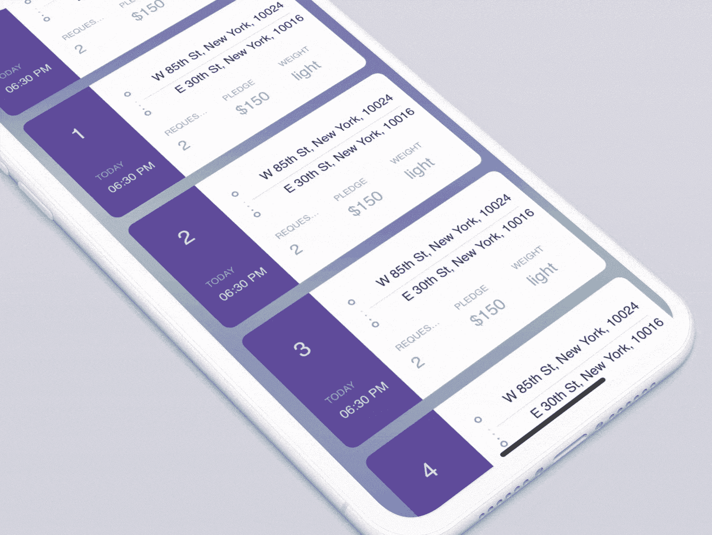
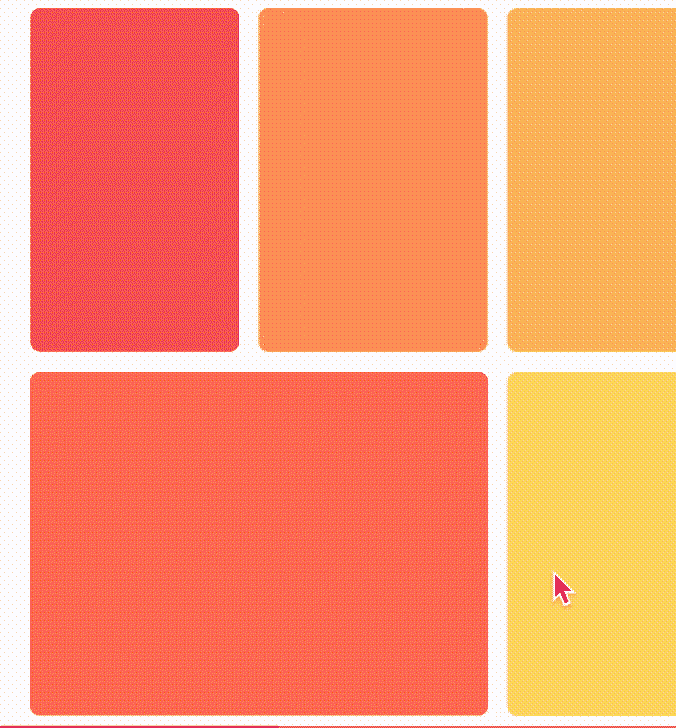
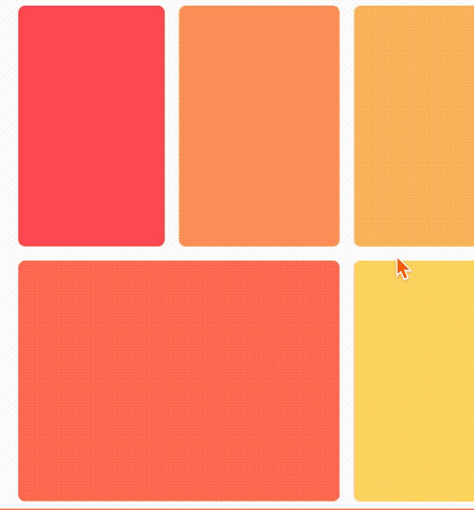

# 5 个有趣的 iOS 库来改善你的用户界面

> 原文：<https://betterprogramming.pub/5-fun-ios-libraries-to-improve-your-ui-2da28865b55>

## “UITableView”和“UICollectionView”的出色用户界面和动画

# 折叠电池

我们从`folding-cell`开始，这是为`UITableViewCell`定制的细胞子类。它提供了一个可怕的折叠/展开动画的细胞，以显示/隐藏其内容。

这个库与 iOS 8+和 Xcode 10.2+兼容

 [## 分枝/折叠细胞

### 受折叠纸卡材料设计的启发，使用动画扩展内容单元格。我们专门从事设计…

github.com](https://github.com/Ramotion/folding-cell) 

# 扩展集合

`expanding-collection`是`UICollectionViewCell`的定制细胞亚类。通过显示所有的细节，它提供了一个很好的动画，将一个单元格动画化为一个视图控制器。这有点类似于 App Store 对“今日”标签所做的事情

这个库兼容 iOS 9+和 Xcode 9+。

 [## 移动/扩展-收集

### octocat: ExpandingCollection 是一个动画材质设计 UI 卡 peek/pop 控制器。@Ramotion 做的 iOS 库…

github.com](https://github.com/Ramotion/expanding-collection) 

# 集合工具包

这是`UICollectionView`的改进版本，它遵循数据驱动的方法。它有内置的动画，所有这些都有卓越的性能。

这个库兼容 iOS 8+和 Xcode 8.2+。

 [## 酱油实验室/收集工具包

### 用于构建可组合数据驱动集合视图的现代 Swift 框架。在…上重写 UICollectionView

github.com](https://github.com/SoySauceLab/CollectionKit) 

# 翻转切口

这是 iOS 应用中默认的拉至刷新功能的替代。它使用 Notch 来制作动画，并在`UICollectionView`或`UITableView`中添加/显示/更新新项目。

该库支持 Swift 4+。

 [## 快鸟工作室/FlippingNotch

### FlippingNotch 是 Swift 编写的“拉动刷新/添加/显示”自定义动画，使用 iPhone X Notch。深受启发…

github.com](https://github.com/quickbirdstudios/FlippingNotch) 

# MP 偏斜

这是`UICollectionView`的另一个细胞子类。它有一个`skewed`布局，并且默认为所有图像提供视差效果。

这个库很老了，是用 Objective-C 写的。

 [## MP0w/MP 偏斜

### 受此系列启发的超酷系列视图单元格和布局查看过去的版本(<= 0.2.0) were just an…

github.com](https://github.com/MP0w/MPSkewed) 

# 6 iOS Libraries to Create Tinder-Like Swipe-able Cards

If you are interested in knowing about some libraries that will help you create Tinder like swipe-able cards, you can have a look at my [其他媒体文章](https://medium.com/better-programming/6-ios-libraries-to-create-tinder-like-swipeable-cards-33525620f4fc)