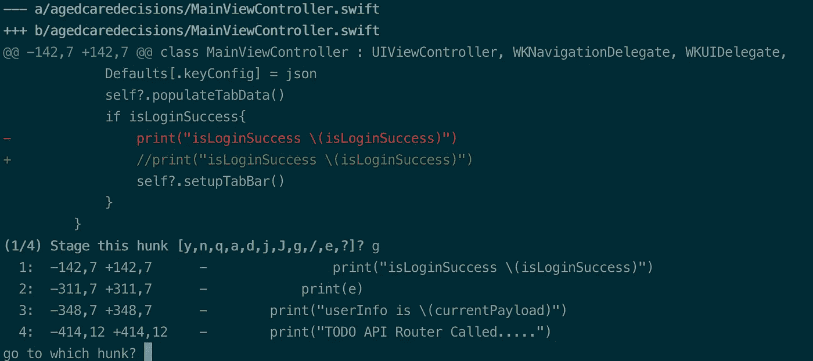

# 5 个你可能不常用的 Git 命令

> 原文：<https://betterprogramming.pub/5-git-commands-that-you-probably-arent-using-much-5da9a0b95399>

## 将文件添加到以前的提交中，以交互方式存放文件，等等


罗伯特·穆雷在 [Unsplash](https://unsplash.com?utm_source=medium&utm_medium=referral) 上的照片。

毫无疑问，Git 是软件开发人员日复一日最常用的工具。通过它的版本控制系统，您可以跟踪代码库的变化，并确保团队以协调的方式工作。

开发人员经常发现在初始阶段很难完全掌握 Git，所以他们最终只能记住并使用最常用的命令(`init`、`pull`、`push`、`add`和`commit`)。但是使用 Git 还可以做更多的事情。

在接下来的小节中，我们将介绍一些鲜为人知的 Git 命令。你很有可能知道并使用其中的一些。同时，其中一些命令可能会让您感到惊讶。

# 将文件添加到上一次提交

您可能知道开发人员经常用来修复 Git 提交消息(打字错误或缺少描述)的`amend`命令:

```
git commit --amend -m "Fixed Commit Message"
```

通过简单地扩展上面的命令，我们可以将文件中的新更改添加到以前的提交中。只需在命令中添加`no-edit`标志:

```
git commit --amend --no-edit -a
```

# 交互式暂存文件

做一个`git add .`或者单独存放文件是每个开发人员的常规任务。但是有时候，人们希望有一种更具交互性的方式，于是就选择了 GUI Git 工具。

令人惊讶的是，有一个 Git 命令可以让您直接从命令行交互地存放文件:

```
git add -p
```

该命令单独显示文件中的每个更改，并让您决定如何处理它。这是我的一个项目中的一小段:



您可以选择以下任一选项:

*   `y`:上演当前大块头。
*   `n`:不要上演这个大块头。
*   `g`:去一个不同的大块头。
*   `a`:暂存此块和当前文件中的所有其他块。
*   `d`:不要暂存当前文件中的这个块或任何其他块。
*   `e`:手动编辑当前块。

# 跟踪错误提交

在软件工程中，意识到一些提交(可能比当前提交晚 50 次)被破坏是一个非常普遍的现象。当你合并某人的分支机构时，这种情况经常发生。

跟踪错误提交的缓慢、枯燥和乏味的方法是手动迭代所有以前的提交。但这肯定会耗光你的时间。如果我告诉您，有一个命令可以通过迭代不到您通常使用的提交次数的一半来帮助您更快地找出 bug，会怎么样？

是的，`git bisect`是执行分治策略的命令，就像我们在二分搜索法中做的一样。本质上，你应该先做一个`git bisect start`，然后再做一个`git bisect bad <commit id>`。现在，如果您将提交 ID 保留为空，它将假定头部提交是错误的。

随后，您需要在`git bisect good <commit id>`中设置最后一个工作提交散列。

现在，上面的命令选择中间提交来开始测试。如果你的代码在提交时运行良好，输入`git bisect good`。否则，进入`git bisect bad`。根据您输入的内容，`git bisect`命令将使用二分搜索法技术寻找下一个提交。

到达错误提交后，您可以使用`git bisect reset`重置回头部。

或者，您可以通过以下方式直接在`git bisect start`命令中设置好的和坏的提交散列:

```
git bisect start [end_commit] [start_commit]
```

# 快速查看另一个分支的文件

通常，在处理多个分支时，开发人员会希望快速打开不同分支中的文件。

经典的、无需动脑的方法是使用`checkout`切换到相关的一个。但是当您只需要快速浏览一下文件而不改变当前分支时，Git `show`命令就来了:

```
git show branch:file
```

您还可以显示来自多个分支的文件，并按以下方式将它们连接起来:

```
git show branch1:file1 branch2^:file2
```

# 挑选提交

顾名思义，精选提交可以帮助您在不同步的分支之间传递特定的提交。

例如，两个团队可能正在开发不同的特性，其中一个团队需要立即发布他们的特性，而另一个团队已经准备好了相关的代码，但是被延迟了。或者可能在阶段化和产品化分支中发现了一个常见的错误，人们希望只复制代码的某一部分。

在这种情况下，执行`git merge`或`git rebase`可能不是最好的主意，因为这会复制所有的提交。有时，您只想挑选和复制特定的提交。

对你来说就是这样。要执行该操作，请获取您要复制的提交的 ID。现在检查您希望粘贴提交的分支，并运行以下命令:

```
git checkout destinationgit cherry-pick <commit_id>
```

精选对于快速修复错误、恢复丢失的提交或快速共享一段公共代码非常有用。但是它会导致重复提交。因此，如果您的用例需要转移多个提交，使用`merge`可能是一个更好的主意。

# 结论

这总结了一些鲜为人知的 Git 命令，这些命令对于某些用例来说非常方便。掌握 Git 将提高你和你的团队的编码速度和效率。

我希望这篇文章对你有用。感谢阅读。