# 我希望我能早点知道的 5 个技巧

> 原文：<https://betterprogramming.pub/5-git-tricks-that-i-wished-i-have-known-earlier-af1060881880>

## Git lola，更好的分支名称，squashing，等等


[Pankaj Patel](https://unsplash.com/@pankajpatel?utm_source=medium&utm_medium=referral) 在 [Unsplash](https://unsplash.com?utm_source=medium&utm_medium=referral) 上拍摄的照片。

# **1。运行 git lola 来可视化提交历史**

当使用 Git 版本控制时，能够可视化您的 Git 分支是至关重要的。

Git 命令可能很长，而且输入起来很乏味。为了在将来节省一些精力，让我们设置一个有用的 Git 命令来帮助您可视化您的 Git 分支历史。

在终端中:

```
vim ~/.gitconfig
```

然后在`gitconfig`文件中，添加以下代码片段:

```
[alias] lola = log --graph --decorate --pretty=oneline --abbrev-commit --all --date=local
```

我刚刚克隆了一个全新的项目，它只有最初的承诺。这是来自`git lola`的提交历史的样子:

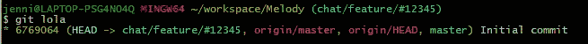

*注意:你可以自定义你的命令说* `*lola*` *以外的话，但这是行业惯例。除非你有充分的理由使用另一个命令，否则就保持这个命令为* `*lola*` *。*

# 2.新分支机构的清晰方便的名称

什么时候检查一个新的分支以及给分支取什么名字由你的团队决定。然而，有一些经验法则——尤其是如果您的团队在敏捷环境中工作:

1.  特性分支:您可以将分支命名为`chat/feature/#12345` ( `#12345`可以是项目过程中的任何类型的引用)。提示:我更喜欢将参考编号放在分行的末尾，因为如果分行名称以英文而不是数字开头，则更容易记住分行名称并点击 tab 自动完成。
2.  Bug branch:这是一个类似的想法。可以做`chat-styles/bug/#54321`。

这里，我创建了一个名为`chat/feature/#12345`的新分支，如上面的例子中所提到的。创建分支后，您可以再次运行`git lola`来查看您已经创建的新分支。

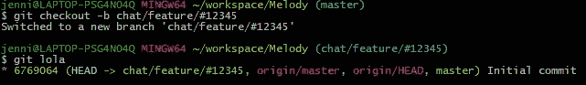

注意:因为我没有在新分支上进行任何新的提交，git lola 显示 chat/feature/#12345 与主分支具有相同的提交散列。稍后，我们将向这个分支添加更多的提交。

# 3.运行 git add -p，而不是 git add。

以前，每当我想暂存所有未暂存的文件时，我只需运行`git add .`。然而，有时我忘记删除一个`TODO`注释，一个控制台语句，最后不得不添加另一个只做清理工作的提交。

当您正在编辑一个已经被 Git 跟踪的现有文件时，您可以运行`git add -p`来查看您所做的更改。

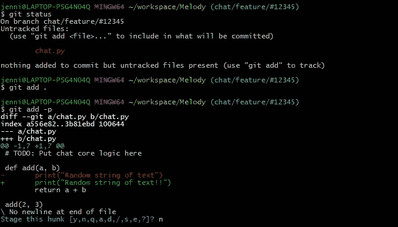

在下面的例子中，我第一次创建文件 chat.py 时，我仍然需要做 git add。或者 git 添加<filename>请求 Git 开始跟踪文件。但是，对于后面的修改，当我运行 git add -p 时，它会显示我所做的更改，我可以选择 y 表示“是”，或者选择 n 表示“否”，或者只选择 q 来退出这种交互模式并根据需要更新我的文件。</filename>

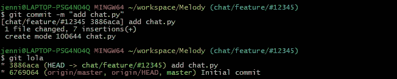

提交后，这是我运行 git lola 时显示的内容。

# 4.挤压提交

这里，我向`chat/feature/#12345`添加了三个额外的提交，向`master`添加了一个额外的提交，如下面运行`git lola`所示。

`git lola`将在左边显示最近提交的分支。最左边的红色垂直线显示了主分支机构的历史记录。我们看到`master`有两个提交(`6769064`和`b5010ec`)，而`chat/feature/#12345`有提交`3886aca`、`027d0a5`、`faf5e02`和`73cee7d`。

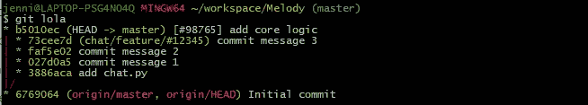

因为我添加的最后一个提交是`b5010ec`，即使当我从`master`分支切换到`chat/feature/#12345`分支时，它仍然在树的最左边显示`master`分支:

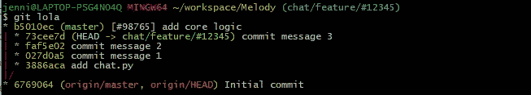

现在，让我们在`chat/feature/#12345`上添加第四个提交消息。如您所见，现在`chat/feature/#12345`的提交显示在树的最左边。

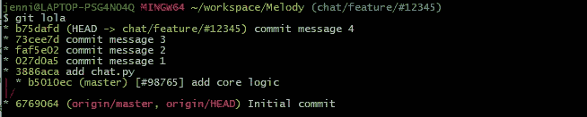

假设我现在已经完成了聊天功能，并希望将其合并到`master`。与其直接执行`git merge chat/feature/#12345`，我建议将`chat/feature/#12345`中的所有提交压缩成一个干净的提交，并将其添加到`master`。这样，看起来这些特性是在`master`之上顺序开发的。如果您想稍后恢复您的更改，这也会有所帮助。

以下是如何干净利落地粉碎提交的说明:

1.  找到当前分支的提交分支。在这个例子中，是`6769064`。


2.运行`git rebase -i <branched-off-commit-hash>`。`-i`代表交互，本例中的提交哈希是`6769064`。确保您位于想要挤压提交的分支上，并运行`git rebase -i 6769064`。

一旦我们进入交互模式，您将看到对当前分支的所有提交。

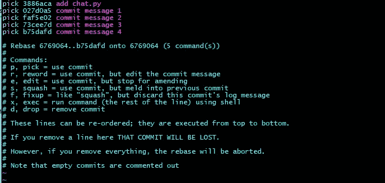

3.从第二次提交开始，将挤压的`pick`更新为`s`。在 vim 中，按`i`进入插入模式:

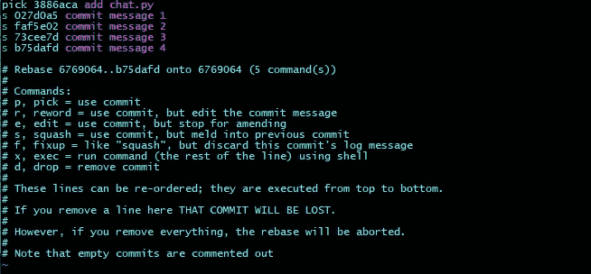

完成后，按`Esc`和`:wq`保存并退出编辑模式。

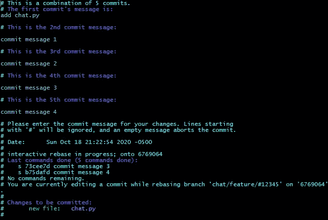

Git 将自动从提交中提取所有的注释。

4.删除所有注释，放入一个简洁的注释来总结分支:

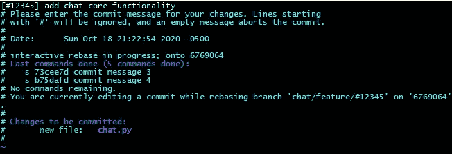

我已经将提交消息更新为“#12345]添加聊天核心功能。”

提示:按`DD`删除整行注释，按`i`再次进入插入模式。

再次按下`Esc`和`:wq`保存并退出交互模式。

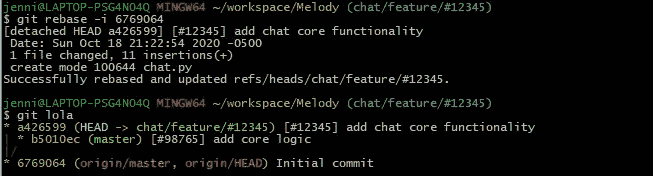

现在，它只是特性分支的一个干净的提交。

# 5.如果可以的话，在合并前重设基础

合并只会让 Git 的历史变得混乱。因此，在合并之前，我尝试先重定基础。这样，当我们将我们的分支合并到`master`时，`master`上的提交将是线性的和顺序的，就好像特性是一个接一个开发的一样。如果需要的话，这也使得在`master`上读取我们的提交历史更加容易。

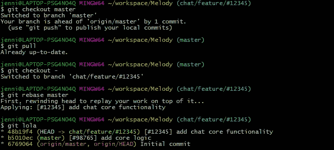

一旦您重新掌握了 master，合并过程将变得快速而简单:

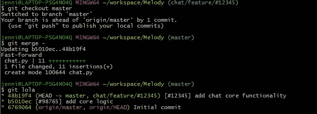

你有它！五个 Git 技巧让我节省了一些 Git 历史和合并冲突的痛苦。希望这对您有所帮助！