# 给网络开发者的 5 个谷歌分析技巧

> 原文：<https://betterprogramming.pub/5-google-analytics-tips-for-web-developers-4f93e77af553>

## 为 GA 初学者节省时间


斯蒂芬·菲利普斯-Hostreviews.co.uk 在 Unsplash[拍摄的照片](https://unsplash.com?utm_source=medium&utm_medium=referral)

在工作中，当我被要求从事谷歌分析时，我感到相当紧张，因为我对它没有任何背景知识。我就想“这到底是什么？”我花了相当多的时间来弄清楚这是如何工作的，以及我应该做些什么来让其他作品在仪表板上看到日志。希望这对不了解 GA 或者目前正在遭受痛苦的人有所帮助。

# 1.不要沉迷于隐藏视图 ID

许多与会话令牌或任何凭证值打过交道的人可能都知道，不将它们暴露给外部用户从您的站点获取它们是多么重要。然而，在谷歌分析中，这不在你需要担心的范围之内。

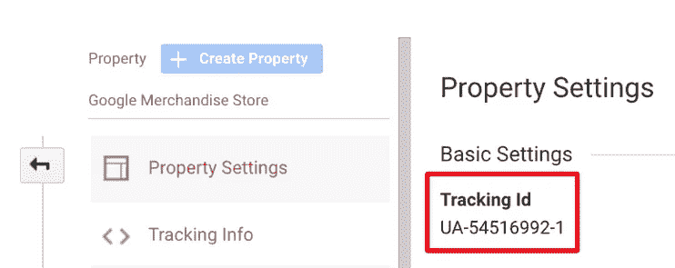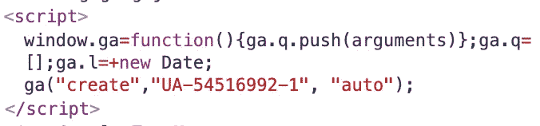

跟踪 ID 总是显示的。

在“设置”菜单的“属性设置”部分，您可以从 UA 开始检查视图的跟踪 ID，UA 是 Universal Analytics。你可以在 head 标签中插入 JavaScript 代码。然后你可以在网站上找到你的 ID。

你可能会担心如果有人拿走你的 ID 并滥用它对你的网站做一些不好的事情。

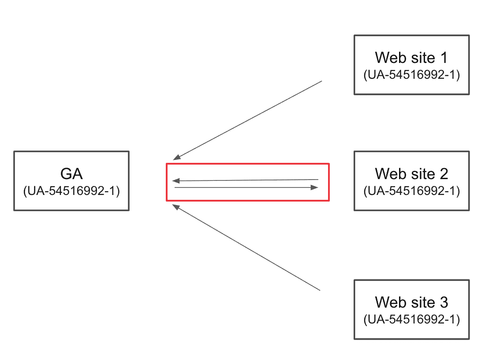

GA 如何只接受你的日志如上图所示。有三个网站使用相同的 ID 发送日志，您的 Google Analytics 从您那里获取一个域来接受和收集来自网站的日志。因此，它只适用于您指定的特定网站。

# 2.使用自定义维度

只有 ID 以 UA 开头的视图才能正常工作，而不是以 GTM、G 或其他名称开头的视图。

在 Google Analytics 中，有很多标准可以作为一个专栏，让你的报告更有内容。但是，您可能希望设置默认项目中不存在的自己的列。

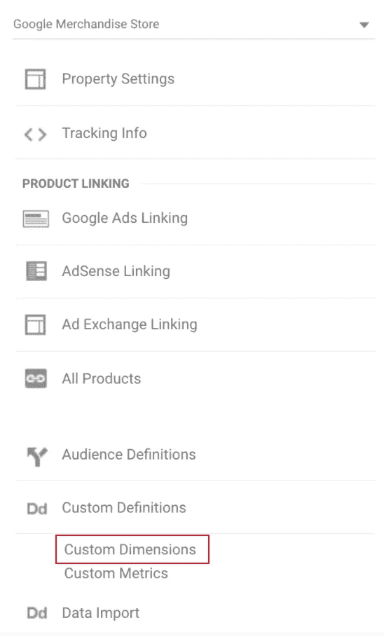

管理>属性>自定义定义>自定义维度，查看[更多信息](https://support.google.com/analytics/answer/2709828?hl=en)

此设置允许您在报告中创建自己的列。在过滤日志时，这是一个非常棒的特性。

有一点你要记住:你不能定制超过 20 个维度。它们一旦创建就无法删除。因此，创建一个定制维度应该通过咨询市场营销人员或该领域中更关心日志的其他工作人员来实现。

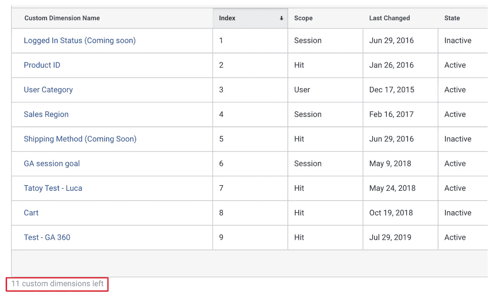

不能超过 20 个

自定义维度的索引号始终从 1 开始。在定义了`window.ga`的文件中，您可以添加如下关于上图所示的自定义尺寸。

```
window.ga('set', 'dimension2', /* Add Your Product ID */);
```

这项工作最好在您的页面完全呈现之前完成，因为任何页面视图都可以发送。

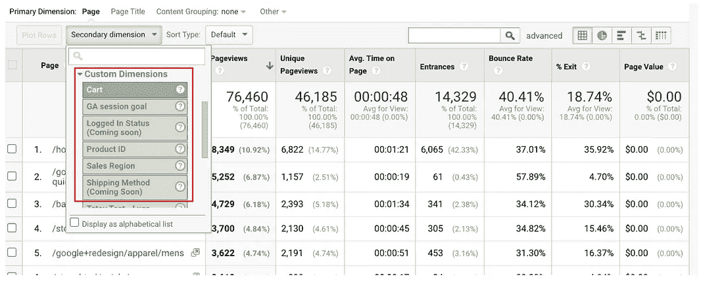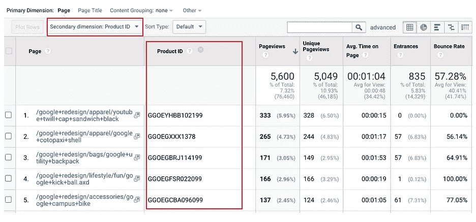

上面的屏幕截图向您展示了如何在报表中使用自定义维度作为列。

# 3.使用过滤器

使用定制维度，您不仅可以使您的报告更有内容，而且还可以通过过滤所有传入的日志来告诉您的视图接受某些日志。

假设您在一家汽车经销商处工作，您想获得购买红色汽车的客户的报告。你怎么能这样做？到目前为止，您已经创建了一个自定义维度，`'dimension1'`。在这种情况下，过滤器是最适合您的功能。

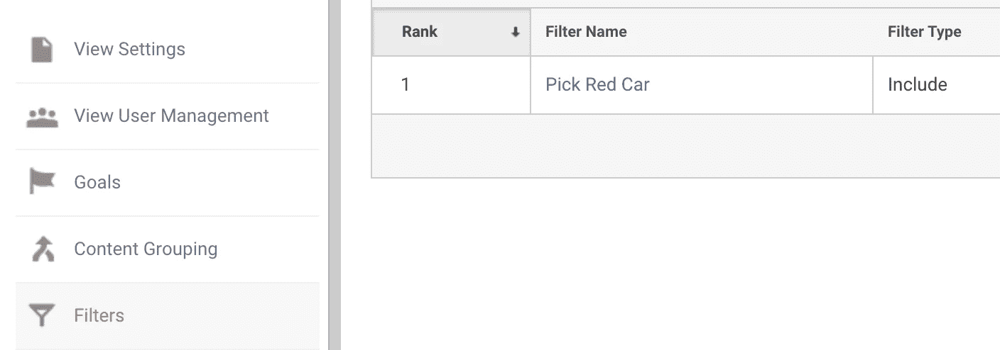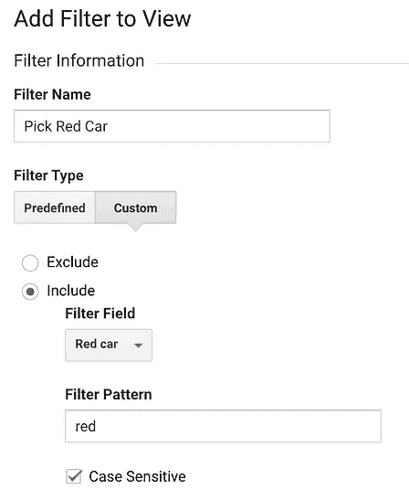

管理>视图>过滤器。查看[更多信息](https://support.google.com/analytics/answer/1034823?hl=en)

我使用名为“红色汽车”的自定义维度创建了一个新的过滤器过滤器类型为“自定义”，选项为“包含”您可以设置自己的过滤器。


这就是过滤器的工作原理。可能有许多不同的日志，如“蓝色汽车”或“橙色汽车”但是您的视图会检查它们，只让包含“红色”的日志通过安全门。

**重要提示**:注意同一个跟踪 ID 下可以有多个视图。您可以拥有许多带有不同过滤器或自定义维度的自定义视图。

# 4.调试您的日志

[Analytics.js](https://developers.google.com/analytics/devguides/collection/analyticsjs/how-analyticsjs-works) 是一个第三方包，允许您向 GA 数据库发送日志，这意味着很难知道您的日志是否已成功发送。有几种方法可以在控制台上调试日志。

在你的开发模式下，你可以下载`[analytics_debug.js](https://developers.google.com/analytics/devguides/collection/analyticsjs/debugging)`而不是`analytics.js`。它在控制台中向您显示每个 GA 操作，如下所示。


Medium 也使用谷歌分析

`Running Command: ga(...)`指每个 GA 动作。可能是`set`、`create`或者`event`。在命令下面，您可以检查发送到您的 GA 或与您的 GA 视图相关的每个属性的详细信息。你甚至可以找到跟踪 ID；这就是为什么我告诉你，你不必试图隐藏它。

第二种方法是安装 Chrome 扩展[谷歌分析调试器](https://chrome.google.com/webstore/detail/google-analytics-debugger/jnkmfdileelhofjcijamephohjechhna)，其工作原理与`analytics_debug.js`完全相同。插入 dev 模式文件和安装这个扩展的唯一区别是你不必关心`RUN_MODE`。

```
/* No need to do this w/ the extension */
if (process.env.RUN_MODE !== 'production') {
  script.src = analytics_debug.js
}
```

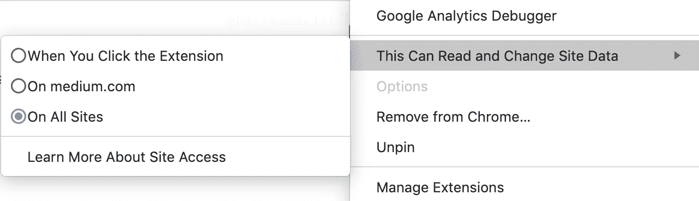

您可以根据网站打开/关闭 Google Analytics 调试器

它让您选择是否为每个网站打开它。

最后，这对那些使用谷歌标签管理器或 GTag 的人来说更好。[谷歌标签助手](https://chrome.google.com/webstore/detail/tag-assistant-by-google/kejbdjndbnbjgmefkgdddjlbokphdefk)帮助你更直观地看到发送了哪些带有哪些属性的标签。

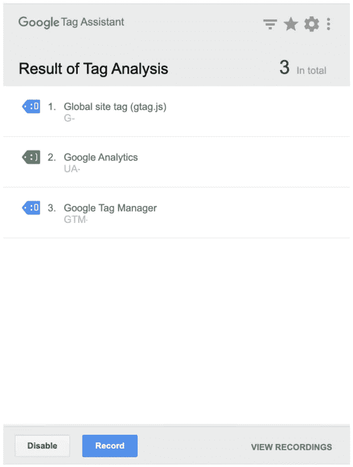

点击后，每个菜单都会显示更多的详细信息

我个人推荐安装第三个，Chrome 扩展 Google Tag Assistant，因为它不仅可以让你自由开启和关闭扩展，而且视觉上更有内容。在调试代码中的其他内容时，您不会受到太多的困扰。

# 5.考虑使用谷歌标签管理器

GTM，Google Tag Manager，是另一个不用部署代码就可以运行标签的工具(GTM 称日志为*标签*)。)


在您的 GA 中，您可以将上下文更改为 GTM，这是图片中的蓝色图标。我个人推荐这个给你，有两个原因。

首先，它是免部署的。当然，您应该在您的项目中设置 GTM 的基本配置，但它只是插入脚本标记。这就是你需要做的。使用 GA，需要部署您的代码来发送新的日志。另一方面，使用 GTM，您不需要在每次创建新标记(日志)或修改现有标记时都部署代码。

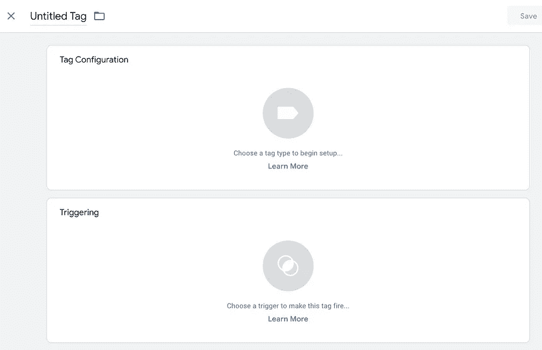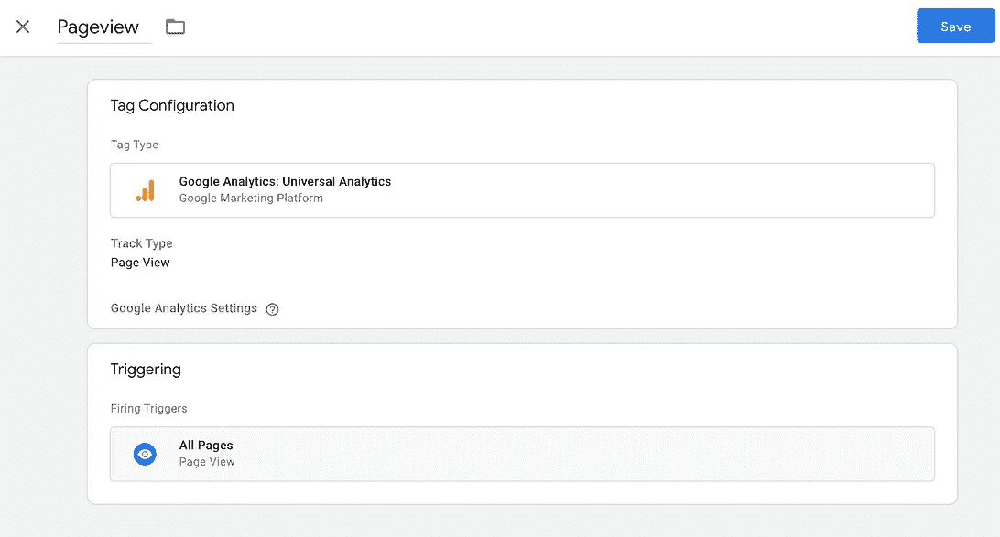

GTM 页面，此时您可以创建新标签

在 GTM 页面上，只需点击几下鼠标，即可创建新标签或修改现有标签。如果您想向您的 GA 发送页面视图，这非常简单。右图显示了创建一个适用于每个页面的新页面视图标签后的结果。

为什么 GTM 看起来简单多了？因为它的诞生是为了让开发者和非开发者能够顺畅地协同工作。例如，营销人员无法编辑代码，因为他们不知道 JavaScript，而开发人员无法设置日志策略，因为他们不知道营销方面的事情。为了节省他们的时间，谷歌为他们两个制作了一个很棒的工具，所以现在营销人员应该要求他们的开发者安装 GTM。一旦安装完成，他们就可以做任何他们想要的标签。太棒了。

第二，这是令人难以置信的惊人调试每个标签，并允许你时间旅行，称为 [GTM 预览模式](https://support.google.com/tagmanager/answer/6107056?hl=en)。

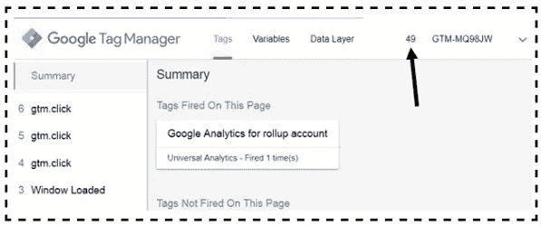

图片来源于[优化智能](https://www.optimizesmart.com/guide-to-google-tag-manager-debug-console/)

GTM 使用一个`dataLayer`来跟踪数据。如果新数据被推送到`dataLayer`中，它会反应性地工作。这使得你甚至可以在 Chrome 控制台上进行测试。通过显示符合和不符合条件的每个属性，您可以直观地看到哪些标签被发送，哪些标签没有被发送，甚至为什么它们不能被发送。

# 结论

没有使用 GA 的答案，因为不同公司的营销人员想要不同的日志。但是如果你是一个开发人员，你可以向他们建议一个新的想法来更容易和更方便地收集和检查日志。我要说的是不要害怕，因为谷歌的大多数日志工具都是类似的工作方式，理解 GA 可以解决你遇到的大多数问题或顾虑。所以探索一下，试一试，找到更好的方法！