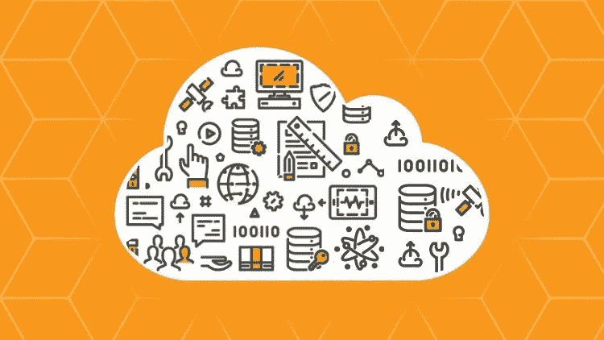
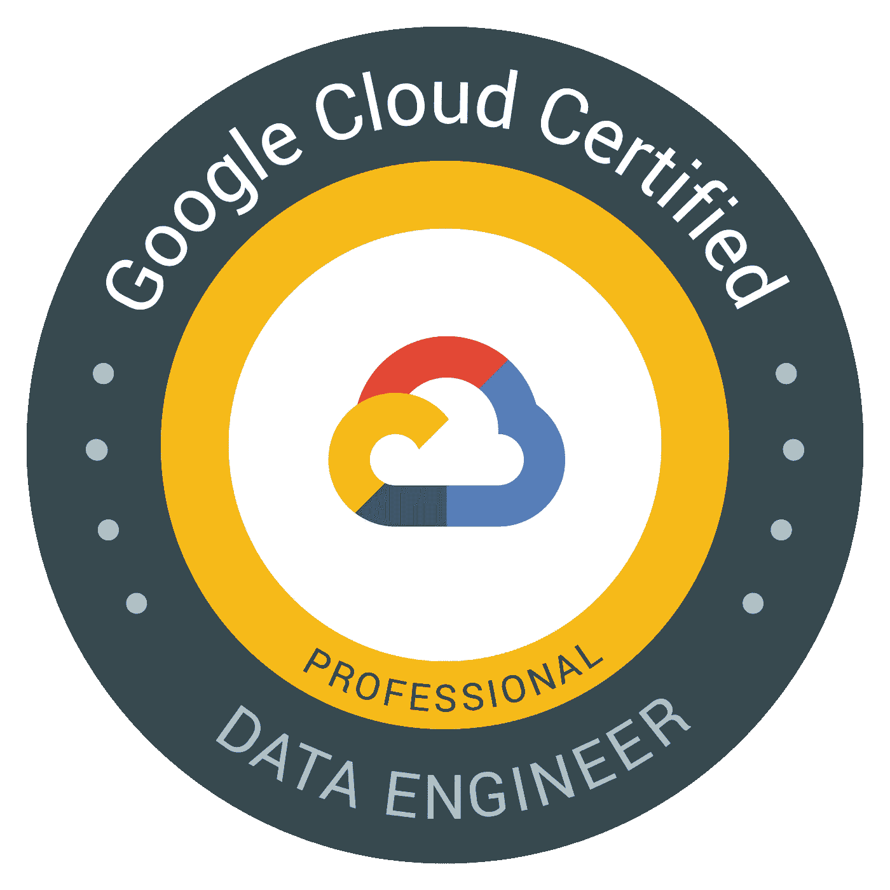
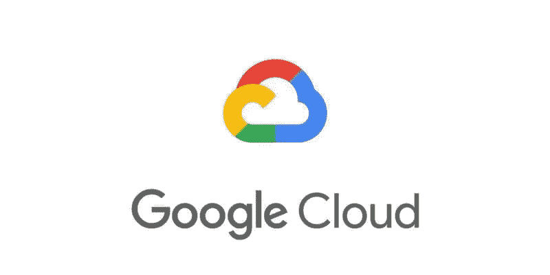
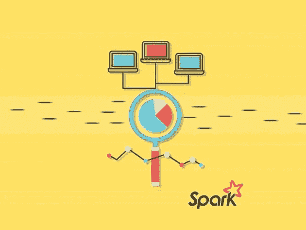

# 5 大数据工程在线课程

> 原文：<https://betterprogramming.pub/5-great-data-engineering-online-courses-784e62f57ddd>

## 从大数据到云计算

照片由[希望之家出版社——皮革日记工作室](https://unsplash.com/@hope_house_press_leather_diary_studio?utm_source=unsplash&utm_medium=referral&utm_content=creditCopyText)在 [Unsplash](https://unsplash.com/s/photos/coding?utm_source=unsplash&utm_medium=referral&utm_content=creditCopyText)

根据 Statista 最近在[进行的一项调查，到 2025 年，数据市场的容量预计将增长 175 兆字节。为了更深入地研究大数据，我们需要了解如何处理大数据，这就是数据工程的用武之地。](https://www.statista.com/statistics/871513/worldwide-data-created/)

简而言之，数据工程就是管理大数据集，并高效准确地从中提取信息。

# 加入我们的时事通讯

在继续滚动之前，为什么不加入我们团队的时事通讯，了解数据科学、数据工程和技术的最新动态！[在此了解更多信息](https://seattledataguy.substack.com/)。

# **什么是数据工程师？**

数据工程师是负责在 DS 项目中维护和构建数据架构的人。

数据工程师的一些主要角色和职责包括必须确保服务器和应用程序之间的不间断数据流、集成新的数据管理软件、改进数据基础流程以及构建数据管道。

事实是，有许多不同的技术和概念需要数据工程师采用——使用[云计算](https://medium.com/swlh/10-great-courses-for-aws-google-cloud-and-azure-ec89bef8a078)、[ETL、](https://www.theseattledataguy.com/data-engineering-101-writing-your-first-pipeline/)数据仓库等等。

数据工程师的需求在不断扩大，因此我们需要不断了解技术世界的变化。

在本文中，我们将讨论理解数据工程如何工作的前五门课程。

# AWS(亚马逊网络服务)云中的大数据

来源: [Udemy](https://www.udemy.com/course/introduction-to-cloud-computing-with-amazon-web-services/)

显示[课程页面](https://www.udemy.com/course/big-data-in-the-aws-amazon-web-services-cloud/)，通过本课程:

> "1.您将了解各种亚马逊 Web 服务在大数据领域的局限性和用途。
> 
> 2.您还将在真实使用案例的帮助下了解大数据工具。
> 
> 3.您还将了解大数据分析框架、存储和数据库
> 
> 4.您还将了解重要主题，如大数据计算实例、人工智能、商业智能、机器学习和无服务器架构。"

## **总结**

Udemy 的这一综合课程评分为 4.5/5，目前有 761 名学生注册，它将教您如何在 AWS 上构建弹性和可扩展的大数据解决方案。

本课程要求您对数据相关概念有基本的了解，如数据流、数据库和数据仓库。

本课程专为 IT 行业中希望了解更多有关使用 AWS 处理大数据的个人而设计。尽管本课程不面向高级从业者，但它将为您提供关于 AWS 大数据解决方案的丰富经验。

# 数据工程与谷歌云专业证书

来源: [Coursera](https://www.coursera.org/)

根据[课程页面](https://www.coursera.org/professional-certificates/gcp-data-engineering)，通过本课程:

> "1.你将能够练习设计、运行和构建数据处理系统。
> 
> 2.您还将学习构建和操作机器学习模型。
> 
> 3.您将了解谷歌云平台提供的基础设施和平台服务。
> 
> 4.你将获得谷歌云的适当认证。"

## **总结**

Coursera 的这一优秀课程涵盖了学习数据工程所需的全部技能。

这种 100%在线课程提供了灵活的时间表，并为您提供了练习关键工作技能的机会，例如使用数据处理系统和机器学习模型。

这是一门中级课程，要求您对 SQL 有基本的熟练程度。

本课程包括各种演示、实验和演示，使您能够通过数据的收集、转换和发布来学习数据驱动的决策。该课程提供英语、日语、葡萄牙语和西班牙语版本。

**快速休息** —这是 2021 年以来我们最喜欢的一些课程的更新。

# GCP 专业化的数据工程、大数据和机器学习

来源: [Coursera](https://www.coursera.org/)

显示[课程页面](https://www.coursera.org/specializations/gcp-data-machine-learning)，通过本课程:

> "1.您将能够学习如何在谷歌云平台中设计和构建数据管道。
> 
> 2.您还将学习如何使用 Cloud Dataproc 在 Hadoop 上提升和转移您现有的工作负载。
> 
> 3.您还将了解如何使用 cloud composer 和数据融合来管理您的数据管道。
> 
> 4.您还将了解如何通过在云数据流的数据管道上实施自动缩放技术来处理和传输数据。"

## **总结**

通过这门优秀的课程，您将能够在数据工程领域开始自己的职业生涯，并利用机器学习和大数据实现商业价值。这种专业化是 100%在线，并为您的学习提供灵活的时间表。

本课程涵盖结构化数据、非结构化数据和流数据等主题，涵盖了所有内容。它还涵盖了对使用 BigQuery 机器学习在不同种类的 ML 模型上预构建的机器学习 API 的理解。

更好的是，您将了解如何使用 cloud composer 管理您的数据管道。本课程面向使用数据处理架构、查询数据集和分析集成的个人。

# 商业智能专业化的数据仓库

根据[课程页面](https://www.coursera.org/specializations/data-warehousing)，通过本课程:

> "1.您将学习如何利用业务数据并构建完全优化的业务仓库
> 
> 2.您将了解如何使用仪表板可视化数据。
> 
> 3.您还将学习如何设计数据仓库，并使用可视化分析对其进行集成。
> 
> 4.你将学到最流行的数据架构技巧。"

## **总结**

通过这门 100%在线、完全灵活的课程，您将学习数据建模的基础知识，并使用 SQL 深入理解数据操作和数据仓库的设计。

本课程将为您提供使用可视化分析处理大型数据集和创建仪表板的机会。

通过这种全面的专业化，您将了解数据可视化、Pentaho 和数据仓库。

本课程提供韩语、英语、中文和越南语版本。

# 用 Apache Spark 和 Python 驯服大数据

来源: [Udemy](https://www.udemy.com/course/introduction-to-cloud-computing-with-amazon-web-services/)

根据[课程页面](https://www.udemy.com/course/taming-big-data-with-apache-spark-hands-on/)，通过本课程:

> "1.您将了解如何在 Spark3 中使用结构化流和数据帧。
> 
> 2.您还将了解如何使用 Amazon 的 Elastic MapReduce 服务在 Hadoop 上处理您的集群。
> 
> 3.您还将学习如何在大数据分析中构建问题，如火花问题。
> 
> 4.您还将学习如何使用 Spark 实现长度和宽度优先搜索等迭代算法。"

## **总结**

Udemy 的这门 4.4/5 评级的课程非常有助于理解 Apache Spark 和 Hadoop。

通过这个专业，您将了解 GraphX 库如何处理网络分析，以及如何使用 [MLlib](https://spark.apache.org/mllib/) 来回答主要的数据挖掘问题。

该认证包括 15 个以上的大型数据集示例，这将使您能够深入处理结构化数据。此外，您将了解弹性分布式数据集以及它们如何实时工作。

这门课程售价 149.99 美元，提供 5.5 小时的点播视频和 7 种可下载资源。

# **遗言**

如果你想进入这个十年来最热门的领域，数据工程，重要的是首先要打下一个坚实的基础。

为此，许多机构提供在线课程，你可以开始学习。我们列出了五门最受欢迎的课程，让你开始学习。所以，看看吧，开始你的大数据世界之旅。

更新—这是我们 2021 年的[顶级数据工程课程。](https://www.theseattledataguy.com/best-online-courses-for-data-engineers-in-2021/)

# 点击此处阅读更多内容

感谢阅读！如果您想了解更多关于数据咨询、大数据和数据科学的信息，请点击下面的链接。

[成为数据工程师的现实](https://www.youtube.com/watch?v=6RiA_Qur2yo&t=1s)

[转行成为数据工程师|成为数据工程师的途径](https://www.youtube.com/watch?v=f9ngBz7wCGE&t=2s)

[为小型企业和初创企业制定数据分析战略](https://www.theseattledataguy.com/developing-a-data-analytics-strategy-for-small-businesses-and-start-ups/)

[下一次数据科学或数据工程面试前你需要知道的 5 个 SQL 概念](https://www.youtube.com/watch?v=X6-VNKe3XVM&t=6s)

[如何改进您的数据驱动战略](https://www.theseattledataguy.com/17-questions-you-need-to-ask-about-your-data-strategy/)

[什么是数据仓库，为什么使用它](https://youtu.be/VjlzuUzYJYM)

[破坏您的数据驱动战略的错误](https://logitanalytics.com/5-mistakes-that-are-ruining-your-data-driven-strategy-and-costing-you/)

[用 Python 管理大数据的 5 大图书馆](https://www.theseattledataguy.com/5-great-libraries-manage-big-data-with-python/)

[什么是数据工程师](https://www.youtube.com/watch?v=D1V6t--9tt8&t=7s)