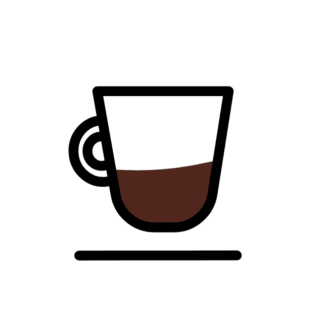
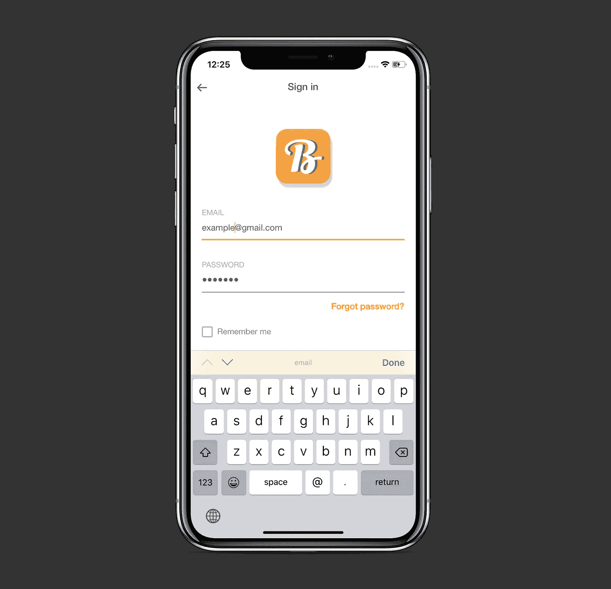

# 5 个伟大的库，帮助你更快地编写 iOS 应用程序

> 原文：<https://betterprogramming.pub/5-great-libraries-to-help-you-write-ios-apps-faster-4f276b261cb2>

## 自动布局 DSL、动画、键盘优化等等

[英池](https://unsplash.com/@yingchih_hao?utm_source=medium&utm_medium=referral)在 [Unsplash](https://unsplash.com?utm_source=medium&utm_medium=referral) 上的照片

在本文中，我将列出五个很棒的第三方框架/库，你可以将它们导入到你的应用中，并根据你的需要来使用。

# 1.卡扣套件

SnapKit 帮助我们以编程方式更快地创建用户界面:

 [## 卡扣套件/卡扣套件

### SnapKit 是一个 DSL，使自动布局在 iOS 和 OS X 上都很容易。⚠️与 Swift 4.x 一起使用，请确保您使用> =…

github.com](https://github.com/SnapKit/SnapKit) 

下面是一个正方形`UIImageView`在其超级视图中心的简单定位:

与标准`NSLayoutConstraint`相反:

# 2.洛蒂

[Lottie](https://airbnb.design/lottie/) 通过以 JSON 格式加载和渲染高级动画，极大地简化了对它们的处理。有了它，开发人员可以轻松地配置像这样的动画:

资料来源:https://lottiefiles.com/18761-expresso

要了解更多信息，请查看 GitHub repo:

 [## Airbnb/洛蒂 ios

### Lottie 是一个 Android 和 iOS 的移动库，它可以实时渲染基于矢量的动画和艺术…

github.com](https://github.com/airbnb/lottie-ios) 

以及 iOS/macOS 的官方文档:

 [## 洛蒂医生

### 描述

airbnb.io](https://airbnb.io/lottie/#/ios?id=quick-start) 

# 3.IQKeyboardManagerSwift

你曾经不得不手动处理键盘与用户界面重叠的情况吗？

`IQKeyboardManagerSwift`在这种情况下是救世主。你所需要做的就是在`AppDelegate`中添加下面两行来忘记操作键盘:

结果现在看起来像这样:

在这里了解`IQKeyboardManager`:

 [## hackiftekhar/IQKeyboardManager

### 在开发 iOS 应用程序时，我们经常会遇到 iPhone 键盘向上滑动并覆盖了…

github.com](https://github.com/hackiftekhar/IQKeyboardManager) 

# 4.PKHUD

PKHUD 为在屏幕上显示进度提供了强大的功能。它在联网和其他耗时的操作中非常有用:

 [## pkluz/PKHUD

### 基于 Swift 的 Apple HUD 的重新实现(音量、铃声、旋转、...)适用于 iOS 8 及以上版本。iOS 8 官方模糊…

github.com](https://github.com/pkluz/PKHUD) 

用法非常简单:

*   在文件顶部导入 PKHUD。
*   火力负荷指示器:`HUD.show(.progress)`或`HUD.show(.labeledProgress(title: “Loading”, subtitle: nil))`。
*   停止加载指示灯:`HUD.hide()`。

# 5.侧菜单

在 iOS 应用程序中实现侧菜单(又名`NavigationDrawer`)的要求是很常见的。`SideMenu`库为此提供了一个很好的解决方案。使用它非常简单:

*   定义`SideMenuNavigationController`子类:

*   在视图控制器中，创建并呈现这个子类:

注意，您将侧菜单的内容视图控制器指定为`rootViewController`属性。

`SideMenu`库提供了许多其他的额外好处，比如样式定制、演示类型等等。查看其官方 GitHub 回购:

 [## jonkykong/侧面菜单

### SideMenu 需要你的帮助！如果你是一个熟练的 iOS 开发者，想帮助维护这个库并回答问题…

github.com](https://github.com/jonkykong/SideMenu) 

# 包扎

最近，我写了一篇关于[有用的扩展](https://medium.com/better-programming/5-useful-swift-extensions-to-use-in-your-ios-app-f54a817ea9a9)的文章，你可以直接复制并粘贴到你的应用中，以加快你的开发过程。如果你有兴趣，可以去看看。

感谢阅读！