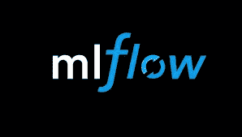
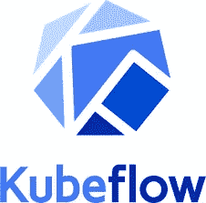
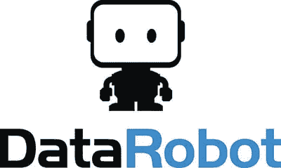
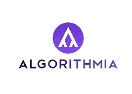

# 启动下一个机器学习模型的 5 大 MLOps 工具

> 原文：<https://betterprogramming.pub/5-great-mlops-tools-to-launch-your-next-machine-learning-model-3e403d0c97d3>

## 简化机器学习开发生命周期

罗曼·胡诺在 [Unsplash](https://unsplash.com/s/photos/robots?utm_source=unsplash&utm_medium=referral&utm_content=creditCopyText) 上拍摄的照片。

你知道吗[2019 年花费了](https://financesonline.com/machine-learning-statistics/)285 亿美元投资机器学习项目、工具和员工？

由于机器学习给工作带来的自动化和灵活性，它已经占据了几乎每个行业。各种规模的公司都在使用工具和云服务，如[AWS comprehensive](https://medium.com/better-programming/3-natural-language-processing-tools-from-aws-to-python-954dbb34b189)和其他类似的服务，来改善他们的业务流程和创造新产品。

然而，在复杂的机器学习部署环境中，有一个稍微新一点的概念被证明是有帮助的，那就是 MLOps。

后缀“Ops”是不是有点用过头了？是的。

但是 MLOps 在技术世界有它的位置。这实际上是一个成熟学科的标志。随着机器学习模型管理和部署的最佳实践变得更加明确，开发自动化平台变得更加容易，这些平台可以管理您的机器学习工作流程中许多平凡且容易出错的步骤。

这就是为什么现在市场上充斥着很多产品，试图争夺你的注意力。有开源的 MLOps 选项和企业解决方案。

有些人非常专注于机器学习模型部署工作流程中的一个步骤，而另一些人则试图管理整个过程。

在今天的文章中，我们将讨论如何通过使用 DevOps 和五个最佳工具来实现机器学习的自动化。

# 什么是 MLOps？

[MLOps 与 DevOps](https://www.theseattledataguy.com/mlops-vs-aiops-what-is-the-difference/#page-content) 有几个相似之处，除了不是专注于部署和管理纯粹的代码，而是专注于部署和管理模型。当谈到机器学习时，你专注于测试结果，管理边缘案例，训练统计模型和神经网络以及测试数据。

使用 DevOps，一旦您的代码被编写和检查，代码就被集成到 CI 中。然而，在 MLOps 的情况下，这不起作用，因为我们必须相应地运行测试和修改模型。由于该过程需要在回路中进行测试和培训，因此构建 MLOPs 是为了便于重新测试。

# MLOps 的 5 大工具

## 1.MLflow

来自 [MLflow](https://mlflow.org/) 的照片。

借助 MLflow 等工具，数据专业人员现在可以轻松实现复杂模型跟踪的自动化。MLflow 在 2018 年 Spark + AI 峰会上首次亮相，是又一个阿帕奇项目。MLflow 允许数据科学家自动化模型开发。通过 MLflow，可以使用跟踪服务器更轻松地选择最佳模型。参数、属性和性能指标都可以记录到这个服务器上，然后可以用来快速寻找符合特定标准的模型。Airflow 和 MLflow 正在迅速成为机器学习模型的自动化实现、集成和开发的行业主食。

尽管 MLflow 是一个对日志模型进行排序的强大工具，但它并没有回答应该建立什么模型的问题。这是一个有点困难的问题，因为根据您的模型，培训可能需要大量的资源，超参数可能是不直观的，或者两者都有。甚至这些问题也可以部分自动解决。

## 2.迟钝的人

图片来自[厚皮动物](https://www.pachyderm.com/)。

管理您的数据管道、模型和数据集是一个复杂的过程，有许多活动的部分。Pachyderm 旨在简化这一过程，使其既可追溯又可重现。

Pachyderm 是一个数据科学平台，它将端到端管道与 Kubernetes 上的数据血统结合在一起。该平台在企业范围内工作，为任何项目添加基础。该过程从数据版本化与数据管道化相结合开始，这产生了数据血统，并以部署机器学习模型结束。

它不仅跟踪您的数据修订，还跟踪相关的转换。此外，Pachyderm 阐明了转换依赖关系以及数据谱系。它使用数据管道为数据提供版本控制，使您的所有数据保持最新。

## 3.库贝弗洛

照片来自 [Kubeflow](https://www.kubeflow.org/) 。

Kubeflow 是一个机器学习平台，管理 Kubernetes 上 ML 工作流的部署。Kubeflow 最好的部分是它提供了一个可伸缩的和可移植的解决方案。

该平台最适合希望构建和试验数据管道的数据科学家。Kubeflow 也非常适合将机器学习系统部署到不同的环境中，以便进行测试、开发和生产级服务。

Kubeflow 是 Google 作为运行 TensorFlow 的开源平台而启动的。因此，它开始是通过 Kubernetes 运行 TensorFlow 作业的一种方式，但后来扩展成为一个运行整个 ML 管道的多云、多架构框架。使用 Kubeflow，数据科学家不需要学习新的平台或概念来部署他们的应用程序或处理网络证书等。他们可以像在 TensorBoard 上一样简单地部署应用程序。

## 4.数据机器人

照片来自 [DataRobot](https://www.datarobot.com/) 。

DataRobot 是一个非常有用的人工智能自动化工具，它允许数据科学家自动化部署、维护或大规模构建人工智能的端到端流程。该框架由开源算法提供支持，这些算法不仅可以在云上使用，也可以在内部使用。DataRobot 允许用户在短短十个步骤内轻松快速地为他们的人工智能应用提供支持。该平台包括专注于交付价值的支持模型。

DataRobot 不仅为数据科学家工作，也为希望维护人工智能而不必学习数据科学传统方法的非技术人员工作。因此，数据科学家现在可以通过 DataRobot 自动化这一过程，而不是花费大量时间开发或测试机器学习模型。

这个平台最好的部分是它无处不在的特性。根据您的业务需求，您可以通过任何设备以多种方式随时随地访问 DataRobot。

## 5.算法 a

图片来自 [TechLeer](https://www.techleer.com/articles/184-algorithmia-making-applications-smarter/) 。

最后，最流行的 MLOps 工具之一无疑是 Algorithmia。这个框架使用人工智能来生产一套不同的 IT 架构。这项服务支持创建应用程序，以使用社区贡献的机器学习模型。除此之外，Algorithmia 为算法智能的高级开发提供了可访问性。

目前，该平台拥有超过 60，000 名开发人员和 4，500 种算法。

Algorithmia 于 2014 年由两名总部位于华盛顿的开发人员创立，目前拥有 70 名员工，并且正在快速发展。

这个平台不仅允许您从任何框架或语言部署模型，还允许您连接到大多数数据源。它在云和内部基础架构上都可用。Algorithmia 使用户能够通过测试、保护和治理来持续管理他们的机器学习生命周期。

主要目标是实现机器学习模型的部署、服务和管理的无摩擦路线。

# 结论

在当今时代，机器学习已经融入到我们使用的几乎每一项技术和软件中。

所以，数据科学不再是一个人的事。事实上，它是一个完整的组织。为了使集成和协作更容易，我们需要不仅允许数据科学家处理更多问题，而且使模型开发更容易的 MLOps。