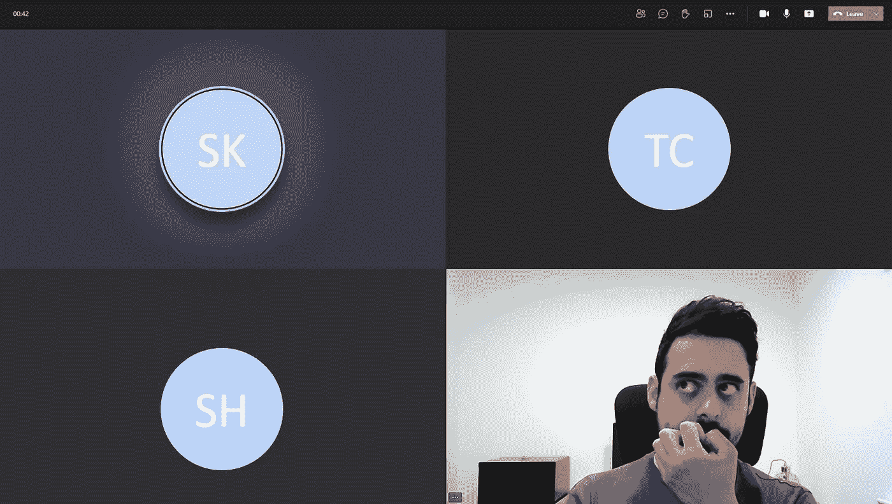
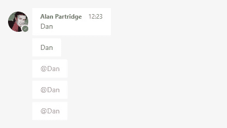

# 效率极低的远程员工的 5 个习惯

> 原文：<https://betterprogramming.pub/5-habits-of-highly-ineffective-remote-workers-a9f5f87f3118>

## 拜托，看在上帝的份上，别再做这些事了

作者图片

如果你指望我鼓励你多锻炼、打扫房间或者自己创业，恐怕你来错地方了。坦率地说，你偶然发现一个适度易怒的人讽刺地抱怨远程工作的不幸。

我敢肯定，如果你在寻找短暂的动力，有很多自助的文章。所以，如果这是你的目标，请随意寻找它们——很高兴见到你，我祝你好运！

对于那些还想留下来的人，让我们直入主题——是什么让这些杰出的人如此无能？

# 1.他们从不交流他们的议程

在组织会议时，他们喜欢使用“叙旧”或“快速聊天”这样不太明确的标题。更有创造性的类型开玩笑地在常规单词中引入超过所需数量的元音，以显得漠不关心和没有威胁，例如“meeeeeeting”。他们甚至可以更上一层楼，通过在会议主体中加入一个有趣的模因来展示他们的智慧。

事情是这样的。如果你邀请我参加一个会议，我需要知道**两件事:**

1.  会议是关于什么的
2.  我在会议中的角色是什么

如果我事先没有这两个重要的信息，我不可能确定它是否值得我的时间，或者你的时间。此外，即使我*是*合适的人选——除非我有机会准备，否则你永远也不会从我身上得到最好的东西。

# 2.他们假设可用性

你知道在办公室里我*不怀念什么吗？人们不打招呼就出现在我的办公桌前，试图搭讪，丝毫不考虑我可能在做什么。*

不过，不要害怕！这些人仍然存在。他们只是进化了数字时代的技能。你看，正是这些人希望你随时可以和他们聊天，他们会给你发私人信息，比如:

> “嘿，怎么样了？”

“嘿，你好吗？”你是在邀请我闲聊，这将*永远不会*优先于我正在做的任何事情。试着加入一些背景知识:

> “嘿，怎么样了？你知道我在哪里可以找到 X 吗？”

现在，我可以回答一个问题，而不是一个随意闲聊的邀请，即使我正忙着做别的事情。

如果你觉得文本输入的限制不能解决问题，这个简单的修饰语会让你看起来不那么放肆:

> “嘿，怎么样了？你有 5 分钟时间吗？

现在我们有了明确的时间限制，我更倾向于回应！

这个习惯有几个变种，但我最喜欢的——也是迄今为止最无效的——是我喜欢称之为“艾伦·帕特里奇”的方法。

用[teamsmemes.com](https://www.teamsmemes.com)制造

老实说，你知道你是谁——别说了。

# 3.他们神秘地消失了

你正在进行一场全面的数字对话；信息毫不费力地在电线上来回传递——你感觉很有效率，自我感觉良好，直到……你与之交谈的人突然停止回应，他们的状态显示为“离开”。

当然，如果你是效率极低的类型之一，这种行为是完全合理的，因为你只是在“吃午饭”——很明显。

要明白，这在现实世界中相当于在谈话中途转身，默默地走开。除非你真的是蝙蝠侠，否则没有理由毫无征兆地神秘消失。

就说再见吧！如果你偏爱一些 90 年代的网络俚语，比如“gtg”或“brb”或“asl”？

# 4.他们假装有用

如果你想赢得高层管理人员的好感，这是一个极好的技巧，只要你不介意惹恼其他人。

如果出现关键问题，尝试在公共论坛上插话，比如:

> “伙计们，这上面有人吗？”

此时，你的目标是传达一种权威感和一丝挫败感。现在你可以放松 30 分钟到一个小时，当你准备好了，再检查一下:

> “伙计们，有什么新消息吗？”

一旦问题解决了，以一句冷静的话结束:

> “谢谢大家——非常努力。”

现在你已经设法让*看起来*好像你是有用的，但是每个曾经*实际上*有用的人都为你感到尴尬。郑重声明，这才是真正有用的人的样子:

> “我能帮上什么忙吗？”

没错。询问你是否能帮上忙，开启了成为有用之人的可能性。否则，你最好让开，不要让大家分心。

特雷·赫芬尼在这里说得很好:

# 5.他们秘密行动

如果你真的想在效率低下方面出类拔萃，确保你的相机在*时刻都处于关闭状态。当你已经有了一个非常体面的圈子，里面有你的首字母，在你说话时会发光，你就不需要浪费时间在讨厌的非语言社交暗示上。*

还记得以前人们戴着匿名面具，穿着印有他们名字首字母的套头衫去上班吗？当然不是——那将是不可思议的怪异和不被社会接受的！对吗？

如果你在一个会议上关着相机做卧底，你认为一个人带着相机*在*会是什么感觉？当另一个人说话时，每个人都在看着他们点头表示同意！

这在现实世界中是不可接受的。想象一下，坐在会议室的桌子周围，一个人在说话，但是没有人看着那个人。反而都在盯着你，看你听。

拜托，带上你的摄像机，结束这种令人毛骨悚然的行为。

> 更新:看起来我的“相机开着”的言论已经惹怒了一些人。所表达的观点是我自己的，我的意图并不是非包容性的。这是你的选择，让你的相机关闭，并完全有可能在许多情况下有效。