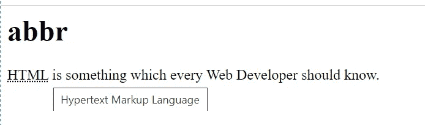
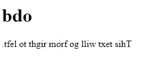
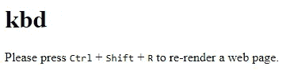
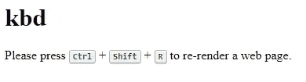
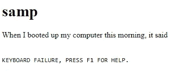
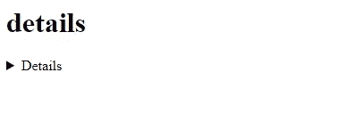
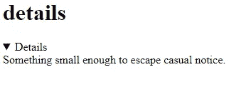

# 你可能不知道的 5 个 HTML 标签

> 原文：<https://betterprogramming.pub/5-html-tags-you-might-not-know-were-a-thing-1ef8843c855>

## 有时候，甚至 HTML 都能让我们大吃一惊！


照片由[内森·杜姆劳](https://unsplash.com/@nate_dumlao?utm_source=medium&utm_medium=referral)在 [Unsplash](https://unsplash.com?utm_source=medium&utm_medium=referral) 上拍摄

没有 HTML，任何 web 开发人员都无法生存。但是，我们大多数人仍然认为 HTML 是小菜一碟。这倒是真的。但这并不意味着 HTML 不能给我们带来惊喜。

还有一些 HTML 标签是我们想不到存在的。在本文中，我们将讨论其中的五种。当然，HTML 可能会为我们提供更多隐藏的宝藏。但此时此刻，让我们关注其中的几个。

## 1.缩写的/缩写词

`[**abbr**](https://developer.mozilla.org/en-US/docs/Web/HTML/Element/abbr)`是缩写**的简称。**此标签允许您指定首字母缩写代表什么，并提供首字母缩写的描述。

当您使用这个标签时，当您将鼠标悬停在缩略词上时，它会将点放在下面，并且会出现一个工具提示，显示您使用`abbr`标签的`title`属性提供的描述。

为了更清楚起见，让我们看看下面的 HTML 代码和输出:

```
<body>
    <div>
        <h1>abbr</h1>
        <p><abbr title="Hypertext Markup Language">HTML</abbr> is      something which every Web Developer should know.</p>
    </div>
</body>
```



## 2.bdo

`[bdo](https://developer.mozilla.org/en-US/docs/Web/HTML/Element/bdo)` 代表双向覆盖元素。此标签覆盖文本的当前方向，以便文本以不同的方向显示。

改变文本的方向并不常见，但是有一些语言是从右向左的。在那些情况下，`bdo` 标签会超级有用。

这是一个随机的例子:

```
<body>
    <div>
        <h1>bdo</h1>
        <bdo dir="rtl">This text will go from right to left.</bdo>
    </div>
</body>
```



## 3.keyboard 键盘

有没有注意到某些文本被定义为网页上的键盘输入？嗯，这就是`[kbd](https://developer.mozilla.org/en-US/docs/Web/HTML/Element/kbd)` [](https://developer.mozilla.org/en-US/docs/Web/HTML/Element/kbd)的神奇标记。让我们看看`kbd`或者键盘投入使用后是什么样子。那就更有意义了。

```
<body>
    <div>
        <h1>kbd</h1>
        <p>Please press <kbd>Ctrl</kbd> + <kbd>Shift</kbd> + <kbd>R</kbd> to re-render a web page.</p>
    </div>
</body>
```



实际上，我们可以通过在它上面添加一些 CSS 来使它变得更好。



## 4.玉米片

`[samp](https://developer.mozilla.org/en-US/docs/Web/HTML/Element/samp)`标签用于定义计算机程序的样本输出。里面的内容以浏览器默认的等宽字体显示。这里有一个例子:

```
<body>
    <div>
        <h1>samp</h1>
        <p> When I booted up my computer this morning, it said</p>
        <br />
        <samp>KEYBOARD FAILURE, PRESS F1 FOR HELP.</samp>
    </div>
</body>
```



这个标签没有被广泛使用，因为使用 CSS 可以获得更好的结果。但是这个标签没有被弃用。

## **5。详情**

[**details**](https://developer.mozilla.org/en-US/docs/Web/HTML/Element/details) 标签用于使用披露小部件显示关于某件事情的附加信息。这个部件可以根据需要打开和关闭。默认情况下，此小部件保持关闭状态。

`summary` 标签与`details` 结合使用，为细节指定一个可见的标题。

```
<body>
    <div>
        <h1>details</h1>
        <details>
            <summary>Details</summary>
            Something small enough to escape casual notice.
        </details>
    </div>
</body>
```



# 结论

这就是这篇文章的内容。我希望你今天学到了一些新东西。想看更多这样的文章，敬请期待！

感谢阅读！