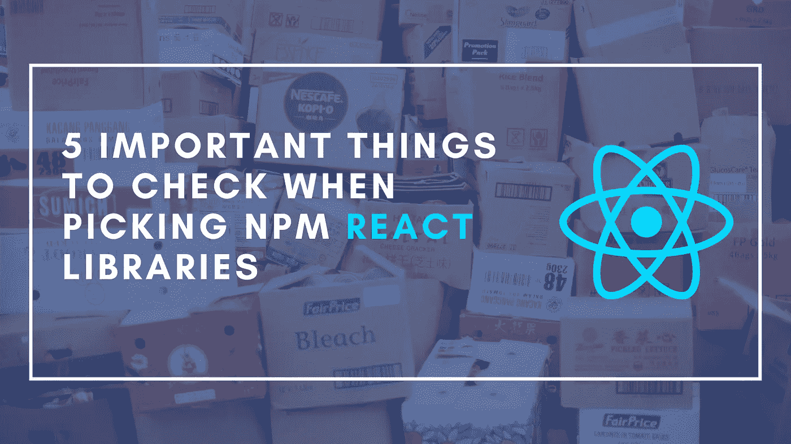

# 挑选 NPM 反应库时需要检查的 5 个重要事项

> 原文：<https://betterprogramming.pub/5-important-things-to-check-when-picking-npm-react-libraries-4f69c78ba085>

## 那会节省你的时间和精力



作为前端开发人员，NPM 注册中心在我们的开发中起着不可或缺的作用。虽然我们可以自己创建所有的功能，但是时间和资源有限。出于这个原因，我们有时不得不寻求其他开发人员提供的现有实现。

这非常方便，因为它节省了我们大量的时间和精力。但是使用 NPM 库不仅仅是从书架上拿下第一个并安装到你的项目中。注册表上有超过 130 万个包，可供选择的数量是巨大的。但是质量也可以是不同程度的。

学习如何在 NPM 图书馆的森林中挖掘自己的道路，确定什么是高质量的 React 库，以及需要注意什么是作为 React 开发人员的基本技能。为了有助于这一点，这篇文章将详细介绍 NPM 图书馆的不同方面，如何评估它，以及它对你的潜在意义。

# 库大小

一个库最直观的方面之一就是它的大小。选择库时，这通常是 React 开发人员检查的第一件事。这是理所当然的，因为库的大小直接影响到必须交付给最终用户的代码量。库越大，你的项目就越大，对你的用户来说，你的应用程序就越慢。

幸运的是，有很多不同的方法来检查你要安装的库的大小。首先，一个库的 NPM 页面已经显示了该库的解压缩大小。但是对于大多数项目来说，这不会是一个有意义的数字。相反，可以使用 [Bundlephobia](https://bundlephobia.com/) 来查看库在缩小或压缩时的包大小。这些将提供一个更真实的图像，显示一个库将如何影响你的应用程序。

# 维护活动

使用 NPM 库的主要好处之一是围绕它的开源结构。这不仅意味着开发人员不必从头开始创建一切，也不必冒可能遗漏边缘案例的风险，还意味着代码的维护可以留给库的创建者和维护者。这包括功能、错误修复和安全问题。

因此，图书馆最重要的事情之一就是维护。您不应该期望库每天都有新的拉请求(PR)或发布，但是集成一个没有任何主动支持的废弃库可能是一个主要的危险信号。这意味着所有的维护负担都落在你身上。

再说一次，有很多方法可以检查图书馆的活动，NPM 已经提供了很多这方面的信息。图书馆的 NPM 页面将显示最新版本发布的时间，并列出所有其他版本。一个健康的库会频繁地发布新版本。了解库的活跃性的另一种方法是浏览 Github 存储库上的 PRs、提交和讨论。

# 适当的文件

当您实现自己的代码时，您可以针对自己的用例定制某些结构、API 和决策。但是当你在 NPM 图书馆工作时，这种情况很少发生。库必须考虑所有的潜在用户和用例，这意味着它的实现很可能与你所期望的不同。这可能会使库更难使用。

为了解决这个问题，库必须有适当的文档来说明如何使用它们的代码。这可能是关于 API 设计，如何使用库，如何实现某些常见的用例，等等。确保您正在集成的库有适当的文档，这将使您的工作变得非常容易。

# 代码结构兼容性

虽然这很大程度上取决于上下文，并且可能取决于偏好，但是库与项目代码结构的兼容性可能很重要。可能是您的项目以一种更可组合的方式实现了 React 组件，但也可能是您更喜欢有一个大的组件来接受所有适当的信息作为道具。

在大多数情况下，不相容不一定是交易的障碍。在极少数情况下，不兼容会导致库在项目中不可用。但是在大多数情况下，这仅仅意味着您需要做更多的工作和实现来将库与项目集成。如果你处在考虑这方面的位置，那么它肯定会节省你一些时间。

# 辅助功能

在选择 React 库时，开发人员非常关注的一件事就是特性。他们从设计师或产品经理那里得到一套需求，并试图确保这个库能够涵盖所有的需求。虽然这很有道理，但一个经常被忽视的方面是可访问性特性。

我不会深入讨论整个可访问性主题，因为这不是本文的范围，但它是前端开发不可分割的一个方面，即使是通过库来实现。在之前的一篇文章中，我比较了几个库，它也发挥了不错的作用。

不幸的是，没有直接的方法来验证库是否已经实现了正确的可访问性特性，并且已经正确地实现了。对于这些信息，您依赖于维护人员编写的文档。否则，另一个更手动的选择是深入代码本身，将实现与 W3C 标准进行比较。

# 最后的想法

作为 React 开发人员，NPM 软件包对我们的工作至关重要。它们很方便，可以节省我们很多时间和精力。然而，选择最合适的一个并不总是简单的，特别是注册中心有超过 130 万个包，而且质量参差不齐。

为了对此有所帮助，本文介绍了 NPM React 库的五个方面，您在选择它们之前应该注意这些方面。这包括库的大小、维护方面的活动程度、是否有适当的文档、代码结构是否与您的项目兼容，以及可访问性功能的实现。

```
**Want to Connect?**If you liked this article, consider checking out the other entries in the [Uncommon React](https://www.getrevue.co/profile/chakshunyu) newsletter and my [Twitter](https://twitter.com/keraito) for future updates.
```