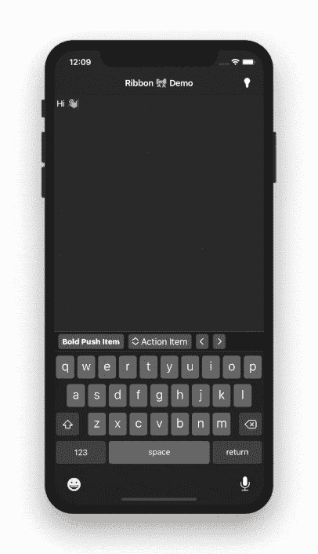
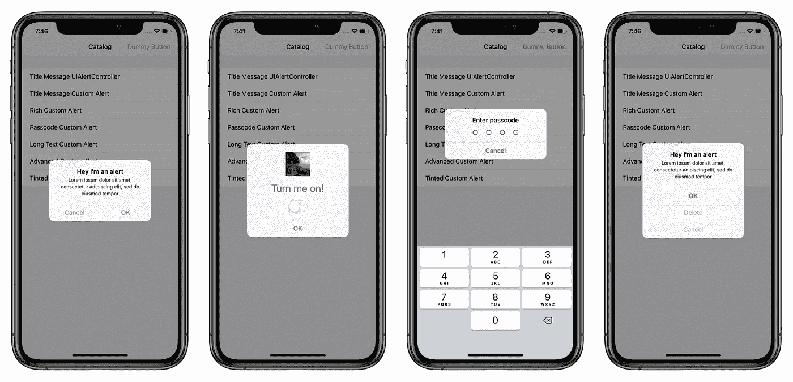
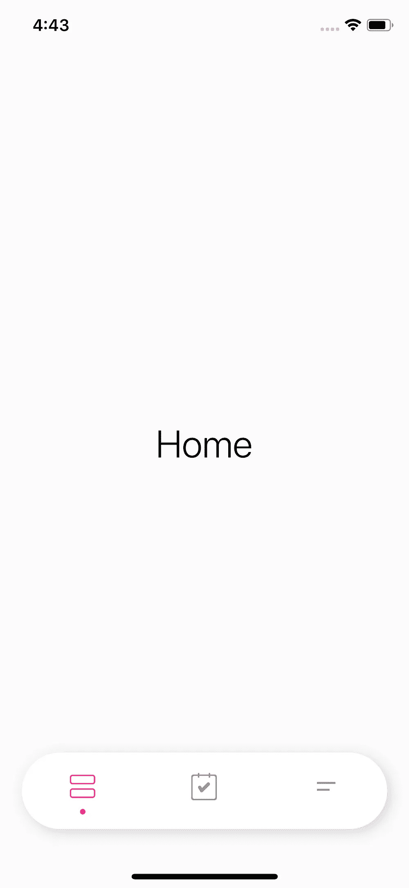
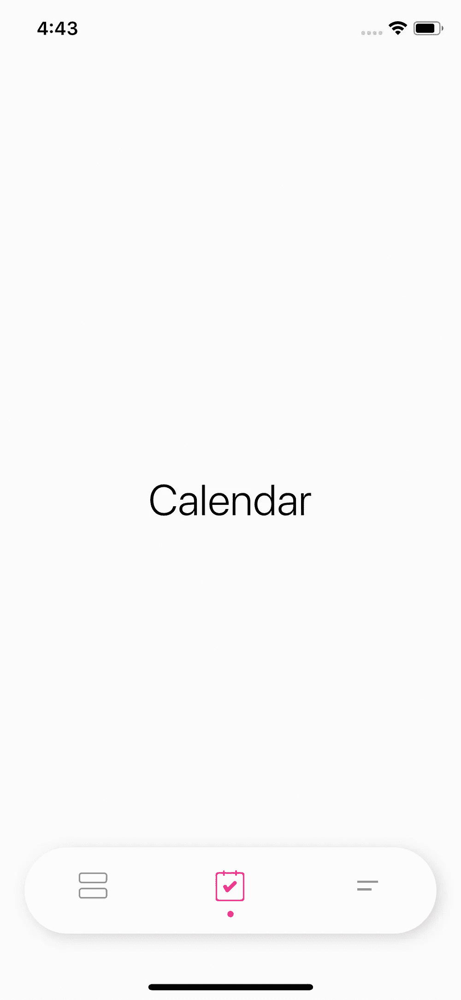
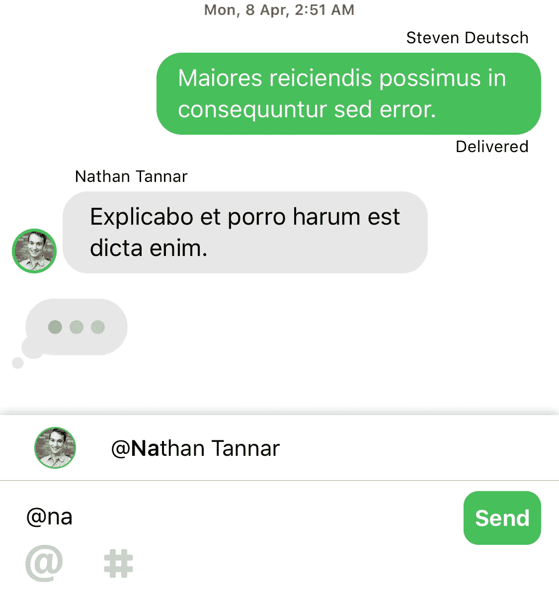
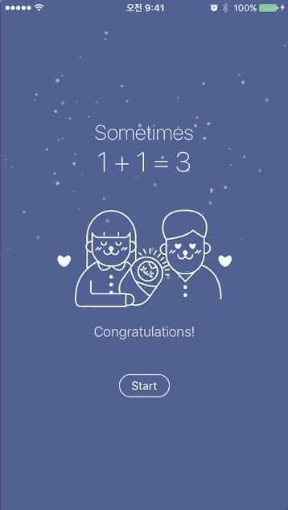

# 5 个 iOS 库为您的新项目做好准备

> 原文：<https://betterprogramming.pub/5-ios-libraries-ready-for-your-new-projects-19e497700769>

## UIAlertController on steroids、自定义输入视图、MessageKit 等等

照片由[麦克斯·尼尔森](https://unsplash.com/@maxcodes?utm_source=medium&utm_medium=referral)在 [Unsplash](https://unsplash.com?utm_source=medium&utm_medium=referral) 拍摄

# 1.带状物

我们将从一个漂亮的跨平台(iOS & macOS)库开始，它允许开发人员简单地添加工具栏/自定义输入附件。

配置真的很简单——你只需要修改`ribbon-configuration.json` 文件，就可以了。

该库还支持黑暗模式。

 [## chriszielinski/丝带

### 适用于 iOS 和 macOS 的简单跨平台工具栏/自定义输入附件视图库。用 Swift 写的。类型安全的…

github.com](https://github.com/chriszielinski/Ribbon) 

# 2.DWAlertController

引用作者 Andrew Podkovyrin 的话，“你最后一次告诉你的设计师你不能定制 UIAlertController 是什么时候？现在有可能了。”

多亏了这个库，你可以在`UIAlertController` 中显示任何`ViewController`，而不仅仅是标题和消息。

真是好消息。

 [## podkovyrin/DWAlertController

### 你最后一次告诉你的设计师你不能定制 UIAlertController 是什么时候？现在有可能了。没有…

github.com](https://github.com/podkovyrin/DWAlertController) 

# 3.PTCardTabBar

厌倦了正常的标签栏？你为你最新的应用程序寻找一个新的酷界面吗？

这个小程序库可以用来创建一个非常酷的平面标签栏。

即使现在没有真正的文档，产品中也有一个[示例项目](https://github.com/hussc/PTCardTabBar/blob/master/Example/PTCardTabBar/PTTabBarViewController.swift)简要解释了如何使用它。

 [## hussc/PTCardTabBar

### 1 2 要运行示例项目，首先克隆 repo 并从示例目录运行 pod install。PTCardTabBar 是…

github.com](https://github.com/hussc/PTCardTabBar) 

# 4.信息包

如果你想在你的应用上添加高度可定制的聊天或消息功能，这是最好的库(我正在我的一个应用中使用它)。

下面您可以找到目前支持的不同消息类型:

*   文本消息(简单和属性化)
*   照片
*   录像
*   位置
*   表情符号
*   声音的
*   接触

 [## 信息包/信息包

### 提供一个🚨安全的🚨通过开源为他人提供学习和成长的环境。添加聊天💬对于一个简单的项目…

github.com](https://github.com/MessageKit/MessageKit) 

# **5。水滴**

这最后一个库，模拟了温和的雨滴落下，是一个非常酷的动画，可以用来让你的应用程序更有活力，对用户更有吸引力。

您可以配置液滴方向、液滴数量、最小和最大尺寸以及最小和最大持续时间。

 [## LeFal/水滴

### 简单的水滴动画💧。在 GitHub 上创建一个帐户，为 LeFal/WaterDrops 的发展做出贡献。

github.com](https://github.com/LeFal/WaterDrops) 

# **感谢阅读。**