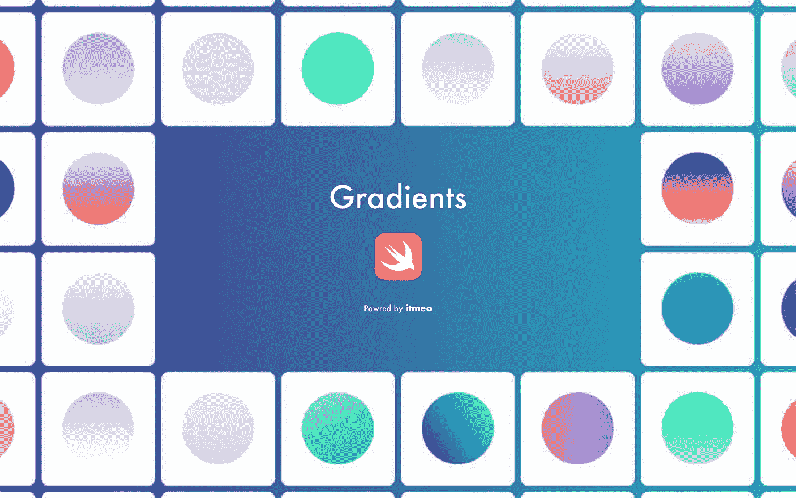
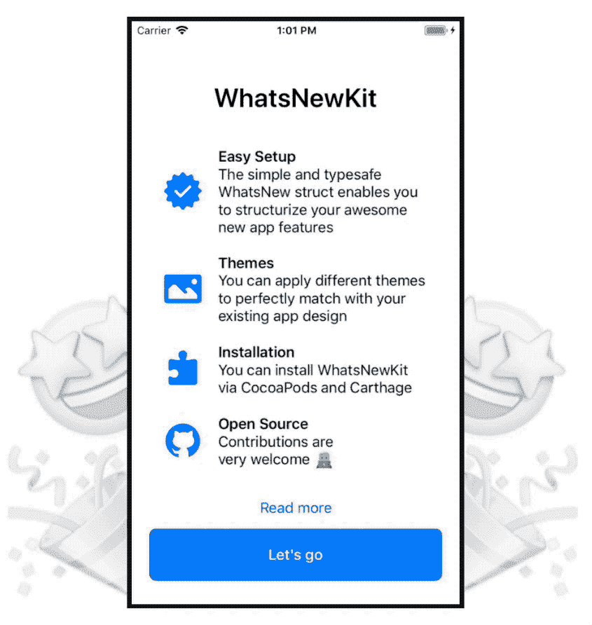

# 5 个能激发你创造力的 iOS 库

> 原文：<https://betterprogramming.pub/5-ios-libraries-that-will-inspire-your-creativity-26ee5837f9b7>

## 运动视差，惊人的颜色梯度，轻松的触觉反馈集成，等等

照片由[克莱门特 H](https://unsplash.com/@clemhlrdt?utm_source=medium&utm_medium=referral) 在 [Unsplash](https://unsplash.com?utm_source=medium&utm_medium=referral) 上拍摄

# 1.远景

我们从这个轻便而强大的库开始，它允许你创建很酷的视差，以及在你的应用和游戏中滚动视图。

它真的很容易配置，如果你想使用运动功能，它支持加速度计和陀螺仪。

 [## yannickl/透视

### Perspective 是一个强大的轻量级库，用于创建滚动和运动视差。(贷项:资产用于…

github.com](https://github.com/yannickl/Perspective) 

# 2.梯度

这个库是 180 多种引人注目的渐变的集合，你可以将它们用于你的控件和应用背景。您还可以通过简单地沿渐变方向传递颜色数组来轻松创建新的自定义渐变。

 [## 渐变/渐变

### 🌔灵感源自 itmeo/webgradients 的 swift 180 precedent Gradients 精心设计的 180 款精彩渐变系列…

github.com](https://github.com/Gradients/Gradients) 

# 3.彗星

这个库受到了[这篇 Medium](https://medium.com/call-voicy/comets-animating-particles-in-swift-3431a7f1b250) 文章的启发，并使用`CAEmitterLayer`和`CAEmitterCell`实现了 Kevin van der Wijst 制作的动画。

例如，它可以用作一个很酷的启动屏幕或加载页面。

 [## 航海日记/彗星

### ☄️彗星:由凯文制作的 Swift 动画中的动画粒子作为 Voicy 设计的一部分实现了 Bennet van der…

github.com](https://github.com/cruisediary/Comets) 

# 4. **Haptico**

创建这个库是为了让每个人都能轻松使用 iOS 触觉反馈生成器。它支持预定义的反馈(成功，警告，错误)，三个级别的影响通知，甚至可以由开发人员用一个特殊的字符串编程的自定义模式。

 [## iSapozhnik/Haptico

### Haptico 是易于使用的 iOS 触觉反馈生成器。除了默认的触觉反馈，它可以播放模式！结账…

github.com](https://github.com/iSapozhnik/Haptico) 

# 5.WhatsNewKit

WhatNewKit 是每个 app 的必备！它向用户展示了一个示意性的更改日志和新的应用程序功能，图形简洁美观。该库以智能的方式开发，只会在用户更新后第一次打开应用程序时显示屏幕。

布局、主题、内容模式和动画是完全可定制的，并且它还支持触觉反馈。

 [## SvenTiigi/WhatsNewKit

### WhatsNewKit 可以让你轻松展示你令人敬畏的新应用功能。它的设计完全是为了…

github.com](https://github.com/SvenTiigi/WhatsNewKit) 