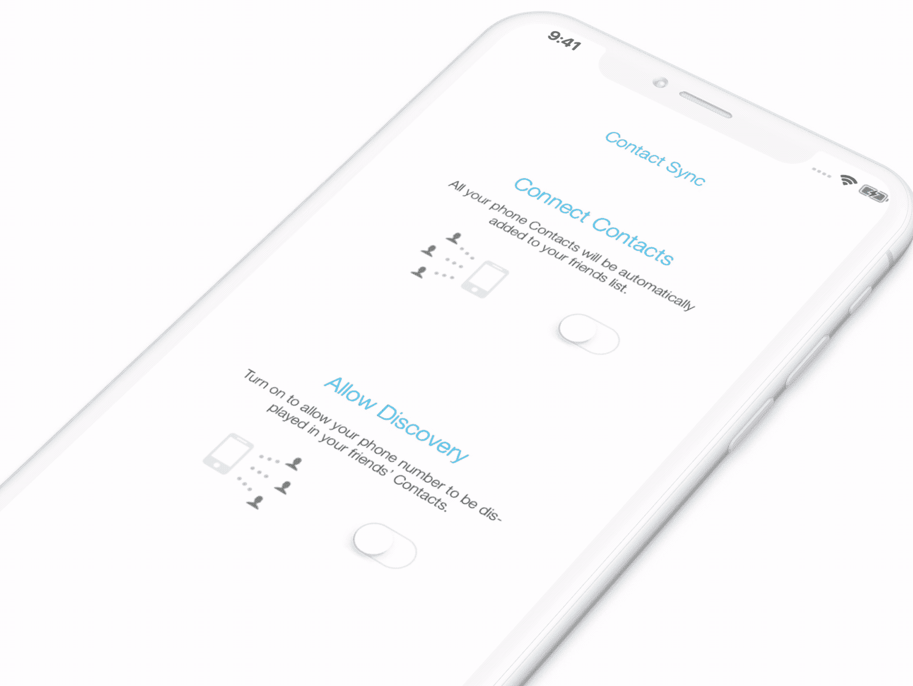
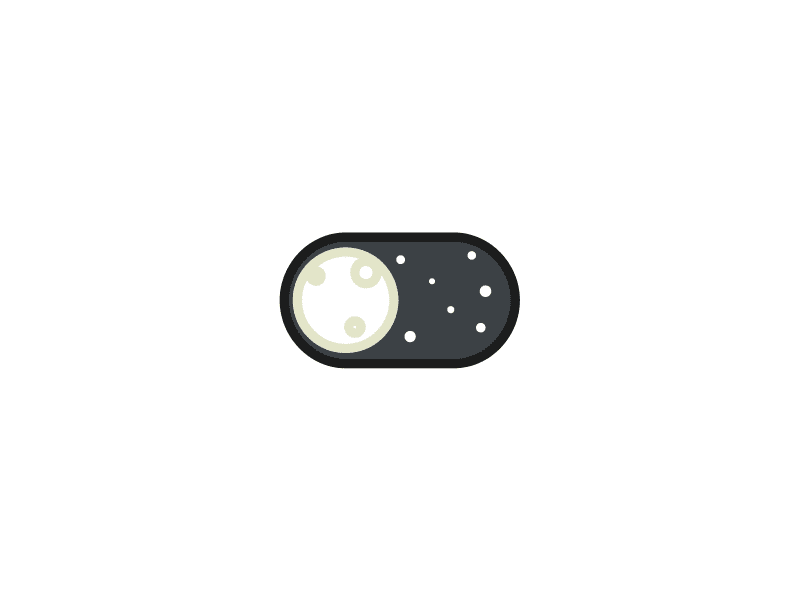
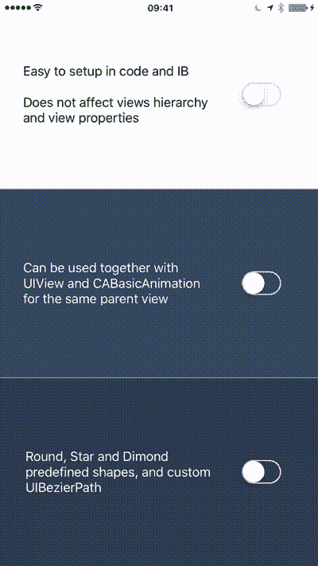
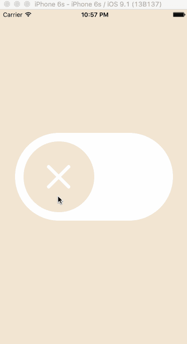

# 5 个 iOS 库将使 UISwitch 控件变得非常棒

> 原文：<https://betterprogramming.pub/5-ios-libraries-thatll-make-uiswitch-control-awesome-54e1a4ba7c82>

## 这些库将把你的普通开关变成一个全新的令人敬畏的控件

照片由[卡斯帕·卡米尔·鲁宾](https://unsplash.com/@casparrubin?utm_source=medium&utm_medium=referral)在 [Unsplash](https://unsplash.com?utm_source=medium&utm_medium=referral) 上拍摄

# 1.RAMPaperSwitch

本周，我们从 RAMPaperSwitch 开始，它是由 [Ramotion](https://www.ramotion.com) 制造的 UISwitch 的替代产品。

您只需要设置 tint-color 属性，它会自动用选定的颜色绘制超级视图背景。

您还可以自定义动画持续时间，并在动画开始时更改标签和其他视图的颜色。

 [## 遥控/纸开关

### 一个 Swift 材质设计 UI 模块，当开关打开时，它会覆盖父视图。我们专门从事…

github.com](https://github.com/Ramotion/paper-switch) 

# 2.AIFlatSwitch

这种扁平设计的开关可以在您的项目中用作 UISwitch 的替代品。您可以通过编程方式使用它，实例化`AIFlatSwitch`类，或者直接从接口构建器中使用它。

通过更改 control-property 值，还可以轻松地自定义线条宽度、描边颜色、轨迹描边颜色和背景层颜色。

 [## cocoatoucher/AIFlatSwitch

### 一款光滑、美观、可设计的平板 iOS 交换机。可以代替 UISwitch 使用。灵感来自…

github.com](https://github.com/cocoatoucher/AIFlatSwitch) 

# 3.昼夜开关

DayNightSwitch 是一个简单的开关，有两个很酷的动画图像用于白天和夜晚模式。

要使用它，您需要创建一个`DayNightButton`实例或者将一个`UIView`放到您的故事板中，并将其类设置为`DayNightButton`。

 [## 芬盖达/昼夜开关

### 所以我在 Dribbble 上看到了这个很棒的，有点 skeuomorphic 的定制开关设计，觉得它很可爱，所以在这里…

github.com](https://github.com/finngaida/DayNightSwitch) 

# 4.动画开关

与第一个库类似，AnimatedSwitch 是 UISwitch 的子类。

如果开关打开，它会在父视图的颜色属性上绘制，如果开关关闭，它会返回到原始的超级视图背景颜色。

 [## alsedi/动画开关

### UISwitch 的 Swift 子类，如果开关打开并返回…

github.com](https://github.com/alsedi/AnimatedSwitch) 

# 5.PMZSwitch

最后一个库是一个基本的 UISwitch 控件，在开/关切换时有一个很酷的动画，这将使你的应用程序更有活力，对用户更有吸引力。

不幸的是，没有属性配置，如果您想更改控件，您需要深入研究代码以了解它是如何工作的。

 [## kovpas/PMZSwitch

### 此时您不能执行该操作。您已使用另一个标签页或窗口登录。您已在另一个选项卡中注销，或者…

github.com](https://github.com/kovpas/PMZSwitch) 