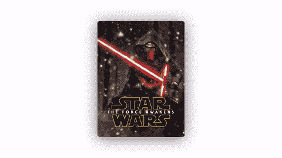
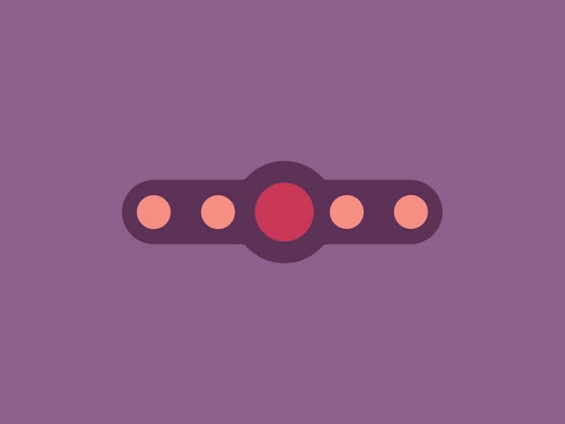
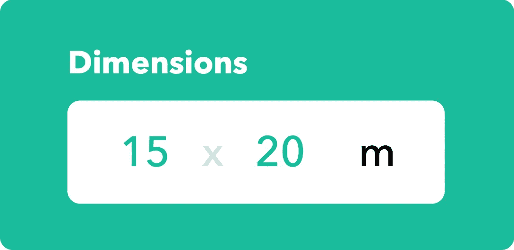
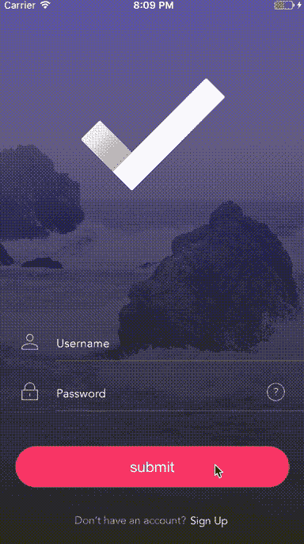
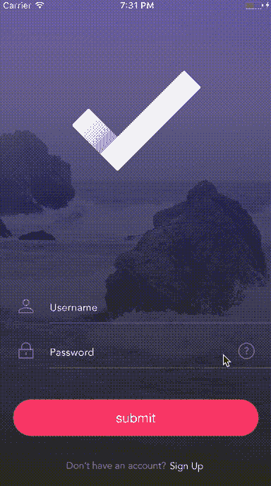
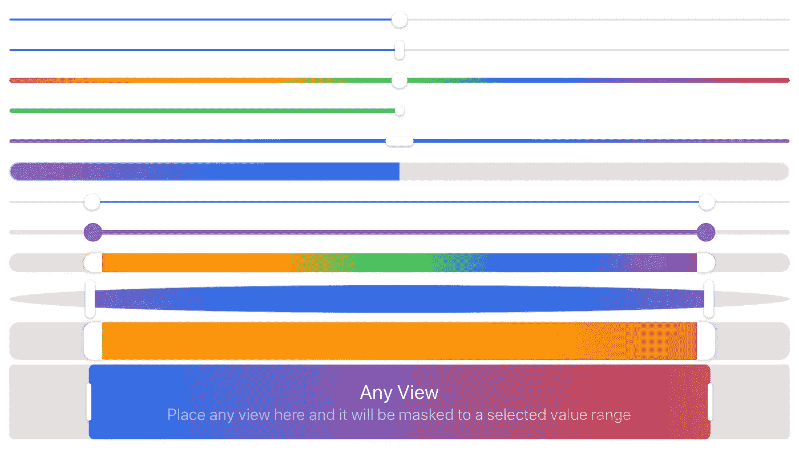

# 5 个 iOS 库，让你的应用充满活力

> 原文：<https://betterprogramming.pub/5-ios-libraries-to-animate-your-app-ff8b39761472>

## 酷视差视图，动画页面控制，动态按钮，等等


照片由 [Przemyslaw Marczynski](https://unsplash.com/@pemmax?utm_source=medium&utm_medium=referral) 在 [Unsplash](https://unsplash.com?utm_source=medium&utm_medium=referral) 上拍摄

# 1.电视按钮



今天，我们从 [TVButton](https://github.com/marmelroy/TVButton) 开始，这是一个库，它在你的 UIButton 控件上重现了你可以在 Apple TV 上看到的美丽视差效果。该效果由长按或拖动触发。

要使用视差效果，您需要至少两层/三层尺寸相同的图像。下面是一个实现示例:

```
let bg = TVButtonLayer(image: UIImage(named: "TVBG.png")!)
let pattern = TVButtonLayer(image: UIImage(named: "TVBtnPattern.png")!)
let top = TVButtonLayer(image: UIImage(named: "TVbtnTop.png")!)
tvButton.layers = [background, pattern, top]
```

然后，您可以通过更改以下属性来自定义视差效果强度:

```
tvButton.parallaxIntensity = 1.3
```

[](https://github.com/marmelroy/TVButton) [## 马梅罗伊/电视按钮

### 将苹果电视上的酷视差图标重新创建为 iOS UIButtons(在 Swift 中)。长按触发效果…

github.com](https://github.com/marmelroy/TVButton) 

# 2.TKRubberIndicator



[TKRubberIndicator](https://github.com/TBXark/TKRubberIndicator) 是 Swift 开发的一个库，它将在你的应用程序中添加一个橡皮动画页面控件。

要使用它，需要先导入`TKRubberPageControl`框架。然后，您需要将以下代码添加到控制器中:

```
override func viewDidLoad() {
        super.viewDidLoad()

        page.center = self.view.center
        page.valueChange = {(num) -> Void in
            print("Closure : Page is \(num)")
        }
        page.addTarget(self, action: "targetActionValueChange:", forControlEvents: UIControlEvents.ValueChanged)
        self.view.addSubview(page)

        page.numberOfpage = 2
    }

    @IBAction func pageCountChange(sender: UISegmentedControl) {
        page.numberOfpage = (sender.selectedSegmentIndex + 1) * 2
    }
    func targetActionValueChange(page:TKRubberIndicator){
        print("Target-Action : Page is \(page.currentIndex)")
    }
```

 [## TBXark/TKRubberIndicator

### 一个橡皮动画页面控件 CocoaPods 您可以使用 CocoaPods 安装 TKRubberPageControl，方法是将它添加到您的…

github.com](https://github.com/TBXark/TKRubberIndicator) 

# 3.尺寸 picker 视图



在几行代码中，[dimensionspikerview](https://github.com/hussc/DimensionsPickerView)将让您添加一个可用于测量数据输入的漂亮视图。

占位符单位、字体颜色、间距和边框颜色/宽度可通过以下方式自定义:

```
sizePickerView.textFieldConfigureBlock = { index, field in
    switch index {
    case 0:
        field.placeholder = "w"
    case 1:
        field.placeholder = "h"
    default:
        break
    }
}

sizePickerView.pickerFieldConfigureBlock = { field in
    field.text = "m"
}        

sizePickerView.tintColor = UIColor.red
sizePickerView.spacingBetweenValueFields = 0
sizePickerView.spacingBetweenUnitAndValues = 30

sizePickerView.layer.cornerRadius = 5
sizePickerView.layer.borderColor = UIColor.white.cgColor
sizePickerView.layer.borderWidth = 1.5
```

[](https://github.com/hussc/DimensionsPickerView) [## hussc/DimensionsPickerView

### 要运行示例项目，首先克隆 repo，并从示例目录运行 pod install。尺寸选择器视图…

github.com](https://github.com/hussc/DimensionsPickerView) 

# 4.过渡按钮



[TransitionButton](https://github.com/AladinWay/TransitionButton) 是一个库，用来添加一个带有加载和过渡动画的 UIButton。

首先，考虑`TransitionButton`是`UIButton`的子类。`TransitionButton`还增加了两个主要方法:

*   `startAnimation()`:当被调用时，会用一个加载微调器来启动按钮动画
*   `stopAnimation(...)`:当被调用时将停止动画按钮

[](https://github.com/AladinWay/TransitionButton) [## 报警/过渡按钮

### 要运行示例项目，克隆 repo，然后打开 workspace transition button . xcworkspace run…

github.com](https://github.com/AladinWay/TransitionButton) 

# 5.滑块



最后， [Sliders](https://github.com/SwiftUIExtensions/Sliders) 是一个完全由 SwiftUI 制作的库。它允许您在 iOS、macOS 和 Mac Catalyst 上创建可定制的水平和垂直滑块。

在个性化方面，我们发现:

*   [简单渐变值滑块样式](https://github.com/SwiftUIExtensions/Sliders#simple-gradient-value-slider-style)
*   [多值轨道](https://github.com/SwiftUIExtensions/Sliders#multivalue-track)
*   [复杂范围滑块样式](https://github.com/SwiftUIExtensions/Sliders#complex-range-slider-style)
*   [复杂点滑块样式](https://github.com/SwiftUIExtensions/Sliders#complex-point-slider-style)

[](https://github.com/SwiftUIExtensions/Sliders) [## SwiftUIExtensions/滑块

### 此软件包允许您为 iOS、macOS 和 Mac Catalyst 构建高度可定制的滑块和轨道。构建您自己的…

github.com](https://github.com/SwiftUIExtensions/Sliders) [](https://www.buymeacoffee.com/nicolidomenico)