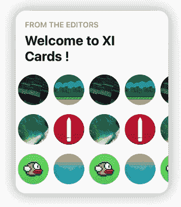
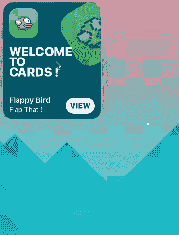
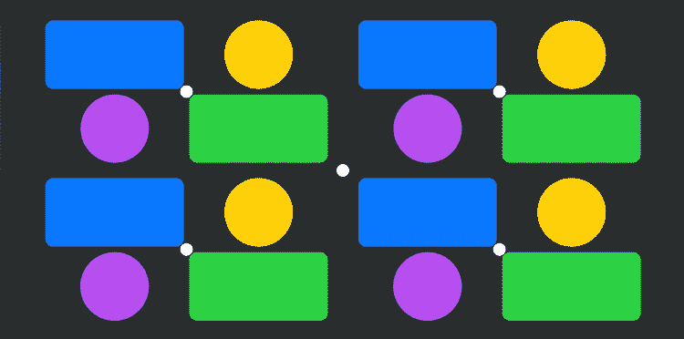
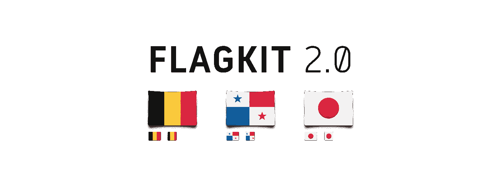
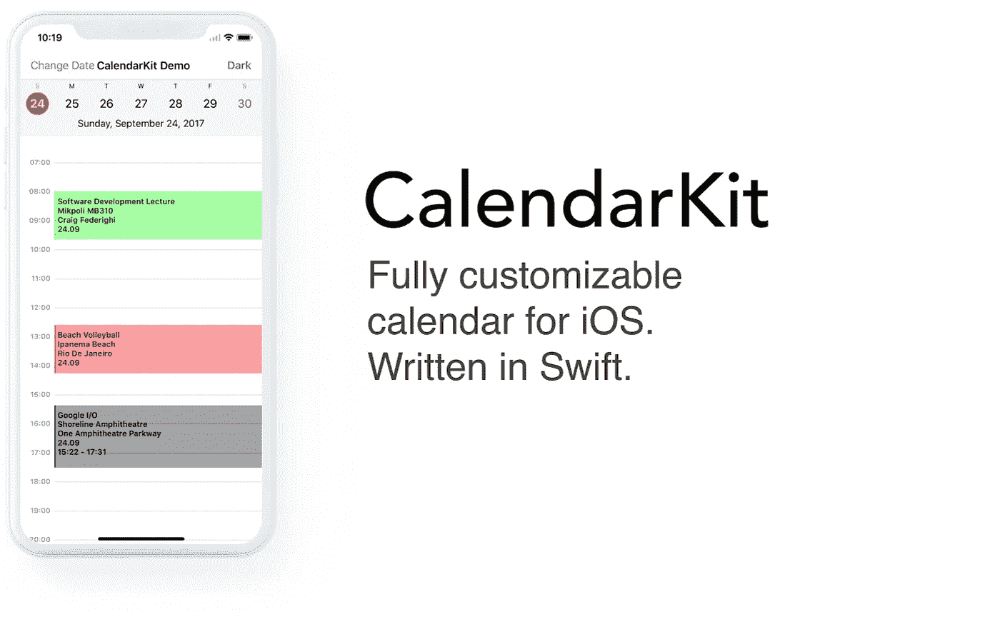

# 5 个 iOS 库来增强您的应用

> 原文：<https://betterprogramming.pub/5-ios-libraries-to-enhance-your-app-17ae7ed350db>

## 卡片视图动画、动态界面、徽章等


法比安·格罗斯在 [Unsplash](https://unsplash.com?utm_source=medium&utm_medium=referral) 上拍摄的照片

# 1.卡片



今天，我们从[卡片](https://github.com/PaoloCuscela/Cards)开始，这是一个强大的可定制库，可以将你的视图转换成一张类似于 App Store 上看到的卡片。

可用的自定义包括阴影、背景图像和颜色、文本颜色、卡片半径、图标和模糊效果。更多细节可以在[官方文档](http://AppStore)中找到。

[](https://github.com/PaoloCuscela/Cards) [## PaoloCuscela/卡片

### Cards 为 Xcode 带来了新的 iOS XI 应用商店中的卡片视图。转到 main.storyboard 并添加一个空白 UIView Open…

github.com](https://github.com/PaoloCuscela/Cards) 

# 2.**分区套件**



[PartitionKit](https://github.com/kieranb662/PartitionKit) 是 SwiftUI 中一个动态调整大小的用户界面。

这个库非常新，现在它支持五种不同的模式:

*   水平分区
*   垂直分区
*   网格分区
*   嵌套网格
*   混合的

[](https://github.com/kieranb662/PartitionKit) [## Kieran 662/分区套件

### 最近出现在 10 月份的十大趋势 Android 和 iOS 库中！什么是分区套件？它是…的解决方案

github.com](https://github.com/kieranb662/PartitionKit) 

# 3. **EasyNotificationBadge**


[EasyNotificationBadge](https://github.com/Minitour/EasyNotificationBadge) 几行代码就能把著名的 iOS 徽章放到任意视图中。

基本上，如果您想添加或更新带有默认设置的徽章，您应该编写这一行代码:

```
view.badge(text: "5")
```

要移除徽章:

```
view.badge(text: nil)
```

您还可以通过更改背景颜色、文本颜色、文本大小、距 X/Y 中心的距离、阴影、边框颜色和宽度来自定义徽章外观。

[](https://github.com/Minitour/EasyNotificationBadge) [## 迷你旅游/轻松通知徽章

### 或者只需将 NSBadge.swift 拖放到您的项目中。要添加带有默认设置的工卡，请使用此选项(这也适用于…

github.com](https://github.com/Minitour/EasyNotificationBadge) 

# 4.旗帜套件



[FlagKit](https://github.com/madebybowtie/FlagKit) 提供了漂亮的旗帜图标，可以在我们的 iOS、macOS 和 tvOS 应用中使用。所有标志都在资产目录中，可以很容易地在我们的应用程序中实现。

这个库提供了不同形状的非样式和样式的旗帜，如圆角、正方形和圆形。

下面您可以找到一个示例代码来了解它是如何工作的:

```
let countryCode = Locale.current.regionCode!
let flag = Flag(countryCode: countryCode)!

// Get unstyled image
let originalImage = flag.originalImage

// Get circle shaped flag
let styledImage = flag.image(style: .circle)
```

[](https://github.com/madebybowtie/FlagKit) [## 自制蝴蝶结/旗帜套件

### 在应用程序和网络上使用漂亮的旗帜图标。所有标志都作为独立的 PNG 和 SVG 文件提供。FlagKit…

github.com](https://github.com/madebybowtie/FlagKit) 

# 5. **CalendarKit**



最后， [CalendarKit](https://github.com/richardtop/CalendarKit) 是一个可定制的库，可在完全由 Swift 制作的应用程序中添加日历功能。真的和 iOS 日历很像，这个 app 可以很容易的定制。

该库支持本地化，并使用默认区域设置来显示月/日名称。图形风格也可以改变，创建一个新的`CalendarStyle`对象并调用`updateStyle`方法。

[](https://github.com/richardtop/CalendarKit) [## richardtop/CalendarKit

### CalendarKit 是用 Swift 编写的完全可定制的日历库。它被设计成看起来类似于 iOS 日历…

github.com](https://github.com/richardtop/CalendarKit) [](https://www.buymeacoffee.com/nicolidomenico)