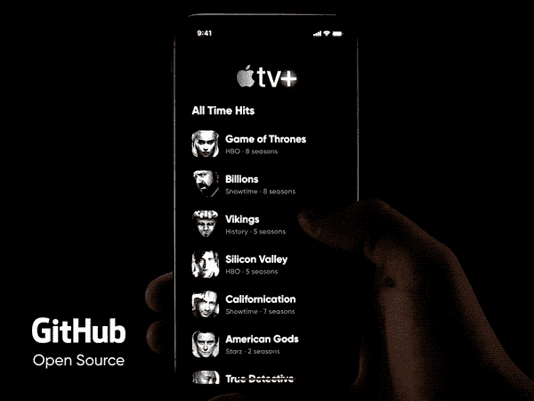
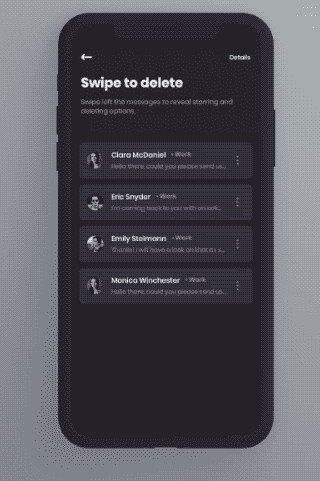
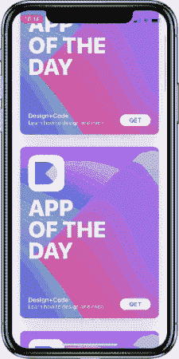
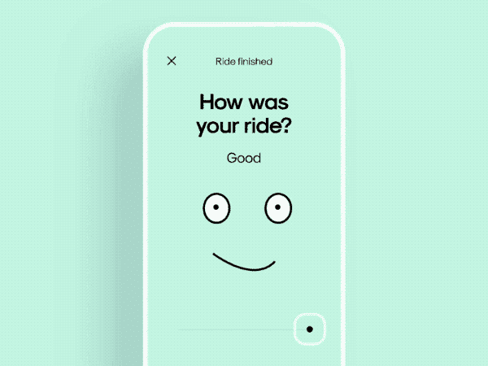

# 5 个 iOS 库点燃你心中的设计师

> 原文：<https://betterprogramming.pub/5-ios-libraries-to-ignite-the-designer-in-you-4e33cc68eabc>

## 探索一些运球概念和他们的 iOS 对应物

亚历山大·托多夫在 [Unsplash](https://unsplash.com?utm_source=medium&utm_medium=referral) 上的照片

一个没有好设计的 iOS 应用程序对 iPhone 来说是不公平的。设计是让每一件苹果产品如此受欢迎的唯一驱动因素(或者至少，它们设法抓住了眼球)。

在这篇文章中，我们将探索一些令人惊叹的运球设计及其各自的开源 iOS 项目，这些项目不仅会给你的应用程序带来全新的外观，还会激发你的 UI 设计师灵感。所以不要再浪费时间了，让我们开始吧。

# 1.平滑进料

首先，我们有一个惊人的 CollectionView 布局[库](https://github.com/Cuberto/smooth-feed)，它拥有任何基于新闻订阅的应用程序所需的一切。最重要的是，它可以在 CollectionView 的不同部分平滑滚动，并支持自调整单元格大小。

为了在你的应用中使用它，安装`pod 'smooth-feed'`并简单地在你的`UICollectionView`上使用`SmoothFeedCollectionViewLayout`。

# 2.EKLongPress

接下来，我们有一个长按上下文菜单 iOS [库](https://github.com/ekamalov/EKLongPress)，它可以是任何基于音乐播放器的应用程序的资产。

除了为菜单设置我们自己的标题和图标，我们还可以定制上下文菜单的接触点，以及`EKLongPress`上的字体和背景外观。

# 3.SwipeableTableViewCell

这是一个定制的 UITableView 单元格库[库](https://github.com/10clouds/SwipeableTableViewCell-ios)，它以流畅的方式显示滑动菜单，给用户一种身临其境的体验。

要实现这一点，您需要做的就是为表格视图单元格使用`SwipeableTableViewCell`类。

# 4.轻松过渡

接下来，我们有一个很棒的实用程序[库](https://github.com/marcosgriselli/EasyTransitions),它通过一个非常简单的实现使跨 ViewController 的转换交互。

# 5.RateIt

最后，另一个惊人的运球设计[由](https://github.com/Cuberto/rate-it)[库贝托团队](https://github.com/Cuberto)在 iOS 中实现。这是一种真正的交互式方式，要求用户进行评级，如下所示:

# 结论

在这篇探索性的文章中，我们浏览了一堆在 iOS 中实现的开源运球设计。我希望这些对进一步提升应用程序的用户体验有所帮助。