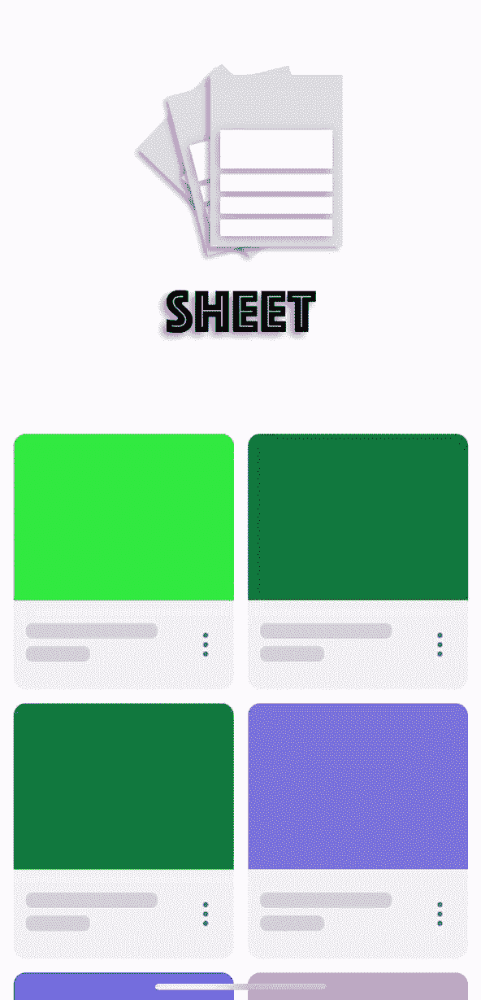

# 5 个 iOS 库来改进和启发您的用户界面

> 原文：<https://betterprogramming.pub/5-ios-libraries-to-improve-and-inspire-your-ui-3a7c768a176c>

## 惊人的布局动画，日期选择器，等等

# 1.重力滑块流量布局

今天我们从`GravitySliderFlowLayout`开始，这是一个轻量级的动画流布局，用于水平方向的`UICollectionView`。

这个神奇的库完全用 Swift 编写，兼容 iOS 11+版本和 xCode 9+。

使用起来真的很简单。您需要做的就是实例化一个`GravitySliderFlowLayout`对象，并将其设置为集合视图的`collectionViewLayout`属性。

 [## 应用解决方案/重力滑块

### 由 Applikey Solutions 制作的这个关于 Dribbble GravitySlider 的项目是一个轻量级的动画流程

github.com](https://github.com/ApplikeySolutions/GravitySlider) 

# 2.素食卷

VegaScroll 是一个漂亮的垂直方向的`UICollectionView`动画流布局，完全用 Swift 4 编写，兼容 iOS 11 和 Xcode 9。

要使用它，您只需将一个新的`VegaScrollFlowLayout`实例设置到集合视图的`collectionViewLayout`属性中，就可以开始了！

 [## 应用解决方案/Vegas scroll

### 由 Applikey Solutions 制造在 Dribbble 上找到此项目，还可以查看 UICollectionView 的另一个流程布局…

github.com](https://github.com/AppliKeySolutions/VegaScroll) 

# 3.曼陀琳琴(= mandotin)

`Mandoline`是一个`UICollectionView`，如果你需要一个具有“挑选”功能的界面，你可以使用它。例如，您可以使用它从日历中选择酒店预订或餐馆预订的日期。

该库还使用触觉反馈来在项目选择期间和跨单元移动时产生更身临其境的体验。

 [## 蓝色围裙/曼陀林

### PickerView 是一个 UICollectionView，它提供了一个平滑的“picking”界面。为了充分利用它，一个…

github.com](https://github.com/blueapron/Mandoline) 

# 4.卷轴搜索

卷轴搜索是一个令人惊叹的用户界面控制器，完全由 Swift 制作，允许您从列表中选择选项。

为了让它工作，你需要为列表设置一个数据源，一个从`UICollectionViewCell`继承的类，并实现`ConfigurableCell`协议，以及`UITextField`的任何子类。

卷轴搜索也支持主题化。要改变默认主题，你基本上需要在你的类上实现`Theme`协议，然后将对象的`theme`属性设置为你的主题。

 [## 移动/卷轴搜索

### 卷轴搜索是一个快捷的用户界面控制器，允许您从我们专门设计的列表中选择选项

github.com](https://github.com/Ramotion/reel-search) 

# 5.表

工作表，在几分钟内，可以帮助您创建许多不同的行动表与导航功能。

高度可定制的，有许多设置可以在创建过程中帮助你，Sheet 有一个导航结构，包含从`SheetContentsViewController`继承的所有子视图。

 [## ParkGwangBeom/Sheet

### 📑“表单”可帮助您轻松创建各种各样的动作表单，并在 Flipboard 应用程序中使用导航功能，如果…

github.com](https://github.com/ParkGwangBeom/Sheet) 