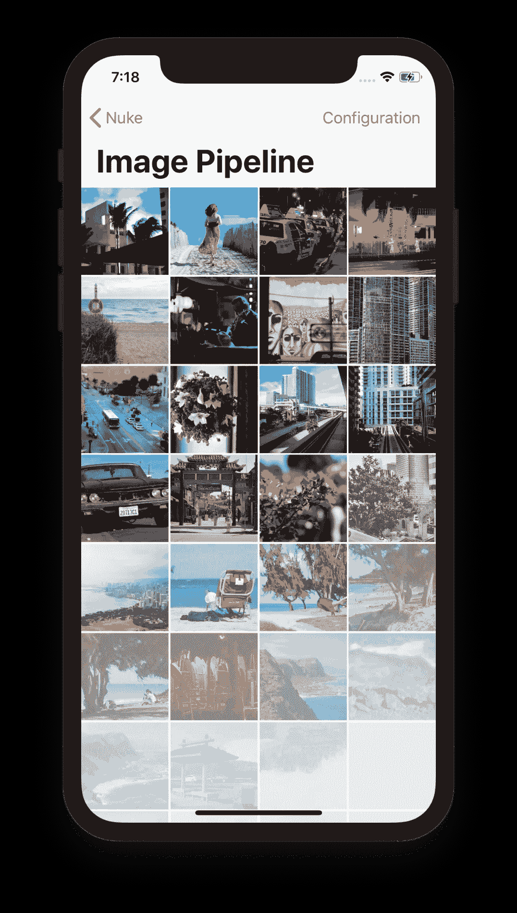
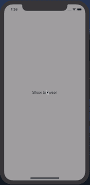
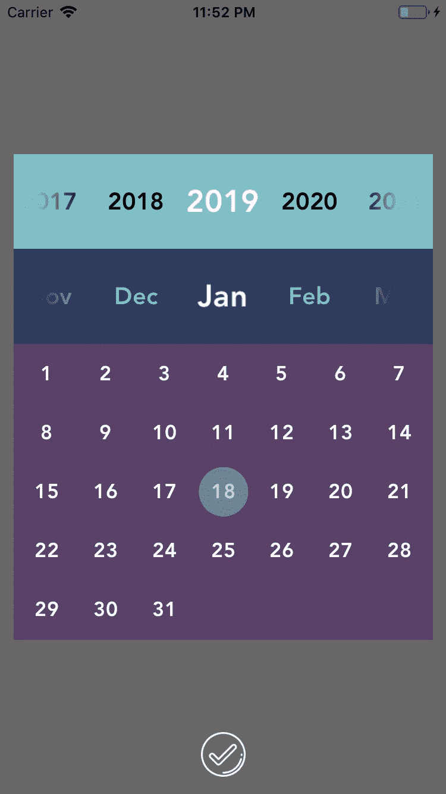
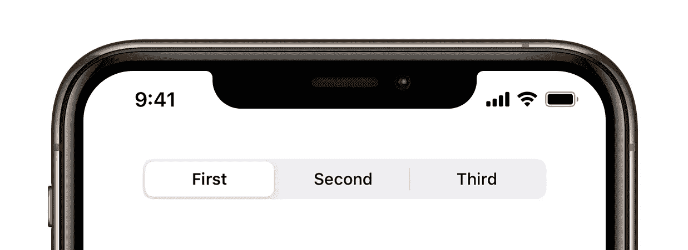

# 5 个 iOS 库，启发您的应用开发

> 原文：<https://betterprogramming.pub/5-ios-libraries-to-improve-your-app-17d0daa11af8>

## 下载和显示图像，安装一个很酷的导航栏，以现代日历为特色，等等

照片由[法比安·格罗斯](https://unsplash.com/@grohsfabian?utm_source=medium&utm_medium=referral)在 [Unsplash](https://unsplash.com?utm_source=medium&utm_medium=referral) 拍摄

# 1.核武器

Nuke 是一个强大的多功能图书馆，提供了一种简单的方法来下载和显示你的应用程序中的图像。

完全可定制，有许多不同的功能，你可以在每个显示网络图片的应用程序中使用它。

以下是主要特征:

*   内存和磁盘缓存
*   背景图像解压缩
*   图像处理
*   可恢复下载
*   图像预取
*   限速
*   渐进式 JPEG 加载
*   动画图像支持
*   Alamofire、WebP、Gifu 和 FLAnimatedImage 集成

 [## 基恩/纽克

### 从以前的版本升级？使用迁移指南。Nuke 提供了一种简单高效的下载和…

github.com](https://github.com/kean/Nuke) 

# 2.StylableNavigationBar

StylableNavigationBar 为标准的`UINavigationController`提供了一个轻巧美观的替代品。

您可以通过编程方式使用它，也可以与故事板一起使用它，并且可以自定义条形图的样式、颜色和色调。

 [## pchernovolenko/StylableNavigationBar

### 🧸 StylableNavigationBar 为标准的 UINavigationController 提供了一个轻量级的替代品，因此您可以轻松地…

github.com](https://github.com/pchernovolenko/StylableNavigationBar) 

# 3.MHWebViewController

这个库模拟了很多 app 使用的 web view 控制器，比如 Instagram、脸书、Reddit 等

基本上，它可以用来打开一个可拖动模式中的网页，可以通过滑动关闭。

 [## Michael Henry/MHWebViewController

### 受 Instagram 启发的网络视图控制器。为 Michael Henry/MHWebViewController 开发做出贡献，创建一个…

github.com](https://github.com/michaelhenry/MHWebViewController) 

# 4.AVCalendar

如果你需要在你的应用上有一个日历，这个库是最好的选择。

它有一个漂亮的用户界面。此外，它可以通过改变日、年、月背景颜色进行高度定制；文本颜色；和突出显示颜色。

 [## vyasanirudh/AVCalendar

### 一个 AVCalendar 示例应用程序。只需将所需的文件添加到您的项目空间中，就大功告成了！一个示例项目已经…

github.com](https://github.com/vyasanirudh/AVCalendar) 

# 5.TOSegmentedControl

到了 iOS 13，苹果改变了`UISegmentedControlstyle`和设计。现在它更圆、更平、更干净。

这个库是`UIControl`的子类，它重新实现了新`UISegmentedControl`组件的外观。这样开发者甚至可以在之前的 iOS 版本中使用。它还支持文本和图像作为分段类型。

 [## TimOliver/TOSegmentedControl

### 作为 iOS 13 中视觉改进的一部分，UISegmentedControl 被完全重新设计，具有许多…

github.com](https://github.com/TimOliver/TOSegmentedControl) 